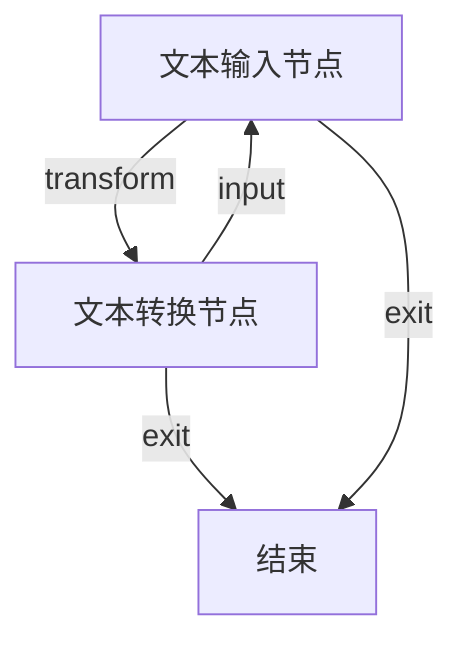
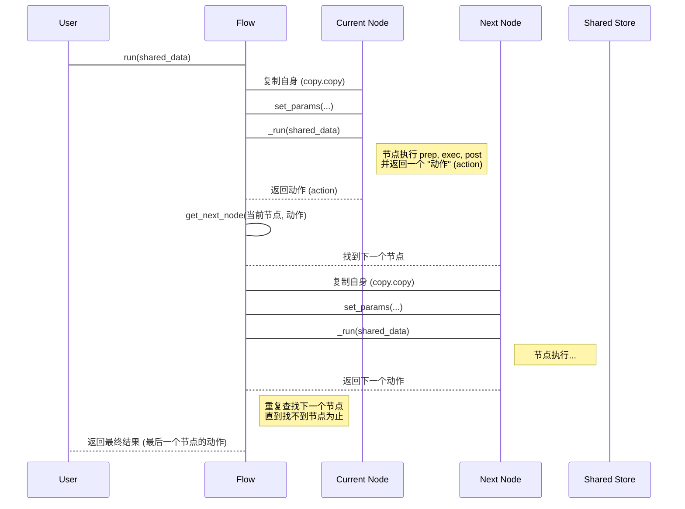

# Chapter 1: 流程 (Flow)


欢迎来到 PocketFlow 教程！在本章中，我们将介绍 PocketFlow 中最重要的概念之一：**流程 (Flow)**。

想象一下，你想要建造一个复杂的机器，或者完成一个需要多个步骤的任务，比如把原材料变成最终产品。你需要一个详细的计划或者“蓝图”，说明每一步应该做什么，按照什么顺序做，以及在每一步完成之后，接下来应该去哪里。在 PocketFlow 中，**流程 (Flow)** 就扮演了这个“蓝图”的角色。

## 什么是流程 (Flow)？

在 PocketFlow 中，**流程 (Flow)** 负责**编排 (orchestrate)** 和**连接 (connect)** 不同的工作单元。这些工作单元被称为**节点 (Node)**（我们将在下一章 [节点 (Node)](03_节点__node__.md) 中详细讨论它）。一个流程定义了任务执行的**路径**和**顺序**。

就像工厂的生产线设计图一样，流程规定了产品从开始到结束需要经过哪些“工作站”（即节点），以及在每个工作站处理完成后，产品应该被送往哪里。

流程总是从一个**起始节点 (start node)** 开始执行。当一个节点完成它的工作后，它会产生一个结果或者一个“动作 (action)”，流程会根据这个动作来决定接下来要执行哪个节点。

简单来说：
*   流程是你的任务的**总设计图**。
*   它连接了不同的**工作站**（节点）。
*   它决定了**从哪里开始**，以及**下一步去哪里**，直到任务完成。

## 为什么需要流程？

如果你只是想执行一个简单的、一步到位的任务，你可能不需要流程。但是，当你需要处理更复杂、多步骤的任务时，流程就变得非常重要了：

1.  **结构清晰：** 流程提供了一种组织和管理复杂任务的方式，让你可以把大任务分解成小步骤（节点），然后用流程把它们串起来。
2.  **顺序和分支：** 流程明确定义了节点执行的顺序。更重要的是，它可以根据节点的处理结果（动作）来决定走向不同的分支路径，这使得构建灵活的工作流成为可能。
3.  **易于理解和维护：** 有了流程蓝图，你可以清楚地看到整个任务的处理过程，这让理解、修改和维护你的代码变得更加容易。

## 如何定义一个流程？

定义一个流程主要包括三个步骤：

1.  创建构成流程的**节点**实例。
2.  连接这些节点，定义它们之间的**执行路径**。
3.  创建一个 `Flow` 实例，指定**起始节点**。

让我们看一个简单的例子，这个例子来自 PocketFlow 提供的“文本转换器”示例 (`cookbook/pocketflow-flow/flow.py`)。这个流程可以接收用户输入的文本，然后根据用户的选择进行大小写转换、反转或去除多余空格。

首先，我们需要从 `pocketflow` 库中导入 `Flow` 和 `Node`：

```python
from pocketflow import Node, Flow
```

接下来，我们定义我们的节点。在这个例子中，我们有两个主要节点：一个用于接收用户输入的 `TextInput` 节点，和一个用于执行文本转换的 `TextTransform` 节点，还有一个简单的 `EndNode` 表示流程结束。

```python
# ... 导入代码省略 ...

class TextInput(Node):
    # 这个节点负责获取用户输入文本和选择
    pass # 实际代码中有 prep 和 post 方法，这里简化展示

class TextTransform(Node):
    # 这个节点负责根据选择转换文本
    pass # 实际代码中有 prep, exec, 和 post 方法，这里简化展示

class EndNode(Node):
    # 一个简单的结束节点
    pass

# 创建节点实例
text_input = TextInput()
text_transform = TextTransform()
end_node = EndNode()
```

这里我们创建了三个节点对象。请注意，`TextInput` 和 `TextTransform` 都继承自 `Node` 类，这是 PocketFlow 中创建自定义节点的方式（我们将在 [节点 (Node)](03_节点__node__.md) 章详细介绍）。

现在，我们来连接这些节点，定义流程的路径。PocketFlow 使用 `>>` 运算符来表示默认的连接，使用 `- "动作" >>` 运算符来表示带有特定动作标签的连接。

```python
# ... 节点定义代码省略 ...

# 连接节点
# 当 text_input 节点返回 "transform" 动作时，流程会走向 text_transform 节点
text_input - "transform" >> text_transform

# 当 text_transform 节点返回 "input" 动作时，流程会回到 text_input 节点
text_transform - "input" >> text_input

# 当 text_transform 节点返回 "exit" 动作时，流程会走向 end_node 节点
text_transform - "exit" >> end_node

# 当 text_input 节点返回 "exit" 动作时，流程也会走向 end_node 节点
text_input - "exit" >> end_node
```

这些连接语句就像在生产线蓝图上画线，指示产品在不同工作站之间的流向。例如，`text_input - "transform" >> text_transform` 的意思是，如果 `text_input` 节点完成工作后决定下一步的“动作”是 `"transform"`，那么流程就会把控制权交给 `text_transform` 节点。

最后一步是创建一个 `Flow` 实例，并告诉它从哪个节点开始：

```python
# ... 节点和连接代码省略 ...

# 创建流程，指定起始节点
flow = Flow(start=text_input)
```

这样，我们就成功定义了一个名为 `flow` 的流程，它从 `text_input` 节点开始执行。

## 如何运行一个流程？

定义好流程之后，运行它就非常简单了。你只需要调用流程对象的 `run()` 方法：

```python
# 文件: main.py
from flow import flow # 从 flow.py 导入我们定义的流程

def main():
    print("\nWelcome to Text Converter!")
    print("=========================")

    # 初始化一个共享存储对象，用于在节点之间传递数据
    # 我们将在下一章详细讨论共享存储
    shared = {}

    # 运行流程
    flow.run(shared)

    print("\nThank you for using Text Converter!")

if __name__ == "__main__":
    main()
```

当你调用 `flow.run(shared)` 时，PocketFlow 流程就开始按照你定义的蓝图工作了。它会从 `start` 节点（在这里是 `text_input`）开始，执行节点的逻辑，然后根据节点的返回动作，找到下一个要执行的节点，如此循环，直到没有下一个节点可走为止。

`shared = {}` 这里的 `shared` 对象是一个字典，它用来在不同的节点之间传递数据。比如，`TextInput` 节点可以将用户输入的文本存储到 `shared` 中，而 `TextTransform` 节点则可以从 `shared` 中取出文本进行处理。我们会在 [共享存储 (Shared Store)](04_共享存储__shared_store__.md) 章节深入探讨这个概念。

## 文本转换器流程示例执行过程

让我们结合 Mermaid 图来看看这个流程是如何执行的：



解释：

1.  **开始：** 流程从 `text_input` (文本输入节点) 开始运行。
2.  `text_input` 节点运行：它提示用户输入文本，并选择一个转换选项。
3.  `text_input` 节点完成：
    *   如果用户选择了转换选项 (1-4)，`text_input` 节点会返回动作 `"transform"`。流程根据蓝图，发现 `"transform"` 连接到了 `text_transform` 节点。
    *   如果用户选择了退出 (5)，`text_input` 节点会返回动作 `"exit"`。流程根据蓝图，发现 `"exit"` 连接到了 `end_node` 节点。
4.  **如果动作是 `"transform"`：** 流程转移到 `text_transform` (文本转换节点) 运行。
5.  `text_transform` 节点运行：它从共享存储中获取用户输入的文本和选择，执行相应的文本转换。
6.  `text_transform` 节点完成：
    *   它会打印转换结果。然后问用户是否要转换更多文本。
    *   如果用户输入 `y`，节点返回动作 `"input"`。流程根据蓝图，发现 `"input"` 连接回了 `text_input` 节点。
    *   如果用户输入 `n`，节点返回动作 `"exit"`。流程根据蓝图，发现 `"exit"` 连接到了 `end_node` 节点。
7.  **循环或结束：**
    *   如果返回 `"input"`，流程回到步骤 2，重新开始接收输入。
    *   如果返回 `"exit"`，流程转移到 `end_node` 节点。`end_node` 是一个空节点，运行完毕后没有定义的下一个节点，流程结束。

这个例子展示了流程如何通过节点的返回动作来控制执行路径，实现循环和条件分支。

## 流程如何工作（幕后原理）

了解流程在内部是如何工作的，能帮助你更好地使用它。想象一下，流程对象就像一个工厂的调度员，它手里拿着生产线蓝图（就是你定义的节点连接）。

这是一个简化的流程内部执行步骤：



在代码层面，`Flow` 类的核心逻辑通常在一个内部的编排方法中（在 `pocketflow/__init__.py` 中，你可以找到 `Flow` 类的 `_orch` 方法）。这个方法里面有一个 `while` 循环：

```python
# 简化过的 Flow._orch 伪代码
def _orch(self, shared, params=None):
    curr = copy.copy(self.start_node) # 从起始节点开始，并复制一份
    params = params or {**self.params} # 获取流程参数
    last_action = None

    while curr: # 只要当前节点存在，就继续循环
        curr.set_params(params) # 设置节点参数
        last_action = curr._run(shared) # **运行当前节点，并获取它返回的动作**
        # 根据当前节点和返回的动作，找到下一个节点
        curr = copy.copy(self.get_next_node(curr, last_action))
        # Note: 这里的 copy.copy 是为了确保每个节点实例在流程执行中是独立的，
        # 以防在复杂场景下（如并行、循环）状态相互影响。

    return last_action # 返回最后一个节点的动作
```

这个循环就是流程的大脑。它不断地：

1.  检查 `curr`（当前节点）是否存在。如果不存在，流程结束。
2.  设置当前节点的参数（来自流程或批量处理）。
3.  调用当前节点的 `_run()` 方法执行它（节点内部会依次调用 `prep`, `exec`, `post`）。
4.  获取 `_run()` 方法返回的结果，也就是下一个要执行的“动作”。
5.  根据当前节点和这个“动作”，调用 `get_next_node()` 方法查找连接到这个动作的下一个节点。
6.  将找到的下一个节点赋值给 `curr`，准备下一轮循环。

`get_next_node()` 方法（也在 `Flow` 类中）则负责根据节点连接蓝图查找下一个节点：

```python
# 简化过的 Flow.get_next_node 伪代码
def get_next_node(self, curr, action):
    # 尝试根据动作查找后继节点
    nxt = curr.successors.get(action or "default")
    # 如果找不到，并且当前节点有定义任何后继节点，发警告
    if not nxt and curr.successors:
        warnings.warn(f"Flow ends: '{action}' not found in {list(curr.successors)}")
    # 返回找到的下一个节点 (可能为 None)
    return nxt
```

这个方法查找当前节点 `curr` 的 `successors` 字典。这个字典是在你用 `>>` 和 `- "动作" >>` 连接节点时填充的。例如，`text_input - "transform" >> text_transform` 就会在 `text_input` 节点的 `successors` 字典中添加一个条目，键是 `"transform"`，值是 `text_transform` 节点。如果找不到匹配的动作，并且当前节点确实有定义后继节点（只是动作不匹配），它会发出警告，并返回 `None`，导致主循环终止。如果节点本身就没有定义任何后继，流程也会自然终止。

## 不同类型的流程

除了标准的 `Flow` 类，PocketFlow 还提供了其他类型的流程来满足不同的需求，例如：

*   **`BatchFlow`**: 用于批量处理任务。它可以接收一个批次的输入数据，然后对批次中的每个数据项独立运行一次流程。更多细节请参考 [批量处理 (Batch Processing)](05_批量处理__batch_processing__.md) 章。
*   **`AsyncFlow`**: 用于构建异步工作流，可以在等待某些操作（如网络请求）时同时处理其他任务，提高效率。更多细节请参考 [异步处理 (Async Processing)](06_异步处理__async_processing__.md) 章。

这些特殊类型的流程继承自 `Flow` 并扩展了其功能，但它们的核心思想都是围绕着编排和连接节点来定义任务的执行路径。

## 总结

在本章中，我们学习了 PocketFlow 中的 **流程 (Flow)** 概念。它是构建工作流的蓝图，负责连接和编排**节点 (Node)**，定义任务的执行路径和顺序。我们通过一个简单的文本转换器示例，了解了如何定义流程、连接节点以及如何运行流程。我们还简要探讨了流程在幕后的工作原理，即如何根据节点的返回动作来决定下一步的走向。

流程是 PocketFlow 工作流的基础框架。而流程连接的各个工作单元，也就是**节点 (Node)**，则是真正执行任务的地方。在下一章，我们将深入探讨 **图 (Graph)** 的概念，它与流程的结构紧密相关，帮助我们更清晰地理解节点之间的关系。

[下一章：图 (Graph)](02_图__graph__.md)

---

Generated by [AI Codebase Knowledge Builder](https://github.com/The-Pocket/Tutorial-Codebase-Knowledge)