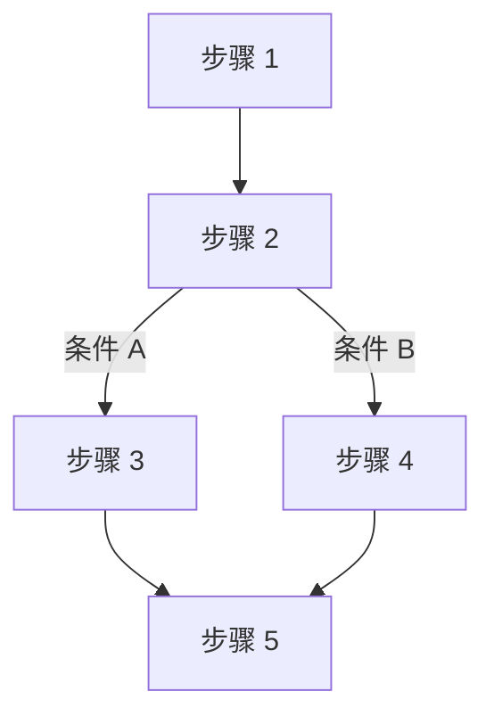
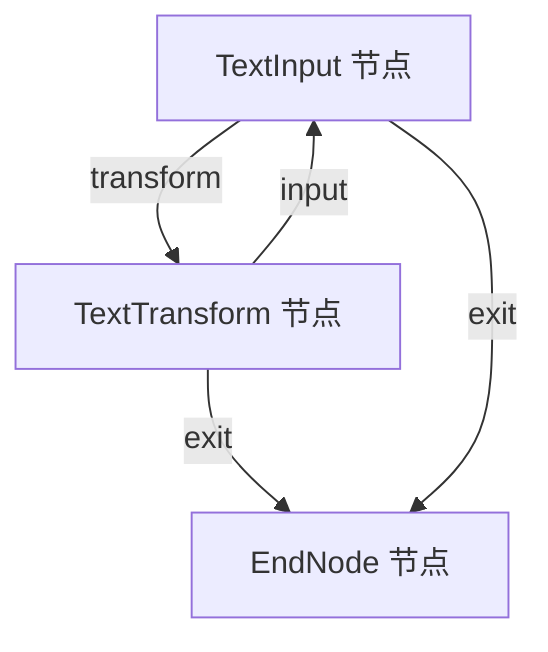
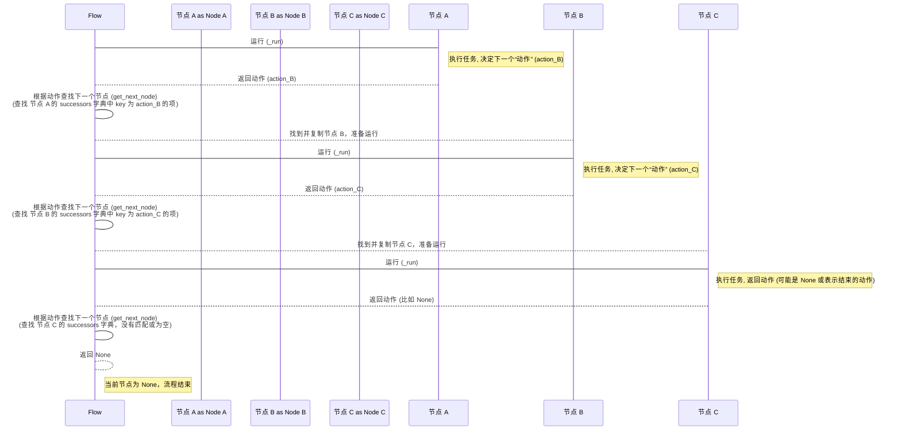

# Chapter 2: 图 (Graph)

欢迎回到 PocketFlow 教程！在 [第一章：流程 (Flow)](01_流程__flow__.md) 中，我们学习了 **流程 (Flow)** 的概念，它是 PocketFlow 中用来编排和连接不同工作步骤（称为**节点 (Node)**）的“蓝图”。流程定义了任务执行的路径和顺序。

那么，流程的这个“蓝图”本身是什么呢？它背后用来描述节点之间关系和执行路径的结构，就是我们本章要重点介绍的概念：**图 (Graph)**。

## 什么是图 (Graph)？

在 PocketFlow 中，**图 (Graph)** 是**核心的抽象概念**。你可以把它想象成一张**流程图**。

*   流程图中的每个**步骤**就是一个**节点 (Node)**。
*   连接这些步骤的**箭头**就是图中的**边**或者说**连接**。
*   箭头上的**文字或条件**（比如“如果用户输入了 'y'”，或者在 PocketFlow 中叫做“动作”）决定了沿着哪条边前进。

如图所示：

这是一个简单的流程图，展示了步骤之间的关系。在 PocketFlow 中，**图**就是这种由**节点**和带标签的**连接**构成的结构。

**图**本身只是一个**结构**，它描述了节点之间“谁连接到谁”，以及“通过什么动作连接”。而 **流程 (Flow)** 则是在这个图上**移动和执行**的实体。流程会从图中的一个特定节点（起始节点）开始，然后根据节点的执行结果（动作），沿着图中的连接找到下一个节点，一步步前进，直到走到没有连接的地方为止。

## 为什么需要图？

你可能会问，我们不是已经有“流程”来描述执行路径了吗？为什么还需要一个“图”的概念？

1.  **清晰的结构抽象：** 图提供了一个标准的方式来描述复杂的依赖关系。它把关注点放在“是什么结构”，而不是“如何执行”（这是流程的工作）。这使得设计和理解复杂的工作流变得更容易。
2.  **灵活性：** 同一个图结构可以被不同类型的“流程”以不同的方式执行（比如顺序执行、批量执行、并行执行等），而无需改变图本身的定义。
3.  **可视化：** 图结构天然适合用图形（如 Mermaid 图）来表示，这极大地提高了工作流的可读性和沟通效率。

就像建筑物的蓝图一样，“图”定义了房间（节点）和门/走廊（连接）的布局，而“流程”则是在这个布局中移动的人或物品。

## 图的基本组成部分

PocketFlow 中的图主要由以下两部分构成：

1.  **节点 (Node):** 这是图中的基本工作单元。每个节点代表一个特定的任务或操作，例如读取数据、调用模型、进行计算、格式化输出等等。我们将在 [第三章：节点 (Node)](03_节点__node__.md) 中深入探讨节点。
2.  **连接 (Connections) / 边 (Edges):** 这些是连接节点的线。在 PocketFlow 中，连接可以是**默认连接**（使用 `>>` 运算符）或**带动作标签的连接**（使用 `- "动作" >>` 运算符）。这些连接定义了流程在节点之间的可能跳转路径。

节点通过它们的**后继者 (successors)** 来定义图的结构。每个节点内部都有一个字典 (`successors`)，记录了在当前节点完成并返回某个“动作”时，应该跳转到哪一个后继节点。

## 如何在 PocketFlow 中构建图？

你在定义流程时，实际上就是在构建一个图。使用 `>>` 和 `- "动作" >>` 运算符来连接节点，就是在图中的节点之间添加有向边。

我们再次使用 [第一章：流程 (Flow)](01_流程__flow__.md) 中的文本转换器示例来理解这一点。回想一下，我们定义了三个节点和它们之间的连接：

```python
from pocketflow import Node, Flow
# ... 导入及节点类定义省略 ...

# 创建节点实例
text_input = TextInput()
text_transform = TextTransform()
end_node = EndNode()

# 连接节点，**这就在构建图结构**
text_input - "transform" >> text_transform
text_transform - "input" >> text_input
text_transform - "exit" >> end_node
text_input - "exit" >> end_node

# 创建流程，指定起始节点，**流程是在图上运行的实体**
flow = Flow(start=text_input)
```

上面的连接语句 `text_input - "transform" >> text_transform` 等同于在 `text_input` 节点内部说：“如果我执行完毕后返回的动作是 `"transform"`，那么下一个要执行的节点是 `text_transform`。” 这就在图中的 `text_input` 节点和 `text_transform` 节点之间建立了一条带标签 `"transform"` 的边。

这些连接语句执行完毕后，内存中就形成了一个图结构。例如，`text_input` 节点的 `successors` 字典大致会是这样：
```python
# text_input.successors 大致结构
{
    "transform": <TextTransform 实例对象>,
    "exit": <EndNode 实例对象>
}
```
而 `text_transform` 节点的 `successors` 字典大致是这样：
```python
# text_transform.successors 大致结构
{
    "input": <TextInput 实例对象>,
    "exit": <EndNode 实例对象>
}
```
`end_node` 节点没有通过 `>>` 或 `- "动作" >>` 连接到任何其他节点，所以它的 `successors` 字典是空的。

这个图结构可以用 Mermaid 图表示为：


这张图就是我们文本转换器流程背后所依赖的**图结构**。

## 流程如何利用图结构？

理解了图是结构，流程是在图上运行的实体后，我们再看看流程在幕后是如何工作的。回想一下 [第一章：流程 (Flow)](01_流程__flow__.md) 中简化的 `Flow._orch` 方法伪代码：

```python
# 简化过的 Flow._orch 伪代码 (来自 pocketflow/__init__.py)
def _orch(self, shared, params=None):
    # 从起始节点开始，复制一份当前节点实例
    curr = copy.copy(self.start_node)
    params = params or {**self.params}
    last_action = None

    # 只要当前节点存在，就继续循环
    while curr:
        curr.set_params(params)
        # **运行当前节点，并获取它返回的动作**
        last_action = curr._run(shared)
        # **利用图结构，根据当前节点和返回的动作，找到下一个节点**
        curr = copy.copy(self.get_next_node(curr, last_action)) # <-- 这里使用了图结构

    # 返回最后一个节点的动作
    return last_action
```

流程的关键在于 `while curr:` 这个循环以及 `self.get_next_node(curr, last_action)` 这一行。在每一次循环中：

1.  流程执行当前的 `curr` 节点。
2.  节点执行完毕后，会返回一个字符串，表示它希望下一步要执行的“动作”。
3.  流程调用 `self.get_next_node(curr, last_action)` 方法。这个方法接收当前的节点 `curr` 和它返回的 `last_action` 作为输入。
4.  `get_next_node` 方法的核心逻辑就是**查询当前节点 `curr` 的图结构**（也就是 `curr.successors` 字典）。它会查找字典中键与 `last_action` 匹配的那个节点。
5.  如果找到了匹配的节点，它就返回这个节点实例，然后流程在下一轮循环中将这个节点作为新的 `curr` 执行。
6.  如果找不到匹配的动作，或者当前节点根本就没有定义任何后继节点，`get_next_node` 就返回 `None`。
7.  `while curr:` 循环检测到 `curr` 变成 `None`，流程执行终止。

所以，流程的执行过程可以看作是在**遍历图结构**。

用一个简单的 sequenceDiagram 来表示这个过程：



注意在这个图中，流程对象本身扮演了调度者的角色，它根据节点返回的动作来决定下一步要“调用”哪个节点。节点的连接信息（图结构）就存储在每个节点对象内部的 `successors` 字典中。

我们再看 `Flow.get_next_node` 方法的简化伪代码，它直接展示了如何利用 `successors` 字典：

```python
# 简化过的 Flow.get_next_node 伪代码 (来自 pocketflow/__init__.py)
def get_next_node(self, curr, action):
    # 从当前节点 curr 的 successors 字典中查找
    # 使用 action 或 "default" 作为键
    nxt = curr.successors.get(action or "default")

    # 如果找不到后继节点，并且当前节点实际定义了连接，则发出警告
    if not nxt and curr.successors:
        warnings.warn(f"Flow ends: '{action}' not found in {list(curr.successors)}")

    # 返回找到的下一个节点 (如果没找到就是 None)
    return nxt
```

可以看到，`get_next_node` 方法直接访问了当前节点 `curr` 的 `successors` 属性，这是图结构信息存储的地方。这就是流程如何“读取”图结构来决定下一步走向的。

## 图与不同类型流程的关系

PocketFlow 提供了多种类型的流程，如 `Flow`, `BatchFlow`, `AsyncFlow` 等。它们都建立在相同的**图**抽象之上。

*   标准的 `Flow` 按照顺序遍历图。
*   `BatchFlow` 会对一批输入数据，对图进行多次独立的遍历。
*   `AsyncFlow` 则可能以异步的方式遍历图，允许节点在等待时释放控制权。

这意味着你可以设计一个通用的图结构来描述任务，然后根据需要选择不同类型的流程来执行它，比如先用 `Flow` 测试单一输入，然后用 `BatchFlow` 处理大量数据，或者用 `AsyncFlow` 优化包含等待操作的工作流。图作为核心结构抽象，提供了这种灵活性。

## 总结

在本章中，我们学习了 PocketFlow 的核心抽象概念：**图 (Graph)**。我们了解到，图是由**节点 (Node)** 和连接它们的**边（带有动作标签）**构成的结构，它描述了工作流中步骤之间的关系和可能的执行路径。

**流程 (Flow)** 则是在这个图结构上执行的实体，它根据节点的返回动作来遍历图，决定下一步要执行哪个节点。图结构信息存储在每个节点的 `successors` 字典中，流程的 `get_next_node` 方法利用这个信息来查找下一个节点。

理解了图是基础结构，流程是执行机制，能帮助你更好地设计和构建 PocketFlow 工作流。接下来，我们将深入探讨图的基本构建块：**节点 (Node)**。

[下一章：节点 (Node)](03_节点__node__.md)

---

Generated by [AI Codebase Knowledge Builder](https://github.com/The-Pocket/Tutorial-Codebase-Knowledge)