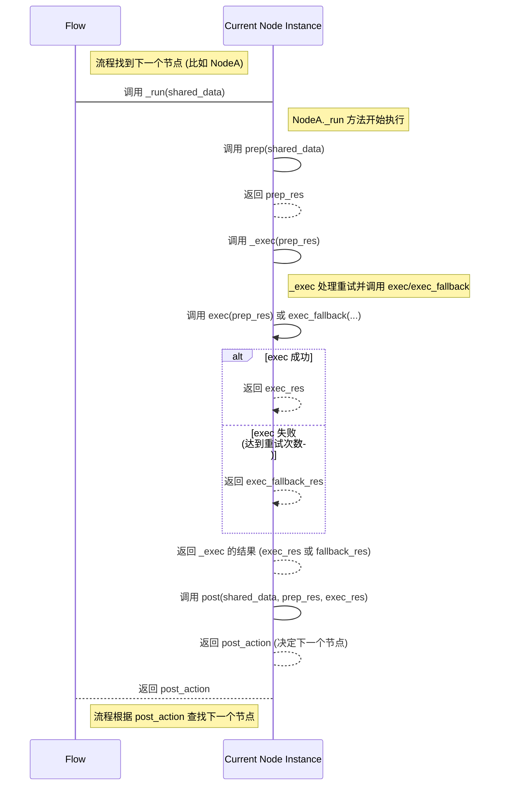

# Chapter 3: 节点 (Node)

欢迎回到 PocketFlow 教程！在 [第二章：图 (Graph)](02_图__graph__.md) 中，我们学习了 **图 (Graph)** 的概念，它是 PocketFlow 中描述工作流结构的抽象蓝图，由节点和连接这些节点的带标签的边组成。**流程 (Flow)** 则是在这个图上移动并执行的实体。

现在，是时候深入了解构成图结构的基本单元，以及真正执行任务的“工作站”了——这就是我们本章要讨论的 **节点 (Node)**。

## 什么是节点 (Node)？

想象一下工厂里的生产线。整条生产线（流程）是为了完成一个大任务（比如组装一辆汽车），但这个大任务被分解成许多小任务，每个小任务都在一个特定的**工作站**完成。例如，一个工作站负责安装轮胎，另一个负责安装车门，还有一个负责喷漆。

在 PocketFlow 中，**节点 (Node)** 就相当于这个“工作站”。

*   **节点是 PocketFlow 中执行具体任务的**基本单元**。**
*   每个节点都负责完成工作流中的一个**特定步骤或操作**。这可以是读取数据、调用一个大型语言模型 (LLM)、进行计算、清洗数据、发送通知等等。
*   节点之间相互独立，它们通常**通过一个共享的存储区域来传递数据**，而不是直接相互调用（我们会在 [第四章：共享存储 (Shared Store)](04_共享存储__shared_store__.md) 中详细讨论）。

你可以将节点想象成一个**带有明确输入和输出的独立处理单元**。

## 节点的核心阶段：Prep, Exec, Post

PocketFlow 中的标准节点通常被设计为包含三个核心阶段或方法：

1.  **准备阶段 (`prep`)**：
    *   **做什么？** 这个阶段负责**从共享存储中获取节点需要的数据**，并进行任何必要的预处理。它可能检查输入数据的有效性，或者从不同的地方收集信息。
    *   **工厂类比：** 就像工作站开始工作前，工人需要从仓库或者上一站接收原材料，并检查一下它们是否符合要求。
    *   **返回值：** `prep` 方法通常返回一个值，这个值将作为下一个阶段 `exec` 的输入。

2.  **执行阶段 (`exec`)**：
    *   **做什么？** 这是节点**执行主要任务逻辑**的阶段。它接收 `prep` 阶段的输出作为输入，并执行具体的计算、模型调用、数据转换等操作。
    *   **工厂类比：** 这是工作站进行实际加工的地方。安装轮胎，喷漆，等等。
    *   **返回值：** `exec` 方法返回任务的原始处理结果。

3.  **处理结果阶段 (`post`)**：
    *   **做什么？** 这个阶段负责**处理 `exec` 阶段的结果**，将结果存储到共享存储中，并决定**下一步的“动作”**。这个“动作”通常是一个字符串，流程会根据这个字符串来决定接下来执行哪个节点（回想一下 [第二章：图 (Graph)](02_图__graph__.md) 中图的连接）。
    *   **工厂类比：** 产品加工完成后，工人需要进行质量检查，包装好，然后根据指示（比如产品类型或目的地）将其送到下一站或完成区。
    *   **返回值：** `post` 方法的**返回值决定了流程的下一个走向**。如果返回 `None` 或没有返回任何值（隐式返回 `None`），流程可能会根据图的定义寻找默认后继或终止。如果返回一个字符串（如 `"transform"`, `"input"`, `"exit"`），流程会根据这个字符串在图结构中查找对应的后继节点。

这三个阶段的划分强制了关注点分离，使得节点逻辑更加清晰和模块化。

## 为什么这样设计节点？

这种 Prep/Exec/Post 的结构带来了几个好处：

*   **模块化：** 将数据的准备、核心逻辑和结果处理分开，每个方法只专注于一件事情。
*   **可测试性：** 你可以独立测试 `prep`, `exec`, `post` 方法，简化调试。
*   **灵活性：** PocketFlow 的一些高级特性（如批量处理、错误重试）是在这三个阶段的结构上实现的。例如，错误重试通常只发生在 `exec` 阶段。
*   **图的驱动：** `post` 方法的返回值直接驱动了流程在图结构上的跳转，使得节点能够灵活地控制流程的走向。

## 如何创建自定义节点？

在 PocketFlow 中创建自定义节点非常简单，只需要继承 `pocketflow.Node` 类，并实现 `prep`, `exec`, `post` 方法即可。

让我们看一个非常简单的节点示例，它从共享存储中读取一个数字，加一，然后把结果存回去，并总是返回 `"continue"` 动作。

```python
from pocketflow import Node

class AddOneNode(Node):
    def prep(self, shared):
        """从共享存储中读取 'number'"""
        # 检查 'number' 是否存在，如果不存在或不是数字，返回None或默认值
        number = shared.get("number", 0)
        if not isinstance(number, (int, float)):
            print(f"警告: 'number' 不是数字，使用默认值 0")
            number = 0
        return number # 将读取的数字作为 exec 的输入

    def exec(self, prep_res):
        """对数字加一"""
        print(f"执行加一: {prep_res} + 1")
        result = prep_res + 1
        return result # 将结果作为 post 的输入

    def post(self, shared, prep_res, exec_res):
        """将结果存回共享存储，并返回 'continue' 动作"""
        print(f"结果处理: {exec_res} 存回共享存储")
        shared["number"] = exec_res
        # 返回字符串决定下一个节点。如果返回 None，流程可能会结束。
        return "continue"
```

**代码解释：**

*   `from pocketflow import Node`: 导入 `Node` 基类。
*   `class AddOneNode(Node):`: 定义我们自己的节点类，继承自 `Node`。
*   `prep(self, shared)`: 接收 `shared` 字典作为参数。从 `shared` 中读取键为 `"number"` 的值，如果不存在则返回 `0`。将读取到的值返回。
*   `exec(self, prep_res)`: 接收 `prep` 的返回值 (`prep_res`) 作为参数。执行加一操作。返回计算结果。
*   `post(self, shared, prep_res, exec_res)`: 接收 `shared` 字典，`prep` 的返回值 (`prep_res`) 和 `exec` 的返回值 (`exec_res`) 作为参数。将 `exec_res` 存回 `shared["number"]`。返回字符串 `"continue"`。

**使用这个节点构建一个简单的流程：**

```python
from pocketflow import Flow

# ... (上面的 AddOneNode 类定义) ...

# 创建节点实例
add_node1 = AddOneNode()
add_node2 = AddOneNode()
add_node3 = AddOneNode()

# 连接节点，形成一个简单的线性流程
add_node1 >> add_node2 >> add_node3

# 创建流程，从 add_node1 开始
flow = Flow(start=add_node1)

# 初始化共享存储
shared_data = {"number": 5}

print(f"流程开始前: shared['number'] = {shared_data['number']}")

# 运行流程
flow.run(shared_data)

print(f"流程结束后: shared['number'] = {shared_data['number']}")
```

**预期输出：**

```
流程开始前: shared['number'] = 5
执行加一: 5 + 1
结果处理: 6 存回共享存储
执行加一: 6 + 1
结果处理: 7 存回共享存储
执行加一: 7 + 1
结果处理: 8 存回共享存储
流程结束后: shared['number'] = 8
```

这个例子展示了：
1.  如何定义一个继承自 `Node` 的类。
2.  如何在 `prep` 中从 `shared` 读取数据。
3.  如何在 `exec` 中执行核心逻辑。
4.  如何在 `post` 中将结果存回 `shared` 并返回一个“动作”来决定流程走向。
5.  多个相同的节点实例可以在同一个流程中独立工作，并通过 `shared` 传递数据。

## 错误处理和重试 (`exec_fallback`, `max_retries`, `wait`)

现实世界的任务经常会失败，特别是涉及外部服务（如调用 LLM API）时。PocketFlow 的 `Node` 基类提供了内置的错误处理和重试机制。

*   **`max_retries`**: 节点属性，指定 `exec` 方法在失败时最多重试的次数（默认为 1，即不重试）。
*   **`wait`**: 节点属性，指定重试之间的等待秒数（默认为 0）。
*   **`exec_fallback`**: 一个可选的方法。如果在达到 `max_retries` 后 `exec` 仍然失败，就会调用 `exec_fallback` 方法。你可以用它来提供一个默认结果、记录错误或执行其他清理操作，而不是让整个流程崩溃。

我们来看 `cookbook/pocketflow-node/flow.py` 中 `Summarize` 节点的例子：

```python
# 来自 cookbook/pocketflow-node/flow.py
from pocketflow import Node
from utils.call_llm import call_llm # 假设这是一个调用LLM的函数

class Summarize(Node):
    def prep(self, shared):
        """从共享存储读取文本"""
        # print("Summarize.prep: 获取数据") # 可以添加日志
        return shared.get("data", "") # 获取要总结的文本

    def exec(self, prep_res):
        """调用LLM进行总结"""
        # print("Summarize.exec: 调用LLM") # 可以添加日志
        if not prep_res:
             return "Empty text"
        prompt = f"Summarize this text in 10 words: {prep_res}"
        summary = call_llm(prompt)  # <-- 这个函数调用可能会失败
        return summary

    def exec_fallback(self, prep_res, exc):
        """如果exec失败，提供一个备用结果"""
        print(f"Summarize.exec 失败，原因: {exc}") # 打印错误信息
        return "Summarization failed." # 返回一个预设的失败消息

    def post(self, shared, prep_res, exec_res):
        """将总结结果存回共享存储"""
        # print("Summarize.post: 存储结果") # 可以添加日志
        shared["summary"] = exec_res
        # 没有 return 语句，默认返回 None，流程会查找 default 后继，如果找不到就结束。
        # 在这个单节点流程中，这将导致流程结束。
```

**在流程中配置重试：**

```python
# 来自 cookbook/pocketflow-node/flow.py
# ... (上面的 Summarize 类定义) ...

# 创建 Summarize 节点实例，配置最多重试 3 次
summarize_node = Summarize(max_retries=3, wait=1) # 每次重试等待1秒

# 创建流程
flow = Flow(start=summarize_node)

# ... (main.py 中运行流程的代码) ...
```

通过设置 `max_retries=3` 和 `wait=1`，如果 `summarize_node` 的 `exec` 方法在第一次运行时抛出异常，PocketFlow 会等待 1 秒，然后再次尝试运行 `exec`。它会重复这个过程最多 3 次。如果第三次重试仍然失败，流程不会崩溃，而是会调用 `exec_fallback` 方法，然后 `post` 方法会接收 `exec_fallback` 的返回值作为 `exec_res` 参数继续执行。

## 节点在流程中的执行过程（幕后原理）

理解节点如何在流程中被调度执行，有助于我们更好地使用它。回想一下 [第一章：流程 (Flow)](01_流程__flow__.md) 中提到的流程核心调度方法 `_orch`。当流程找到下一个要执行的节点 `curr` 后，它会调用 `curr._run(shared)` 方法来执行这个节点。

以下是 `BaseNode` 和 `Node` 基类中 `_run` 和 `_exec` 方法的简化逻辑：

```python
# 简化过的 pocketflow/__init__.py 中的 Node 核心执行逻辑

class BaseNode:
    # ... 其他方法 ...

    def _run(self, shared):
        # 1. 调用 prep 方法，获取输入 for exec
        p = self.prep(shared)
        # 2. 调用 _exec 方法执行核心逻辑 (处理重试等)
        e = self._exec(p) # <-- _exec 内部会调用 exec 或 exec_fallback
        # 3. 调用 post 方法处理结果并获取下一个动作
        next_action = self.post(shared, p, e)
        # 4. _run 方法返回 post 方法的结果 (即下一个动作)
        return next_action

class Node(BaseNode):
    # ... 其他方法和 __init__ ...

    def _exec(self, prep_res):
        # 实现重试逻辑
        for self.cur_retry in range(self.max_retries):
            try:
                # 尝试运行 exec 方法
                return self.exec(prep_res)
            except Exception as e:
                # 如果失败
                if self.cur_retry == self.max_retries - 1:
                    # 如果是最后一次尝试，调用 exec_fallback
                    return self.exec_fallback(prep_res, e)
                # 如果不是最后一次，等待后继续循环尝试
                if self.wait > 0:
                    time.sleep(self.wait)
        # 理论上不会到这里，但为了代码完整性
        return None # 或者可以抛出异常
```

这是一个简单的时序图，展示了流程、节点实例及其内部方法之间的调用关系：



从图中可以看出，`_run` 方法是节点的入口点，它负责按顺序调用 `prep`, `_exec`, `post`。而 `_exec` 方法则封装了 `exec` 的实际调用以及重试和备用逻辑。流程只需要关心调用 `_run` 并获取其返回值（下一个动作）即可。

需要注意的是，流程在运行到某个节点时，通常会创建该节点类的一个**新的实例**（通过 `copy.copy`，如 [第一章：流程 (Flow)](01_流程__flow__.md) 中所示）。这意味着每个节点在流程执行中的状态是独立的，不会因为多次执行或在不同流程中使用而相互干扰。

## 不同类型的节点

除了标准的 `Node` 类，PocketFlow 还提供了一些特殊的节点类型，它们通常是 `Node` 的子类，并修改了 `_exec` 方法的行为，以支持更复杂的场景：

*   **`BatchNode`**: 用于批量处理。它的 `_exec` 方法会期望接收一个列表作为输入（由 `prep` 返回），然后对列表中的每一个元素独立调用父类（`Node`）的 `_exec` 方法。更多细节请参考 [第五章：批量处理 (Batch Processing)](05_批量处理__batch_processing__.md) 章。
*   **`AsyncNode`**: 用于构建异步工作流。它的方法（`prep_async`, `exec_async`, `post_async`, `exec_fallback_async`）都是异步方法 (`async def`)，`_exec` 方法内部会使用 `await` 来调用它们。更多细节请参考 [第六章：异步处理 (Async Processing)](06_异步处理__async_processing__.md) 章。
*   还有结合批量和异步的节点类型，如 `AsyncBatchNode` 和 `AsyncParallelBatchNode`。

这些特殊节点类型的存在，使得你可以在定义了基本的 `prep`, `exec`, `post` 逻辑后，轻松地让你的节点支持批量或异步处理，而无需大幅修改核心逻辑。

## 总结

在本章中，我们深入学习了 PocketFlow 的 **节点 (Node)** 概念。我们了解到，节点是执行具体任务的基本单元，类似于工厂里的工作站。每个节点通常包含**准备阶段 (`prep`)**、**执行阶段 (`exec`)** 和**处理结果阶段 (`post`)**。

我们学习了如何通过继承 `pocketflow.Node` 类来创建自定义节点，实现这三个核心方法，并了解了 `prep` 方法负责获取输入，`exec` 方法执行核心逻辑，而 `post` 方法处理结果并**通过其返回值决定流程的下一个动作**。我们还探讨了如何使用 `exec_fallback`, `max_retries`, `wait` 来实现健壮的错误处理和重试机制。

最后，我们简要了解了节点在流程中被调度的幕后原理，以及不同类型的节点如何扩展了基本功能。

节点是构成 PocketFlow 工作流的基石。它们通过共享存储相互协作，形成流程图，共同完成复杂的任务。在下一章，我们将详细探讨节点之间传递数据的方式——**共享存储 (Shared Store)**。

[下一章：共享存储 (Shared Store)](04_共享存储__shared_store__.md)

---

Generated by [AI Codebase Knowledge Builder](https://github.com/The-Pocket/Tutorial-Codebase-Knowledge)