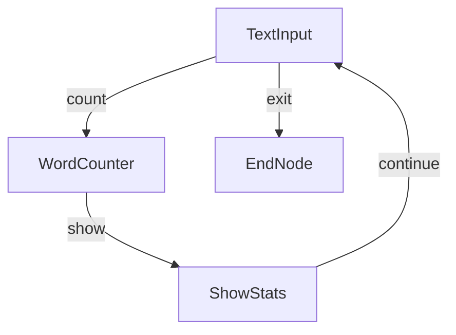
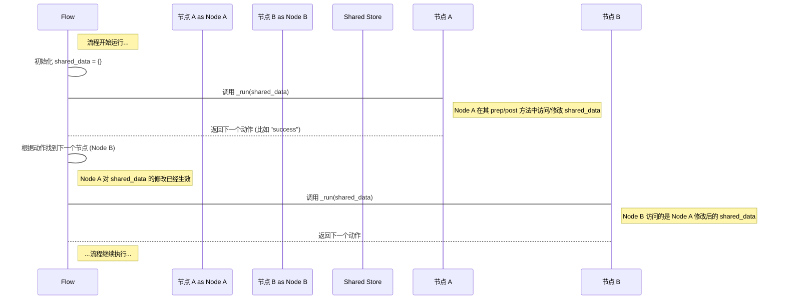

# Chapter 4: 共享存储 (Shared Store)

欢迎回到 PocketFlow 教程！在前面的章节中，我们学习了 **流程 (Flow)** ([01_流程__flow__.md)](01_流程__flow__.md) 如何作为任务的蓝图来编排步骤，**图 (Graph)** ([02_图__graph__.md)](02_图__graph__.md) 如何描述这些步骤（**节点 (Node)**）之间的连接关系，以及 **节点 (Node)** ([03_节点__node__.md)](03_节点__node__.md) 如何作为工作流中执行具体任务的基本单元。

现在，我们来探讨一个关键问题：如果不同的节点是独立的“工作站”，它们如何**互相传递数据和共享信息**？例如，一个节点读取用户输入，另一个节点需要使用这个输入进行处理；或者一个节点计算出中间结果，另一个节点需要基于这个结果继续工作。

PocketFlow 解决这个问题的方式就是引入 **共享存储 (Shared Store)** 的概念。

## 什么是共享存储 (Shared Store)？

想象一个工厂的生产线，每个工作站都在处理产品。在这些工作站之间，通常会有一个**中央仓库**或者一个**手推车**，用来存放正在处理的物品、半成品或者需要共享的信息。每个工作站完成自己的工作后，会把结果或者需要给下一站的东西放进仓库/手推车里，然后下一站的工作站从同一个仓库/手推车里取出他们需要的东西。

在 PocketFlow 中，**共享存储** 就扮演了这个“中央仓库”或“手推车”的角色。

*   它是一个**字典 (Python dict)**，通常命名为 `shared`。
*   它在流程开始时被**初始化**（或者作为参数传递给 `flow.run()` 方法）。
*   这个**同一个** `shared` 字典实例会被**传递给流程中的每一个节点**。
*   每个节点都**可以读取** `shared` 中的任何数据，也**可以写入或修改** `shared` 中的任何数据。
*   它是节点之间**通信和维护整个工作流状态**的关键机制。

简单来说：
*   共享存储是一个**所有节点都能访问的公共数据区域**。
*   节点通过往这个字典里存取数据来**交换信息**。
*   流程的状态（比如处理了多少个项目，总共花了多少时间，或者一些配置参数）可以保存在这里。

## 为什么需要共享存储？

为什么不让节点直接把数据传递给下一个节点呢？例如，节点A处理完后，直接把结果作为参数调用节点B的方法？

主要原因如下：

1.  **解耦 (Decoupling):** 节点的设计应该是独立的。一个节点不应该知道它的上游节点是谁，也不应该关心它的下游节点具体需要什么格式的数据。它只需要知道把什么信息放到“公共仓库”里，以及从“公共仓库”里取什么信息。这使得节点更容易复用和组合。
2.  **灵活的流程：** 回想一下 [第二章：图 (Graph)](02_节点__graph__.md)，流程可以根据节点的返回动作走向不同的路径。如果节点之间是直接传递数据，那么每个节点都需要知道所有可能的下游节点的接口。有了共享存储，节点只需要把结果放到 `shared` 里，流程根据动作找到下一个节点后，下一个节点自己从 `shared` 里取它需要的数据即可，无需关心数据是哪个节点放进去的。
3.  **状态维护：** 有些信息需要在整个流程中保持和更新，比如一个计数器、一个累计结果或者一些全局配置。共享存储是存放这些跨节点、跨执行（在批量处理等场景下）的状态信息的理想场所。

## 如何使用共享存储？

使用共享存储非常直观，因为它就是一个普通的 Python 字典。每个节点的 `prep` 和 `post` 方法都会接收 `shared` 字典作为第一个参数。

*   **在 `prep` 方法中读取数据：** 你可以在 `prep` 方法中从 `shared` 字典中获取当前节点执行所需的所有数据。
*   **在 `post` 方法中写入数据：** 你可以在 `post` 方法中将 `exec` 方法产生的处理结果或任何需要传递给后续节点的状态信息存入 `shared` 字典。

让我们再次使用 [第三章：节点 (Node)](03_节点__node__.md) 中提到的简单计数器节点示例，来展示共享存储的使用。

这个节点从 `shared` 中读取一个数字，加一，然后把更新后的数字存回 `shared`。

```python
# 来自示例：一个简单的计数器节点
from pocketflow import Node

class AddOneNode(Node):
    def prep(self, shared):
        """在准备阶段从共享存储读取数据"""
        # 使用 .get() 是一个好习惯，可以提供默认值，避免键不存在时出错
        number = shared.get("number", 0)
        print(f"AddOneNode.prep: 从 shared 读取 'number' = {number}")
        return number # 将读取的数字返回给 exec

    def exec(self, prep_res):
        """执行核心逻辑：加一"""
        result = prep_res + 1
        print(f"AddOneNode.exec: 计算 {prep_res} + 1 = {result}")
        return result # 将结果返回给 post

    def post(self, shared, prep_res, exec_res):
        """在处理结果阶段将数据存回共享存储"""
        shared["number"] = exec_res # 将 exec 的结果存回 shared
        print(f"AddOneNode.post: 将新的 'number' = {exec_res} 存入 shared")
        # 返回一个动作字符串决定下一个节点，这里简单返回 None 表示结束或默认后继
        # 在实际流程中通常会返回决定流程走向的动作，比如 "continue"
        return None # 或者 "continue"
```

**代码解释：**

*   `prep(self, shared)`: 注意这里的 `shared` 参数。我们使用 `shared.get("number", 0)` 来安全地从 `shared` 中获取 `number`，如果 `number` 键不存在，则使用默认值 `0`。
*   `post(self, shared, prep_res, exec_res)`: 同样接收 `shared` 参数。我们将 `exec` 方法返回的结果 `exec_res` 直接赋值给 `shared["number"]`，从而更新共享存储中的值。

现在，我们用这个节点构建一个流程来运行它：

```python
# 构建一个简单的流程来运行 AddOneNode
from pocketflow import Flow

# ... (上面的 AddOneNode 类定义) ...

# 创建节点实例
add_node = AddOneNode()

# 创建一个简单的流程（只有一个节点）
flow = Flow(start=add_node)

# **初始化共享存储**
# 这是流程运行前创建的，会传递给第一个节点
initial_shared_data = {"number": 10}

print(f"流程运行前，共享存储内容: {initial_shared_data}")

# **运行流程，并将共享存储传递进去**
flow.run(initial_shared_data)

print(f"流程运行后，共享存储内容: {initial_shared_data}")
```

**预期输出：**

```
流程运行前，共享存储内容: {'number': 10}
AddOneNode.prep: 从 shared 读取 'number' = 10
AddOneNode.exec: 计算 10 + 1 = 11
AddOneNode.post: 将新的 'number' = 11 存入 shared
流程运行后，共享存储内容: {'number': 11}
```

这个简单的例子清晰地展示了：
1.  流程运行前，可以准备一个初始的 `shared` 字典。
2.  `flow.run()` 方法会接收这个 `shared` 字典。
3.  节点在其 `prep` 方法中从 `shared` 读取数据。
4.  节点在其 `post` 方法中向 `shared` 写入数据。
5.  `shared` 字典在流程运行过程中是被**所有节点共享的同一个实例**，因此一个节点对它的修改会立刻对下一个节点可见。

## 更复杂的例子：共享统计信息

让我们看看 `cookbook/pocketflow-communication` 示例中是如何使用共享存储来维护跨节点的统计信息的。这个示例实现了读取文本、计数单词、显示统计信息的功能。

```python
# 来自 cookbook/pocketflow-communication/nodes.py (简化版)
from pocketflow import Node

class TextInput(Node):
    def prep(self, shared):
        # 这里只是获取用户输入，不需要从 shared 读取特定数据
        return input("输入文本 (或 'q' 退出): ")

    def post(self, shared, prep_res, exec_res):
        if prep_res == 'q':
            return "exit" # 用户输入 'q' 时返回 'exit' 动作
        
        # 将用户输入的文本存入 shared，供后续节点使用
        shared["current_text"] = prep_res
        
        # **初始化或更新统计信息**
        # 如果 shared 中没有 'stats' 键，说明是第一次运行，初始化它
        if "stats" not in shared:
            shared["stats"] = {
                "total_texts": 0,
                "total_words": 0
            }
        shared["stats"]["total_texts"] += 1 # 处理文本数量加一
        
        # 返回 'count' 动作，指示流程下一步执行 WordCounter 节点
        return "count"

class WordCounter(Node):
    def prep(self, shared):
        # 从 shared 中读取 TextInput 存入的文本
        return shared["current_text"]

    def exec(self, text):
        # 计算单词数量
        return len(text.split())

    def post(self, shared, prep_res, exec_res):
        # 获取当前统计信息 (从 shared 中读取)
        stats = shared["stats"]
        # 更新总词数 (将 exec 的结果加到 stats 中)
        stats["total_words"] += exec_res
        # 将更新后的 stats 存回 shared (实际上修改的就是 shared["stats"] 字典本身)
        # shared["stats"] = stats # 这一步是可选的，因为 stats 是 shared["stats"] 的引用
        
        # 返回 'show' 动作，指示流程下一步执行 ShowStats 节点
        return "show"

class ShowStats(Node):
    def prep(self, shared):
        # 从 shared 中读取统计信息
        return shared["stats"]

    def post(self, shared, prep_res, exec_res):
        stats = prep_res # prep_res 就是 shared["stats"]
        # 打印统计信息
        print(f"\n--- 统计 ---")
        print(f"处理文本数: {stats['total_texts']}")
        print(f"总词数: {stats['total_words']}")
        avg_words = stats['total_words'] / stats['total_texts'] if stats['total_texts'] > 0 else 0
        print(f"平均每篇文本词数: {avg_words:.1f}\n")
        
        # 返回 'continue' 动作，指示流程回到 TextInput 节点继续循环
        return "continue"

# 流程定义 (来自 cookbook/pocketflow-communication/flow.py 简化版)
from pocketflow import Flow, Node # 导入 Node 是为了 EndNode
# 假设 EndNode 已经定义为一个简单的 Node 子类

def create_word_count_flow():
    text_input = TextInput()
    word_counter = WordCounter()
    show_stats = ShowStats()
    end_node = EndNode() # 需要一个结束节点
    
    # 连接节点
    text_input - "count" >> word_counter
    word_counter - "show" >> show_stats
    show_stats - "continue" >> text_input # 从 ShowStats 回到 TextInput 形成循环
    text_input - "exit" >> end_node # 从 TextInput 退出到 EndNode
    
    return Flow(start=text_input)

# 主运行代码 (来自 cookbook/pocketflow-communication/main.py 简化版)
# ... (create_word_count_flow 函数定义) ...

word_count_flow = create_word_count_flow()

# 初始化一个空的共享存储字典
shared_data = {}

# 运行流程
print("启动词数统计流程 (输入 'q' 退出)")
word_count_flow.run(shared_data)

print("流程结束。")
# shared_data 现在包含了最终的统计结果
print(f"最终共享存储内容 (stats): {shared_data.get('stats', {})}")

```

**流程运行示意：**



这个示例更完整地展示了共享存储的用法：

*   `TextInput` 将用户输入文本存入 `shared["current_text"]`。
*   `TextInput` **初始化**或**更新** `shared["stats"]` 字典。这个 `stats` 字典在整个流程的生命周期内都被维护。
*   `WordCounter` 从 `shared["current_text"]` 读取文本，计算词数，并将结果累加到 `shared["stats"]["total_words"]` 中。
*   `ShowStats` 从 `shared["stats"]` 读取统计信息并显示。
*   `ShowStats` 返回 `"continue"` 动作，流程回到 `TextInput`，用户可以输入更多文本。每次新的文本输入和处理都会更新 `shared["stats"]`。
*   当用户输入 `"q"` 时，`TextInput` 返回 `"exit"` 动作，流程跳转到 `EndNode` 并结束。

每次节点运行时，它们访问的都是同一个 `shared_data` 字典实例。

## 共享存储在幕后是如何工作的？

你可能会好奇，这个 `shared` 字典是如何在节点之间传递的？回顾 [第三章：节点 (Node)](03_节点__node__.md) 中关于流程执行过程的描述，流程的调度器 (`Flow._orch`) 是一个循环，它负责找到下一个要执行的节点，然后调用该节点的 `_run` 方法。

核心就在这里：`Flow._orch` 在调用每个节点的 `_run` 方法时，都**将同一个 `shared` 字典实例作为参数传递进去**。

这是一个简化的时序图，展示了流程和节点之间如何传递共享存储：



在 PocketFlow 的内部代码中（`pocketflow/__init__.py`），你可以看到这样的结构：

*   `Flow` 类的 `_run` 方法接收 `shared` 参数，并将其传递给 `_orch` 方法：
    ```python
    # 简化过的 pocketflow/__init__.py 中的 Flow._run
    def _run(self, shared):
        # ... 调用 prep ...
        o = self._orch(shared) # 将 shared 传递给编排器
        # ... 调用 post ...
        return self.post(shared, prep_res, o)
    ```
*   `Flow` 类的 `_orch` 方法在一个 `while` 循环中依次执行节点。在循环内部，它调用当前节点的 `_run` 方法时，**同样将接收到的 `shared` 参数传递给它**：
    ```python
    # 简化过的 pocketflow/__init__.py 中的 Flow._orch
    def _orch(self, shared, params=None):
        curr = copy.copy(self.start_node) # 获取当前节点（复制一份）
        # ... 参数处理 ...
        last_action = None

        while curr: # 只要当前节点存在
            # ... 设置节点参数 ...
            # 调用当前节点的 _run 方法，并传递 shared 字典
            last_action = curr._run(shared)
            # 根据返回的动作找到下一个节点
            curr = copy.copy(self.get_next_node(curr, last_action))
            # 注意：这里 copy.copy 只复制节点对象本身，shared 字典的引用保持不变

        return last_action
    ```
*   `BaseNode` (和其子类 `Node`) 的 `_run` 方法接收 `shared` 参数，并将其传递给 `prep` 和 `post` 方法：
    ```python
    # 简化过的 pocketflow/__init__.py 中的 BaseNode._run
    def _run(self, shared):
        # 将 shared 传递给 prep 方法
        p = self.prep(shared)
        # 调用 _exec 方法获取结果 (不传递 shared，因为核心逻辑通常不直接访问 shared)
        e = self._exec(p)
        # 将 shared 以及 prep 和 exec 的结果传递给 post 方法
        next_action = self.post(shared, p, e)
        # 返回 post 方法的结果 (即下一个动作)
        return next_action
    ```

这个调用链保证了从 `flow.run(shared_data)` 开始的那个 `shared_data` 字典实例，会被整个流程中的每一个节点的 `prep` 和 `post` 方法访问到。

**重要提示：** 虽然流程在调度节点时会复制节点对象本身 (`copy.copy(curr)`)，但它传递给节点 `_run` 方法的 `shared` 字典**是同一个实例**。这意味着你在一个节点的 `post` 方法中修改了 `shared`，这个修改在下一个节点的 `prep` 方法中就能立刻看到。这就是共享存储实现数据传递和状态维护的原理。

## 共享存储的最佳实践

*   **使用唯一的键名：** 确保你的节点使用的键名是唯一的，以避免不同节点不小心覆盖了彼此的数据。如果可能，可以使用一个包含节点名称或功能的命名空间约定，例如 `shared["text_input_result"]` 或 `shared["word_count_stats"]`。
*   **注意数据类型：** 共享存储是一个字典，可以存放各种 Python 对象。确保你的节点在读取数据时，对可能的数据类型和缺失值进行检查（如使用 `shared.get(key, default_value)`），避免运行时错误。
*   **存储必要的数据：** 共享存储应该只存储流程需要跨节点传递或维护的状态数据。避免将所有临时变量都放入 `shared`，保持其清晰和易于管理。
*   **考虑内存：** 如果你在 `shared` 中存储大量数据（如大型数据集、模型参数等），要注意内存消耗。对于非常大的数据，可能需要考虑其他方案（如文件、数据库），并在 `shared` 中只存储它们的引用或路径。
*   **只在 `prep` 和 `post` 中直接修改：** 尽管你可以在 `exec` 中访问 `shared`，但最佳实践是将从 `shared` 读取数据的逻辑放在 `prep` 中，将需要存回 `shared` 的逻辑放在 `post` 中。这使得节点的职责更清晰，也符合 PocketFlow 的设计模式。

## 总结

在本章中，我们深入探讨了 PocketFlow 中的 **共享存储 (Shared Store)** 概念。我们了解到，共享存储是一个被流程中所有节点共享的字典 (`shared`)，它是节点之间传递数据和维护工作流状态的核心机制。

我们通过简单的计数器示例和更完整的单词计数示例，学习了如何在节点的 `prep` 方法中从 `shared` 读取数据，以及如何在 `post` 方法中将数据存回 `shared`。我们还了解了流程在幕后如何通过将同一个 `shared` 字典实例传递给每个节点的 `_run` 方法来实现数据共享。

理解共享存储是构建复杂 PocketFlow 工作流的关键一步。它提供了一种强大而灵活的方式来管理节点之间的数据流和全局状态。

接下来，我们将学习如何利用 PocketFlow 的 **批量处理 (Batch Processing)** 功能来高效地处理大量数据。

[下一章：批量处理 (Batch Processing)](05_批量处理__batch_processing__.md)

---

Generated by [AI Codebase Knowledge Builder](https://github.com/The-Pocket/Tutorial-Codebase-Knowledge)