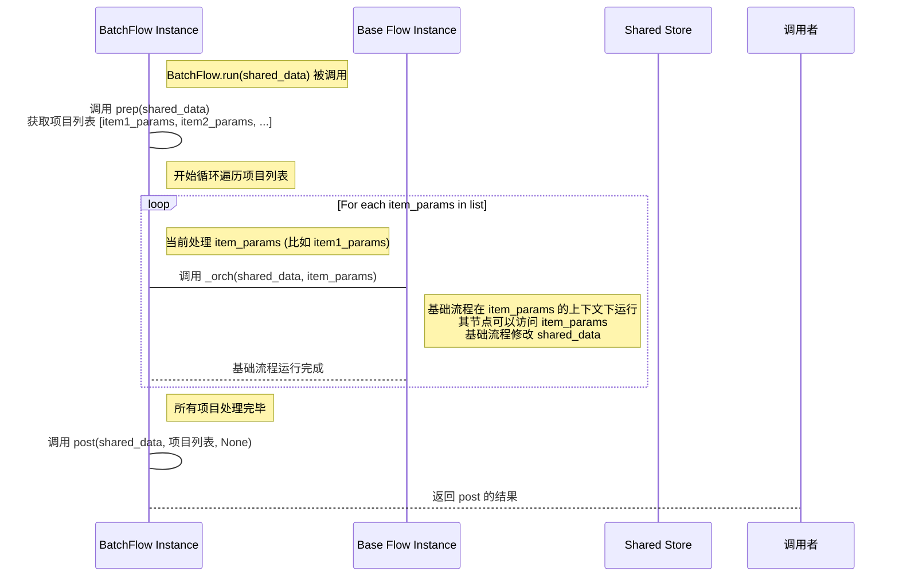
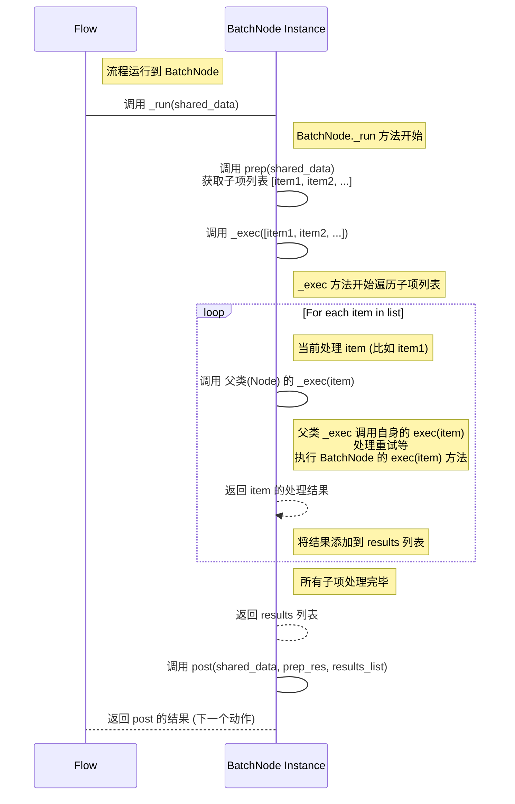

# Chapter 5: 批量处理 (Batch Processing)

欢迎回到 PocketFlow 教程！在 [第四章：共享存储 (Shared Store)](04_共享存储__shared_store__.md) 中，我们学习了如何使用共享存储 (`shared` 字典) 在流程的不同节点之间传递数据和维护状态。我们看到，通过 `shared`，一个节点可以将处理结果存入，供后续节点读取。

但是，如果我们有**大量相似的任务或数据项需要处理**，该怎么办呢？例如，你可能有几百张图片需要应用相同的滤镜，或者几千个文本文件需要翻译。如果手动地为每个任务创建一个流程实例并运行，或者设计一个流程包含一个处理循环，这可能会变得复杂、低效且难以管理。

PocketFlow 的**批量处理 (Batch Processing)** 功能正是为了解决这个问题而设计的。它提供了一种优雅且高效的方式，让你能够让同一个节点或同一个子流程自动地对输入数据列表中的每一个项目进行处理。

## 什么是批量处理？

想象一下一个洗车房。如果只有一辆车，工人会按照洗车流程（冲水、打泡沫、清洗、冲水、擦干）完整地处理它。但如果一次来了很多车（一个批次），洗车房不会等第一辆车完全洗好再开始洗第二辆。他们可能会让第一辆车冲水后，进入下一站打泡沫，同时第二辆车开始冲水。或者，如果只有一个洗车位，他们会按顺序把所有车一辆接一辆地洗完。

PocketFlow 的批量处理就是这种“批量化”工作的概念。它让你能够提交一个“批次”的输入，然后 PocketFlow 会安排对这个批次中的每个“项目”进行处理。

PocketFlow 主要提供了两种实现批量处理的方式：

1.  **BatchFlow (批量流程)**：适用于对每个输入项目执行**一整个流程**。你可以把它想象成让洗车房的整个生产线重复运行多次，每次处理不同的车。
2.  **BatchNode (批量节点)**：适用于在**一个节点内部**处理一个批次或一个数据块。你可以把它想象成洗车房里的一个特别大的擦干机，可以一次把好几辆车一起擦干，或者一次处理一大堆毛巾。它更常用于处理一个大的数据输入（比如一个大文件），并将其分割成小块（chunk）进行并行或顺序处理。

这两种方式都旨在提高处理大量数据的效率和便利性。

## BatchFlow：批量运行整个流程

`BatchFlow` 适用于你有**一个定义好的基础流程 (base flow)**，它知道如何处理**一个**单一的输入项目，但现在你需要用这个流程去处理**很多个**独立的输入项目。

### 如何使用 BatchFlow？

使用 `BatchFlow` 的步骤如下：

1.  **定义基础流程 (Base Flow):** 创建一个标准的 `Flow` 实例，它能够处理一个单一的输入项目。这个流程的节点通常会在 `prep` 中从共享存储或节点参数中获取当前项目的数据。
2.  **定义 BatchFlow 类:** 创建一个类，继承自 `pocketflow.BatchFlow`。
3.  **实现 BatchFlow 的 `prep` 方法:** 这个方法不处理单个项目，而是负责**生成一个列表或迭代器**。列表中的每个元素代表一个要处理的**项目**。通常，每个项目的数据或参数会封装在一个字典中。这个方法接收整个批次的输入数据或上下文（通常从 `shared` 中获取）。
4.  **创建 BatchFlow 实例:** 创建你的 `BatchFlow` 类的实例，并将步骤 1 中定义好的**基础流程**作为参数传递给 `BatchFlow` 的构造函数。
5.  **运行 BatchFlow:** 调用 `BatchFlow` 实例的 `run()` 方法，通常需要传递一个初始的 `shared` 字典。

`BatchFlow` 在运行时，会先调用自身的 `prep` 方法获取要处理的项目列表。然后，它会遍历这个列表，**为列表中的每一个项目**，都**独立地运行一次基础流程**。每个基础流程的运行可能会接收该项目对应的参数。

### BatchFlow 示例：批量处理图片

我们来看一个简化的示例，来自 `cookbook/pocketflow-batch-flow`。这个例子使用 `BatchFlow` 来对多张图片应用不同的滤镜。

首先，定义一个处理**单张图片**的基础流程：

```python
# 文件: flow.py (部分)
from pocketflow import Flow, BatchFlow
# 假设 nodes.py 中有 LoadImage, ApplyFilter, SaveImage 节点

def create_base_flow():
    """创建一个处理单张图片的基础流程"""
    # 创建节点
    load = LoadImage()      # 节点负责加载图片
    filter_node = ApplyFilter() # 节点负责应用滤镜
    save = SaveImage()      # 节点负责保存图片

    # 连接节点，形成单张图片处理的流程
    # LoadImage 节点可能返回 "apply_filter" 动作后连接到 ApplyFilter
    load - "apply_filter" >> filter_node
    # ApplyFilter 节点可能返回 "save" 动作后连接到 SaveImage
    filter_node - "save" >> save

    # 创建并返回基础流程，从 load 节点开始
    return Flow(start=load)
```

**代码解释：**
`create_base_flow` 函数创建了一个标准的 `Flow`，它定义了处理**一张图片**的步骤：加载 -> 应用滤镜 -> 保存。这个流程本身并不知道如何处理多张图片。

接下来，定义一个 `ImageBatchFlow` 类，继承自 `BatchFlow`：

```python
# 文件: flow.py (部分)
# ... (create_base_flow 函数定义) ...
# ... 导入 LoadImage, ApplyFilter, SaveImage 节点 ...

class ImageBatchFlow(BatchFlow):
    """用于批量处理多张图片和多种滤镜的 BatchFlow"""

    def prep(self, shared):
        """
        生成要处理的每个图片/滤镜组合的参数。
        BatchFlow 的 prep 方法返回一个列表，
        列表中的每个元素都是一个要处理的项目（通常是一个参数字典）。
        """
        # 要处理的图片列表
        images = ["cat.jpg", "dog.jpg", "bird.jpg"]

        # 要应用的滤镜列表
        filters = ["grayscale", "blur", "sepia"]

        # 生成所有图片和滤镜的组合作为要处理的项目列表
        params = []
        for img in images:
            for f in filters:
                params.append({
                    "input_image": img, # 项目参数1: 输入图片文件名
                    "filter_name": f    # 项目参数2: 应用的滤镜名称
                })

        # BatchFlow 的 prep 方法返回项目列表
        return params

# 注意：BatchFlow 通常不需要实现 exec 和 post 方法，
# 因为它的核心逻辑在于遍历 prep 返回的项目列表，并为每个项目运行 base flow。
# 如果需要对所有批次运行结果进行聚合或最终处理，可以实现 post 方法。
```

**代码解释：**
`ImageBatchFlow` 的核心是它的 `prep` 方法。它硬编码了一个图片列表和一个滤镜列表，然后生成所有可能的组合。每个组合被封装成一个字典，包含 `"input_image"` 和 `"filter_name"`。`prep` 方法最终返回的是一个包含所有这些字典的列表。这个列表就是 `BatchFlow` 要处理的**项目批次**。

最后，创建 `BatchFlow` 实例并运行：

```python
# 文件: flow.py (部分)
# ... (create_base_flow 和 ImageBatchFlow 类定义) ...

def create_flow():
    """创建完整的批量处理流程"""
    # 创建处理单张图片的基础流程实例
    base_flow = create_base_flow()

    # 创建 ImageBatchFlow 实例，并将基础流程传递给它
    batch_flow = ImageBatchFlow(start=base_flow) # BatchFlow 的 start 参数是它的 base flow

    return batch_flow

# 文件: main.py (部分)
# ... 导入 create_flow 函数 ...

# 创建批量流程
image_batch_flow = create_flow()

# 初始化共享存储 (BatchFlow 本身可以访问 shared，基础流程运行也会接收这个 shared)
shared_data = {} # 例如，可以在 shared 中存放输出目录等信息

print("开始批量处理图片...")
# 运行批量流程
image_batch_flow.run(shared_data)

print("批量处理完成。")
```

**预期行为：**
当你运行 `image_batch_flow.run(shared_data)` 时：
1.  `ImageBatchFlow` 调用自身的 `prep` 方法，生成包含 3 张图片 \* 3 种滤镜 = 9 个参数字典的列表。
2.  `ImageBatchFlow` 遍历这个列表。对于列表中的**每一个参数字典** (例如 `{"input_image": "cat.jpg", "filter_name": "grayscale"}`)：
    *   它会获取 `create_base_flow` 定义的基础流程实例 (`base_flow`)。
    *   它会以这个参数字典 (`{"input_image": "cat.jpg", "filter_name": "grayscale"}`) 作为**基础流程运行时的额外参数**，运行一次基础流程。
    *   基础流程中的 `LoadImage` 节点可以在其 `prep` 或 `exec` 中访问这些参数，知道要加载 `"cat.jpg"`。
    *   基础流程中的 `ApplyFilter` 节点可以访问这些参数，知道要应用 `"grayscale"` 滤镜。
    *   基础流程会按其定义的顺序（加载 -> 应用滤镜 -> 保存）执行，处理完这张图片。
3.  这个过程会重复 9 次，为每一张图片应用每一种指定的滤镜。
4.  所有的基础流程运行完成后，`BatchFlow` 的 `run` 方法返回。

**关键点：** `BatchFlow` 的 `prep` 返回的是**要处理的项目列表**，而不是处理结果。每个项目的数据（例如文件名、滤镜类型）会作为参数传递给基础流程的每次运行。基础流程的每个节点可以在其 `prep` 或通过 `self.params` 访问这些参数，从而知道要处理的是哪个具体项目及其细节。`shared` 字典在整个 `BatchFlow` 运行过程中是**同一个实例**，可以在各个基础流程运行之间共享全局状态，但项目相关的特定数据通常通过参数传递。

## BatchNode：在单个节点内批量处理

`BatchNode` 适用于一个任务步骤本身就需要处理一个**数据集合**，并且你希望这个节点的 `exec` 方法能够**一次处理集合中的一个元素**，然后将所有元素的处理结果在 `post` 中进行**聚合**。它特别适合处理需要**分块 (chunking)** 的大型数据输入。

### 如何使用 BatchNode？

使用 `BatchNode` 的步骤如下：

1.  **定义 BatchNode 类:** 创建一个类，继承自 `pocketflow.BatchNode`。
2.  **实现 BatchNode 的 `prep` 方法:** 这个方法负责从共享存储或其他地方获取节点的输入数据，并将其**分割成一个列表或迭代器**，其中的每个元素代表一个要独立处理的**子项 (item)** 或**数据块 (chunk)**。
3.  **实现 BatchNode 的 `exec` 方法:** 这个方法接收 `prep` 返回的列表中的**一个子项**作为输入，并执行针对**单一子项**的处理逻辑。`BatchNode` 的内部机制会自动对 `prep` 返回的列表中的每一个子项调用一次 `exec` 方法。
4.  **实现 BatchNode 的 `post` 方法:** 这个方法接收 `prep` 方法的返回值 (`prep_res`) 以及一个包含所有 `exec` 方法返回结果的**列表** (`exec_res_list`) 作为参数。它负责将所有子项的处理结果进行**聚合或汇总**。
5.  **在流程中使用 BatchNode:** 将创建好的 `BatchNode` 实例像普通节点一样添加到流程中。

`BatchNode` 在运行时，会调用自身的 `prep` 方法获取子项列表。然后，它会在内部**遍历**这个列表，**对列表中的每一个子项调用一次** `exec` 方法。所有 `exec` 调用的结果会被收集到一个列表中，然后作为参数传递给 `post` 方法。

### BatchNode 示例：分块处理大型 CSV 文件

我们来看一个简化的示例，来自 `cookbook/pocketflow-batch-node`。这个例子使用 `BatchNode` 来分块处理一个大型 CSV 文件。

首先，定义一个 `CSVProcessor` 类，继承自 `BatchNode`：

```python
# 文件: nodes.py (部分)
import pandas as pd
from pocketflow import BatchNode
# 假设 sales.csv 包含一个 'amount' 列

class CSVProcessor(BatchNode):
    """一个分块处理大型 CSV 文件的 BatchNode"""

    def __init__(self, chunk_size=1000):
        """初始化时指定分块大小"""
        super().__init__()
        self.chunk_size = chunk_size # 节点的参数，决定了 prep 如何分块

    def prep(self, shared):
        """
        读取 CSV 文件并分割成数据块 (chunks)。
        BatchNode 的 prep 方法返回一个可迭代对象，
        其每个元素是一个要由 exec 方法处理的“子项”或“数据块”。
        """
        input_file = shared.get("input_file", "data/sales.csv") # 从 shared 获取文件名

        print(f"CSVProcessor.prep: 读取文件 {input_file} 并分块 (chunk_size={self.chunk_size})")
        # 使用 pandas 的 chunksize 参数读取 CSV，返回一个迭代器
        chunks = pd.read_csv(
            input_file,
            chunksize=self.chunk_size
        )
        return chunks # 返回一个迭代器，BatchNode 将遍历它并为每个元素调用 exec

    def exec(self, chunk):
        """
        处理一个单一的数据块 (chunk)。
        这个方法会被 BatchNode 对 prep 返回的每个元素调用一次。
        """
        # chunk 是一个 pandas DataFrame，代表一个数据块
        print(f"CSVProcessor.exec: 处理一个数据块 ({len(chunk)} 行)")
        # 对这个数据块进行简单统计
        return {
            "total_chunk_sales": chunk["amount"].sum(), # 这个块的总销售额
            "num_chunk_transactions": len(chunk)      # 这个块的交易数量
        }
        # BatchNode 会收集所有 exec 调用的返回值，形成一个列表，传递给 post

    def post(self, shared, prep_res, exec_res_list):
        """
        将所有数据块的处理结果进行聚合。
        exec_res_list 是一个列表，包含所有 exec 方法的返回值。
        """
        print(f"CSVProcessor.post: 聚合 {len(exec_res_list)} 个数据块的结果")

        # 聚合所有块的总销售额和总交易数量
        total_sales = sum(res["total_chunk_sales"] for res in exec_res_list)
        total_transactions = sum(res["num_chunk_transactions"] for res in exec_res_list)

        # 计算总平均销售额等最终统计信息
        average_sale = total_sales / total_transactions if total_transactions > 0 else 0

        # 将最终统计结果存入共享存储，供后续节点使用
        shared["final_statistics"] = {
            "total_sales": total_sales,
            "average_sale": average_sale,
            "total_transactions": total_transactions
        }

        print("CSVProcessor.post: 最终统计结果已存入 shared['final_statistics']")
        # 返回下一个动作，决定流程走向
        return "show_stats" # 例如，跳转到下一个节点显示统计信息
```

**代码解释：**
*   `CSVProcessor` 继承自 `BatchNode`。
*   构造函数接收 `chunk_size` 参数，这是节点特有的配置。
*   `prep` 方法读取指定文件，并使用 `pandas.read_csv` 的 `chunksize` 功能，返回一个迭代器。这个迭代器是 BatchNode 需要处理的“子项”来源。
*   `exec` 方法接收 `prep` 返回的迭代器中的**一个**元素（一个 DataFrame 数据块）。它处理这个数据块并返回该块的统计信息（一个字典）。
*   `post` 方法接收一个包含所有 `exec` 方法返回字典的**列表** (`exec_res_list`)。它遍历这个列表，将所有块的统计信息进行累加，计算出最终的统计结果，并存入 `shared`。

**使用这个 BatchNode 构建一个流程：**

```python
# 文件: flow.py (部分)
from pocketflow import Flow, Node # 导入 Node 是为了 EndNode
from nodes import CSVProcessor
# 假设你有一个 ShowStatsNode 节点用于显示统计信息
# 假设 EndNode 已经定义

def create_csv_process_flow():
    # 创建 BatchNode 实例，指定分块大小
    csv_processor = CSVProcessor(chunk_size=5000) # 例如，每块 5000 行
    show_stats = ShowStatsNode() # 假设这个节点从 shared['final_statistics'] 读取并显示
    end_node = EndNode()

    # 连接节点
    # CSVProcessor 完成后返回 "show_stats" 动作，连接到 ShowStatsNode
    csv_processor - "show_stats" >> show_stats
    # ShowStatsNode 完成后，流程结束（因为它没有定义后继，或者返回 None）
    # show_stats >> end_node # 如果需要显式连接到结束节点

    return Flow(start=csv_processor)

# 文件: main.py (部分)
# ... 导入 create_csv_process_flow 函数 ...
# ... 导入 ShowStatsNode, EndNode 定义 ...

csv_flow = create_csv_process_flow()

# 初始化共享存储，提供输入文件名
shared_data = {
    "input_file": "data/sales.csv"
}

print(f"开始处理 CSV 文件...")
# 运行流程
csv_flow.run(shared_data)

print("流程结束。")
# 最终结果在 shared_data['final_statistics'] 中
print(f"最终统计结果: {shared_data.get('final_statistics', {})}")
```

**预期行为：**
当你运行 `csv_flow.run(shared_data)` 时：
1.  流程从 `csv_processor` 节点开始。
2.  `csv_processor` 调用自身的 `prep` 方法。
3.  `prep` 方法打开 `"data/sales.csv"` 文件，并创建一个 pandas 迭代器，每次迭代返回 5000 行的数据块。`prep` 返回这个迭代器。
4.  `csv_processor` (作为 `BatchNode`) 内部开始遍历 `prep` 返回的迭代器。
5.  对于迭代器中的**每一个数据块 (chunk)**：
    *   `BatchNode` 调用 `csv_processor` 的 `exec` 方法，并将当前数据块 (`chunk` DataFrame) 作为参数传递给它。
    *   `exec` 方法计算该数据块的销售额和交易数，并返回一个字典。
    *   `BatchNode` 将这个字典添加到内部的结果列表 `exec_res_list` 中。
6.  所有数据块都通过 `exec` 处理完毕后，`BatchNode` 调用 `csv_processor` 的 `post` 方法，并将原始的迭代器 (`prep_res`) 和收集到的 `exec_res_list` 传递给它。
7.  `post` 方法遍历 `exec_res_list`，聚合所有块的统计信息，计算最终结果，并存入 `shared["final_statistics"]`。
8.  `post` 方法返回 `"show_stats"` 动作。
9.  流程根据这个动作找到下一个节点 `show_stats`。
10. `show_stats` 节点运行，读取 `shared["final_statistics"]` 并显示。
11. `show_stats` 完成后，流程结束。

**关键点：** `BatchNode` 将批量处理逻辑**封装在一个节点内部**。它的 `prep` 定义了要处理的“子项”来源，`exec` 定义了**单个子项**的处理逻辑，`post` 定义了如何**聚合所有子项**的处理结果。`shared` 字典在 `BatchNode` 的 `prep`, `exec`, `post` 方法中都是同一个实例，可以用于传递全局信息或在 `post` 中存储最终聚合结果。

## 批量处理在幕后如何工作？

理解 `BatchFlow` 和 `BatchNode` 的内部实现有助于更好地使用它们。它们都是通过覆盖基类（`Flow` 和 `Node`）的某些方法来实现批量行为的。

### BatchFlow 的幕后

`BatchFlow` 继承自 `Flow`。它覆盖了 `_run` 方法。标准 `Flow` 的 `_run` 调用自身的 `prep`，然后调用 `_orch` 来执行图，最后调用自身的 `post`。

`BatchFlow` 的 `_run` 做了不同的事情：

```python
# 简化过的 pocketflow/__init__.py 中的 BatchFlow._run
class BatchFlow(Flow):
    def _run(self, shared):
        # 1. 调用自身的 prep 方法，获取要处理的项目列表
        pr = self.prep(shared) or [] # pr 就是上面例子中的 params 列表

        # 2. 遍历项目列表
        for bp in pr: # 对于列表中的每一个项目参数字典 bp
            # 3. 为每个项目运行 base flow
            # 调用父类 (Flow) 的 _orch 方法来执行 base flow
            # 注意，这里传递了 shared (同一个实例) 和项目的参数 bp
            self._orch(shared, {**self.params,**bp}) # 将 BatchFlow 的参数和项目参数合并传递给 base flow

        # 4. 调用自身的 post 方法 (可选，用于最终聚合)
        # 注意：这里传递的 exec_res 参数是 None，因为 _orch 返回的结果没有被 BatchFlow 收集
        return self.post(shared, pr, None)
```

**BatchFlow 执行时序图 (简化版):**



从图中可以看到，`BatchFlow` 并不直接处理数据，它是一个调度器。它从自己的 `prep` 获取要处理的批次，然后循环调用其 `start_node` (即基础流程) 的 `_orch` 方法，为每次调用提供项目特定的参数。同一个 `shared` 字典被传递给每一次基础流程的运行，因此基础流程的不同运行之间可以通过 `shared` 共享信息。

### BatchNode 的幕后

`BatchNode` 继承自 `Node`。它覆盖了 `_exec` 方法。标准 `Node` 的 `_exec` 方法负责执行核心逻辑并处理重试。

`BatchNode` 的 `_exec` 方法做了不同的事情：

```python
# 简化过的 pocketflow/__init__.py 中的 BatchNode._exec
class BatchNode(Node):
    def _exec(self, items): # items 是 prep 方法返回的列表或迭代器
        # 遍历 prep 返回的每一个子项
        # 注意：AsyncBatchNode 和 AsyncParallelBatchNode 会在这里并行处理
        results = []
        for i in (items or []): # 对于每一个子项 i
            # 对每一个子项，调用父类 (Node) 的 _exec 方法进行处理
            # 这里的 super(BatchNode, self)._exec(i) 实际上会调用 Node 的 _exec 方法
            # Node 的 _exec 方法会负责调用当前 BatchNode 实例的 exec(i)
            # 并处理重试等逻辑 (如果配置了 max_retries > 1)
            item_result = super(BatchNode, self)._exec(i)
            results.append(item_result) # 收集每个子项的处理结果

        # _exec 方法返回所有子项的处理结果列表
        return results
```

**BatchNode 执行时序图 (简化版):**



从图中可以看出，`BatchNode` 的核心在于其重写的 `_exec` 方法。这个 `_exec` 方法不是像标准 `Node` 那样只调用一次 `self.exec(prep_res)`，而是遍历 `prep` 的结果，并**为每一个子项**调用 `super(BatchNode, self)._exec(i)`。`super(BatchNode, self)._exec(i)` 调用实际上会执行 `Node` 类中的 `_exec` 逻辑，而 `Node` 的 `_exec` 又会调用当前实例的 `exec(i)` 方法（这个 `exec` 方法是你自己在 `BatchNode` 子类中实现的）。这样就实现了对批次中每一个子项的独立处理。最后，所有子项的结果被收集起来传递给 `post` 方法。`shared` 字典在 `prep`, `exec` (通过 `shared` 参数，虽然通常不直接在 `exec` 中修改), `post` 方法中都是同一个实例。

## 何时使用 BatchFlow，何时使用 BatchNode？

*   **使用 BatchFlow** 当：
    *   你需要对每个独立输入项目执行一个**复杂的多步骤流程**。
    *   每个项目的处理流程是**相同的**，但输入数据是**独立的**。
    *   你希望利用流程的编排能力（如条件分支、循环）来处理每个项目。
    *   示例：批量翻译文档（每个文档需要读取、调用模型、保存），批量处理订单（每个订单需要验证、处理支付、更新库存）。

*   **使用 BatchNode** 当：
    *   批量处理是某个**单一任务步骤**的一部分。
    *   你需要处理一个**大型数据输入**（如文件、数据库结果），并将其分割成小块进行处理。
    *   你希望在一个节点内完成数据的**分发** (`prep`)、**子项处理** (`exec`) 和结果**聚合** (`post`)。
    *   示例：处理大型 CSV 文件（分块读取、每块独立统计、最终汇总），对大量文本数据进行预处理（分行处理、最终合并）。

简单来说，`BatchFlow` 是关于**批量执行流程**，而 `BatchNode` 是关于**在一个节点内批量处理项目**。

## 批量处理与共享存储

在批量处理中，`shared` 字典的使用需要稍微注意：

*   **BatchFlow:** 基础流程的每次运行都会收到**同一个** `shared` 字典实例。这意味着一个基础流程运行（处理一个项目）对 `shared` 的修改对其他基础流程运行是可见的。这可以用于维护整个批次的全局状态（如总处理数量、错误计数），但要小心处理并发修改（如果使用 `AsyncParallelBatchFlow`）。项目特定的数据通常通过 `BatchFlow` 的 `prep` 返回的参数字典传递，这些参数在基础流程运行时可以通过 `self.params` 访问。
*   **BatchNode:** `BatchNode` 的 `prep`, `exec`, `post` 方法都接收同一个 `shared` 字典实例。`exec` 方法处理的是**单个子项**，但它仍然可以访问 `shared`。`prep` 通常从 `shared` 获取输入来源（如文件名），`post` 则将聚合后的最终结果存入 `shared`。

## 总结

在本章中，我们学习了 PocketFlow 的 **批量处理 (Batch Processing)** 能力，它是用于高效处理大量相似任务或数据项的强大工具。我们了解了两种主要的批量处理方式：

*   **BatchFlow (批量流程)**：用于对每个独立的项目**运行一个完整的基础流程**。我们通过图片批量处理示例，了解了如何在 `BatchFlow` 的 `prep` 中生成项目参数列表，并将其传递给基础流程的每次运行。
*   **BatchNode (批量节点)**：用于在**一个节点内部**对一个批次或一个数据块进行处理。我们通过大型 CSV 文件分块处理示例，了解了如何在 `BatchNode` 的 `prep` 中分割数据，在 `exec` 中处理单个子项，并在 `post` 中聚合结果。

我们还探讨了 `BatchFlow` 和 `BatchNode` 在幕后如何通过覆盖基类的 `_run` 或 `_exec` 方法来实现批量行为，并简要说明了在批量处理中使用共享存储的注意事项。

理解批量处理能够帮助你更有效地设计 PocketFlow 工作流来处理大规模数据。

接下来，我们将学习如何利用 PocketFlow 的 **异步处理 (Async Processing)** 功能，特别是在涉及等待操作（如调用外部 API）时，如何提高工作流的效率。

[下一章：异步处理 (Async Processing)](06_异步处理__async_processing__.md)

---

Generated by [AI Codebase Knowledge Builder](https://github.com/The-Pocket/Tutorial-Codebase-Knowledge)