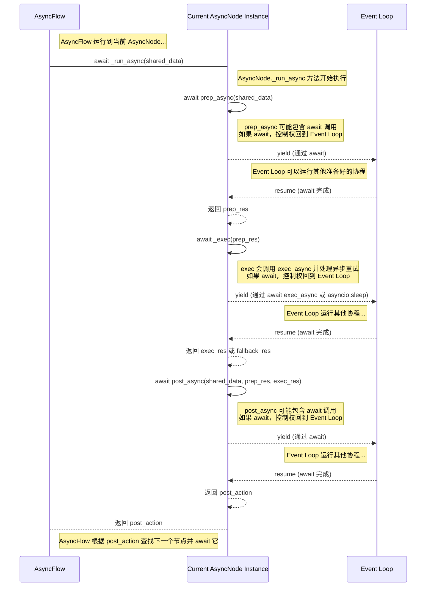
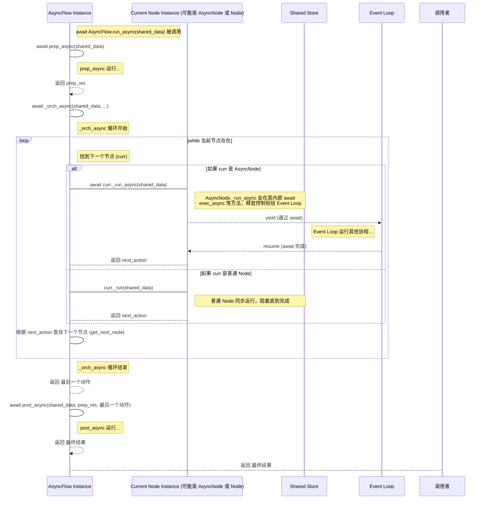

# Chapter 6: 异步处理 (Async Processing)

欢迎回到 PocketFlow 教程！在前面的章节中，我们学习了如何使用 [流程 (Flow)](01_流程__flow__.md) 构建任务蓝图，如何通过 [节点 (Node)](03_节点__node__.md) 定义工作步骤，以及如何使用 [共享存储 (Shared Store)](04_共享存储__shared_store__.md) 在节点间传递数据，还探讨了 [批量处理 (Batch Processing)](05_批量处理__batch_processing__.md) 如何高效处理多个类似任务。

然而，在现实世界的许多工作流中，某些步骤可能需要花费大量时间来**等待**，而不是进行计算。例如：

*   调用外部 API（如天气服务、支付接口、大语言模型）需要等待网络响应。
*   从数据库读取大量数据需要等待数据库查询完成。
*   等待用户输入。
*   等待文件读写操作完成。

在传统的同步处理模式下，当流程遇到需要“等待”的操作时，整个流程会**暂停**，直到该操作完成并返回结果，才能继续执行下一步。这就好比工厂里的一个工作站需要等待外部供应商送来一个零件，在零件到达之前，整个工作站的工人都只能闲着，无法开始下一个任务，即使其他工作站还有工作可以做。

这种情况会导致效率低下，特别是在处理大量需要外部交互或 I/O 操作的任务时。

PocketFlow 通过引入**异步处理 (Async Processing)** 来解决这个问题。异步处理允许 PocketFlow 在等待某个操作（比如调用外部 API 或等待用户输入）完成时，**同时开始或继续执行其他不受当前等待操作阻塞的任务**，从而提高整体效率。这就像工厂里的工人不需要等待一台机器处理完所有任务才能开始另一台机器的工作一样，只要任务不互相依赖，就可以并行处理。

通过 PocketFlow 的 `AsyncNode` 和 `AsyncFlow`，你可以构建高效的非阻塞工作流，尤其适用于包含大量 I/O 操作的任务。

## 什么是异步处理 (Async Processing)？

在 Python 中，异步处理通常涉及 `asyncio` 库和 `async def`、`await` 关键字。

*   `async def`: 定义一个**协程 (coroutine)**，或者称为异步函数。调用这样的函数会返回一个协程对象，它不会立即执行。
*   `await`: 用于**暂停**当前协程的执行，并**等待**另一个协程完成。当等待的操作完成后，当前协程会从暂停的地方继续执行。在等待期间，程序可以切换去执行其他等待中的协程。

异步处理的核心思想是**合作式多任务**：协程之间通过 `await` 主动让出执行权，让事件循环 (event loop) 有机会去运行其他协程。这与多线程或多进程不同，后者通常依赖操作系统的时间片调度，且多线程在 Python 中受 GIL (全局解释器锁) 限制，难以实现 CPU 密集型任务的并行，但在 I/O 密集型任务上通过释放 GIL 仍能实现并发。异步协程更适合处理大量 I/O 绑定的任务，因为它在等待 I/O 时能高效地切换上下文。

## PocketFlow 如何支持异步？

PocketFlow 引入了与标准 `Node` 和 `Flow` 相对应的异步类：

1.  **`AsyncNode`**: 这是一个特殊的 [节点 (Node)](03_节点__node__.md)。它的核心方法 (`prep_async`, `exec_async`, `post_async`, `exec_fallback_async`) 都是异步方法 (`async def`)。这意味着你可以在这些方法内部使用 `await` 来调用其他异步操作，而不会阻塞整个流程的执行。
2.  **`AsyncFlow`**: 这是一个特殊的 [流程 (Flow)](01_流程__flow__.md)。它能够正确地编排和运行 `AsyncNode`。当 `AsyncFlow` 执行一个 `AsyncNode` 时，它会使用 `await` 来调用 `AsyncNode` 的 `_run_async` 方法，从而允许异步操作的正常工作。

## 使用 `AsyncNode` 构建异步工作站

`AsyncNode` 继承自 `Node` (实际上是 `AsyncNode` 继承 `Node`，`Node` 继承 `BaseNode`)，但它有自己独特的方法签名：

*   `async def prep_async(self, shared)`: 异步准备阶段。
*   `async def exec_async(self, prep_res)`: 异步执行阶段。
*   `async def exec_fallback_async(self, prep_res, exc)`: 异步错误备用阶段。
*   `async def post_async(self, shared, prep_res, exec_res)`: 异步处理结果阶段。

请注意，方法名称末尾有 `_async`，并且定义时使用了 `async def`。

让我们使用 PocketFlow 提供的“基础异步示例”（`cookbook/pocketflow-async-basic`）中的节点来看看如何使用 `AsyncNode`。这个示例实现了一个简单的食谱查找器，涉及异步 API 调用、异步 LLM 调用和异步用户输入。

### 示例节点：异步获取食谱 (`FetchRecipes`)

这个节点负责从用户那里获取食材，然后**异步**调用一个外部 API 来查找食谱。

```python
# 文件: cookbook/pocketflow-async-basic/nodes.py (部分)
from pocketflow import AsyncNode
from utils import fetch_recipes, call_llm_async, get_user_input

class FetchRecipes(AsyncNode):
    """AsyncNode，负责异步获取食谱。"""

    async def prep_async(self, shared):
        """异步获取用户输入的食材。"""
        print("请输入食材: ")
        # get_user_input 是一个模拟异步等待用户输入的函数
        ingredient = await get_user_input("请输入食材: ")
        return ingredient # 返回食材给 exec_async

    async def exec_async(self, ingredient):
        """异步调用食谱 API 获取食谱。"""
        print("正在获取食谱...")
        # fetch_recipes 是一个模拟异步 API 调用的函数
        recipes = await fetch_recipes(ingredient)
        print(f"找到了 {len(recipes)} 个食谱。")
        return recipes # 返回食谱列表给 post_async

    async def post_async(self, shared, prep_res, recipes):
        """将食谱存入共享存储，并返回下一个动作。"""
        shared["recipes"] = recipes # 将获取到的食谱列表存入 shared
        shared["ingredient"] = prep_res # 将用户输入的食材也存入 shared
        return "suggest" # 返回动作 "suggest"，指示流程下一步
```

**代码解释：**

*   `FetchRecipes` 继承自 `AsyncNode`。
*   `prep_async` 使用 `await get_user_input(...)` 来等待用户输入。虽然这是一个模拟，但在真实的场景中，等待用户输入是一个 I/O 操作，应该使用异步方式。
*   `exec_async` 使用 `await fetch_recipes(ingredient)` 来等待模拟的 API 调用完成。这是典型的异步 I/O 操作。
*   `post_async` 将结果存入 `shared`，并返回决定流程走向的动作字符串 `"suggest"`。

### 示例节点：异步推荐食谱 (`SuggestRecipe`)

这个节点从共享存储中获取食谱列表，然后**异步**调用一个大语言模型 (LLM) 来推荐一个最佳食谱。

```python
# 文件: cookbook/pocketflow-async-basic/nodes.py (部分)
# ... (导入及 FetchRecipes 定义) ...

class SuggestRecipe(AsyncNode):
    """AsyncNode，使用 LLM 异步推荐食谱。"""

    async def prep_async(self, shared):
        """从共享存储获取食谱列表。"""
        # 从 shared 中读取上一个节点存入的食谱列表
        return shared["recipes"]

    async def exec_async(self, recipes):
        """异步调用 LLM 获取推荐。"""
        print("正在推荐最佳食谱...")
        if not recipes:
             return "没有找到食谱。" # 如果食谱列表为空，返回默认消息
        # call_llm_async 是一个模拟异步 LLM 调用的函数
        suggestion = await call_llm_async(
            f"从以下食谱中选择最佳食谱并给出标题: {', '.join(recipes)}"
        )
        print(f"推荐的食谱是: {suggestion}")
        return suggestion # 返回 LLM 的推荐结果给 post_async

    async def post_async(self, shared, prep_res, suggestion):
        """将推荐结果存入共享存储，并返回下一个动作。"""
        shared["suggestion"] = suggestion # 将 LLM 的推荐结果存入 shared
        return "approve" # 返回动作 "approve"，指示流程下一步
```

**代码解释：**

*   `SuggestRecipe` 继承自 `AsyncNode`。
*   `prep_async` 从 `shared` 读取数据，这是同步操作。
*   `exec_async` 使用 `await call_llm_async(...)` 来等待模拟的 LLM 调用完成。LLM 调用通常涉及网络请求和计算，是典型的异步操作场景。
*   `post_async` 将结果存入 `shared`，并返回 `"approve"` 动作。

### 示例节点：异步获取用户确认 (`GetApproval`)

这个节点向用户展示推荐的食谱，并**异步**等待用户确认。

```python
# 文件: cookbook/pocketflow-async-basic/nodes.py (部分)
# ... (导入及 FetchRecipes, SuggestRecipe 定义) ...

class GetApproval(AsyncNode):
    """AsyncNode，获取用户确认。"""

    async def prep_async(self, shared):
        """获取当前推荐的食谱。"""
        # 从 shared 中读取上一个节点存入的推荐食谱
        return shared["suggestion"]

    async def exec_async(self, suggestion):
        """异步向用户展示推荐并获取输入。"""
        # prep_res 作为 exec 的输入
        # await get_user_input 等待用户输入 'y' 或 'n'
        answer = await get_user_input(f"\n接受这个食谱吗？ (y/n): ")
        return answer # 返回用户输入给 post_async

    async def post_async(self, shared, prep_res, answer):
        """根据用户输入处理结果并返回动作。"""
        # prep_res 是推荐的食谱，answer 是用户输入的 'y' 或 'n'
        if answer.lower() == "y":
            print("\n太棒了！这是你的食谱...")
            print(f"食谱: {shared['suggestion']}")
            print(f"食材: {shared['ingredient']}")
            return "accept" # 用户接受，返回 "accept" 动作
        else:
            print("\n让我们试试别的食谱...")
            return "retry" # 用户拒绝，返回 "retry" 动作
```

**代码解释：**

*   `GetApproval` 继承自 `AsyncNode`。
*   `prep_async` 从 `shared` 读取数据。
*   `exec_async` 使用 `await get_user_input(...)` 等待用户输入。
*   `post_async` 根据用户输入检查结果，并返回 `"accept"` 或 `"retry"` 动作。这些动作将决定流程的下一个走向。

## 使用 `AsyncFlow` 编排异步节点

要运行这些 `AsyncNode`，我们需要使用 `AsyncFlow`。`AsyncFlow` 继承自 `Flow` 并增加了异步执行的能力。

### 如何使用 AsyncFlow？

1.  **定义 `AsyncNode`s:** 像上面那样创建继承自 `AsyncNode` 的类。
2.  **连接节点:** 使用 `>>` 和 `- "动作" >>` 运算符连接 `AsyncNode` 实例，这与连接普通 [节点 (Node)](03_节点__node__.md) 相同，它们共同构建了 [图 (Graph)](02_图__graph__.md) 结构。
3.  **创建 `AsyncFlow` 实例:** 像创建 `Flow` 那样创建 `AsyncFlow` 实例，并指定起始节点。
4.  **运行 `AsyncFlow`:** 使用 `await flow.run_async(shared)` 方法来运行。因为 `AsyncFlow` 的运行本身是一个异步操作，所以需要在另一个异步函数内部使用 `await` 来调用它。

### 示例流程：异步食谱查找器

我们将上面定义的 `AsyncNode`s 连接起来，形成食谱查找器的流程。

```python
# 文件: cookbook/pocketflow-async-basic/flow.py
from pocketflow import AsyncFlow, Node # 导入 AsyncFlow 和 Node (用于 EndNode)
from nodes import FetchRecipes, SuggestRecipe, GetApproval
# 假设 EndNode 是一个简单的 Node 子类

def create_recipe_flow():
    """创建异步食谱查找流程"""
    # 创建节点实例
    fetch = FetchRecipes()
    suggest = SuggestRecipe()
    approve = GetApproval()
    end_node = Node() # 使用普通 Node 作为结束节点是可以的

    # 连接节点，构建图
    fetch - "suggest" >> suggest     # FetchRecipes 成功后，建议食谱
    suggest - "approve" >> approve   # SuggestRecipe 成功后，获取确认
    approve - "accept"  >> end_node  # 用户接受，流程结束
    approve - "retry"   >> suggest   # 用户拒绝，回到 SuggestRecipe 尝试另一个 (注意：这里简化了，实际示例中可能需要更多逻辑来处理不同食谱)

    # 创建 AsyncFlow，指定起始节点
    return AsyncFlow(start=fetch)

# 文件: cookbook/pocketflow-async-basic/main.py (部分)
import asyncio
from flow import create_recipe_flow # 导入流程创建函数

async def main():
    """主函数，运行异步流程"""
    recipe_flow = create_recipe_flow()

    # 初始化共享存储
    shared_data = {}

    print("========= 异步食谱查找器 =========\n")

    # **使用 await 运行 AsyncFlow**
    await recipe_flow.run_async(shared_data)

    print("\n========= 流程完成 =========\n")

if __name__ == "__main__":
    # 必须使用 asyncio.run() 来运行最顶层的异步函数 main()
    asyncio.run(main())
```

**代码解释：**

*   `create_recipe_flow` 函数像创建普通 `Flow` 一样连接节点，但使用的是 `AsyncNode` 实例，并创建了一个 `AsyncFlow` 实例。
*   `main` 函数是一个 `async def` 函数，因为我们需要在里面使用 `await` 来运行 `AsyncFlow`。
*   `await recipe_flow.run_async(shared_data)` 调用启动了 `AsyncFlow` 的异步执行。
*   `if __name__ == "__main__": asyncio.run(main())` 是运行顶层异步函数的标准模式。

**流程执行示意 (Mermaid 图):**

```mermaid
graph TD
    fetch[FetchRecipes<br>(AsyncNode)] -->|suggest| suggest[SuggestRecipe<br>(AsyncNode)]
    suggest -->|approve| approve[GetApproval<br>(AsyncNode)]
    approve -->|accept| end[EndNode<br>(Node)]
    approve -->|retry| suggest
```

当 `AsyncFlow` 运行时，它会从 `fetch` 节点开始。
1.  `fetch` 调用 `prep_async` (`await get_user_input`)，等待用户输入。在等待期间，如果事件循环有其他可以运行的协程，它们会执行。用户输入后，`prep_async` 完成。
2.  `fetch` 调用 `exec_async` (`await fetch_recipes`)，等待 API 响应。在等待期间，程序可以做其他事情。API 响应后，`exec_async` 完成。
3.  `fetch` 调用 `post_async`，将结果存入 `shared`，返回 `"suggest"`。
4.  `AsyncFlow` 根据 `"suggest"` 动作找到 `suggest` 节点，并 **await** 它。
5.  `suggest` 调用 `prep_async` (同步从 `shared` 读取)。
6.  `suggest` 调用 `exec_async` (`await call_llm_async`)，等待 LLM 响应。同样，等待期间程序可以切换。LLM 响应后，`exec_async` 完成。
7.  `suggest` 调用 `post_async`，将结果存入 `shared`，返回 `"approve"`。
8.  `AsyncFlow` 根据 `"approve"` 动作找到 `approve` 节点，并 **await** 它。
9.  `approve` 调用 `prep_async` (同步从 `shared` 读取)。
10. `approve` 调用 `exec_async` (`await get_user_input`)，等待用户再次输入 'y' 或 'n'。
11. `approve` 调用 `post_async`，根据用户输入返回 `"accept"` 或 `"retry"`。
12. 如果返回 `"accept"`，流程跳转到 `end_node` 并结束。如果返回 `"retry"`，流程跳转回 `suggest` 节点，再次尝试推荐食谱。

整个过程中，`AsyncFlow` 确保了在等待异步操作时，程序不会完全阻塞，而是可以处理其他可能的任务（尽管在这个简单例子中没有其他任务，但在更复杂的应用中或者结合 `AsyncParallelBatchNode` 时，异步的优势就体现出来了）。

## 批量异步处理与并行加速 (`AsyncBatchNode`, `AsyncParallelBatchNode`)

结合异步和批量处理是提高效率的常见模式。PocketFlow 提供了 `AsyncBatchNode` 和 `AsyncParallelBatchNode` 来支持这种需求。它们都继承自 `AsyncNode` 和 `BatchNode`。

*   **`AsyncBatchNode`**: 它像 `BatchNode` 一样，在 `_exec` 内部遍历 `prep` 返回的子项列表。但不同的是，它使用 `await super()._exec(i)` 来依次（顺序地）运行每个子项的异步 `exec_async` 方法。这意味着子项处理是**顺序执行**的，但每个子项内部的等待是异步非阻塞的。
*   **`AsyncParallelBatchNode`**: 它也像 `BatchNode` 一样遍历子项列表，但它使用 `asyncio.gather` 来**并发地**运行所有子项的异步 `exec_async` 方法。这意味着多个子项的处理可以**同时进行**，这对于 I/O 密集型任务（如并发调用多个 API 或 LLM）能显著减少总执行时间。

让我们看一个简化的例子，来自 `cookbook/pocketflow-parallel-batch`，它对比了使用 `AsyncBatchNode`（顺序异步）和 `AsyncParallelBatchNode`（并行异步）来处理多个文件摘要任务。每个摘要任务都涉及一个模拟的、有固定等待时间的异步 LLM 调用。

模拟的异步 LLM 调用函数（在 `utils.py` 中）：

```python
# 文件: cookbook/pocketflow-parallel-batch/utils.py (部分)
import asyncio, time

async def mock_llm_summarize(text, item_name=""):
    """模拟一个需要等待的异步 LLM 调用"""
    print(f"[{item_name}] 开始总结...")
    await asyncio.sleep(1) # 模拟需要 1 秒的等待时间 (I/O 阻塞)
    print(f"[{item_name}] 总结完成。")
    return f"Summary of {item_name}"
```

一个简单的异步摘要节点 `AsyncSummarizer`：

```python
# 文件: cookbook/pocketflow-parallel-batch/nodes.py (部分)
from pocketflow import AsyncNode
from utils import mock_llm_summarize

class AsyncSummarizer(AsyncNode):
    """异步总结节点"""
    async def exec_async(self, item):
        """对单个项目（例如文件名）进行异步总结"""
        # 在这里调用模拟的异步 LLM 函数
        # 实际中可能需要读取文件内容，这里简化直接使用文件名
        return await mock_llm_summarize(f"Content of {item}", item)

    async def post_async(self, shared, prep_res, exec_res):
        """收集结果 (在这里不做复杂处理，只返回结果)"""
        return exec_res # post_async 通常返回动作，这里为演示返回结果
```

**使用 `AsyncBatchNode` (顺序异步):**

```python
# 文件: cookbook/pocketflow-parallel-batch/main.py (部分)
from pocketflow import AsyncBatchNode
from nodes import AsyncSummarizer

class SequentialSummarizerBatchNode(AsyncBatchNode, AsyncSummarizer):
    """使用 AsyncBatchNode 顺序处理"""
    async def prep_async(self, shared):
        # 假设要处理的文件列表
        return ["file1.txt", "file2.txt", "file3.txt"]

    async def post_async(self, shared, prep_res, exec_res_list):
         # exec_res_list 是所有 exec_async 返回结果的列表
        print("\n=== 顺序处理结果 ===")
        for res in exec_res_list:
            print(res)
        # 返回 None 或其他动作
        return None

# ... 在 main 函数中创建并运行 ...
# seq_flow = AsyncFlow(start=SequentialSummarizerBatchNode())
# await seq_flow.run_async({}) # 运行顺序批量处理
```

当 `SequentialSummarizerBatchNode` 运行时，它的 `prep_async` 返回 `["file1.txt", "file2.txt", "file3.txt"]`。然后它的 `_exec` 方法（继承自 `AsyncBatchNode`）会**依次**调用 `super()._exec("file1.txt")`, `super()._exec("file2.txt")`, `super()._exec("file3.txt")`。每个 `super()._exec(item)` 又会调用 `AsyncSummarizer` 的 `exec_async(item)`。因为 `exec_async` 需要 `await asyncio.sleep(1)`，所以总执行时间大约是 1 秒 + 1 秒 + 1 秒 = 3 秒。

**使用 `AsyncParallelBatchNode` (并行异步):**

```python
# 文件: cookbook/pocketflow-parallel-batch/main.py (部分)
from pocketflow import AsyncParallelBatchNode
from nodes import AsyncSummarizer

class ParallelSummarizerBatchNode(AsyncParallelBatchNode, AsyncSummarizer):
    """使用 AsyncParallelBatchNode 并行处理"""
    async def prep_async(self, shared):
        # 假设要处理的文件列表
        return ["file1.txt", "file2.txt", "file3.txt"]

    async def post_async(self, shared, prep_res, exec_res_list):
         # exec_res_list 是所有 exec_async 返回结果的列表
        print("\n=== 并行处理结果 ===")
        for res in exec_res_list:
            print(res)
        # 返回 None 或其他动作
        return None

# ... 在 main 函数中创建并运行 ...
# par_flow = AsyncFlow(start=ParallelSummarizerBatchNode())
# await par_flow.run_async({}) # 运行并行批量处理
```

当 `ParallelSummarizerBatchNode` 运行时，它的 `prep_async` 也返回 `["file1.txt", "file2.txt", "file3.txt"]`。然后它的 `_exec` 方法（继承自 `AsyncParallelBatchNode`）会使用 `asyncio.gather` **并发地**调用 `super()._exec("file1.txt")`, `super()._exec("file2.txt")`, `super()._exec("file3.txt")`。因为这三个异步操作可以同时进行，并且每个都等待 1 秒，所以总执行时间大约是这三个操作中最长的一个的时间，即大约 1 秒（加上一些调度的开销）。

这正是异步并行处理在 I/O 密集型任务中的强大之处！

## 异步处理在幕后如何工作？

理解异步节点和流程的内部实现，能帮助你更好地利用它。核心在于 `AsyncNode` 和 `AsyncFlow` 重写了基类中的方法，使其变为异步版本，并使用 `await` 来协调协程的执行。

### AsyncNode 的幕后

`AsyncNode` 重写了 `Node` 的 `_exec` 和 `_run` 方法，使其成为异步方法 `_exec` (仍命名为 `_exec` 但内部是异步逻辑) 和 `_run_async`。

```python
# 简化过的 pocketflow/__init__.py 中的 AsyncNode 部分

class AsyncNode(Node):
    # ... (async prep_async, exec_async, post_async, exec_fallback_async 定义) ...

    # 重写 _exec 方法，使其支持异步和 await
    async def _exec(self, prep_res):
        # 实现异步重试逻辑
        for i in range(self.max_retries):
            try:
                # **使用 await 调用异步的 exec_async 方法**
                return await self.exec_async(prep_res)
            except Exception as e:
                if i == self.max_retries - 1:
                    # **使用 await 调用异步的 exec_fallback_async 方法**
                    return await self.exec_fallback_async(prep_res, e)
                if self.wait > 0:
                    # **使用 await 暂停异步等待**
                    await asyncio.sleep(self.wait)
        return None # Unreachable in practice

    # 提供了 run_async 方法供外部调用
    async def run_async(self, shared):
        # 如果节点有后继，通常不应该直接调用 run_async
        if self.successors: warnings.warn("Node won't run successors. Use AsyncFlow.")
        # 调用内部的异步运行方法
        return await self._run_async(shared)

    # 内部异步运行方法，被 AsyncFlow 调用
    async def _run_async(self, shared):
        # **使用 await 调用异步的 prep_async 方法**
        p = await self.prep_async(shared)
        # **使用 await 调用异步的 _exec 方法**
        e = await self._exec(p)
        # **使用 await 调用异步的 post_async 方法**
        next_action = await self.post_async(shared, p, e)
        return next_action

    # 覆盖同步的 _run 方法，防止误用
    def _run(self, shared):
        raise RuntimeError("Use run_async.")

```

**AsyncNode 异步执行时序图 (简化版):**



从图中可以看出，`AsyncNode` 的方法通过 `await` 与事件循环协作。当 `prep_async`, `exec_async` 或 `post_async` 中遇到 `await` 时，该节点的执行会暂停，控制权交还给事件循环，允许其他协程运行，直到 `await` 的操作完成。

### AsyncFlow 的幕后

`AsyncFlow` 重写了 `Flow` 的 `_orch` 和 `_run` 方法，使其成为异步版本 `_orch_async` 和 `_run_async`。

```python
# 简化过的 pocketflow/__init__.py 中的 AsyncFlow 部分

class AsyncFlow(Flow, AsyncNode):
    # 异步的编排方法，负责驱动流程执行
    async def _orch_async(self, shared, params=None):
        curr = copy.copy(self.start_node) # 从起始节点开始 (复制)
        p = params or {**self.params} # 获取流程参数
        last_action = None

        while curr: # 只要当前节点存在，就继续循环
            curr.set_params(p) # 设置节点参数

            # **根据节点类型，调用同步或异步的运行方法，并使用 await**
            if isinstance(curr, AsyncNode):
                last_action = await curr._run_async(shared) # 如果是 AsyncNode，await _run_async
            else:
                last_action = curr._run(shared) # 如果是普通 Node，调用同步的 _run

            # 根据当前节点和返回的动作，找到下一个节点 (逻辑与 Flow.get_next_node 相同)
            curr = copy.copy(self.get_next_node(curr, last_action))
            # Note: copy.copy 复制节点对象，shared 字典的引用保持不变

        return last_action # 返回最后一个节点的动作

    # 提供了 run_async 方法供外部调用
    async def _run_async(self, shared):
        # 调用异步的 prep_async
        p = await self.prep_async(shared)
        # **调用异步的编排方法**
        o = await self._orch_async(shared)
        # 调用异步的 post_async
        return await self.post_async(shared, p, o)

    # 覆盖同步的 _run 方法
    def _run(self, shared):
        raise RuntimeError("Use run_async.")

    # 覆盖同步的 post 方法，提供异步版本
    async def post_async(self, shared, prep_res, exec_res):
         # 默认 post_async 行为是返回 exec_res (即最后一个节点的动作)
        return exec_res
```

**AsyncFlow 异步执行时序图 (简化版):**



`AsyncFlow` 的 `_orch_async` 方法是异步流程的核心调度器。它在一个 `while` 循环中遍历图结构，但当它遇到 `AsyncNode` 时，它会使用 `await curr._run_async(shared)` 来调用节点。这个 `await` 允许 `AsyncNode` 在执行 I/O 密集型操作时暂停，让 `AsyncFlow` (以及整个 `asyncio` 事件循环) 有机会去运行其他可能已经准备好的协程（例如，在 `AsyncParallelBatchNode` 中并发执行的其他子项，或者另一个并行运行的 `AsyncFlow`）。

### AsyncBatchNode vs AsyncParallelBatchNode 幕后对比

它们的区别主要体现在 `_exec` 方法如何处理 `prep` 方法返回的子项列表。

**AsyncBatchNode._exec (顺序异步):**

```python
# 简化过的 pocketflow/__init__.py 中的 AsyncBatchNode._exec
class AsyncBatchNode(AsyncNode, BatchNode):
    # 重写 BatchNode 的 _exec 方法，使其支持异步
    async def _exec(self, items): # items 是 prep_async 返回的列表或迭代器
        results = []
        for i in (items or []): # **顺序遍历子项**
            # **使用 await 顺序调用父类 (AsyncNode) 的 _exec 方法**
            # 这个调用会执行 AsyncNode 的重试逻辑并最终 await exec_async(i)
            item_result = await super(AsyncBatchNode, self)._exec(i) # <-- await 在循环内部
            results.append(item_result) # 收集结果
        return results # 返回结果列表
```

**AsyncParallelBatchNode._exec (并行异步):**

```python
# 简化过的 pocketflow/__init__.py 中的 AsyncParallelBatchNode._exec
class AsyncParallelBatchNode(AsyncNode, BatchNode):
    # 重写 BatchNode 的 _exec 方法，使其支持异步并行
    async def _exec(self, items): # items 是 prep_async 返回的列表或迭代器
        # **使用 asyncio.gather 并发地创建并运行所有子项的异步任务**
        # super(AsyncParallelBatchNode,self)._exec(i) 返回的是一个 Coroutine 对象
        tasks = [super(AsyncParallelBatchNode,self)._exec(i) for i in (items or [])]
        # **使用 await 等待所有并发任务完成**
        results = await asyncio.gather(*tasks) # <-- await 在 gather 外部
        return results # 返回结果列表
```

关键区别在于 `await` 的位置。`AsyncBatchNode` 在 `for` 循环**内部** `await` 每个子项的处理，导致它们顺序执行。`AsyncParallelBatchNode` 在循环**外部**使用 `asyncio.gather` 一次性 `await` 所有子项的任务，这些任务会由事件循环调度，尽可能地并发运行。

## 异步处理与共享存储

在异步处理中，共享存储 (`shared`) 的用法基本相同：节点在 `prep_async` 中读取，在 `post_async` 中写入。然而，如果在 `AsyncParallelBatchNode` 或 `AsyncParallelBatchFlow` 中，多个子任务是并发执行的，它们会同时访问同一个 `shared` 字典。如果你的任务需要并发地修改 `shared` 中的同一个值（例如，一个共享的计数器），就需要考虑同步问题，使用 `asyncio.Lock` 或 `asyncio.Queue` 等异步安全的数据结构来管理对 `shared` 的访问，以避免数据损坏或竞争条件。但在很多情况下，并发任务只是读取 `shared` 中的配置或将结果写入 `shared` 中的不同键，这种情况下直接访问 `shared` 是安全的。

## 总结

在本章中，我们学习了 PocketFlow 的 **异步处理 (Async Processing)** 功能。我们了解到，异步处理是利用 Python 的 `asyncio`、`async def` 和 `await` 来实现合作式多任务，特别适用于处理 I/O 密集型任务，避免流程在等待时阻塞。

我们学习了两个核心概念：
*   **`AsyncNode`**: 拥有 `async def` 方法 (`prep_async`, `exec_async`, `post_async` 等)，允许在节点内部进行异步操作。
*   **`AsyncFlow`**: 用于编排和运行 `AsyncNode`，通过 `await` 调用节点的异步方法，驱动异步工作流。

我们通过食谱查找器的示例，了解了如何定义和连接 `AsyncNode`，以及如何使用 `await AsyncFlow.run_async()` 运行流程。

最后，我们探讨了 **批量异步处理**，特别是 `AsyncBatchNode` (顺序异步) 和 `AsyncParallelBatchNode` (并行异步) 的区别，并通过模拟示例展示了 `AsyncParallelBatchNode` 在 I/O 密集型批量任务中的显著加速效果。我们还简要了解了它们在幕后如何通过重写方法和使用 `await` 或 `asyncio.gather` 来实现这些行为。

异步处理是构建高效、响应式工作流的关键，特别是在现代应用中频繁涉及外部服务调用时。

PocketFlow 的核心概念我们已经学习得差不多了。流程、图、节点、共享存储、批量处理和异步处理构成了 PocketFlow 的强大基石。

---
本教程到此结束。

---

Generated by [AI Codebase Knowledge Builder](https://github.com/The-Pocket/Tutorial-Codebase-Knowledge)