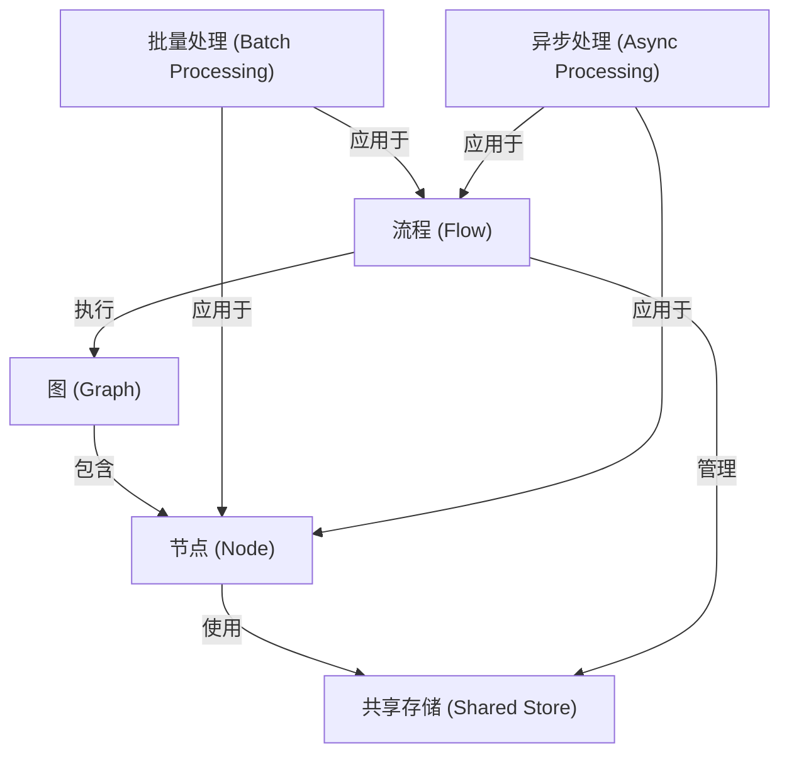

# Tutorial: PocketFlow

PocketFlow 是一个极简的 LLM 框架，它将复杂的任务分解为一系列互连的步骤，形成一个概念上的**图**。
这个**图**中的每个步骤都是一个独立的**节点**，负责执行具体的处理逻辑。
**流程**负责按照**图**的结构来编排和执行这些**节点**，定义了任务的执行路径和顺序。
**节点**之间通过一个中心化的**共享存储**来便捷地传递数据和状态。
此外，框架还提供了**批量处理**和**异步处理**的能力，以支持更高效、更灵活的任务执行。

**Source Repository:** [https://github.com/The-Pocket/PocketFlow](https://github.com/The-Pocket/PocketFlow)

## Chapters

1. [流程 (Flow)
](01_流程__flow__.md)
2. [图 (Graph)
](02_图__graph__.md)
3. [节点 (Node)
](03_节点__node__.md)
4. [共享存储 (Shared Store)
](04_共享存储__shared_store__.md)
5. [批量处理 (Batch Processing)
](05_批量处理__batch_processing__.md)
6. [异步处理 (Async Processing)
](06_异步处理__async_processing__.md)

---

Generated by [AI Codebase Knowledge Builder](https://github.com/The-Pocket/Tutorial-Codebase-Knowledge)