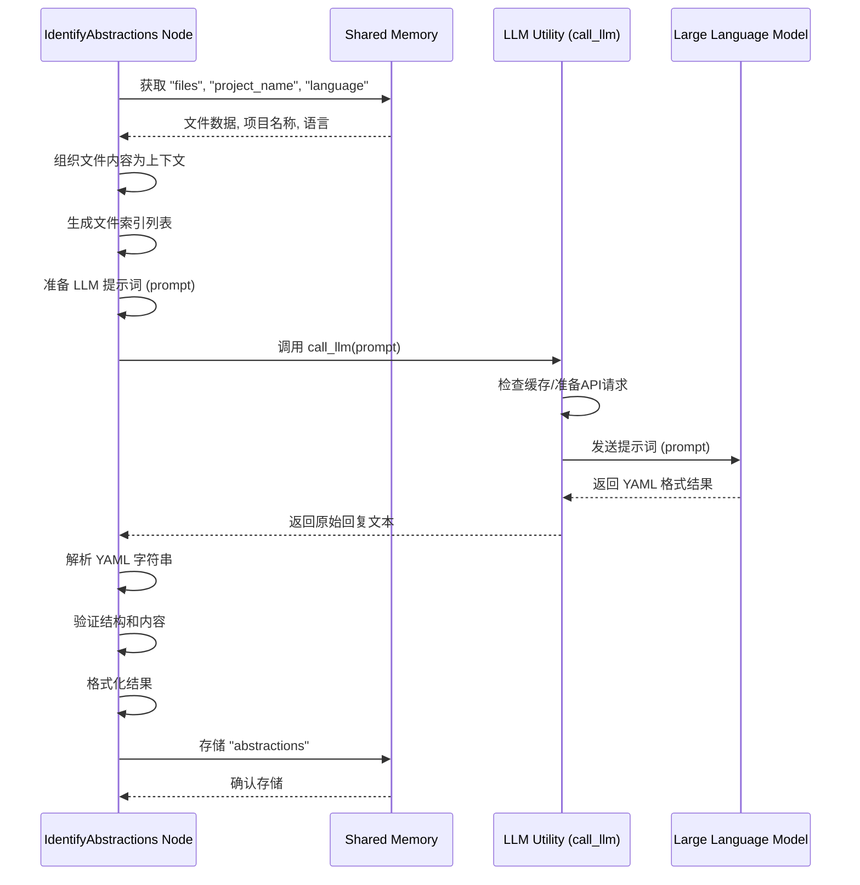

# Chapter 2: 核心概念识别 (Core Concept Identification)

欢迎回到 `Tutorial-Codebase-Knowledge` 项目教程！在[上一章：代码抓取与文件收集](01_代码抓取与文件收集__code_crawling_and_file_collection__.md)中，我们学习了如何从代码库中收集到我们需要分析的文件内容，这就像图书管理员帮我们找到了所有相关的书籍。现在，书本（代码文件）已经放在我们面前了，但对于一个庞大的项目来说，文件数量可能仍然很多，我们该如何快速理解其核心思想和最重要的组成部分呢？

这就引出了我们本章要讨论的核心概念：**核心概念识别**。

## 这是什么？为什么需要它？

想象一下，你面前是上千本关于某个复杂主题的书籍。即使图书管理员帮你把不相关的都移走了，你也不可能一下子读完所有内容来理解主题的精髓。你需要一位**非常聪明、阅读速度极快**的助手，他能迅速浏览这些书籍，然后告诉你：“这本书讲的是量子力学，核心概念是波函数、叠加态和量子纠缠；那本书讲的是统计学，核心概念是均值、方差和概率分布。”

在我们的代码教程生成项目中，“核心概念识别”扮演的就是这位**聪明的助手**的角色。

这个步骤是整个流程的**第二步**。它的主要目标是：

1.  利用**大型语言模型 (LLM)，也就是通常说的 AI**，去分析上一步收集到的所有代码文件内容。
2.  从这些代码中识别出这个项目里最关键、最重要、最核心的 5 到 10 个**抽象概念或模块**。这些概念往往代表了项目的主要功能、核心数据结构或者重要的处理流程。
3.  为每个核心概念提供一个**简明易懂的名称和描述**，最好还能打个简单的比方（类比），让新手也能快速理解。
4.  找出每个核心概念**最相关的代码文件**是哪些。

为什么这一步如此重要？因为对于一个新手来说，直接阅读海量代码是令人生畏的。通过识别出少数几个核心概念，我们可以迅速抓住项目的主脉络，建立初步的认知框架。这就像是拿到了一份“项目地图”的核心标注，知道哪些地方是最重要的“地标”。接下来的学习就可以围绕这些核心概念展开，效率会大大提高。

## 代码中的实现：`IdentifyAbstractions` 节点

在我们的项目代码中，负责实现“核心概念识别”功能的主要是 `nodes.py` 文件里的 `IdentifyAbstractions` 节点（Node）。

还记得节点 (Node) 是什么吗？它是 PocketFlow 框架中的一个工作单位，代表了一个特定的步骤。`IdentifyAbstractions` 节点就是执行核心概念识别这个步骤的“工人”。

和 `FetchRepo` 节点类似，`IdentifyAbstractions` 节点也有 `prep`、`exec` 和 `post` 方法。

让我们看看 `IdentifyAbstractions` 是如何工作的：

```python
# snippets/nodes.py
# ... (imports and FetchRepo class above) ...

class IdentifyAbstractions(Node):
    def prep(self, shared):
        # 从共享数据 shared 中获取上一步的结果
        files_data = shared["files"] # 这是上一章 FetchRepo 节点收集到的文件列表 [(路径, 内容), ...]
        project_name = shared["project_name"] # 项目名称
        language = shared.get("language", "english") # 获取目标语言，默认为英语

        # 准备给大型语言模型 (LLM) 的输入上下文
        # 我们需要把所有文件内容整合成一个字符串，同时保留文件路径和索引信息
        def create_llm_context(files_data):
            context = ""
            file_info = [] # 存储 (索引, 路径) 的元组，方便后续引用
            for i, (path, content) in enumerate(files_data):
                # 在文件内容前加上索引和路径信息，方便 LLM 引用
                entry = f"--- 文件索引 {i}: {path} ---\n{content}\n\n"
                context += entry
                file_info.append((i, path))

            return context, file_info # file_info 是 (索引, 路径) 的列表

        context, file_info = create_llm_context(files_data)
        # 格式化文件信息列表，用于 LLM 提示词中的参考
        file_listing_for_prompt = "\n".join([f"- {idx} # {path}" for idx, path in file_info])

        # 返回执行阶段所需的数据
        return context, file_listing_for_prompt, len(files_data), project_name, language # 返回目标语言

    # ... exec and post methods
```

`prep` 方法是**准备阶段**。它从 `shared` 共享内存中获取了上一步 `FetchRepo` 节点辛苦收集来的文件数据 (`files_data`) 和项目名称 (`project_name`)。它还获取了教程的目标语言。然后，它调用了一个内部辅助函数 `create_llm_context`，将文件列表转换成一个大型语言模型能理解的、带有文件索引和路径的**上下文字符串**。同时，它生成了一个简洁的“文件索引列表”，用于在提示词中告诉 LLM 如何引用文件。最后，它把这些准备好的数据返回，供 `exec` 方法使用。

接下来是 `exec` 方法，这是**核心执行阶段**：

```python
# snippets/nodes.py
# ... inside IdentifyAbstractions class ...
    def exec(self, prep_res):
        # 从 prep 阶段的返回结果中解包数据
        context, file_listing_for_prompt, file_count, project_name, language = prep_res
        print(f"正在使用 LLM 识别核心抽象概念...")

        # 根据目标语言添加提示词指令
        language_instruction = ""
        name_lang_hint = ""
        desc_lang_hint = ""
        if language.lower() != "english":
            language_instruction = f"重要提示：请以**{language.capitalize()}**语言生成每个抽象概念的 `name`（名称）和 `description`（描述）。请勿在这些字段中使用英语。\n\n"
            # 在示例 YAML 中添加语言提示
            name_lang_hint = f" (值应为{language.capitalize()}语言)"
            desc_lang_hint = f" (值应为{language.capitalize()}语言)"


        # 构建发送给 LLM 的提示词 (prompt)
        prompt = f"""
对于项目 `{project_name}`:

代码库上下文:
{context}

{language_instruction}分析代码库上下文。
识别出对代码库新手最重要的 5-10 个核心抽象概念或模块。

对于每个抽象概念，请提供:
1. 一个简洁的 `name`（名称）{name_lang_hint}。
2. 一个 beginner-friendly（新手友好）的 `description`（描述），用简单的类比解释它是什么，字数在 100 词左右{desc_lang_hint}。
3. 一个相关的 `file_indices`（文件索引）列表（整数），格式使用 `索引 # 路径/注释`。

上下文中存在的文件索引和路径列表:
{file_listing_for_prompt}

请以 YAML 格式输出一个字典列表:

```yaml
- name: |
    查询处理{name_lang_hint}
  description: |
    解释抽象概念的功能。
    它就像是一个中央调度员，负责分派请求。{desc_lang_hint}
  file_indices:
    - 0 # path/to/file1.py
    - 3 # path/to/related.py
- name: |
    查询优化{name_lang_hint}
  description: |
    另一个核心概念，类似于对象的蓝图。{desc_lang_hint}
  file_indices:
    - 5 # path/to/another.js
# ... 最多 10 个抽象概念
```"""
        # 调用 LLM 工具函数获取结果
        response = call_llm(prompt) # 这里的 call_llm 会在后面的章节详细介绍

        # --- 验证 ---
        # 从 LLM 的回复中解析出 YAML 字符串
        yaml_str = response.strip().split("```yaml")[1].split("```")[0].strip()
        # 解析 YAML
        abstractions = yaml.safe_load(yaml_str)

        # 进行严格的结构和数据类型验证
        # ... (详细的验证代码，确保输出是预期的列表结构，每个项有 name, description, file_indices)
        # ... (验证 name 和 description 是字符串，file_indices 是列表)
        # ... (验证 file_indices 中的每个索引是有效的，且不超过文件总数)
        # ... (将 file_indices 转换为排序去重后的整数列表，存储到 'files' 键下)

        validated_abstractions = [] # 存储验证通过的抽象概念列表
        for item in abstractions:
            # ... 验证逻辑 ...
             # Store only the required fields
            validated_abstractions.append({
                "name": item["name"], # 可能是已翻译的名称
                "description": item["description"], # 可能是已翻译的描述
                "files": item["files"] # 关联的文件索引列表
            })


        print(f"已识别出 {len(validated_abstractions)} 个核心抽象概念.")
        return validated_abstractions # 返回验证通过的抽象概念列表

    def post(self, shared, prep_res, exec_res):
        # 将 exec 阶段返回的核心抽象概念列表存储到 shared["abstractions"] 中
        shared["abstractions"] = exec_res # 列表格式： [{"name": str, "description": str, "files": [int]}, ...]

# ... AnalyzeRelationships and other classes below ...
```

`exec` 方法是整个步骤的核心。它接收 `prep` 准备好的上下文、文件列表信息、文件总数、项目名称和目标语言。然后，它构建了一个详细的**提示词 (prompt)** 发送给大型语言模型。这个提示词明确地告诉 LLM：

*   项目的名称是什么。
*   提供了哪些代码文件内容作为参考 (`context`)。
*   要求它识别出 5-10 个核心概念，并说明需要提供哪些信息（名称、描述、相关文件索引）。
*   提供了可供引用的文件索引列表 (`file_listing_for_prompt`)。
*   **最重要的是**，要求 LLM 严格按照指定的 YAML 格式输出结果，并根据目标语言生成名称和描述。

它调用了 `call_llm` 这个工具函数来与大型语言模型进行实际交互。`call_llm` 的具体实现（比如调用哪个 AI 模型、如何处理 API 请求、缓存等）将在[第七章：大模型调用工具](07_大模型调用工具__llm_calling_utility__.md)中详细介绍。

收到 LLM 的回复后，`exec` 方法会进行**验证**。它首先解析回复中的 YAML 字符串，然后检查解析出来的结果是否符合预期的结构（一个列表，列表中每个元素都是包含 `name`, `description`, `file_indices` 键的字典）。它还会验证文件索引是否有效。验证通过后，它将结果格式化为包含名称、描述和相关文件索引列表的字典列表。

最后，`post` 方法将 `exec` 方法返回的、验证通过的核心抽象概念列表存储到 `shared` 共享内存中的 `abstractions` 键下。这样，后续的节点（比如用于分析概念间关系的节点）就可以通过 `shared["abstractions"]` 获取到这些识别出的核心概念及其相关信息进行处理了。

### LLM 调用流程 (简化序列图)

这个核心概念识别的执行过程可以简化为下面的交互序列：



这张图展示了 `IdentifyAbstractions` 节点如何从共享内存获取输入，准备发送给 LLM 的数据，调用 `call_llm` 工具函数，接收 LLM 的回复，处理并验证结果，最后将处理好的核心概念列表存回共享内存。

## 总结

在这一章中，我们学习了“核心概念识别”的概念，它是整个教程生成过程的第二步。它的作用是利用大型语言模型，从收集到的代码文件中识别出项目中最重要、最核心的 5-10 个抽象概念，并为它们生成新手友好的名称、描述和相关的代码文件列表。

我们还详细了解了在项目代码中，`IdentifyAbstractions` 节点是如何实现这一功能的：它的 `prep` 方法负责将原始文件数据转换成 LLM 可以理解的上下文；`exec` 方法构建了详细的提示词并调用 `call_llm` 工具函数与 LLM 交互，然后对 LLM 返回的结果进行严格的验证；最后 `post` 方法将识别出的核心概念列表存储到共享内存中，供后续步骤使用。我们还通过一个简化的序列图展示了节点、LLM 工具和 LLM 之间的交互过程。

这些识别出的核心概念 (`shared["abstractions"]`) 将作为输入，传递给工作流中的下一个步骤。

我们现在有了项目的核心概念列表以及它们对应的代码文件。下一步，我们需要理解这些核心概念之间是如何相互关联、协同工作的。

---

下一章：[概念关系分析](03_概念关系分析__concept_relationship_analysis__.md)

---

Generated by [AI Codebase Knowledge Builder](https://github.com/The-Pocket/Tutorial-Codebase-Knowledge)