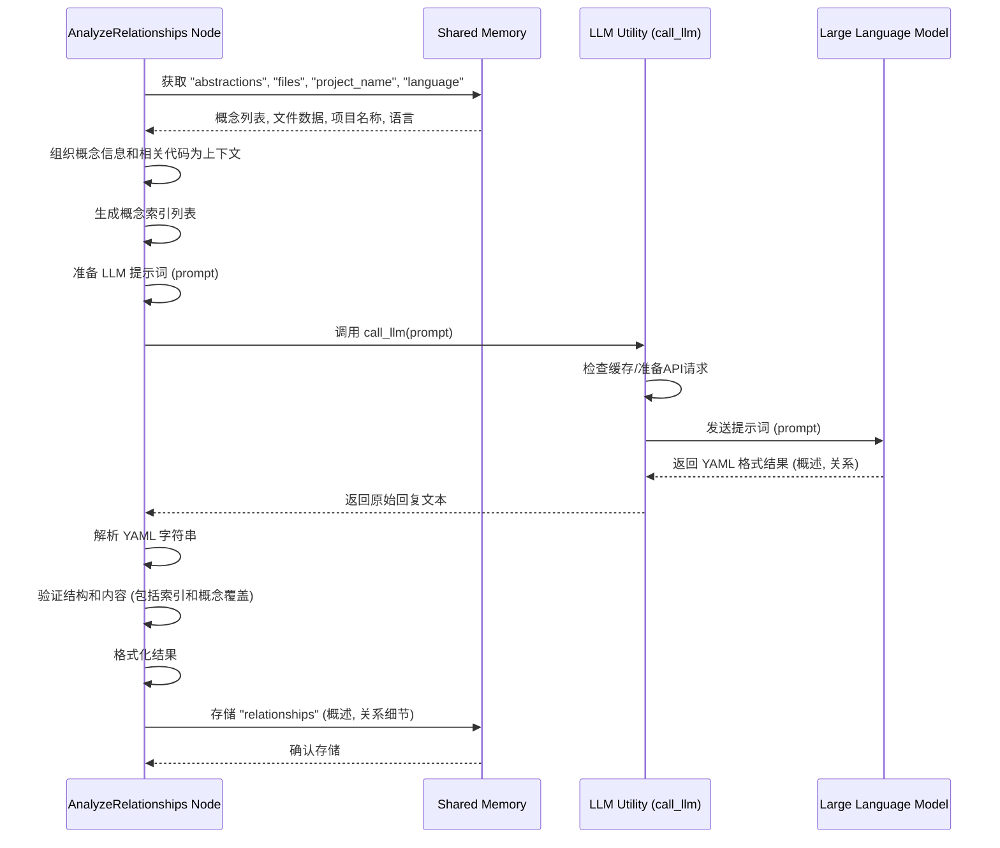

# Chapter 3: 概念关系分析 (Concept Relationship Analysis)


好的，这是一个关于“概念关系分析”的教程章节，完全使用中文编写。

```markdown
# Chapter 3: 概念关系分析 (Concept Relationship Analysis)

欢迎回到 `Tutorial-Codebase-Knowledge` 项目教程！在[上一章：核心概念识别](02_核心概念识别__core_concept_identification__.md)中，我们学习了如何利用大型语言模型（LLM）从代码文件中识别出项目中最重要、最核心的抽象概念。现在，我们已经有了一份项目“地标”的列表，知道最重要的概念是什么，以及它们大概涉及哪些代码文件。

但这就像只知道城市里有哪些重要的建筑，却不知道它们之间的道路是如何连接的，它们的功能是如何互相依赖的。要真正理解这个项目如何作为一个整体运作，我们需要弄清楚这些核心概念之间是**如何相互关联、相互作用**的。

这就引出了我们本章要讨论的核心概念：**概念关系分析**。

## 这是什么？为什么需要它？

想象一下，你正在学习一个复杂的系统的地图。仅仅知道地图上标出了哪些重要地点（核心概念）是不够的。你还需要知道从A地到B地有什么路？A地的数据会流向B地吗？C地是不是依赖D地的某个功能？

在我们的项目中，“概念关系分析”扮演的就是**绘制这张“交通网络图”或“社交关系图”**的角色。

这个步骤是整个流程的**第三步**。它的主要目标是：

1.  再次利用**大型语言模型 (LLM)**，基于上一章识别出的核心概念及其关联代码，分析这些概念之间可能存在的相互关系（例如：调用、依赖、包含、管理等）。
2.  构建出一张概念之间的“关系图”，展示它们是如何相互连接和协作的。
3.  同时，利用LLM的理解能力，为整个项目生成一个简明扼要的、新手友好的高层级**项目概述**。

为什么这一步如此重要？因为它帮助我们将孤立的核心概念串联起来，形成一个有机的整体视图。通过理解概念间的关系，我们可以更好地把握数据流向、控制逻辑、模块依赖，这对于理解项目架构、进行代码修改或功能扩展至关重要。项目概述则为读者提供了一个快速了解项目全貌的入口。

## 代码中的实现：`AnalyzeRelationships` 节点

在我们的项目代码中，负责实现“概念关系分析”功能的主要是 `nodes.py` 文件里的 `AnalyzeRelationships` 节点（Node）。

回忆一下，节点 (Node) 是 PocketFlow 框架中的一个基本工作单位。`AnalyzeRelationships` 节点就是执行概念关系分析这个步骤的“工人”。

和之前的节点一样，`AnalyzeRelationships` 节点也包含 `prep`、`exec` 和 `post` 方法。

让我们看看 `AnalyzeRelationships` 是如何工作的：

```python
# snippets/nodes.py
# ... (imports and other classes above) ...

class AnalyzeRelationships(Node):
    def prep(self, shared):
        # 从共享数据 shared 中获取上一步的结果和原始文件数据
        abstractions = shared["abstractions"] # 这是上一章 IdentifyAbstractions 节点识别出的核心概念列表
        files_data = shared["files"] # 这是第一章 FetchRepo 节点收集到的原始文件列表
        project_name = shared["project_name"]  # 获取项目名称
        language = shared.get("language", "english") # 获取目标语言

        # 为大型语言模型 (LLM) 准备输入上下文
        # 上下文需要包含所有核心概念的名称、索引、描述，以及与这些概念相关的代码片段
        context = "Identified Abstractions:\n"
        all_relevant_indices = set() # 收集所有与核心概念相关的文件的索引
        abstraction_info_for_prompt = [] # 用于在提示词中列出概念信息
        for i, abstr in enumerate(abstractions):
            # 使用 'files' 字段，其中包含的是文件索引列表
            file_indices_str = ", ".join(map(str, abstr['files']))
            # 概念名称和描述可能已经是翻译好的
            info_line = f"- Index {i}: {abstr['name']} (Relevant file indices: [{file_indices_str}])\n  Description: {abstr['description']}"
            context += info_line + "\n"
            # 在提示词列表中使用概念索引和（可能已翻译的）名称
            abstraction_info_for_prompt.append(f"{i} # {abstr['name']}")
            # 将与当前概念关联的文件索引加入到总的相关文件索引集合中
            all_relevant_indices.update(abstr['files'])

        # 添加相关代码片段到上下文中
        context += "\nRelevant File Snippets (Referenced by Index and Path):\n"
        # 使用辅助函数获取所有相关文件索引对应的文件内容
        relevant_files_content_map = get_content_for_indices(
            files_data,
            sorted(list(all_relevant_indices)) # 按索引排序以保持一致性
        )
        # 将文件内容格式化后添加到上下文字符串
        file_context_str = "\n\n".join(
            f"--- File: {idx_path} ---\n{content}" # 格式化为 "--- File: 索引 # 路径 ---"
            for idx_path, content in relevant_files_content_map.items()
        )
        context += file_context_str

        # 返回执行阶段所需的数据：完整上下文、概念列表字符串、项目名称和目标语言
        return context, "\n".join(abstraction_info_for_prompt), project_name, language

    # ... exec and post methods
```

`prep` 方法是**准备阶段**。它从 `shared` 共享内存中获取了上一章识别出的核心概念列表 (`abstractions`) 和原始文件内容列表 (`files_data`)，还有项目名称和目标语言。它的核心工作是构建一个详细的、供大型语言模型理解的**上下文字符串**。这个上下文不仅包含每个核心概念的名称、描述和关联文件索引，还通过 `get_content_for_indices` 辅助函数提取了所有**与这些核心概念关联的代码文件内容**，并将它们也添加到上下文中。这样做是为了给LLM提供足够的细节来理解概念的实际实现和它们之间的互动。最后，它还生成了一个简洁的“概念索引列表”字符串，方便在提示词中引用。

接下来是 `exec` 方法，这是**核心执行阶段**：

```python
# snippets/nodes.py
# ... inside AnalyzeRelationships class ...
    def exec(self, prep_res):
        # 从 prep 阶段的返回结果中解包数据
        context, abstraction_listing, project_name, language = prep_res
        print(f"正在使用 LLM 分析概念关系和生成项目概述...")

        # 根据目标语言添加提示词指令和提示
        language_instruction = ""
        lang_hint = ""
        list_lang_note = ""
        if language.lower() != "english":
            lang_cap = language.capitalize()
            # 指令：以目标语言生成特定字段
            language_instruction = f"重要提示：请以**{lang_cap}**语言生成 `summary`（概述）和关系 `label`（标签）字段。请勿在这些字段中使用英语。\n\n"
            # 提示：标记出这些字段需要使用目标语言
            lang_hint = f" (in {lang_cap})"
            # 提示：说明输入列表中的概念名称可能已经是目标语言
            list_lang_note = f" (Names might be in {lang_cap})"

        # 构建发送给 LLM 的提示词 (prompt)
        prompt = f"""
基于项目 `{project_name}` 的以下抽象概念和相关代码片段：

抽象概念索引和名称列表{list_lang_note}:
{abstraction_listing}

上下文 (抽象概念、描述、代码):
{context}

{language_instruction}请提供：
1. 一个高层级的 `summary`（概述），用几句话以新手友好的方式概括项目的主要目的和功能{lang_hint}。使用 Markdown 格式，可以用 **粗体** 和 *斜体* 文本强调重要概念。
2. 一个列表 (`relationships`)，描述这些抽象概念之间的关键互动。对于每个关系，请指定：
    - `from_abstraction`: 源抽象概念的索引（例如：`0 # 抽象概念名称1`）
    - `to_abstraction`: 目标抽象概念的索引（例如：`1 # 抽象概念名称2`）
    - `label`: 互动的一个简短标签，**只用几个词**{lang_hint}（例如：“管理”、“继承”、“使用”）。
    理想情况下，关系应该基于一个抽象概念调用另一个概念或向其传递参数。
    请简化关系，并排除那些不重要的。

重要提示：确保**每个**抽象概念都至少参与了**一个**关系（作为源或目标）。每个抽象概念的索引必须在所有关系中至少出现一次。

请以 YAML 格式输出：

```yaml
summary: |
  项目的简要、简单的解释{lang_hint}。
  可以使用多行，并用 **粗体** 和 *斜体* 强调。
relationships:
  - from_abstraction: 0 # 抽象概念名称1
    to_abstraction: 1 # 抽象概念名称2
    label: "管理"{lang_hint}
  - from_abstraction: 2 # 抽象概念名称3
    to_abstraction: 0 # 抽象概念名称1
    label: "提供配置"{lang_hint}
  # ... 其他关系
```

现在，请提供 YAML 输出：
"""
        # 调用 LLM 工具函数获取结果
        response = call_llm(prompt) # call_llm 的细节将在第七章介绍

        # --- 验证 ---
        # 从 LLM 的回复中解析出 YAML 字符串
        # 假设 LLM 的回复格式是 ```yaml ... ```
        try:
            yaml_str = response.strip().split("```yaml")[1].split("```")[0].strip()
        except IndexError:
             raise ValueError("LLM output did not contain expected ```yaml block.")
        # 解析 YAML
        relationships_data = yaml.safe_load(yaml_str)

        # 进行结构和数据类型验证
        if not isinstance(relationships_data, dict) or not all(k in relationships_data for k in ["summary", "relationships"]):
            raise ValueError("LLM output is not a dict or missing keys ('summary', 'relationships')")
        if not isinstance(relationships_data["summary"], str):
             raise ValueError("summary is not a string")
        if not isinstance(relationships_data["relationships"], list):
             raise ValueError("relationships is not a list")

        # 验证关系的结构和索引有效性
        validated_relationships = []
        # 根据概念列表字符串的行数获取概念总数
        num_abstractions = len(abstraction_listing.split('\n'))
        seen_abstraction_indices = set() # 用于检查是否所有概念都被包含在关系中
        for rel in relationships_data["relationships"]:
             # 检查是否存在 'label' 键
             if not isinstance(rel, dict) or not all(k in rel for k in ["from_abstraction", "to_abstraction", "label"]):
                  raise ValueError(f"关系项缺少键 (需要 from_abstraction, to_abstraction, label): {rel}")
             # 验证 'label' 是字符串
             if not isinstance(rel["label"], str):
                  raise ValueError(f"关系标签不是字符串: {rel}")

             # 验证索引格式并提取整数索引
             try:
                 # 从字符串 "索引 # 名称" 或整数中解析索引
                 from_idx = int(str(rel["from_abstraction"]).split('#')[0].strip())
                 to_idx = int(str(rel["to_abstraction"]).split('#')[0].strip())
                 # 检查索引是否在有效范围内
                 if not (0 <= from_idx < num_abstractions and 0 <= to_idx < num_abstractions):
                      raise ValueError(f"关系中存在无效索引: from={from_idx}, to={to_idx}。最大有效索引为 {num_abstractions-1}。")
                 
                 # 将有效关系添加到列表中
                 validated_relationships.append({
                     "from": from_idx,
                     "to": to_idx,
                     "label": rel["label"] # 可能是已翻译的标签
                 })
                 # 记录参与关系的抽象概念索引
                 seen_abstraction_indices.add(from_idx)
                 seen_abstraction_indices.add(to_idx)

             except (ValueError, TypeError) as e:
                  raise ValueError(f"无法解析关系中的索引: {rel}. 错误: {e}")

        # 检查是否所有抽象概念都被包含在关系中
        if len(seen_abstraction_indices) != num_abstractions:
             missing_indices = set(range(num_abstractions)) - seen_abstraction_indices
             # 根据索引找到缺失概念的名称（可能已翻译）
             missing_names = [abstractions[i]['name'] for i in missing_indices]
             raise ValueError(f"关系中缺少 {num_abstractions - len(seen_abstraction_indices)} 个抽象概念。缺失索引：{missing_indices} ({', '.join(missing_names)})。")


        print("已生成项目概述和关系细节。")
        # 返回包含概述和验证后的关系列表的字典
        return {
            "summary": relationships_data["summary"], # 可能是已翻译的概述
            "details": validated_relationships # 存储验证后的、基于索引的关系列表（标签可能已翻译）
        }


    def post(self, shared, prep_res, exec_res):
        # exec_res 的结构是 {"summary": str, "details": [{"from": int, "to": int, "label": str}]}
        # 概述和标签可能已经是翻译好的
        # 将结果存储到 shared["relationships"] 中
        shared["relationships"] = exec_res
# ... OrderChapters and other classes below ...
```

`exec` 方法是整个步骤的核心。它接收 `prep` 准备好的上下文、概念列表字符串、项目名称和目标语言。然后，它构建了一个详细的**提示词 (prompt)** 发送给大型语言模型。这个提示词明确地告诉 LLM：

*   项目的名称是什么。
*   提供了哪些抽象概念及其描述和相关代码 (`context`)。
*   要求它生成一个项目概述 (`summary`) 和一个概念间的关系列表 (`relationships`)。
*   详细说明了关系列表的格式（`from_abstraction`, `to_abstraction`, `label`）。
*   **最重要的是**，要求 LLM 严格按照指定的 YAML 格式输出结果，并根据目标语言生成概述和关系标签。它还强调了每个概念都必须参与至少一个关系，这有助于确保生成的教程覆盖所有核心概念。

它调用了 `call_llm` 这个工具函数来与大型语言模型进行实际交互。`call_llm` 的具体实现（比如调用哪个 AI 模型、如何处理 API 请求、缓存等）将在[第七章：大模型调用工具](07_大模型调用工具__llm_calling_utility__.md)中详细介绍。

收到 LLM 的回复后，`exec` 方法会进行**验证**。它首先解析回复中的 YAML 字符串，然后检查解析出来的结果是否符合预期的结构（一个包含 `summary` 和 `relationships` 键的字典）。它还会验证关系列表中的每个元素是否包含必需的键，并验证关系中的概念索引是否有效且在合理范围内。此外，它还验证了所有识别出的核心概念是否都被包含在某个关系中，确保没有遗漏。验证通过后，它将结果格式化为包含概述和关系列表的字典。

最后，`post` 方法将 `exec` 方法返回的、验证通过的项目概述和概念关系数据存储到 `shared` 共享内存中的 `relationships` 键下。这样，后续的节点（比如用于编排章节顺序和写作章节内容的节点）就可以通过 `shared["relationships"]` 获取到这些信息进行处理了。

### LLM 调用流程 (简化序列图)

这个概念关系分析的执行过程可以简化为下面的交互序列：



这张图展示了 `AnalyzeRelationships` 节点如何从共享内存获取输入，准备发送给 LLM 的数据（包括将概念和相关代码整合进上下文），调用 `call_llm` 工具函数，接收 LLM 的回复，处理并验证结果，最后将包含项目概述和概念关系细节的数据存回共享内存。

## 总结

在这一章中，我们学习了“概念关系分析”的概念，它是整个教程生成过程的第三步。它的作用是利用大型语言模型，基于已识别的核心概念和相关代码，分析概念之间是如何相互关联的，并为项目生成一个高层级的概述。这个过程就像是为项目的“地标”绘制连接它们的“交通网”和“社交网”。

我们还详细了解了在项目代码中，`AnalyzeRelationships` 节点是如何实现这一功能的：它的 `prep` 方法负责将核心概念信息和相关的代码片段组织成LLM可以理解的上下文；`exec` 方法构建了详细的提示词（要求LLM生成概述和关系列表，并指定输出格式），调用 `call_llm` 与 LLM 交互，然后对 LLM 返回的结果进行严格的验证（包括检查所有核心概念是否都参与了关系）；最后 `post` 方法将包含概述和关系细节的数据存储到共享内存中，供后续步骤使用。我们还通过一个简化的序列图展示了节点、LLM 工具和 LLM 之间的交互过程。

这些分析出的概念关系和项目概述 (`shared["relationships"]`) 将作为输入，连同核心概念列表 (`shared["abstractions"]`)，传递给工作流中的下一个步骤。

我们现在有了核心概念列表、它们对应的代码，以及它们之间的关系和项目的整体概述。下一步，我们将利用这些信息，决定应该按照什么顺序来讲解这些概念，以便构建一个逻辑流畅、易于理解的教程结构。

---

下一章：[章节顺序编排](04_章节顺序编排__chapter_ordering__.md)
```

---

Generated by [AI Codebase Knowledge Builder](https://github.com/The-Pocket/Tutorial-Codebase-Knowledge)