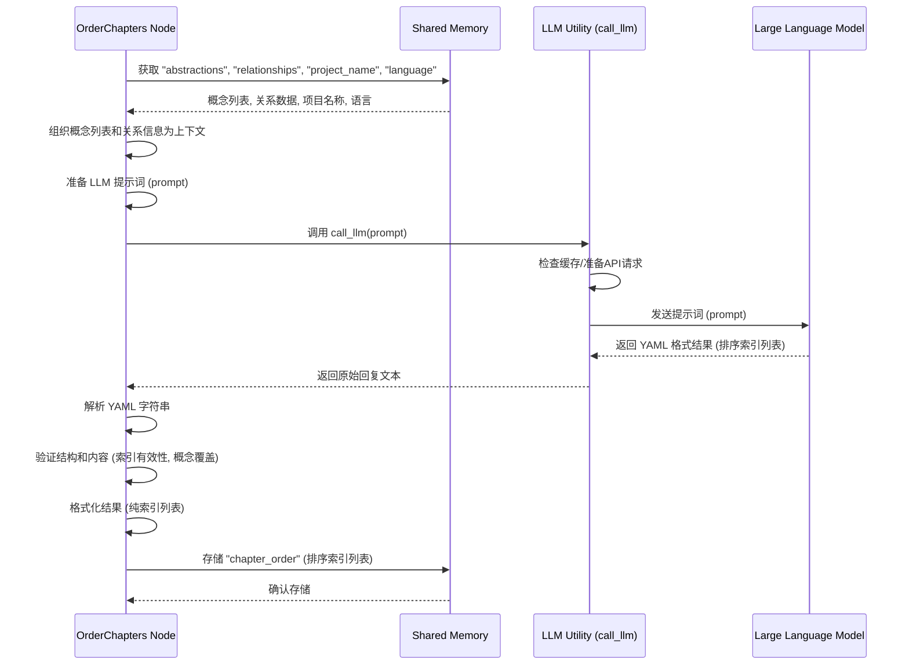

# Chapter 4: 章节顺序编排 (Chapter Ordering)

欢迎回到 `Tutorial-Codebase-Knowledge` 项目教程！在[上一章：概念关系分析](03_概念关系分析__concept_relationship_analysis__.md)中，我们学习了如何识别项目中的核心概念，并进一步分析了这些概念之间的相互关系，甚至生成了项目的整体概述。现在，我们不仅知道了项目中有哪些“地标”，还大致了解了它们之间是如何连接和协作的。

但是，仅仅知道这些信息还不足以构建一个易于理解的教程。想象一下，如果你想给别人介绍一个城市，你不会随机跳着介绍每个地标。你会规划一条**合理的路线**，可能从城市的入口开始，然后沿着交通主干道，依次介绍重要的区域和建筑，确保听者能逐步建立起完整的认知。

在我们的代码教程生成过程中，也需要这样一条“合理的路线”。这就是我们本章要讨论的核心概念：**章节顺序编排**。

## 这是什么？为什么需要它？

“章节顺序编排”顾名思义，就是**决定教程中的各个章节应该按照什么样的顺序来呈现**。这个步骤是基于前几章识别出的核心概念及其相互关系来完成的。

这个步骤是整个流程的**第四步**。它的主要目标是：

1.  根据已识别的核心概念列表、它们之间的关系，以及项目的整体概述。
2.  决定先讲解哪个概念，后讲解哪个概念。
3.  通常会从对新手最友好、最基础、或者最常被用户接触到的概念开始讲解。
4.  然后，沿着概念间的依赖关系或逻辑流程，逐步深入到更细节、更底层或更复杂的概念。

为什么这一步如此重要？一个逻辑清晰、顺序合理的教程，能极大地降低新手的学习难度。如果章节顺序混乱，一会儿讲基础，一会儿跳到最核心的细节，再跳回来讲另一个基础，读者会感到困惑，难以建立完整的知识体系。一个好的章节顺序，就像是为读者铺设了一条学习的“快车道”，让他们能沿着最平滑、最自然的路径理解项目。

## 代码中的实现：`OrderChapters` 节点

在我们的项目代码中，负责实现“章节顺序编排”功能的主要是 `nodes.py` 文件里的 `OrderChapters` 节点（Node）。

节点 (Node) 是 PocketFlow 框架中的一个基本工作单位，代表一个特定的步骤。`OrderChapters` 节点就是负责规划教程章节顺序的“规划师”。

`OrderChapters` 节点也包含 `prep`、`exec` 和 `post` 方法。

让我们看看 `OrderChapters` 是如何工作的：

```python
# snippets/nodes.py
# ... (imports and other classes above) ...

class OrderChapters(Node):
    def prep(self, shared):
        # 从共享数据 shared 中获取上一步的结果
        abstractions = shared["abstractions"] # 这是 IdentifyAbstractions 节点识别出的核心概念列表 (可能已翻译)
        relationships = shared["relationships"] # 这是 AnalyzeRelationships 节点分析出的关系 (可能已翻译)
        project_name = shared["project_name"]  # 获取项目名称
        language = shared.get("language", "english") # 获取目标语言

        # 为大型语言模型 (LLM) 准备输入上下文
        # 上下文需要包含所有核心概念的索引和名称，以及它们之间的关系描述
        abstraction_info_for_prompt = []
        for i, a in enumerate(abstractions):
            # 使用抽象概念的索引和名称（可能已翻译）
            abstraction_info_for_prompt.append(f"- {i} # {a['name']}")
        # 格式化概念列表为字符串，用于提示词
        abstraction_listing = "\n".join(abstraction_info_for_prompt)

        # 构建包含项目概述和关系的上下文
        # 使用relationships中可能已翻译的概述和关系标签
        summary_note = ""
        if language.lower() != "english":
             # 如果不是英语，提示LLM概述可能已翻译
             summary_note = f" (Note: Project Summary might be in {language.capitalize()})"

        context = f"Project Summary{summary_note}:\n{relationships['summary']}\n\n"
        context += "Relationships (Indices refer to abstractions above):\n"
        # 遍历关系列表，为每个关系构建描述字符串
        for rel in relationships['details']:
             # 根据关系中的索引找到对应的抽象概念名称（可能已翻译）
             from_name = abstractions[rel['from']]['name']
             to_name = abstractions[rel[   'to']]['name']
             # 使用关系标签（可能已翻译）
             context += f"- From {rel['from']} ({from_name}) to {rel['to']} ({to_name}): {rel['label']}\n"

        # 添加一个提示，说明输入列表中的概念名称可能已是目标语言
        list_lang_note = ""
        if language.lower() != "english":
             list_lang_note = f" (Names might be in {language.capitalize()})"


        # 返回执行阶段所需的数据：格式化的概念列表、关系上下文、概念总数、项目名称、语言提示
        return abstraction_listing, context, len(abstractions), project_name, list_lang_note

    # ... exec and post methods
```

`prep` 方法是**准备阶段**。它从 `shared` 共享内存中获取了上一章识别出的核心概念列表 (`abstractions`) 和概念关系数据 (`relationships`)，还有项目名称和目标语言。它根据这些信息构建了一个详细的、供大型语言模型理解的**上下文字符串**。这个上下文包含了所有核心概念的索引和名称，以及每个关系中源概念、目标概念的索引、名称和关系标签。这些信息是LLM理解概念间逻辑联系的基础。它还会根据目标语言添加一些提示，告知LLM输入的概念名称和概述可能已经翻译。

接下来是 `exec` 方法，这是**核心执行阶段**：

```python
# snippets/nodes.py
# ... inside OrderChapters class ...
    def exec(self, prep_res):
        # 从 prep 阶段的返回结果中解包数据
        abstraction_listing, context, num_abstractions, project_name, list_lang_note = prep_res
        print("正在使用 LLM 决定章节顺序...")
        # 不需要根据目标语言调整提示词指令本身，因为只是要求排序，
        # 但需要提示LLM输入的名称可能已翻译。
        prompt = f"""
根据项目 `{project_name}` 的以下抽象概念及其关系：

抽象概念 (索引 # 名称){list_lang_note}:
{abstraction_listing}

关于关系和项目概述的上下文:
{context}

如果你要为 `{project_name}` 项目编写教程，按照从先到后的顺序讲解这些抽象概念，最佳顺序是什么？
理想情况下，首先讲解那些最重要或最基础的概念，也许是用户直接面对的概念或入口点。然后逐步深入到更详细、更底层的实现细节或支持性概念。

输出排序后的抽象概念索引列表，为了清晰起见，在注释中包含名称。使用格式 `索引 # 抽象概念名称`。

```yaml
- 2 # 基础概念
- 0 # 核心类A
- 1 # 核心类B (使用核心类A)
- ...
```

现在，请提供 YAML 输出：
"""
        # 调用 LLM 工具函数获取结果
        response = call_llm(prompt) # call_llm 的细节将在第七章介绍

        # --- 验证 ---
        # 从 LLM 的回复中解析出 YAML 字符串
        try:
            yaml_str = response.strip().split("```yaml")[1].split("```")[0].strip()
        except IndexError:
             raise ValueError("LLM output did not contain expected ```yaml block.")
        # 解析 YAML
        ordered_indices_raw = yaml.safe_load(yaml_str)

        # 验证结果是否是列表
        if not isinstance(ordered_indices_raw, list):
            raise ValueError("LLM output is not a list")

        ordered_indices = [] # 存储最终验证通过的排序索引列表
        seen_indices = set() # 用于检查是否有重复索引
        # 遍历LLM返回的列表，验证每个条目
        for entry in ordered_indices_raw:
            try:
                 # 尝试从各种格式（整数、字符串"索引 # 名称"）解析出整数索引
                 if isinstance(entry, int):
                     idx = entry
                 elif isinstance(entry, str) and '#' in entry:
                      idx = int(entry.split('#')[0].strip())
                 else:
                      idx = int(str(entry).strip())

                 # 检查索引是否在有效范围内（小于概念总数）
                 if not (0 <= idx < num_abstractions):
                      raise ValueError(f"排序列表中存在无效索引 {idx}。最大有效索引为 {num_abstractions-1}。")
                 # 检查索引是否重复
                 if idx in seen_indices:
                     raise ValueError(f"排序列表中发现重复索引 {idx}。")
                 # 添加到验证通过的列表中
                 ordered_indices.append(idx)
                 seen_indices.add(idx)

            except (ValueError, TypeError):
                 raise ValueError(f"无法从排序列表条目中解析索引: {entry}")

        # 检查是否所有抽象概念都被包含在排序列表中
        if len(ordered_indices) != num_abstractions:
             # 计算缺失的索引并获取它们的名称（可能已翻译）
             missing_indices = set(range(num_abstractions)) - seen_indices
             # 需要从原始abstractions列表中查找名称，因为prep中没有返回完整的abstractions
             # 可以通过shared["abstractions"]再次获取或者在prep中传递完整的abstractions
             # 这里假设可以通过shared获取
             # missing_names = [shared["abstractions"][i]['name'] for i in missing_indices] # simplified access for explanation
             # 实际代码中，prep返回的num_abstractions是基于abstractions的长度，可以直接验证seen_indices的大小
             raise ValueError(f"排序列表长度 ({len(ordered_indices)}) 与抽象概念数量 ({num_abstractions}) 不匹配。缺失索引：{missing_indices}。")


        print(f"已确定章节顺序 (索引): {ordered_indices}")
        # 返回验证通过的排序索引列表
        return ordered_indices

    def post(self, shared, prep_res, exec_res):
        # exec_res 就是排序后的索引列表
        # 将排序结果存储到 shared["chapter_order"] 中
        shared["chapter_order"] = exec_res
# ... WriteChapters and other classes below ...
```

`exec` 方法是整个步骤的核心。它接收 `prep` 准备好的概念列表、关系上下文、概念总数和项目名称。然后，它构建了一个详细的**提示词 (prompt)** 发送给大型语言模型。这个提示词明确地告诉 LLM：

*   项目名称是什么。
*   提供了哪些抽象概念及其索引和名称。
*   提供了关于概念间关系和项目概述的背景信息 (`context`)。
*   要求它按照最适合新手学习的逻辑顺序，提供一个排序后的概念索引列表。
*   **最重要的是**，要求 LLM 严格按照指定的 YAML 格式输出一个索引列表。

它调用了 `call_llm` 这个工具函数来与大型语言模型进行实际交互。`call_llm` 的具体实现（比如调用哪个 AI 模型、如何处理 API 请求、缓存等）将在[第七章：大模型调用工具](07_大模型调用工具__llm_calling_utility__.md)中详细介绍。

收到 LLM 的回复后，`exec` 方法会进行**验证**。它首先解析回复中的 YAML 字符串，然后检查解析出来的结果是否是一个列表。接着，它遍历列表中的每一个条目，尝试将其解析为整数索引，并验证这个索引是否在有效范围内（小于概念总数），以及是否出现了重复的索引。最关键的验证是确保排序后的列表中**包含了所有**在 `abstractions` 中识别出的概念的索引。验证通过后，它将排序后的索引列表返回。

最后，`post` 方法将 `exec` 方法返回的、验证通过的排序索引列表存储到 `shared` 共享内存中的 `chapter_order` 键下。这样，后续的节点（特别是用于编写章节内容的节点）就可以通过 `shared["chapter_order"]` 获取到这个列表，并按照这个顺序来生成教程章节了。

### LLM 调用流程 (简化序列图)

这个章节顺序编排的执行过程可以简化为下面的交互序列：



这张图展示了 `OrderChapters` 节点如何从共享内存获取输入，准备发送给 LLM 的数据，调用 `call_llm` 工具函数，接收 LLM 的回复，处理并验证结果，最后将排序后的概念索引列表存回共享内存。

## 总结

在这一章中，我们学习了“章节顺序编排”的概念，它是整个教程生成过程的第四步。它的作用是利用大型语言模型，根据前几章识别出的核心概念、它们之间的关系以及项目的概述，确定最适合新手学习的教程章节顺序。这个过程就像是为教程规划一条清晰的学习路径，确保读者能沿着逻辑顺序逐步深入理解项目。

我们还详细了解了在项目代码中，`OrderChapters` 节点是如何实现这一功能的：它的 `prep` 方法负责将核心概念和关系信息组织成LLM可以理解的上下文；`exec` 方法构建了详细的提示词（要求LLM提供排序后的概念索引列表，并指定输出格式），调用 `call_llm` 与 LLM 交互，然后对 LLM 返回的结果进行严格的验证（包括检查索引的有效性、唯一性以及是否覆盖了所有概念）；最后 `post` 方法将排序后的概念索引列表存储到共享内存中，供后续步骤使用。我们还通过一个简化的序列图展示了节点、LLM 工具和 LLM 之间的交互过程。

这个排序后的概念索引列表 (`shared["chapter_order"]`) 将作为核心指令，连同核心概念列表 (`shared["abstractions"]`)、原始文件内容 (`shared["files"]`) 等信息，传递给工作流中的下一个步骤。

现在，我们已经拥有了构建教程所需的所有关键信息：原始代码、核心概念、概念关系、项目概述，以及最重要的——按照什么顺序来讲解这些概念。下一步，我们将利用这些信息，开始真正地撰写教程的每个章节内容。

---

下一章：[章节内容写作](05_章节内容写作__chapter_content_writing__.md)

---

Generated by [AI Codebase Knowledge Builder](https://github.com/The-Pocket/Tutorial-Codebase-Knowledge)