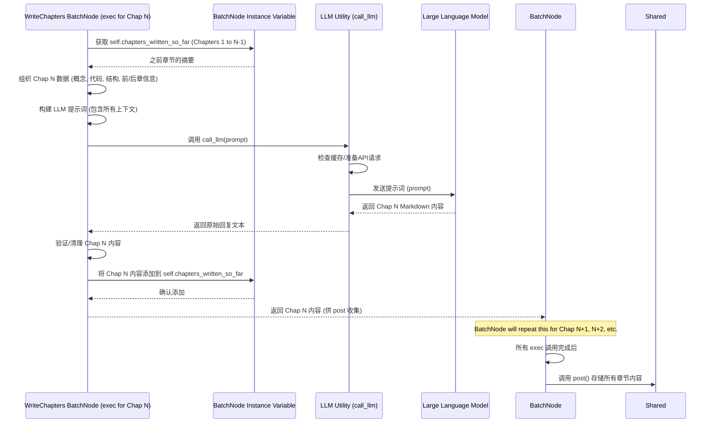

# Chapter 5: 章节内容写作 (Chapter Content Writing)


好的，这是一篇关于“章节内容写作”的教程章节，完全使用中文编写。

# Chapter 5: 章节内容写作 (Chapter Content Writing)

欢迎回到 `Tutorial-Codebase-Knowledge` 项目教程！在[上一章：章节顺序编排](04_章节顺序编排__chapter_ordering__.md)中，我们学习了如何利用大型语言模型（LLM）和之前识别出的核心概念及它们之间的关系，确定了教程的最佳讲解顺序。现在，我们不仅仅有了项目的“地标”列表和它们之间的“交通图”，还规划好了一条最适合新手的“学习路线”。

现在万事俱备，只欠东风了！有了学习路线，我们就可以真正开始**撰写**教程的每一个章节了。这就像一位经验丰富的老师，拿到了课程大纲和顺序，就可以开始为每个主题编写详细、生动的课堂讲义了。

这就引出了我们本章要讨论的核心概念：**章节内容写作**。

## 这是什么？为什么需要它？

“章节内容写作”是教程内容生成的**核心环节**。在前几章，我们完成了准备工作：收集代码、识别概念、分析关系、确定章节顺序。现在，我们需要把这些结构性的信息填充成实际、易于理解的教程内容。

这个步骤是整个流程的**第五步**。它的主要目标是：

1.  对于章节顺序中确定的每一个核心概念。
2.  利用**大型语言模型 (LLM)** 作为“写作助手”。
3.  结合该概念的名称、描述、相关的代码片段，以及**前面已经撰写好的章节内容**作为上下文。
4.  生成一篇完整、新手友好的教程章节内容，包括解释、类比、代码示例、图表等。
5.  确保生成的章节内容使用指定的语言（例如中文），并遵循易于理解的写作风格和结构。

为什么这一步如此重要？因为它直接产出了最终用户将阅读的教程内容。一个好的“章节内容写作”过程，能够将复杂的代码概念转化为清晰、易懂的文字，帮助新手快速掌握项目。它就像是将前几步搭建好的“骨架”和“路线图”，填满了生动、详实的“血肉”。

## 代码中的实现：`WriteChapters` BatchNode

在我们的项目代码中，负责实现“章节内容写作”功能的主要是 `nodes.py` 文件里的 `WriteChapters` 节点（Node）。

你可能会注意到，这里的节点类型是 `BatchNode`，而不是我们前面看到的 `Node`。`BatchNode` 是一种特殊的节点，它可以接收一个“待处理项”的列表，然后**依次**处理列表中的每一个项。在这个场景中，每一个“待处理项”就是一个需要撰写的教程章节（对应章节顺序列表中的一个核心概念）。

为什么这里要用 `BatchNode` 呢？因为在撰写章节内容时，特别是后面的章节，往往需要引用或回顾前面章节讲解过的概念。通过使用 `BatchNode` 按照确定的章节顺序**依次**处理每个章节，我们可以在撰写第 N 章时，将前面第 1 到 N-1 章已经生成的内容作为上下文提供给大型语言模型，帮助它保持内容的一致性和逻辑流畅性，并正确创建章节间的引用链接。

`WriteChapters` BatchNode 也包含 `prep`、`exec` 和 `post` 方法，但它们的含义稍有不同：

*   `prep`: 准备阶段，它接收所有章节所需的数据，并将它们分割成一个“待处理项”列表，`exec` 方法会针对这个列表中的每一个项运行一次。
*   `exec`: **核心执行阶段**，对于列表中的**每一个待处理项（即每一个章节）**，它会被调用一次。在这里，它调用大型语言模型来生成具体章节内容。
*   `post`: 后处理阶段，在 `exec` 方法处理完所有项之后只运行一次，负责收集所有 `exec` 方法的输出结果，并进行最终处理和存储。

让我们看看 `WriteChapters` 是如何工作的：

```python
# snippets/nodes.py
# ... (imports and other classes above) ...

class WriteChapters(BatchNode):
    def prep(self, shared):
        # 从共享数据 shared 中获取前几步的结果
        chapter_order = shared["chapter_order"] # 这是 OrderChapters 节点确定的章节索引顺序列表
        abstractions = shared["abstractions"]   # 这是 IdentifyAbstractions 识别的核心概念列表 (名称/描述可能已翻译)
        files_data = shared["files"] # 这是 FetchRepo 收集的原始文件内容列表
        language = shared.get("language", "english") # 获取目标语言

        # 用于在 exec 阶段逐步积累前面章节的概要
        # BatchNode 会在每个 item 处理之间保持这个实例变量
        self.chapters_written_so_far = []

        # 创建完整的章节列表字符串和文件名映射，用于在提示词中生成链接
        all_chapters = []
        chapter_filenames = {} # 存储 概念索引 -> 章节信息 (编号, 名称, 文件名) 的映射
        for i, abstraction_index in enumerate(chapter_order):
            if 0 <= abstraction_index < len(abstractions):
                chapter_num = i + 1 # 章节编号从1开始
                # 使用可能已翻译的章节名称
                chapter_name = abstractions[abstraction_index]["name"] 
                # 根据章节名称生成安全的文件名 (将非字母数字字符替换为下划线并转小写)
                safe_name = "".join(c if c.isalnum() else '_' for c in chapter_name).lower()
                filename = f"{i+1:02d}_{safe_name}.md" # 格式化文件名 (01_..., 02_...)
                
                # 格式化为 Markdown 链接列表项 (使用可能已翻译的名称)
                all_chapters.append(f"{chapter_num}. [{chapter_name}]({filename})")
                # 存储映射信息
                chapter_filenames[abstraction_index] = {"num": chapter_num, "name": chapter_name, "filename": filename}

        # 将完整的章节列表组合成一个字符串，用于提示词上下文
        full_chapter_listing = "\n".join(all_chapters)

        # 为 BatchNode 的 exec 方法准备输入项列表
        items_to_process = []
        for i, abstraction_index in enumerate(chapter_order):
            # 验证索引是否有效
            if 0 <= abstraction_index < len(abstractions):
                # 获取当前章节对应的核心概念详情 (包含可能已翻译的名称/描述)
                abstraction_details = abstractions[abstraction_index] 
                # 获取与当前概念相关的代码文件索引列表 (在 IdentifyAbstractions 中已经整理好)
                related_file_indices = abstraction_details.get("files", [])
                # 使用辅助函数 get_content_for_indices 获取相关文件内容
                related_files_content_map = get_content_for_indices(
                    files_data, 
                    related_file_indices # 传递文件索引列表
                )

                # 获取前一章节信息 (用于在章节开头做过渡和链接)
                prev_chapter = None
                if i > 0:
                    # 根据章节顺序获取前一个概念的索引
                    prev_idx = chapter_order[i-1]
                    # 从 chapter_filenames 映射中获取前一章节的文件信息 (可能已翻译的名称和文件名)
                    prev_chapter = chapter_filenames.get(prev_idx) # 使用 get 以防万一索引无效

                # 获取后一章节信息 (用于在章节结尾做总结和链接)
                next_chapter = None
                if i < len(chapter_order) - 1:
                    # 根据章节顺序获取下一个概念的索引
                    next_idx = chapter_order[i+1]
                    # 从 chapter_filenames 映射中获取后一章节的文件信息 (可能已翻译的名称和文件名)
                    next_chapter = chapter_filenames.get(next_idx) # 使用 get 以防万一索引无效

                # 将所有准备好的信息打包成一个字典，作为 BatchNode 的一个处理项
                items_to_process.append({
                    "chapter_num": i + 1, # 当前章节编号 (1-based)
                    "abstraction_index": abstraction_index, # 当前章节对应的核心概念索引
                    "abstraction_details": abstraction_details, # 核心概念详情 (名称/描述可能已翻译)
                    "related_files_content_map": related_files_content_map, # 相关代码内容
                    "project_name": shared["project_name"],  # 项目名称
                    "full_chapter_listing": full_chapter_listing,  # 完整的章节列表字符串 (用于生成链接)
                    "chapter_filenames": chapter_filenames,  # 文件名映射 (用于根据索引找到链接信息)
                    "prev_chapter": prev_chapter,  # 前一章节信息 (名称/文件名可能已翻译)
                    "next_chapter": next_chapter,  # 后一章节信息 (名称/文件名可能已翻译)
                    "language": language,  # 目标语言
                    # 注意：previous_chapters_summary 不在这里添加，而是在 exec 方法中动态获取
                })
            else:
                # 如果章节顺序中有无效索引，打印警告
                print(f"警告: 章节顺序中存在无效的抽象概念索引 {abstraction_index}。跳过该章节。")

        print(f"准备撰写 {len(items_to_process)} 个章节...")
        # 返回 BatchNode 要处理的项列表
        return items_to_process # 这会是 BatchNode 的可迭代输入

    def exec(self, item):
        # 这个方法会为 prep 返回的 items_to_process 中的每一个 item 运行一次
        
        # 从当前 item 中解包数据
        abstraction_name = item["abstraction_details"]["name"] # 当前章节的核心概念名称 (可能已翻译)
        abstraction_description = item["abstraction_details"]["description"] # 概念描述 (可能已翻译)
        chapter_num = item["chapter_num"] # 当前章节编号
        project_name = item.get("project_name") # 项目名称
        language = item.get("language", "english") # 目标语言
        
        print(f"正在使用 LLM 撰写章节 {chapter_num}：{abstraction_name}...")

        # 将相关代码内容格式化为 LLM 上下文字符串
        file_context_str = "\n\n".join(
            f"--- 文件: {idx_path.split('# ')[1] if '# ' in idx_path else idx_path} ---\n{content}"
            for idx_path, content in item["related_files_content_map"].items()
        )

        # 获取 BatchNode 实例变量中累积的**之前已撰写**章节的概要
        # 这是 BatchNode 的关键之处：在处理当前章节时，可以访问前一个处理项的状态
        # 我们在 prep 中初始化了 self.chapters_written_so_far
        # 在每次 exec 运行结束前，我们会将当前章节内容添加到这个列表中
        previous_chapters_summary = "\n---\n".join(self.chapters_written_so_far)

        # 根据目标语言添加提示词指令和上下文说明
        language_instruction = ""
        concept_details_note = ""
        structure_note = ""
        prev_summary_note = ""
        instruction_lang_note = ""
        mermaid_lang_note = ""
        code_comment_note = ""
        link_lang_note = ""
        tone_note = ""
        if language.lower() != "english":
            lang_cap = language.capitalize()
            # **重要指令**: 要求 LLM 输出全部中文内容，除非特别指明 (如代码语法)
            language_instruction = f"IMPORTANT: Write this ENTIRE tutorial chapter in **{lang_cap}**. Some input context (like concept name, description, chapter list, previous summary) might already be in {lang_cap}, but you MUST translate ALL other generated content including explanations, examples, technical terms, and potentially code comments into {lang_cap}. DO NOT use English anywhere except in code syntax, required proper nouns, or when specified. The entire output MUST be in {lang_cap}.\n\n"
            # 添加说明，告诉 LLM 输入的某些字段可能已经是目标语言
            concept_details_note = f" (Note: Provided in {lang_cap})"
            structure_note = f" (Note: Chapter names might be in {lang_cap})"
            prev_summary_note = f" (Note: This summary might be in {lang_cap})"
            # 标记出需要用目标语言生成的具体内容类型
            instruction_lang_note = f" (in {lang_cap})"
            mermaid_lang_note = f" (Use {lang_cap} for labels/text if appropriate)"
            code_comment_note = f" (Translate to {lang_cap} if possible, otherwise keep minimal English for clarity)"
            link_lang_note = f" (Use the {lang_cap} chapter title from the structure above)"
            tone_note = f" (appropriate for {lang_cap} readers)"


        # 构建发送给 LLM 的详细提示词 (prompt)
        prompt = f"""
{language_instruction}请撰写一个非常适合初学者的教程章节 (Markdown 格式)，为项目 `{project_name}`，内容关于核心概念: "{abstraction_name}"。这是第 {chapter_num} 章。

概念详情{concept_details_note}:
- 名称: {abstraction_name}
- 描述:
{abstraction_description}

完整的教程章节结构{structure_note}:
{item["full_chapter_listing"]}

之前章节的上下文{prev_summary_note}:
{previous_chapters_summary if previous_chapters_summary else "这是第一章。"}

相关代码片段 (代码本身不变):
{file_context_str if file_context_str else "此抽象概念未提供特定的代码片段。"}

章节撰写说明 (生成内容请使用 {language.capitalize()}，除非特别指明):
- 以清晰的标题开头 (例如: `# 第 {chapter_num} 章: {abstraction_name}`)。使用提供的概念名称。

- 如果这不是第一章，请在章节开头写一小段过渡文字{instruction_lang_note}，使用正确的 Markdown 链接引用前一章节{link_lang_note} (使用上方完整章节结构中的章节名称)。

- 从高层级解释该抽象概念解决了什么问题{instruction_lang_note}。以一个具体的中心用例作为起点。整个章节应该引导读者理解如何使用这个概念来解决这个用例。内容要非常简洁，对初学者友好。

- 如果概念复杂，将其分解为几个关键子概念。逐个解释每个子概念，采用对初学者非常友好的方式{instruction_lang_note}。

- 解释如何使用这个抽象概念来解决中心用例{instruction_lang_note}。提供代码片段的示例输入和输出 (如果输出不是具体数值，高层级描述会发生什么{instruction_lang_note})。

- **每个代码块必须少于 20 行**！如果需要更长的代码，将其分解成更小的片段，逐个讲解。大力简化代码，使其尽量简洁。使用注释{code_comment_note}跳过不重要的实现细节。每个代码块后面必须紧跟着一段对初学者友好的解释{instruction_lang_note}。

- 描述内部实现，帮助理解其底层原理{instruction_lang_note}。首先提供一个非代码或轻代码的逐步流程讲解，说明调用该抽象概念时内部发生了什么{instruction_lang_note}。建议使用一个简单的 sequenceDiagram 配合一个虚拟示例来展示流程 - 保持简洁，最多 5 个参与者，确保清晰。如果参与者名称包含空格，请使用格式: `participant QP as Query Processing`。 {mermaid_lang_note}。

- 然后更深入地讲解内部实现的代码，可以引用相关文件。提供示例代码块，但同样要保持简洁和对初学者友好。并进行解释{instruction_lang_note}。

- **重要提示**: 需要引用其他章节讲解过的核心抽象概念时，**始终**使用正确的 Markdown 链接格式，例如: `[章节标题](文件名.md)`。使用上方提供的**完整的教程章节结构**来查找正确的**文件名**和**章节标题**{link_lang_note}。请翻译周围的文字。

- 使用 mermaid 图表来解释复杂概念 (```mermaid``` 格式)。 {mermaid_lang_note}。

- 在整个章节中大量使用类比和例子{instruction_lang_note}，帮助初学者理解。

- 在章节结尾用简短的结论总结学到的内容{instruction_lang_note}，并提供到下一章节的过渡{instruction_lang_note}。如果有下一章，使用正确的 Markdown 链接格式: `[下一章节标题](下一章节文件名)`{link_lang_note} (使用上方完整章节结构中的下一章节名称)。

- 确保语气热情友好，内容对新手来说易于理解{tone_note}。

- **仅输出**该章节的 Markdown 内容。请不要在输出内容外添加其他文字或标记 (例如 ```markdown``` 标签)。

现在，请直接提供一段非常适合初学者的 Markdown 输出：
"""
        # 调用 LLM 工具函数来获取章节内容
        chapter_content = call_llm(prompt) # call_llm 的细节将在第七章介绍

        # --- 验证和清理 ---
        # 确保章节内容以正确的标题开头
        # 使用可能已翻译的章节名称构造预期标题
        actual_heading = f"# 第 {chapter_num} 章: {abstraction_name}" 
        # 检查 LLM 输出是否以预期标题开头
        if not chapter_content.strip().startswith(actual_heading):
             # 如果缺少或不正确，尝试添加或替换标题
             lines = chapter_content.strip().split('\n')
             if lines and lines[0].strip().startswith("#"): # 如果已有标题行，则替换
                 lines[0] = actual_heading
                 chapter_content = "\n".join(lines)
             else: # 否则，在开头添加标题
                 chapter_content = f"{actual_heading}\n\n{chapter_content}"

        # 将当前章节的内容添加到实例变量中，作为后续章节的上下文
        self.chapters_written_so_far.append(chapter_content)

        # 返回生成的 Markdown 字符串
        return chapter_content # 返回生成的 Markdown 内容 (可能已翻译)

    def post(self, shared, prep_res, exec_res_list):
        # exec_res_list 是一个列表，包含了所有 exec 方法运行返回的结果 (即每个章节的 Markdown 内容)，并且是按照 BatchNode 处理项的顺序排列的
        
        # 将生成的章节内容列表存储到 shared 共享内存中
        shared["chapters"] = exec_res_list
        
        # 清理在 prep 中创建的临时实例变量
        del self.chapters_written_so_far
        
        print(f"已完成 {len(exec_res_list)} 个章节的撰写。")

# ... CombineTutorial and other classes below ...
```

`prep` 方法负责**准备 BatchNode 的输入列表**。它获取了章节顺序、核心概念列表、原始文件内容和目标语言。它遍历章节顺序，为每个章节（即每个核心概念）创建一个“处理项”字典。这个字典包含了撰写该章节所需的所有信息：章节编号、对应的核心概念详情（名称、描述、相关文件索引等），以及一个完整的**教程章节结构列表**和**文件名映射**（用于帮助LLM生成章节间的正确链接），还有前一章和后一章的信息（用于过渡）。它还将一个空列表 `self.chapters_written_so_far` 初始化为实例变量，这个列表将在 `exec` 阶段用于积累前面章节的内容。

`exec` 方法是**核心执行阶段**，它会被**每个章节的处理项**调用一次。在 `exec` 方法中：

1.  它首先解包当前章节的所有相关信息。
2.  它将与当前概念相关的代码片段格式化为一个字符串。
3.  **关键步骤**：它从 `self.chapters_written_so_far` 这个实例变量中获取**到目前为止**所有已经撰写完成的章节内容，并将它们合并成一个字符串 `previous_chapters_summary`。
4.  它构建了一个非常详细的**提示词 (prompt)** 发送给大型语言模型。这个提示词包含了：
    *   项目名称、当前章节编号、核心概念的名称和描述。
    *   所有与该概念相关的代码片段 (`file_context_str`)。
    *   **前面已经撰写好的章节内容概要** (`previous_chapters_summary`)，这为LLM提供了重要的上下文信息。
    *   **完整的教程章节结构列表**和**前一章/后一章的信息**，以及如何使用它们来生成正确的Markdown链接的明确指令。
    *   详细的写作要求：目标语言（中文）、 beginner-friendly 的风格、使用类比和例子、代码块的要求（小于20行，简化，带注释，后跟解释）、描述内部实现（推荐使用 mermaid sequenceDiagram）、如何引用其他章节等。
    *   明确要求输出**仅为**Markdown内容。
5.  它调用了 `call_llm` 工具函数来与大型语言模型进行实际交互，并将提示词发送过去。
6.  收到 LLM 的回复（即生成的章节Markdown内容）后，它进行基本的验证（例如检查标题是否正确）。
7.  **重要步骤**：它将当前生成的章节内容**添加到** `self.chapters_written_so_far` 实例变量中。这样，当 BatchNode 处理下一个章节时，这个列表就会包含当前章节的内容了。
8.  它返回生成的章节 Markdown 字符串。

`post` 方法在所有章节都处理完毕后**只运行一次**。它接收所有 `exec` 方法返回结果组成的列表 (`exec_res_list`)，这个列表就是所有章节的 Markdown 内容。它将这个列表存储到 `shared` 共享内存的 `chapters` 键下，供后续步骤使用。最后，它清理了 `self.chapters_written_so_far` 实例变量。

### LLM 调用流程 (简化序列图)

这个章节内容写作的执行过程可以简化为下面的 BatchNode 内部的迭代交互序列（只展示一次 `exec` 调用，以及它如何利用之前迭代累积的上下文）：



这张图展示了 `WriteChapters` BatchNode 在处理某个章节（例如第 N 章）的 `exec` 方法被调用时，如何从自己的实例变量中获取前面章节的上下文，然后结合当前章节的数据构建提示词，调用 `call_llm`，接收结果，并将结果添加到实例变量中，以便为下一个章节（第 N+1 章）提供上下文。这个过程会一直循环，直到所有章节都撰写完毕。

## 总结

在这一章中，我们学习了“章节内容写作”的概念，它是整个教程生成过程的核心步骤。它的作用是利用大型语言模型，根据前几章准备好的结构和信息，结合每个章节对应的核心概念详情、相关代码片段，以及最关键的——**前面已经撰写好的章节内容作为上下文**，来生成一篇篇详细、新手友好的教程章节内容。这个过程就像是一位老师按照大纲和已讲内容编写新的课程讲义。

我们还详细了解了在项目代码中，`WriteChapters` BatchNode 是如何实现这一功能的：它是一个特殊的 BatchNode，能够按照顺序**依次**处理每个章节。它的 `prep` 方法负责准备每个章节的处理项，并初始化一个临时变量来存储已撰写章节的内容；`exec` 方法是核心，它为每一个章节调用一次，获取该章节所需的所有信息，动态获取前面章节的上下文，构建包含所有这些细节和详细写作要求的提示词，调用 `call_llm` 与 LLM 交互，并将生成的章节内容添加到临时变量中；最后 `post` 方法在所有章节完成后收集结果并存储。我们还通过一个简化的序列图展示了 BatchNode 内部处理单个章节时，如何利用累积的上下文与 LLM 交互。

这些生成的章节 Markdown 内容列表 (`shared["chapters"]`) 将作为最终输出的一部分，传递给工作流中的下一个步骤。

现在，我们已经成功地撰写出了教程的每一个章节内容。下一步，我们将把这些单独的章节文件以及其他辅助内容（如项目概述、关系图等）整合起来，形成一个完整的教程文件集合。

---

下一章：[教程文件整合](06_教程文件整合__tutorial_file_integration__.md)

---

Generated by [AI Codebase Knowledge Builder](https://github.com/The-Pocket/Tutorial-Codebase-Knowledge)