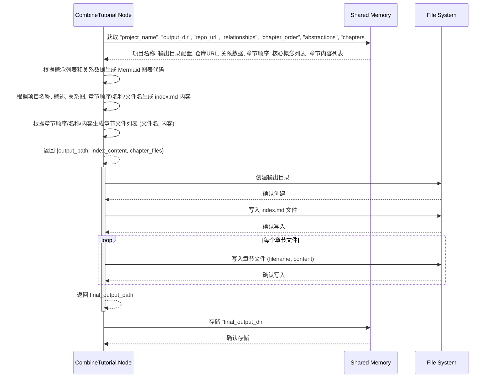

# Chapter 6: 教程文件整合 (Tutorial File Integration)


好的，这是一篇关于“教程文件整合”的教程章节，完全使用中文编写。

```markdown
# Chapter 6: 教程文件整合 (Tutorial File Integration)

欢迎回到 `Tutorial-Codebase-Knowledge` 项目教程！在[上一章：章节内容写作](05_章节内容写作__chapter_content_writing__.md)中，我们学习了如何利用大型语言模型（LLM）作为写作助手，并结合所有前期准备好的信息，按照既定的章节顺序，逐一撰写出了教程的每一个章节内容。现在，我们手里握着的是一份份独立的、写好的章节“草稿”。

我们已经有了：
*   项目的整体概述。
*   识别出的核心概念列表。
*   概念之间如何相互关联的关系图。
*   按照逻辑顺序排列好的章节列表。
*   以及，最核心的——每一个章节的具体 Markdown 内容。

但这还不是一个可以方便阅读和分享的教程。你需要将这些独立的章节文件、项目概述、概念关系图等所有内容**组织起来**，放到一个指定的文件夹里，就像把一本写好的书的所有章节打印出来，然后整齐地装订起来，再放进书架，并给它做一个目录（索引）。

这就引出了我们本章要讨论的核心概念：**教程文件整合**。

## 这是什么？为什么需要它？

“教程文件整合”是整个教程生成流程的**最后一步**。它负责将前面所有步骤生成的离散数据和文件，按照一个预设的结构，保存到文件系统中，形成最终可用的教程文件集合。

这个步骤是整个流程的**第六步**。它的主要目标是：

1.  根据配置创建一个目标输出目录（文件夹）。
2.  生成一个主索引文件（通常是 `index.md` 或 `README.md`），包含项目概述、概念关系图和所有章节的链接列表。
3.  将前面撰写好的每一个章节的 Markdown 内容保存为独立的文件，文件名按照章节顺序和标题生成。
4.  确保所有文件都位于正确的输出目录下，并且主索引文件中的链接是正确的。
5.  （可选）生成概念关系的可视化图表（例如使用 Mermaid 格式）。

为什么这一步如此重要？没有这一步，“书稿”再好，也无法成为一本可读的“书”。教程文件整合将所有分散的成果打包成一个易于导航和分享的整体，让用户可以直接打开主索引文件，开始他们的学习旅程。它标志着整个教程生成过程的圆满完成。

## 代码中的实现：`CombineTutorial` 节点

在我们的项目代码中，负责实现“教程文件整合”功能的主要是 `nodes.py` 文件里的 `CombineTutorial` 节点（Node）。

`CombineTutorial` 节点是一个普通的 `Node`，因为它只需要在前序所有节点（包括 `WriteChapters` 这个 BatchNode 完成所有章节写作后）都执行完毕后，一次性地收集所有结果并进行最终的文件组织和保存。

`CombineTutorial` 节点包含 `prep`、`exec` 和 `post` 方法。

让我们看看 `CombineTutorial` 是如何工作的：

```python
# snippets/nodes.py
# ... (imports and other classes above) ...

class CombineTutorial(Node):
    def prep(self, shared):
        # 从共享数据 shared 中获取所有需要整合的数据
        project_name = shared["project_name"] # 项目名称
        # 获取输出目录配置，如果未指定，默认为 'output' 文件夹下的项目名称子文件夹
        output_base_dir = shared.get("output_dir", "output") 
        output_path = os.path.join(output_base_dir, project_name)
        repo_url = shared.get("repo_url")  # 获取仓库 URL，用于在索引中引用

        # 获取前面节点生成的核心数据 (注意：这些数据可能已经过翻译)
        # relationships_data 包含概述和关系细节
        relationships_data = shared["relationships"] 
        chapter_order = shared["chapter_order"] # 排序后的概念索引列表
        abstractions = shared["abstractions"]   # 核心概念列表 (名称/描述可能已翻译)
        chapters_content = shared["chapters"]   # 所有章节的 Markdown 内容列表 (可能已翻译)

        # --- 生成 Mermaid 关系图 ---
        # 我们要生成一个流程图 (flowchart) 来可视化概念关系
        mermaid_lines = ["flowchart TD"] # TD 表示从上到下 (Top Down)
        # 为每个抽象概念添加节点
        for i, abstr in enumerate(abstractions):
            node_id = f"A{i}" # 使用 A + 索引 作为节点 ID
            # 使用可能已翻译的概念名称作为节点标签，并进行基本 sanitization (移除双引号)
            sanitized_name = abstr['name'].replace('"', '') 
            node_label = sanitized_name # 使用净化后的名称
            # Mermaid 节点定义格式: ID["标签"]
            mermaid_lines.append(f'    {node_id}["{node_label}"]') 
        # 为每个关系添加边
        for rel in relationships_data['details']:
            from_node_id = f"A{rel['from']}" # 关系的源节点 ID
            to_node_id = f"A{rel['to']}"     # 关系的目标节点 ID
            # 使用可能已翻译的关系标签作为边的文本，并进行基本 sanitization (移除双引号和换行)
            edge_label = rel['label'].replace('"', '').replace('\n', ' ') 
            # 限制标签长度，避免图表过宽
            max_label_len = 30
            if len(edge_label) > max_label_len:
                edge_label = edge_label[:max_label_len-3] + "..." # 截断并添加省略号
            # Mermaid 边定义格式: 源ID -- "标签" --> 目标ID
            mermaid_lines.append(f'    {from_node_id} -- "{edge_label}" --> {to_node_id}') 

        mermaid_diagram = "\n".join(mermaid_lines) # 组合成完整的 Mermaid 字符串
        # --- Mermaid 生成结束 ---

        # --- 准备 index.md 内容 ---
        # index.md 是教程的入口文件
        index_content = f"# 教程: {project_name}\n\n" # 使用项目名称作为主标题
        # 直接使用 AnalyzeRelationships 生成的项目概述 (可能已翻译)
        index_content += f"{relationships_data['summary']}\n\n" 
        # 添加来源仓库链接 (这部分通常保持英文，除非有明确的多语言约定)
        index_content += f"**Source Repository:** [{repo_url}]({repo_url})\n\n"

        # 在索引中嵌入 Mermaid 关系图代码块
        index_content += "## 核心概念关系图\n\n" # 副标题
        index_content += "```mermaid\n"
        index_content += mermaid_diagram + "\n" # 插入生成的 Mermaid 代码
        index_content += "```\n\n"

        # 添加章节列表
        index_content += f"## 章节列表\n\n" # 副标题

        chapter_files = [] # 用于存储每个章节的文件名和内容
        # 遍历确定的章节顺序，生成章节链接和文件名
        for i, abstraction_index in enumerate(chapter_order):
            # 验证索引是否有效，并且确保有对应的章节内容
            if 0 <= abstraction_index < len(abstractions) and i < len(chapters_content):
                # 获取核心概念名称 (可能已翻译)，用于章节标题和文件名
                abstraction_name = abstractions[abstraction_index]["name"] 
                # 根据章节编号和概念名称生成文件名，进行基本 sanitization
                safe_name = "".join(c if c.isalnum() else '_' for c in abstraction_name).lower()
                filename = f"{i+1:02d}_{safe_name}.md" # 格式化为 01_concept_name.md

                # 添加到 index.md 中的章节列表，使用 Markdown 链接格式
                # 链接文本使用可能已翻译的章节名称
                index_content += f"{i+1}. [{abstraction_name}]({filename})\n" 

                # 获取对应的章节内容 (可能已翻译)
                chapter_content = chapters_content[i] 
                # 在章节内容末尾添加自动生成的署名 (这部分通常保持英文)
                if not chapter_content.endswith("\n\n"):
                    chapter_content += "\n\n" # 确保有空行
                chapter_content += f"---\n\nGenerated by [AI Codebase Knowledge Builder](https://github.com/The-Pocket/Tutorial-Codebase-Knowledge)"

                # 将文件名和带有署名的章节内容存储起来，供 exec 阶段写入文件
                chapter_files.append({"filename": filename, "content": chapter_content})
            else:
                 # 如果章节顺序、概念列表或章节内容之间存在不匹配，打印警告
                 print(f"警告: 章节顺序、概念列表或章节内容在索引 {i} (概念索引 {abstraction_index}) 处存在不匹配。跳过该章节的文件生成。")

        # 在 index.md 末尾添加自动生成的署名 (这部分通常保持英文)
        index_content += f"\n\n---\n\nGenerated by [AI Codebase Knowledge Builder](https://github.com/The-Pocket/Tutorial-Codebase-Knowledge)"

        # 返回执行阶段所需的数据
        return {
            "output_path": output_path,     # 最终输出目录路径
            "index_content": index_content, # index.md 的完整内容
            "chapter_files": chapter_files  # 包含所有章节文件名和内容的列表
        }

    def exec(self, prep_res):
        # 从 prep 阶段的返回结果中解包数据
        output_path = prep_res["output_path"]
        index_content = prep_res["index_content"]
        chapter_files = prep_res["chapter_files"]

        print(f"正在将教程整合到目录: {output_path}")
        # 创建输出目录及其父目录，如果它们不存在
        os.makedirs(output_path, exist_ok=True)

        # 写入 index.md 文件
        index_filepath = os.path.join(output_path, "index.md")
        try:
            with open(index_filepath, "w", encoding="utf-8") as f:
                f.write(index_content)
            print(f"  - 已写入 {index_filepath}")
        except Exception as e:
            print(f"错误: 无法写入 {index_filepath}: {e}")
            # 如果写入失败，可以根据 Node 的配置决定是否重试或失败

        # 写入各个章节文件
        for chapter_info in chapter_files:
            chapter_filepath = os.path.join(output_path, chapter_info["filename"])
            try:
                with open(chapter_filepath, "w", encoding="utf-8") as f:
                    f.write(chapter_info["content"])
                print(f"  - 已写入 {chapter_filepath}")
            except Exception as e:
                print(f"错误: 无法写入 {chapter_filepath}: {e}")
                # 如果写入失败，可以根据 Node 的配置决定是否重试或失败

        # 返回最终的输出目录路径
        return output_path 


    def post(self, shared, prep_res, exec_res):
        # exec_res 是最终的输出目录路径
        # 将输出路径存储到 shared 中，供其他可能的后处理节点使用 (例如打包、上传等)
        shared["final_output_dir"] = exec_res 
        # 打印完成消息
        print(f"\n教程生成完成！文件位于: {exec_res}")

# ... (其他节点类在 CombineTutorial 之后) ...
```

`prep` 方法是**准备阶段**。它从 `shared` 共享内存中获取了所有前面节点生成的关键数据：项目名称、输出目录配置、仓库 URL、概念关系数据 (`relationships_data`)、章节顺序 (`chapter_order`)、核心概念列表 (`abstractions`) 和所有章节的 Markdown 内容列表 (`chapters_content`)。

它的主要工作是**组织和格式化这些数据**，为文件写入做好准备：

1.  **生成 Mermaid 关系图**：它遍历核心概念列表和关系列表。对于每个概念，它创建一个 Mermaid 节点，使用概念的索引作为 ID，概念名称（可能已翻译）作为标签。对于每个关系，它创建一个 Mermaid 边，连接源概念和目标概念的节点 ID，使用关系标签（可能已翻译）作为边的文本。最后，它将这些 Mermaid 语句组合成一个完整的 Mermaid 图表字符串。
2.  **准备 index.md 内容**：它构建了主索引文件的内容。这包括主标题（使用项目名称）、项目概述（直接使用 `relationships_data` 中的概述，可能已翻译）、来源仓库链接（固定英文格式）、嵌入的 Mermaid 关系图代码块、以及章节列表。章节列表是根据 `chapter_order` 遍历生成的，每个章节都创建一个 Markdown 链接，链接文本使用对应的核心概念名称（可能已翻译），链接路径使用根据章节编号和概念名称生成的标准化文件名。最后，在文件末尾添加固定英文格式的生成署名。
3.  **准备章节文件列表**：它遍历确定的章节顺序，为每个章节构建一个字典，包含生成的标准化文件名和对应的章节 Markdown 内容（可能已翻译）。它还在每个章节内容的末尾添加固定英文格式的生成署名。这个列表 (`chapter_files`) 将在 `exec` 阶段用于写入文件。

`exec` 方法是**核心执行阶段**。它接收 `prep` 准备好的输出路径、`index.md` 内容和章节文件列表。

它的主要工作是**执行文件系统操作**：

1.  创建目标输出目录（包括所需的父目录），如果它们不存在。`os.makedirs(output_path, exist_ok=True)` 语句确保了这一点。
2.  打开 `index.md` 文件，并将 `prep` 准备好的 `index_content` 写入其中。
3.  遍历 `prep` 准备好的 `chapter_files` 列表，对于列表中的每一个章节信息，它打开对应的文件，并将章节内容写入其中。

它打印出正在执行的操作和完成的消息。如果在文件写入过程中发生错误，它会捕获异常并打印警告。

`post` 方法在 `exec` 方法执行完毕后**只运行一次**。它接收 `exec` 方法返回的最终输出目录路径。

它的主要工作是将这个最终输出目录路径存储到 `shared` 共享内存的 `final_output_dir` 键下。这样，如果有后续的节点（尽管在当前定义的工作流中 `CombineTutorial` 是最后一个业务逻辑节点），它们就可以知道生成的文件在哪里。最后，它打印出教程生成完成并指示文件位置的消息。

### 工作流程 (简化序列图)

这个教程文件整合的执行过程可以简化为下面的交互序列：



这张图展示了 `CombineTutorial` 节点如何从共享内存中收集所有必要的数据，在 `prep` 阶段进行文件内容和结构的准备（包括生成 Mermaid 图表和 index.md），然后在 `exec` 阶段执行实际的文件写入操作，最后在 `post` 阶段存储最终输出路径并发出完成通知。

## 总结

在这一章中，我们学习了“教程文件整合”的概念，它是整个教程生成流程的最后一步。它的作用是将前几章生成的离散数据和内容（项目概述、概念关系、章节内容等）组织起来，生成一个包含主索引文件（index.md）和所有章节文件的完整教程目录，并将它们保存到文件系统中。这个过程就像是将写好的书稿进行最后的编辑、排版和装订，使其成为一本易于阅读的完整书籍。

我们详细了解了在项目代码中，`CombineTutorial` 节点是如何实现这一功能的：它的 `prep` 方法负责收集所有必需的数据，并生成主索引文件的内容（包括嵌入的 Mermaid 关系图）以及每个章节文件的内容和文件名；`exec` 方法则执行创建目录和写入文件的实际操作；最后 `post` 方法存储最终的输出目录路径并宣布教程生成完成。我们还通过一个简化的序列图展示了 `CombineTutorial` 节点如何与共享内存和文件系统交互来完成最终的整合任务。

至此，代码库知识教程的业务逻辑生成流程就全部完成了！我们从原始代码出发，经过文件收集、概念识别、关系分析、章节排序和内容写作，最终将所有成果整合成了可用的教程文件。

在下一章，我们将稍微回顾一下在整个流程中被频繁调用的一个关键工具——大型语言模型调用工具，了解它是如何简化我们与 LLM 交互的。

---

下一章：[大模型调用工具](07_大模型调用工具__llm_calling_utility__.md)
```

---

Generated by [AI Codebase Knowledge Builder](https://github.com/The-Pocket/Tutorial-Codebase-Knowledge)