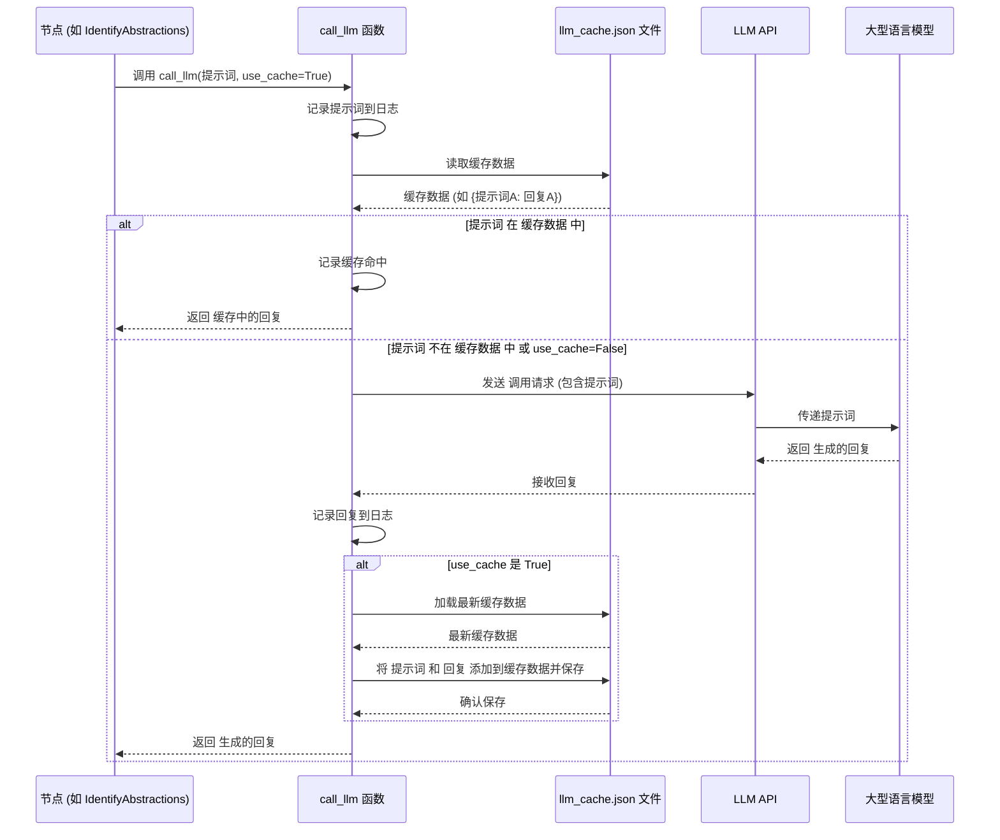

# Chapter 7: 大模型调用工具 (LLM Calling Utility)

欢迎回到 `Tutorial-Codebase-Knowledge` 项目教程！在之前的章节中，我们一起学习了如何从代码库[收集文件](01_代码抓取与文件收集__code_crawling_and_file_collection__.md)、[识别核心概念](02_核心概念识别__core_concept_identification__.md)、[分析概念关系](03_概念关系分析__concept_relationship_analysis__.md)、[编排章节顺序](04_章节顺序编排__chapter_ordering__.md)，并最终[撰写出了完整的章节内容](05_章节内容写作__chapter_content_writing__.md)，最后将所有这些成果进行了[文件整合](06_教程文件整合__tutorial_file_integration__.md)。

在整个过程中，你可能已经注意到，我们反复提到了一个关键的“助手”——**大型语言模型 (LLM)**，并且在许多节点（比如概念识别、关系分析、章节写作）的 `exec` 方法中，都有调用一个名为 `call_llm` 的函数。

今天，我们将聚焦这个在幕后默默工作的核心工具：**大模型调用工具**。它不是一个流程步骤，但却是让整个流程能够“思考”和“写作”的**基础设施**。

## 这是什么？为什么需要它？

想象一下，你的项目需要经常向一位住在远方的“AI专家”咨询各种问题（发送提示词），并获取他们的建议（接收生成的回复）。这些专家可能来自不同的“咨询公司”（不同的LLM服务提供商，比如 Google Gemini、Anthropic Claude 或 OpenAI）。每个公司可能有自己独特的“电话号码”（API 地址）、“沟通方式”（API 调用格式）和“收费标准”（认证方式）。

如果你每次咨询都要记住不同公司的电话、了解他们的沟通细节，并在自己的代码里处理所有这些差异，那将非常繁琐和容易出错。而且，有些问题你可能之前已经问过并且得到了满意的回答，你不想每次都重新咨询并等待回复。

“大模型调用工具”就扮演了你的**专属“AI热线”**的角色。

它的主要目标是：

1.  提供一个**统一的接口（`call_llm` 函数）**，无论底层使用的是哪家公司的AI专家，你都可以用同样的方式向他们发送问题并接收回复。
2.  负责处理底层与不同AI服务商沟通的所有**技术细节**（比如构建API请求、处理认证、发送和接收数据）。
3.  提供**日志记录**功能，记录每一次发送的问题和接收的回复，方便你回顾和调试。
4.  提供简单的**缓存**功能，如果你问了同一个问题，它可以直接从之前的记录中找到答案返回，而无需再次等待AI专家的回复，这可以大大提高效率并节省成本。

有了这个工具，项目中需要与LLM交互的部分（比如我们的概念识别、章节写作节点）就不需要关心底层的复杂性，它们只需要准备好问题（提示词），然后调用 `call_llm` 函数即可。这让我们的核心业务逻辑（节点代码）变得更加简洁、清晰。

## 代码中的实现：`utils/call_llm.py` 文件

在我们的项目代码中，负责实现“大模型调用工具”功能的主要是 `utils/call_llm.py` 文件中的 `call_llm` 函数。

让我们看看这个文件中的关键部分：

```python
# snippets/utils/call_llm.py
import os
import logging
import json
from datetime import datetime
# 导入具体的LLM服务提供商库 (根据实际使用的模型不同，这里会有不同的导入)
from google import genai 

# 配置日志记录
log_directory = os.getenv("LOG_DIR", "logs") # 从环境变量获取日志目录，默认为 'logs'
os.makedirs(log_directory, exist_ok=True) # 创建日志目录，如果不存在
# 根据当前日期生成日志文件名
log_file = os.path.join(log_directory, f"llm_calls_{datetime.now().strftime('%Y%m%d')}.log")

# 设置日志记录器
logger = logging.getLogger("llm_logger") # 获取一个名为 "llm_logger" 的记录器
logger.setLevel(logging.INFO) # 设置日志级别为 INFO (记录信息、警告、错误)
logger.propagate = False  # 阻止日志事件传播到根记录器
file_handler = logging.FileHandler(log_file) # 创建一个文件处理器
# 设置日志格式：时间 - 日志级别 - 消息
file_handler.setFormatter(logging.Formatter('%(asctime)s - %(levelname)s - %(message)s')) 
logger.addHandler(file_handler) # 将文件处理器添加到记录器中

# 简单的缓存文件配置
cache_file = "llm_cache.json" # 缓存文件名

# 这是核心的 LLM 调用函数
# 默认使用 Google Gemini 2.5 Pro 模型，因为它在代码理解方面表现出色
def call_llm(prompt: str, use_cache: bool = True) -> str:
    # 记录发送的提示词
    logger.info(f"PROMPT: {prompt}")
    
    # 如果启用了缓存 (默认是启用的)
    if use_cache:
        # 尝试从缓存文件加载缓存数据
        cache = {}
        if os.path.exists(cache_file):
            try:
                with open(cache_file, 'r') as f:
                    cache = json.load(f) # 缓存数据是 JSON 格式的字典 {prompt: response}
            except:
                # 如果加载缓存失败，打印警告并使用空缓存
                logger.warning(f"Failed to load cache, starting with empty cache")
        
        # 检查当前提示词是否已经在缓存中
        if prompt in cache:
            # 如果在缓存中找到，记录并返回缓存中的回复
            logger.info(f"RESPONSE: {cache[prompt]}")
            return cache[prompt]
    
    # 如果缓存未命中或未启用，则调用实际的 LLM
    # 使用 Google Vertex AI 客户端
    client = genai.Client(
        vertexai=True, 
        # TODO: 更改为你自己的项目 ID 和区域
        # 从环境变量获取项目 ID 和区域，如果未设置则使用默认占位符
        project=os.getenv("GEMINI_PROJECT_ID", "your-project-id"), 
        location=os.getenv("GEMINI_LOCATION", "us-central1")
    )
    # 你也可以注释掉上面使用 Vertex AI 的方式，改为使用 AI Studio 的 API Key 方式：
    # client = genai.Client(
    #     api_key=os.getenv("GEMINI_API_KEY", "your-api_key"), # 从环境变量获取 API Key
    # )
    # 从环境变量获取要使用的模型名称，默认为 gemini-2.5-pro-exp-03-25
    model = os.getenv("GEMINI_MODEL", "gemini-2.5-pro-exp-03-25") 
    
    # 调用模型生成内容
    response = client.models.generate_content(
        model=model,      # 指定模型
        contents=[prompt] # 发送提示词列表 (这里只有一个提示词)
    )
    response_text = response.text # 提取生成的文本回复
    
    # 记录接收到的回复
    logger.info(f"RESPONSE: {response_text}")
    
    # 如果启用了缓存，更新并保存缓存
    if use_cache:
        # 再次加载缓存以避免在程序运行期间被其他地方覆盖
        cache = {}
        if os.path.exists(cache_file):
            try:
                with open(cache_file, 'r') as f:
                    cache = json.load(f)
            except:
                pass # 如果加载失败，忽略错误，用空缓存继续
        
        # 将当前提示词和回复添加到缓存中
        cache[prompt] = response_text 
        try:
            with open(cache_file, 'w') as f:
                json.dump(cache, f) # 将更新后的缓存保存到文件
        except Exception as e:
            # 如果保存缓存失败，记录错误
            logger.error(f"Failed to save cache: {e}")
    
    return response_text # 返回 LLM 的文本回复

# 文件中可能还包含其他模型的调用函数 (如 Claude, OpenAI)，但它们通常被注释掉，
# 只保留一个活跃的 call_llm 实现。这里的简化示例只展示了 Gemini 的实现。

# if __name__ == "__main__": 部分是用于测试 call_llm 函数的示例代码
if __name__ == "__main__":
    test_prompt = "你好，你怎么样？" # 测试提示词 (中文示例)
    
    # 第一次调用 - 应该会调用实际的 LLM (如果缓存中没有)
    print("正在进行 LLM 调用...")
    # 禁用缓存进行首次测试，确保实际调用发生
    response1 = call_llm(test_prompt, use_cache=False) 
    print(f"回复: {response1}")
    
    # 如果启用缓存，第二次调用同一个提示词应该会从缓存中快速返回
    # print("\n再次使用缓存调用...")
    # response2 = call_llm(test_prompt, use_cache=True) # 这次启用缓存
    # print(f"回复: {response2}")
```

### 工作原理详解

`call_llm` 函数的核心逻辑如下：

1.  **接收输入**：它接收一个字符串 `prompt`（要发送给LLM的问题）和一个布尔值 `use_cache`（是否使用缓存，默认为 True）。
2.  **记录提示词**：无论是使用缓存还是调用LLM，它首先使用配置好的 `logger` 将接收到的 `prompt` 记录到日志文件中。
3.  **检查缓存**：如果 `use_cache` 为 True，它会尝试打开一个名为 `llm_cache.json` 的文件，加载之前保存的缓存数据（一个 `{提示词: 回复}` 的字典）。然后，它检查当前的 `prompt` 是否存在于这个字典的键中。
4.  **缓存命中**：如果 `prompt` 在缓存中找到了对应的回复，它会记录这次缓存命中，并立即返回缓存中的回复文本，**不会**调用实际的LLM API。
5.  **缓存未命中/禁用缓存**：如果 `prompt` 不在缓存中，或者 `use_cache` 为 False，函数会继续执行，准备调用实际的LLM。
6.  **调用 LLM API**：
    *   它使用预设好的配置（比如 Google Vertex AI 项目ID和区域，或者 API Key）创建一个LLM客户端对象 (`genai.Client`)。这些配置通常从环境变量中读取，方便切换和保护敏感信息。
    *   它指定要使用的模型名称（例如 `gemini-2.5-pro-exp-03-25`），模型名称也可以通过环境变量配置。
    *   它调用客户端的方法 (`client.models.generate_content`)，将 `prompt` 发送给指定的LLM模型。
7.  **接收回复**：等待LLM处理完毕，函数接收到LLM返回的响应，并提取出其中的文本内容 (`response.text`)。
8.  **记录回复**：将接收到的回复文本记录到日志文件中。
9.  **更新缓存**：如果 `use_cache` 为 True，函数会将当前的 `prompt` 和对应的 `response_text` 添加到缓存字典中，然后尝试将更新后的缓存字典保存回 `llm_cache.json` 文件，以便后续使用。
10. **返回回复**：最终，函数返回从LLM（或缓存）获得的回复文本。

### 日志和缓存的重要性

*   **日志 (`llm_calls_YYYYMMDD.log`)**：这个文件记录了每一次 LLM 交互的原始提示词和回复。当你发现某个章节或概念的生成效果不理想时，你可以查看日志，了解发送给 LLM 的具体提示词是什么，以及 LLM 返回的原始回复是什么，这对于调试提示词或理解 LLM 的行为非常有帮助。
*   **缓存 (`llm_cache.json`)**：这个文件保存了所有已知的提示词及其对应的回复。当工作流中的某个节点需要多次向 LLM 发送同一个提示词时（例如，在开发调试过程中，你反复运行同一个节点的流程），`call_llm` 会直接从 `llm_cache.json` 中快速返回结果，而无需每次都调用远程 API，这不仅节省时间（LLM API 调用通常需要几秒到几十秒），还能节省潜在的 API 费用。

### 简化序列图：调用 LLM 的过程

`call_llm` 函数内部的逻辑，特别是如何与缓存和实际LLM交互，可以用下面的序列图来简化表示：



这张图清晰地展示了 `call_llm` 如何作为中间层，根据是否使用缓存以及缓存是否命中，决定是直接返回本地缓存的结果，还是与远程的 LLM API 进行交互来获取回复。

## 总结

在这一章中，我们学习了“大模型调用工具”的概念。它不是工作流程中的一个特定步骤，而是整个项目中与外部大型语言模型交互的**基础设施**。它提供了一个统一且易用的 `call_llm` 函数，负责处理底层API调用、日志记录和缓存等复杂性。

我们详细了解了在项目代码中，`utils/call_llm.py` 文件中的 `call_llm` 函数是如何工作的：它如何接收提示词、如何根据 `use_cache` 参数检查和使用本地缓存、如何在缓存未命中时调用实际的LLM API、如何记录每一次交互到日志文件，以及如何将新的交互结果保存回缓存。我们还通过一个简化的序列图展示了 `call_llm` 函数内部的逻辑流程。

这个工具使得项目中的各个节点（比如 IdentifyAbstractions, AnalyzeRelationships, OrderChapters, WriteChapters）能够专注于它们各自的业务逻辑，而无需关心底层LLM的具体实现细节，大大提高了代码的可读性和可维护性。它就像是项目的“大脑”与外部“AI专家”沟通的专用、高效且有记录的“热线”。

我们现在已经了解了构建整个教程流程的关键部分，包括如何与我们强大的AI助手进行交互。在下一章，我们将把这些独立的节点串联起来，看看它们是如何组成一个完整的“智能体工作流框架”，让整个教程生成过程自动运行起来的。

---

下一章：[智能体工作流框架](08_智能体工作流框架__agent_workflow_framework__.md)

---

Generated by [AI Codebase Knowledge Builder](https://github.com/The-Pocket/Tutorial-Codebase-Knowledge)