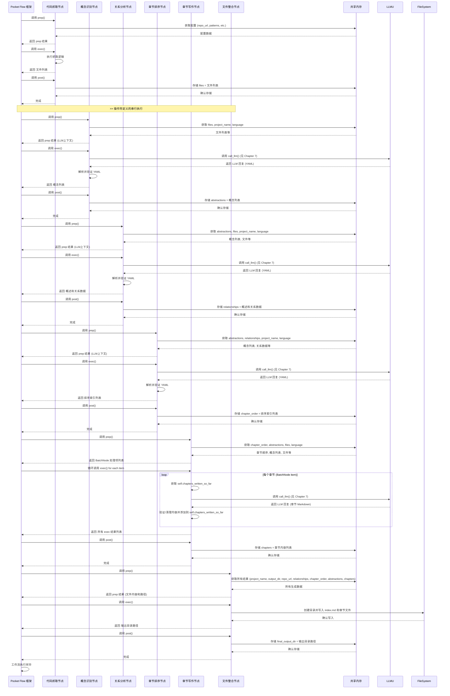

# Chapter 8: 智能体工作流框架 (Agent Workflow Framework)


好的，这是一篇关于“智能体工作流框架”的教程章节，完全使用中文编写。

```markdown
# Chapter 8: 智能体工作流框架 (Agent Workflow Framework)

欢迎回到 `Tutorial-Codebase-Knowledge` 项目教程！在[上一章：大模型调用工具](07_大模型调用工具__llm_calling_utility__.md)中，我们深入了解了那个隐藏在幕后、帮助项目与大型语言模型（LLM）顺畅沟通的关键工具。我们看到了它是如何处理复杂的API调用、日志记录和缓存，让各个功能模块（节点）可以专注于自身的任务。

现在，我们已经探讨了教程生成过程中的每一个独立步骤（从代码抓取到文件整合），也了解了其中一个重要的基础设施（LLM调用工具）。但这些独立的“工人”和“工具”是如何协同工作，形成一个自动化流程的呢？

这就引出了我们本章要讨论的核心概念，也是项目的**总指挥部**和**自动化流水线**：**智能体工作流框架 (Agent Workflow Framework)**。

## 这是什么？为什么需要它？

想象一下，你有一个复杂的项目，需要完成一系列相互依赖的任务：先要收集资料，然后分析资料找出重点，接着整理重点之间的关系，排好学习顺序，最后根据顺序写出文章并整合发布。每一个步骤都需要特定的技能和工具。

如果手动完成这些步骤，你需要一个人一步步地执行：先运行收集脚本，等待它完成；然后运行分析脚本，等待它完成；再运行排序脚本，等待完成；最后运行写作和整合脚本。整个过程既耗时又容易出错，一旦某个步骤失败，你需要手动处理并重新开始。

“智能体工作流框架”就像是这个项目的**总指挥部**和**自动化生产线**。

它的主要目标是：

1.  **定义和连接任务**：它提供一种方式来定义每一个独立的任务（我们称之为“节点”），并明确这些任务之间应该如何按照特定的顺序或依赖关系执行。
2.  **自动化执行**：一旦工作流被定义，框架可以自动按照定义的顺序执行每一个任务，无需人工干预。
3.  **管理数据流动**：框架负责在不同任务之间传递和共享数据，确保一个任务的输出可以作为下一个任务的输入。在我们的项目中，这个数据共享是通过 `shared` 内存来实现的。
4.  **处理错误和重试**：一个健壮的框架通常还提供错误处理、任务重试等机制，提高整个流程的稳定性。
5.  **模块化和可扩展性**：将每个任务封装成独立的节点，使得工作流易于理解、修改和扩展。你可以轻松地替换某个节点的实现，或者在流程中插入新的节点。

在我们的 `Tutorial-Codebase-Knowledge` 项目中，我们使用了 **Pocket Flow** 这个轻量级的 Python 框架来作为智能体工作流框架。它将我们在前面章节讨论的每一个功能（`FetchRepo`、`IdentifyAbstractions` 等）都实现为一个独立的“节点”，然后由 Pocket Flow 框架负责将这些节点串联起来，形成一个完整的、自动化的教程生成工作流。

## 代码中的实现：`flow.py` 文件

在我们的项目代码中，负责定义和连接这些节点、构建整个工作流的，主要是根目录下的 `flow.py` 文件。

让我们看看 `flow.py` 的关键部分：

```python
# snippets/flow.py
from pocketflow import Flow
# 从 nodes.py 文件导入所有节点类
from nodes import (
    FetchRepo,
    IdentifyAbstractions,
    AnalyzeRelationships,
    OrderChapters,
    WriteChapters,
    CombineTutorial
)

def create_tutorial_flow():
    """创建并返回代码库教程生成工作流"""

    # 实例化各个节点
    fetch_repo = FetchRepo() # 抓取代码节点
    # 实例化 LLM 相关节点时，可以配置失败重试次数和等待时间
    identify_abstractions = IdentifyAbstractions(max_retries=5, wait=20) # 识别概念节点
    analyze_relationships = AnalyzeRelationships(max_retries=5, wait=20) # 分析关系节点
    order_chapters = OrderChapters(max_retries=5, wait=20) # 章节排序节点
    write_chapters = WriteChapters(max_retries=5, wait=20) # 章节写作节点 (注意是 BatchNode)
    combine_tutorial = CombineTutorial() # 整合文件节点

    # 按照设计好的顺序连接各个节点 (使用 >> 操作符)
    fetch_repo >> identify_abstractions # 先抓取，然后识别概念
    identify_abstractions >> analyze_relationships # 识别概念后，分析关系
    analyze_relationships >> order_chapters # 分析关系后，决定章节顺序
    order_chapters >> write_chapters # 确定顺序后，撰写章节内容
    write_chapters >> combine_tutorial # 所有章节写完后，整合文件

    # 创建工作流实例，指定第一个节点
    tutorial_flow = Flow(start=fetch_repo)

    return tutorial_flow

# 在项目的主入口点 (通常是 run.py 或 main.py) 中会调用 create_tutorial_flow() 获取工作流，
# 然后调用 tutorial_flow.run() 方法来启动整个自动化流程。
```

### 工作原理详解

`flow.py` 文件中的 `create_tutorial_flow` 函数展示了如何使用 Pocket Flow 框架定义工作流：

1.  **导入节点类**：首先，它从 `nodes.py` 文件中导入了所有代表独立任务的节点类 (`FetchRepo`, `IdentifyAbstractions`, etc.)。
2.  **实例化节点**：接着，它创建了这些节点类的实例。每个实例都代表了工作流中的一个具体步骤。注意，对于依赖于外部服务（如 LLM）的节点，实例化时可以传入参数，比如 `max_retries`（最大重试次数）和 `wait`（重试等待时间），这些是 Pocket Flow 框架提供的内置容错机制。`WriteChapters` 被实例化为 `BatchNode`，正如我们在[第五章：章节内容写作](05_章节内容写作__chapter_content_writing__.md)中讨论的，它用于处理一个列表中的每一个项（即每一个章节）。
3.  **连接节点**：这是定义工作流序列的核心部分。Pocket Flow 框架允许使用简单的 `>>` 操作符来连接节点，表示“左边的节点执行完成后，接下来执行右边的节点”。例如，`fetch_repo >> identify_abstractions` 表示 `FetchRepo` 节点必须在 `IdentifyAbstractions` 节点之前成功完成。如果一个节点有多个后续节点，可以使用 `>>` 连接到包含所有后续节点的列表，例如 `node1 >> [node2, node3]`（表示 `node1` 完成后可以并行执行 `node2` 和 `node3`）。在我们的教程生成流程中，任务是严格串行的，所以使用了简单的链式连接。
4.  **创建工作流实例**：最后，使用 `Flow` 类创建一个工作流实例，并将第一个要执行的节点 (`fetch_repo`) 作为 `start` 参数传递进去。

创建好 `tutorial_flow` 实例后，在项目的主运行文件中（例如 `run.py`），会通过调用 `tutorial_flow.run(shared_memory=...)` 方法来启动整个工作流。此时，Pocket Flow 框架就会接管控制权，按照定义的连接顺序，依次执行每个节点的 `prep`、`exec` 和 `post` 方法，并管理 `shared` 内存中的数据流动。

### 整个工作流的执行流程 (序列图)

将我们在前几章看到的各个节点串联起来，整个教程生成工作流的执行流程可以清晰地展示出来：



这张图清晰地展示了整个流程中，Pocket Flow 框架作为协调者，如何按照 `flow.py` 中定义的顺序，依次调用每个节点的 `prep`、`exec` 和 `post` 方法。每个节点完成任务后，将结果存储到 `shared` 共享内存中，以便下一个节点能够获取这些结果作为输入。特别是 `WriteChapters` 作为 BatchNode，框架会循环调用它的 `exec` 方法来处理每一个章节。最终，当 `CombineTutorial` 节点完成文件写入后，整个自动化教程生成流程就结束了。

## 总结

在这一章中，我们学习了“智能体工作流框架”的概念，以及我们的项目如何使用 Pocket Flow 这个轻量级框架来实现它。我们了解到，框架就像是项目的“总指挥部”和“自动化生产线”，它负责定义、连接和自动执行由各个独立任务（节点）组成的整个教程生成流程。

我们详细查看了 `flow.py` 文件，看到了如何通过实例化我们在前几章讨论的各种节点，并使用简单的 `>>` 操作符来指定它们的执行顺序，从而构建起一个完整的工作流。我们还通过一个详细的序列图，回顾了整个流程中框架是如何协调各个节点的执行，以及数据是如何通过 `shared` 内存从一个节点流向下一个节点的。

正是这个智能体工作流框架，将原本需要手动一步步执行的复杂过程，转化为了一个可以一键启动、自动运行的流畅管道。它提高了效率，减少了错误，并使得整个项目结构更加清晰、易于维护和扩展。

至此，我们已经完整地走过了 `Tutorial-Codebase-Knowledge` 项目从抓取代码到生成可读教程的整个流程。希望这个教程能帮助你理解这个项目的核心概念、它们是如何通过智能体协同工作，以及这个流程的各个组成部分是如何在代码中实现的。

感谢你的阅读！祝你在探索和使用这个项目中获得乐趣！
```

---

Generated by [AI Codebase Knowledge Builder](https://github.com/The-Pocket/Tutorial-Codebase-Knowledge)