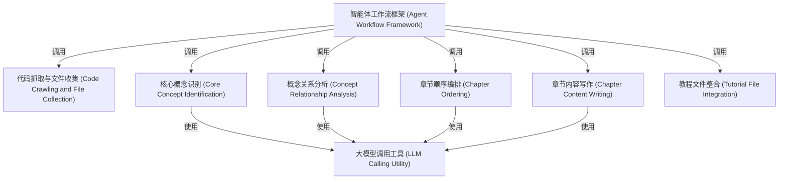

# Tutorial: Tutorial-Codebase-Knowledge

这是一个教程自动生成项目。它首先从代码库**抓取文件**（代码抓取与文件收集），然后利用**大模型调用工具**（大模型调用工具）**识别**（核心概念识别）项目中的核心**概念**并**分析**（概念关系分析）它们之间的**关系**。接着，它根据这些关系**编排章节顺序**（章节顺序编排），并调用大模型**撰写**（章节内容写作）每一章的详细**教程内容**。最后，将所有章节**整合**（教程文件整合）成完整的教程文件。整个过程由轻量级的**智能体工作流框架**（智能体工作流框架）**协调**和驱动。

**Source Repository:** [https://github.com/The-Pocket/Tutorial-Codebase-Knowledge](https://github.com/The-Pocket/Tutorial-Codebase-Knowledge)

## Chapters

1. [代码抓取与文件收集 (Code Crawling and File Collection)
](01_代码抓取与文件收集__code_crawling_and_file_collection__.md)
2. [核心概念识别 (Core Concept Identification)
](02_核心概念识别__core_concept_identification__.md)
3. [概念关系分析 (Concept Relationship Analysis)
](03_概念关系分析__concept_relationship_analysis__.md)
4. [章节顺序编排 (Chapter Ordering)
](04_章节顺序编排__chapter_ordering__.md)
5. [章节内容写作 (Chapter Content Writing)
](05_章节内容写作__chapter_content_writing__.md)
6. [教程文件整合 (Tutorial File Integration)
](06_教程文件整合__tutorial_file_integration__.md)
7. [大模型调用工具 (LLM Calling Utility)
](07_大模型调用工具__llm_calling_utility__.md)
8. [智能体工作流框架 (Agent Workflow Framework)
](08_智能体工作流框架__agent_workflow_framework__.md)

---

Generated by [AI Codebase Knowledge Builder](https://github.com/The-Pocket/Tutorial-Codebase-Knowledge)