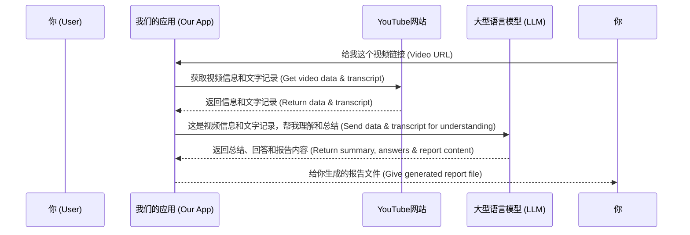

# Chapter 1: 项目核心

嗨！欢迎来到这个教程！

你有没有遇到过这种情况：想学习某个新知识，朋友发给你一个超棒的 YouTube 视频链接，点开一看... 哇！竟然有足足5个小时！🤯 你很想看，但又完全没时间坐下来看完这么长的视频。

别担心！这就是我们这个小项目想解决的问题。想象一下，你有一个特别聪明的朋友，你把这个5小时的视频链接发给他，然后说：“嘿，哥们，帮我看看这个视频讲了啥？重点是啥？用我能听懂的方式讲给我听，就像讲给5岁小孩那样！”

这个项目，**项目核心** 就是要扮演你这个“聪明朋友”的角色！它的**核心目标**是：

接收一个超长 YouTube 视频的链接，然后帮你快速理解视频的**核心内容**，提炼出重要的**主题**，回答你可能有的**问题**，最后用**超级简单易懂**（就像讲给5岁小孩听）的方式告诉你。

这样一来，原本需要几个小时甚至一天才能看完的视频，你可能只需要几分钟，甚至几十秒就能掌握它的精髓！是不是很酷？

## 这个“聪明朋友”是怎么工作的？（高层次概念）

简单来说，这个“聪明朋友”收到你的视频链接后，会做几件事：

1.  它会去“听”视频（或者更准确地说，获取视频的文字记录）。
2.  它会“阅读”这些文字记录，找出里面的重要信息。
3.  它会用它那聪明的大脑（也就是**大型语言模型 LLM**，一种强大的AI）来理解这些信息。
4.  然后，它会把复杂的信息转化成简单的话，回答你的问题，或者告诉你视频的重点是什么。
5.  最后，它把这些简单明了的结果整理成一份报告给你。

这就是我们这个项目的**项目核心** —— 成为你的YouTube视频智能小助手，让你轻松理解复杂内容。

## 如何使用这个“聪明朋友”？

使用这个项目非常简单。你需要做的是：

1.  准备好你想要理解的 YouTube 视频链接。
2.  运行我们提供的程序（这个程序就是你的“聪明朋友”）。
3.  把视频链接告诉程序。
4.  等待一会儿，“聪明朋友”处理完后，会给你一份报告文件。

你可以看看项目主页的 `README.md` 文件，里面有如何运行这个程序的简单说明。通常就像这样（这是从 `README.md` 中提取的运行命令）：

```bash
python main.py --url "https://www.youtube.com/watch?v=example"
```

这行命令的意思是，运行 `main.py` 这个文件，并且告诉它你要处理的视频链接是 `"https://www.youtube.com/watch?v=example"`。如果你不提供链接，程序也会问你要。

程序运行结束后，它会生成一个 `output.html` 文件，这个文件就是“聪明朋友”给你的报告！

## 代码中的“聪明朋友”入口

我们的程序从 `main.py` 文件开始运行。这个文件就像是“聪明朋友”接待你的地方。你把视频链接交给它，它就开始安排后续的工作。

让我们看一下 `main.py` 文件中最核心的一小部分代码：

```python
import argparse
import logging
import sys
import os
from flow import create_youtube_processor_flow # 引入后续章节会讲到的处理流程

# ... (日志设置和其他导入代码省略) ...

def main():
    """Main function to run the YouTube content processor."""
    
    # 解析命令行参数，获取用户输入的URL
    parser = argparse.ArgumentParser(...)
    parser.add_argument(
        "--url", 
        type=str, 
        help="YouTube video URL to process",
        required=False
    )
    args = parser.parse_args()
    
    # 如果用户没提供URL，就提示用户输入
    url = args.url
    if not url:
        url = input("请输入要处理的YouTube视频链接: ") # 提示用户输入中文

    logger.info(f"Starting YouTube content processor for URL: {url}") # 记录日志

    # 创建整个处理流程（就像叫醒“聪明朋友”，告诉它要工作了）
    flow = create_youtube_processor_flow()
    
    # 准备一个共享的“工作空间”，把视频链接放进去
    shared = {
        "url": url 
    }
    
    # 让“聪明朋友”（flow）开始工作，并把工作空间给它
    flow.run(shared)
    
    # 工作完成后，告诉用户结果在哪里
    print("\n" + "=" * 50)
    print("处理成功完成！") # 处理完成中文提示
    print(f"输出HTML文件: {os.path.abspath('output.html')}") # 输出文件路径中文提示
    print("=" * 50 + "\n")

    return 0

if __name__ == "__main__":
    sys.exit(main())
```

这段代码看起来可能有点多，但你只需要关注几个地方：

1.  程序首先会想办法拿到你要处理的 `url`（视频链接）。
2.  然后它调用 `create_youtube_processor_flow()` 创建了一个 `flow` 对象。你可以把 `flow` 理解为“聪明朋友”完成任务的整个行动计划或流程。
3.  它准备了一个叫做 `shared` 的地方，把 `url` 放进去，就像给“聪明朋友”一个任务清单和一个放资料的文件夹。
4.  最后，最重要的！它调用 `flow.run(shared)`，这就像是按下启动按钮，告诉“聪明朋友”：“好的，带着这个链接，按照你计划好的步骤开始干活吧！”

接下来的所有复杂工作，都会在这个 `flow.run(shared)` 内部完成。

## “聪明朋友”内部流程是什么样的？

虽然我们刚刚看了 `main.py` 是怎么启动流程的，但“聪明朋友”真正怎么一步步处理视频、获取信息、用AI理解、最后生成报告，这些细节是怎么样的呢？

我们可以用一个简单的图来模拟一下这个过程。想象一下你、我们的应用（“聪明朋友”）、YouTube 网站和大型语言模型（LLM，AI的大脑）之间的互动：



这个图展示了核心的四个参与者以及他们之间传递信息的主要流程。我们的应用就像一个中间人，接收你的请求，去YouTube获取原始材料，把原始材料喂给强大的AI（LLM）进行处理，最后把AI处理好的结果呈现给你。

在后续的章节中，我们会详细拆解 `flow.run()` 内部的每一步是如何实现的，比如：

*   [处理流程](02_处理流程_.md)：我们会深入看看 `flow` 这个“行动计划”具体包含了哪些步骤。
*   [视频信息提取](04_视频信息提取_.md)：我们会学习“聪明朋友”是怎么从YouTube网站拿到视频的文字记录等有用信息的。
*   [智能问答助手](05_智能问答助手_.md)：我们会了解AI（LLM）是怎样理解视频内容并回答问题的。
*   [报告生成器](06_报告生成器_.md)：我们会看到最后的结果是怎么被整理成一份漂亮的HTML报告的。

## 总结

在本章中，我们理解了项目的**核心理念**：创建一个智能小助手，帮助你快速理解 YouTube 长视频，就像一个把复杂内容用简单方式讲给你的“聪明朋友”。我们看到了如何通过简单的命令启动这个程序，并初步了解了它从接收链接到生成报告的高层级工作流程。

接下来，我们将更深入地探索这个“聪明朋友”的具体“行动计划”，看看它是如何一步步完成任务的。

准备好了吗？让我们前往下一章，看看整个**处理流程**是怎样的吧！

[处理流程](02_处理流程_.md)

---

Generated by [AI Codebase Knowledge Builder](https://github.com/The-Pocket/Tutorial-Codebase-Knowledge)