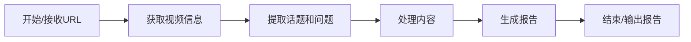

# Chapter 2: 处理流程

你好！欢迎来到这个教程的第二章！

在上一章 [项目核心](01_项目核心_.md) 中，我们认识了我们的小助手——那个能帮你快速理解YouTube长视频的“聪明朋友”。我们知道它的**核心目标**是接收一个视频链接，然后告诉你视频的重点是什么，就像把复杂内容用简单的话讲给一个5岁小孩听一样。我们还看了 `main.py` 文件，知道它是如何接收你的视频链接，然后**启动**整个工作的。

但是，“聪明朋友”到底是怎么一步一步完成这个任务的呢？它收到链接后，大脑里发生了什么？这就是我们这一章要深入探讨的——**处理流程**。

## 什么是“处理流程”？

想象一下，你不是把一个复杂的任务一口气丢给一个人完成，而是把它分解成几个更小、更简单的步骤，然后让不同的人或机器按照特定的顺序来完成这些步骤。这就是一个“流程”。

在我们的项目中，“处理流程”就像是“聪明朋友”完成任务的**自动化流水线**或者**指挥中心**。它定义了从你输入视频链接到最后生成报告的整个过程中，所有的任务是如何被分解、组织，以及按什么顺序一步一步完成的。

为什么我们需要这样一个流程呢？

*   **管理复杂性：** 把一个大问题分解成小问题，每个小问题更容易解决。
*   **确保顺序：** 某些步骤必须先完成，才能进行下一步（比如，必须先获取视频文本，才能分析文本内容）。流程确保了这些步骤按照正确的顺序执行。
*   **易于构建和维护：** 每个步骤（或者说“工人”）只需要做好自己的本职工作，不需要知道整个流程的所有细节。这使得构建和修改项目变得更容易。

我们的项目使用了叫做 **Pocket Flow** 的框架来构建这个“处理流程”。你可以把 Pocket Flow 想象成一个搭积木的工具，它提供了一些“积木块”（我们称为 **Node**），你可以把这些积木块连接起来，形成一个完整的“流程”（称为 **Flow**）。

## 流程中的基本概念

使用 Pocket Flow 来构建流程时，我们需要理解几个基本概念：

1.  **Flow (流程):** 这是整个任务的执行计划。它由一个或多个 **Node** 连接而成，定义了任务的开始、中间步骤和结束。你可以把 Flow 想象成整个流水线的设计图。
2.  **Node (节点):** 这是流程中的一个独立步骤或一个工人站。每个 Node 负责完成一个特定的任务，比如“获取视频信息”是一个 Node，“分析文本”是另一个 Node，“生成报告”又是另一个 Node。
3.  **Shared Data (共享数据):** Node 之间如何传递信息呢？它们通过一个共享的空间来交换数据。你可以把 Shared Data 想象成一个放在流水线旁的“共享文件夹”或“剪贴板”。一个 Node 完成任务后，把结果放到共享数据里；下一个 Node 需要这些结果时，就从共享数据里拿。
4.  **Connection (连接 `>>`):** 如何决定 Node 的执行顺序？我们通过 `>>` 符号来连接 Node，表示一个 Node 执行完毕后，下一个 Node 才能开始。比如 `NodeA >> NodeB` 表示 NodeA 先执行，然后 NodeB 执行。

## 我们的处理流程是什么样的？

回想一下我们的任务：输入一个YouTube视频链接，得到一份摘要报告。根据这个任务，我们可以将它分解成几个主要的步骤或 Node：

1.  **获取视频信息 (ProcessYouTubeURL Node):** 这是第一个步骤。它接收你提供的视频URL，然后去YouTube网站获取视频的标题、封面图以及最重要的——**文字记录 (transcript)**。
2.  **提取话题和问题 (ExtractTopicsAndQuestions Node):** 拿到视频的文字记录后，这个 Node 就开始“阅读”文字记录。它会利用强大的人工智能（LLM）来找出视频中讨论的**主要话题**，并针对每个话题生成一些启发性的**问题**。
3.  **处理内容 (ProcessContent Node):** 上一步找到了话题和问题，但它们可能还比较技术或复杂。这个 Node 会针对找到的每个话题和问题，再次使用人工智能（LLM），将话题标题和问题**重新表达**得更简单易懂（就像给5岁小孩听一样），并提供简单明了的**回答**。
4.  **生成报告 (GenerateHTML Node):** 最后一步！拿到简化后的所有话题、问题和回答后，这个 Node 将这些信息以及视频的标题、封面图等，整理成一份漂亮的**HTML格式的报告文件**。

这就是我们的“聪明朋友”完成任务的四个主要 Node，它们会按照上面列出的顺序一步一步执行。

我们可以用一个简单的图来表示这个流程的顺序：



这个图清晰地展示了任务是如何一步步从开始走到结束的。每个方框代表流程中的一个主要步骤，箭头表示执行的顺序。

## 在代码中看到流程

那么，在我们的项目代码中，这个流程是如何被构建出来的呢？

还记得上一章 [项目核心](01_项目核心_.md) 中 `main.py` 里启动流程的代码吗？

```python
# ... (代码省略) ...

# 创建整个处理流程
flow = create_youtube_processor_flow()

# 准备一个共享的“工作空间”，把视频链接放进去
shared = {
    "url": url
}

# 让“聪明朋友”（flow）开始工作，并把工作空间给它
flow.run(shared)

# ... (代码省略) ...
```

这里的 `create_youtube_processor_flow()` 函数就是用来构建我们刚才描述的那个流程的。这个函数的实现代码在 `flow.py` 文件中。

让我们看看 `flow.py` 文件中的这部分关键代码（为了简洁，我们只看构建流程的部分）：

```python
# ... (导入及其他代码省略) ...

# 定义流程中的具体 Node (节点) 类
class ProcessYouTubeURL(Node):
    # ... (具体实现细节在后续章节讲解) ...
    pass

class ExtractTopicsAndQuestions(Node):
    # ... (具体实现细节在后续章节讲解) ...
    pass

class ProcessContent(BatchNode): # 注意这里是 BatchNode，后续章节会解释
    # ... (具体实现细节在后续章节讲解) ...
    pass

class GenerateHTML(Node):
    # ... (具体实现细节在后续章节讲解) ...
    pass

# 创建整个流程的函数
def create_youtube_processor_flow():
    """创建并连接 YouTube 处理器的各个 Node"""
    # 1. 创建各个 Node 的实例 (想象成在流水线上安装不同的工作站)
    process_url = ProcessYouTubeURL(max_retries=2, wait=10)
    extract_topics_and_questions = ExtractTopicsAndQuestions(max_retries=2, wait=10)
    process_content = ProcessContent(max_retries=2, wait=10)
    generate_html = GenerateHTML(max_retries=2, wait=10)

    # 2. 连接 Node，定义执行顺序 (想象成用输送带连接工作站)
    process_url >> extract_topics_and_questions >> process_content >> generate_html

    # 3. 创建 Flow (想象成启动整个流水线，指定从哪个工作站开始)
    flow = Flow(start=process_url)

    return flow

# ... (其他代码省略) ...
```

在这段代码中：

*   我们首先定义了几个继承自 `Node` (或 `BatchNode`) 的类，比如 `ProcessYouTubeURL`。这些类就是我们流程中的“积木块”，每个类代表一个具体的任务步骤。具体的实现细节（比如如何获取视频信息）被封装在这些类内部，我们会在后续章节详细讲解。
*   `create_youtube_processor_flow()` 函数是构建流程的核心。
*   在函数内部，我们通过 `ProcessYouTubeURL(...)` 这样的代码**创建**了每个 Node 的**实例**。这就像在流水线上安装了不同的工作站。
*   然后，我们使用了神奇的 `>>` 符号将这些 Node **连接**起来：`process_url >> extract_topics_and_questions >> process_content >> generate_html`。这行代码明确告诉 Pocket Flow：先执行 `process_url`，它完成后执行 `extract_topics_and_questions`，接着执行 `process_content`，最后执行 `generate_html`。这就像是铺设好了工作站之间的输送带。
*   最后，我们调用 `Flow(start=process_url)` **创建**了一个完整的 `Flow` 对象，并指定了流程从 `process_url` 这个 Node 开始。

当你调用 `flow.run(shared)` 时，Pocket Flow 框架就会按照我们定义的顺序，自动调用每个 Node 去执行任务。每个 Node 完成任务后，会把结果更新到我们之前准备好的那个 `shared` 字典（共享数据）里，供下一个 Node 使用。

例如：
*   `process_url` Node 会把获取到的视频信息（包括文字记录）存到 `shared['video_info']` 里。
*   `extract_topics_and_questions` Node 会从 `shared` 里读取 `shared['video_info']`，处理后把话题和问题存到 `shared['topics']` 里。
*   `process_content` Node 会从 `shared` 里读取 `shared['topics']` 和 `shared['video_info']` (需要文字记录来回答问题)，处理后更新 `shared['topics']` 里每个问题的答案。
*   `generate_html` Node 会从 `shared` 里读取 `shared['video_info']` 和更新后的 `shared['topics']`，然后生成最终的HTML报告，并把报告内容存到 `shared['html_output']` 里，同时写入文件。

这个 `shared` 字典就像一个任务进行中的状态记录，信息在 Node 之间流动和积累，直到最终结果生成。

## 总结

在本章中，我们学习了项目如何通过**处理流程**来组织和执行复杂的任务。我们了解到，这个流程就像一个自动化流水线，将整个工作分解为多个有序的步骤（Node）。我们使用了 Pocket Flow 框架来构建这个流程，并通过连接 Node (`>>`) 来定义任务的执行顺序。我们还初步了解了 Node 之间如何通过**共享数据** (`shared`) 来传递信息。

现在，我们已经理解了整个任务的骨架——它的处理流程。接下来，我们将深入到流程中的每一个具体的“工作站”或“Node”中，看看它们是如何完成自己的具体任务的。

下一章，我们将先宏观地回顾一下整个流程中的各个步骤，然后开始详细讲解第一个 Node 是如何工作的。

准备好了吗？让我们进入下一章：[流程步骤](03_流程步骤_.md)！

---

Generated by [AI Codebase Knowledge Builder](https://github.com/The-Pocket/Tutorial-Codebase-Knowledge)