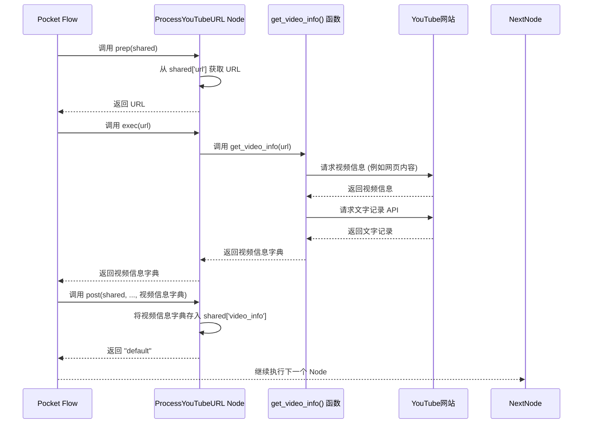

# Chapter 4: 视频信息提取

你好！欢迎来到本教程的第四章！

在上一章 [流程步骤](03_流程步骤_.md) 中，我们学习了构成整个项目**处理流程**的基本单位——**流程步骤**（也就是 Pocket Flow 框架中的 **Node**）。我们知道每个 Node 都像流水线上的一个独立工作站，负责完成一个特定的任务，并通过**共享数据** (`shared`) 与其他 Node 交换信息。我们还初步了解了我们项目中的四个核心 Node。

现在，我们将聚焦于流水线上的**第一个工作站**：**视频信息提取**。

## 为什么需要“视频信息提取”？

想象一下，你的“聪明朋友”收到一个 YouTube 视频链接后，它首先要做什么？它肯定不能直接就开始“理解”和“总结”视频内容，因为它手里只有一串网址！它必须先去 YouTube 网站把真正的内容“拿”回来。

这个“拿”回来的过程，就是**视频信息提取**。它就像是“聪明朋友”去 YouTube 网站“侦查”和“收集证据”。它需要收集以下关键信息：

1.  **视频的唯一编号 (Video ID):** 这是 YouTube 用来标识每个视频的“身份证号”，后续很多操作（比如获取文字记录、生成封面图链接）都需要它。
2.  **视频的标题 (Title):** 这是视频的主题，对理解内容非常重要，也会用在最终的报告中。
3.  **视频的封面图片 URL (Thumbnail URL):** 这个会用在最终的报告中，让报告看起来更直观。
4.  **视频的文字记录 (Transcript):** **这是最重要的一步！** 视频里人们说了什么，都在这个文字记录里。我们的“聪明朋友”——那个强大的大型语言模型（LLM）——就是“阅读”这个文字记录来理解视频内容的。没有文字记录，后续的一切分析都无法进行。

所以，**视频信息提取**是整个项目的**基础**。没有这个步骤，我们就无法获得用于后续智能分析的原始材料。它解决了“从哪里获取原始数据”这个问题。

在我们的项目中，负责这个任务的“工作站”就是 `ProcessYouTubeURL` 这个 Node。

## 如何在流程中使用 `ProcessYouTubeURL` Node？

回想一下 [处理流程](02_处理流程_.md) 中展示的流程图：


这里的“获取视频信息”就是由 `ProcessYouTubeURL` Node 完成的。在 `flow.py` 中构建流程时，我们就是把它放在了第一个位置：

```python
# ... (导入及其他代码省略) ...

from .youtube_processor import get_video_info # 引入负责提取信息的工具函数

# 定义第一个流程步骤 Node
class ProcessYouTubeURL(Node):
    """处理 YouTube URL 以提取视频信息""" # 中文注释：处理 YouTube URL 以提取视频信息
    # ... (Node 的 prep, exec, post 方法定义在下方) ...
    pass # 实际代码这里有实现

# ... (其他 Node 的定义省略) ...

# 创建整个流程的函数
def create_youtube_processor_flow():
    """创建并连接 YouTube 处理器的各个 Node""" # 中文注释：创建并连接 YouTube 处理器的各个 Node
    # 1. 创建各个 Node 的实例
    # 这是第一个 Node，负责处理 URL
    process_url = ProcessYouTubeURL(max_retries=2, wait=10) # 创建 ProcessYouTubeURL 实例
    # ... (创建其他 Node 实例省略) ...
    extract_topics_and_questions = ExtractTopicsAndQuestions(max_retries=2, wait=10)
    process_content = ProcessContent(max_retries=2, wait=10)
    generate_html = GenerateHTML(max_retries=2, wait=10)


    # 2. 连接 Node，定义执行顺序
    # ProcessYouTubeURL 是第一个执行的 Node
    process_url >> extract_topics_and_questions >> process_content >> generate_html

    # 3. 创建 Flow，指定从 process_url 开始
    flow = Flow(start=process_url) # 指定流程从 process_url Node 开始

    return flow

# ... (其他代码省略) ...
```

正如你在代码中看到的，我们创建了 `ProcessYouTubeURL` 的一个实例 `process_url`，并在创建 `Flow` 对象时，通过 `start=process_url` 参数明确指定它为流程的起点。然后，它通过 `>>` 符号连接到下一个 Node (`extract_topics_and_questions`)。

当你通过 `main.py` 运行程序，并调用 `flow.run(shared)` 时，Pocket Flow 框架就会首先调用 `process_url` 这个 Node 来执行其任务。

它的**输入**是什么呢？回想一下 `main.py`，我们将用户提供的视频 `url` 放到了 `shared` 字典里：

```python
# ... (main.py 代码片段) ...
# 准备一个共享的“工作空间”，把视频链接放进去
shared = {
    "url": url # 视频 URL 就在 shared 字典里
}

# 让“聪明朋友”（flow）开始工作
flow.run(shared)
# ... (main.py 代码片段) ...
```

所以，`ProcessYouTubeURL` Node 会从 `shared` 字典中获取 `url` 作为它的原始输入。

它的**输出**是什么呢？它会将提取到的视频信息（标题、文字记录等）存储回 `shared` 字典中，供后续的 Node 使用。具体来说，它会把一个包含这些信息的字典存入 `shared['video_info']`。

## `ProcessYouTubeURL` Node 内部是如何工作的？

现在，让我们像侦探一样，深入 `ProcessYouTubeURL` Node 的内部，看看它是如何完成视频信息提取任务的。

当 Pocket Flow 调用 `process_url` Node 时，它会按照 `prep` -> `exec` -> `post` 的顺序执行其方法：

1.  **`prep` 方法：**
    *   **作用：** 准备 `exec` 方法所需的输入数据。
    *   **在这里：** 它会从传入的 `shared` 字典中查找并取出键为 `"url"` 的值，也就是视频的 URL。
    *   **结果：** `prep` 方法返回提取到的视频 URL 字符串。这个 URL 将作为参数传递给 `exec` 方法。

2.  **`exec` 方法：**
    *   **作用：** 执行 Node 的核心业务逻辑。
    *   **在这里：** 它接收 `prep` 方法返回的 URL。这是进行视频信息提取工作的关键步骤。但是，`ProcessYouTubeURL` Node 本身并不直接“爬取”YouTube 网站，它会调用一个专门负责这个任务的**外部工具函数**。
    *   **调用：** 它会调用一个叫做 `get_video_info()` 的函数来完成实际的提取工作。这个函数封装了与 YouTube 网站交互的细节（比如如何找到标题，如何获取文字记录）。
    *   **结果：** `exec` 方法返回 `get_video_info()` 函数执行后得到的结果，这是一个包含视频信息的字典。

3.  **`post` 方法：**
    *   **作用：** 处理 `exec` 方法返回的结果，并将其存回 `shared` 字典。
    *   **在这里：** 它接收 `exec` 方法返回的视频信息字典。它会把这个字典存储到 `shared` 字典中，使用的键是 `"video_info"`。这样，下一个 Node 就可以通过访问 `shared["video_info"]` 来获取这些信息了。
    *   **结果：** `post` 方法更新了 `shared` 字典。

整个过程可以用下面的时序图表示：



这个图清晰地展示了 `ProcessYouTubeURL` Node 如何与外部工具函数协作，从 YouTube 获取信息，然后将结果传递给 Flow (通过更新 `shared`)，以便流程的下一个步骤可以使用。

## 看代码：`ProcessYouTubeURL` Node 和 `get_video_info` 函数

让我们看看 `flow.py` 文件中 `ProcessYouTubeURL` Node 的具体实现，以及 `utils/youtube_processor.py` 文件中 `get_video_info` 函数的代码。

首先是 `ProcessYouTubeURL` Node 在 `flow.py` 中的代码：

```python
# ... (导入及其他代码省略) ...

from utils.youtube_processor import get_video_info # 引入负责提取信息的工具函数

class ProcessYouTubeURL(Node):
    """处理 YouTube URL 以提取视频信息""" # 中文注释：处理 YouTube URL 以提取视频信息
    def prep(self, shared):
        """从 shared 中获取 URL""" # 中文注释：从 shared 中获取 URL
        # 从 shared 字典中获取 'url' 的值，如果不存在则返回空字符串
        return shared.get("url", "")

    def exec(self, url):
        """提取视频信息""" # 中文注释：提取视频信息
        if not url:
            # 如果 URL 是空的，说明出错了，抛出异常
            raise ValueError("No YouTube URL provided")

        logger.info(f"处理 YouTube URL: {url}") # 记录日志，显示正在处理哪个 URL

        # **** 核心步骤：调用 get_video_info() 函数进行实际提取 ****
        video_info = get_video_info(url)

        if "error" in video_info:
            # 如果 get_video_info 返回的结果里有 'error' 键，说明提取失败，抛出异常
            raise ValueError(f"Error processing video: {video_info['error']}")

        # exec 方法返回提取到的视频信息字典
        return video_info

    def post(self, shared, prep_res, exec_res):
        """将视频信息存储到 shared""" # 中文注释：将视频信息存储到 shared
        # 将 exec 方法返回的视频信息字典存储到 shared['video_info'] 中
        shared["video_info"] = exec_res
        logger.info(f"视频标题: {exec_res.get('title')}") # 记录提取到的视频标题
        logger.info(f"文字记录长度: {len(exec_res.get('transcript', ''))}") # 记录文字记录的长度
        return "default" # Pocket Flow Node 的 post 方法需要返回一个字符串
```
这段代码非常清晰地展示了 `prep`, `exec`, `post` 方法如何协同工作。`prep` 负责输入，`exec` 调用核心工具，`post` 负责输出到 `shared`。注意 `exec` 方法中对 `get_video_info(url)` 的调用，这就是实际执行提取任务的地方。

那么，`get_video_info` 函数又是怎么工作的呢？它的代码在 `utils/youtube_processor.py` 文件里：

```python
# ... (导入必要的库：re用于正则表达式, requests用于网页请求,
#      bs4.BeautifulSoup用于解析HTML, youtube_transcript_api用于获取文字记录) ...
import re
import requests
from bs4 import BeautifulSoup
from youtube_transcript_api import YouTubeTranscriptApi

def extract_video_id(url):
    """从 URL 中提取 YouTube 视频 ID""" # 中文注释：从 URL 中提取 YouTube 视频 ID
    # 使用正则表达式匹配 URL 中的视频 ID 部分
    pattern = r'(?:v=|\/)([0-9A-Za-z_-]{11})'
    match = re.search(pattern, url)
    return match.group(1) if match else None # 返回匹配到的 ID 或 None

def get_video_info(url):
    """获取视频标题、文字记录和封面图""" # 中文注释：获取视频标题、文字记录和封面图
    # 1. 提取视频 ID
    video_id = extract_video_id(url)
    if not video_id:
        # 如果无法提取 ID，返回错误信息
        return {"error": "Invalid YouTube URL"}

    try:
        # 2. 获取视频标题 (通过请求网页并解析 HTML)
        response = requests.get(url) # 使用 requests 请求网页
        soup = BeautifulSoup(response.text, 'html.parser') # 使用 BeautifulSoup 解析 HTML
        # 找到页面的 <title> 标签来获取标题
        title_tag = soup.find('title')
        title = title_tag.text.replace(" - YouTube", "") # 清理标题，去掉 "- YouTube" 后缀

        # 3. 获取封面图 URL (根据视频 ID 构造 URL)
        thumbnail_url = f"https://img.youtube.com/vi/{video_id}/maxresdefault.jpg" # 这是 YouTube 官方的封面图 URL 格式

        # 4. 获取文字记录 (使用 youtube_transcript_api 库)
        # 这个库会自动处理复杂的文字记录获取过程
        transcript_list = YouTubeTranscriptApi.get_transcript(video_id)
        # 将文字记录列表中的文本连接成一个长字符串
        transcript = " ".join([entry["text"] for entry in transcript_list])

        # 5. 返回所有提取到的信息，组成一个字典
        return {
            "title": title,
            "transcript": transcript,
            "thumbnail_url": thumbnail_url,
            "video_id": video_id
        }
    except Exception as e:
        # 如果过程中发生任何错误，捕获异常并返回错误信息
        return {"error": str(e)}

# ... (测试代码省略) ...
```
`get_video_info` 函数是完成实际抓取和提取工作的“苦力”。它使用了几个专门的 Python 库：`requests` 用于发起网络请求，`BeautifulSoup` 用于解析网页的 HTML 代码来找到标题，而 `youtube_transcript_api` 是一个非常方便的库，专门用来获取 YouTube 视频的文字记录。

这个函数首先调用 `extract_video_id` 从 URL 中解析出视频的唯一 ID。然后，它利用这个 ID 和一些库，分别获取标题、封面图 URL 和文字记录。最后，它将所有这些信息打包成一个 Python 字典并返回。

这个字典的结构非常重要，因为它就是 `ProcessYouTubeURL` Node 的 `exec` 方法返回的结果，并会被 `post` 方法存入 `shared['video_info']`。后续的所有 Node 都将依赖于 `shared['video_info']` 中的这些信息来执行它们的任务。

例如，下一个 Node [提取话题和问题](05_智能问答助手_.md) 会从 `shared['video_info']` 中读取 `transcript` 和 `title` 来进行文本分析。

通过 `ProcessYouTubeURL` Node 和它内部调用的 `get_video_info` 函数，我们就完成了从一个简单的 YouTube URL 获取视频所有必要信息的首要任务！

## 总结

在本章中，我们深入探讨了**视频信息提取**这个核心步骤。我们学习了它在整个项目**处理流程**中的重要性，是后续所有智能分析的基础。我们认识了负责这个任务的 `ProcessYouTubeURL` Node，并了解了它如何从 `shared` 字典中获取视频 URL 作为输入，以及如何将提取到的视频信息（标题、封面图、文字记录）存储回 `shared['video_info']` 中作为输出。

我们还进一步查看了 `ProcessYouTubeURL` Node 内部是如何通过调用 `utils/youtube_processor.py` 中的 `get_video_info` 函数来完成实际的提取工作的。这个函数利用了一些外部库来与 YouTube 交互，获取我们需要的原始数据。

现在我们已经成功获取了视频的文字记录，流程中的下一个关键步骤就是利用这个文字记录来理解视频内容，并生成有用的信息。这正是**智能问答助手**的任务。

准备好了吗？让我们前往下一章，看看我们的“聪明朋友”是如何“阅读”文字记录并进行智能分析的吧！

[智能问答助手](05_智能问答助手_.md)

---

Generated by [AI Codebase Knowledge Builder](https://github.com/The-Pocket/Tutorial-Codebase-Knowledge)