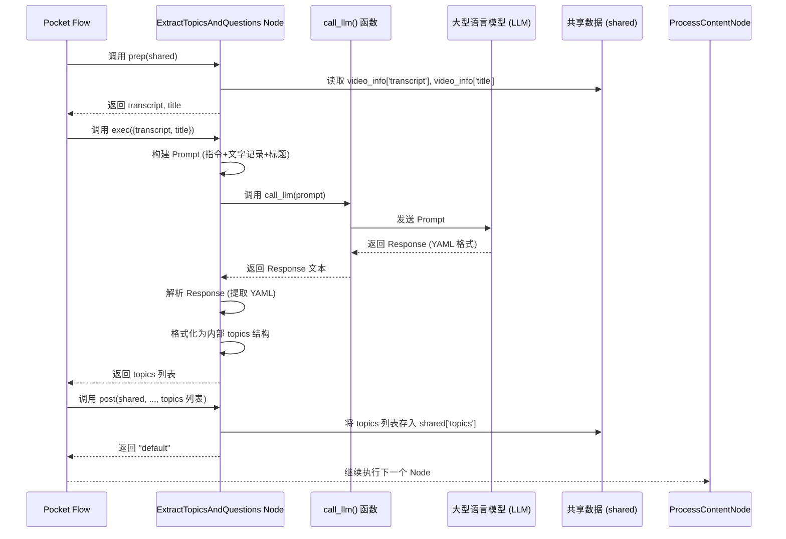
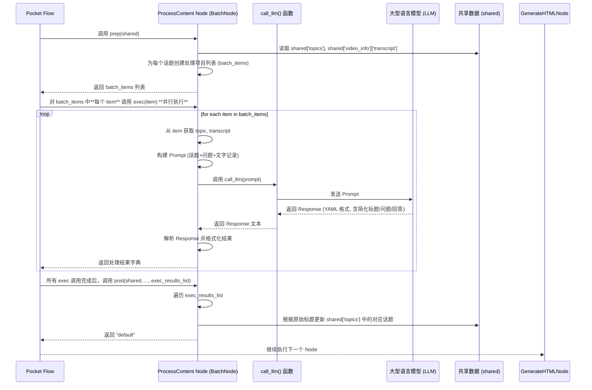

# Chapter 5: 智能问答助手

你好！欢迎来到本教程的第五章！

在上一章 [视频信息提取](04_视频信息提取_.md) 中，我们成功地让我们的“聪明朋友”去 YouTube 网站“侦查”了一番，并且拿回了最重要的“证据”——视频的**文字记录 (transcript)**，以及视频的标题和封面图。现在，我们手里有了视频里人们说的所有文字内容，以及一些基本信息，这些都被整齐地放到了 `shared['video_info']` 这个共享空间里。

但是，仅仅有文字记录还不够。想象一下，如果有人把一本厚厚的书给你，说：“这本书里有所有你问题的答案！” 你肯定不会满意，因为你不可能把整本书都读一遍去找到答案。你需要有人帮你**理解**这本书，找出里面的**重点**，并针对你的**问题**给出**简单明了的回答**。

这就是我们本章要讲解的**智能问答助手**的作用！它就是我们的“聪明朋友”的**“聪明大脑”**——也就是**大型语言模型（LLM）**在项目中发挥作用的地方。这个步骤的核心任务是：

**将从视频中提取的文字记录进行智能分析，找出核心话题，提出相关问题，并用简单易懂的方式回答这些问题，为最终生成报告准备好结构化的内容。**

## 为什么需要“智能问答助手”？

原始的视频文字记录可能非常长、包含很多口语化的表达、重复的内容，甚至跑题的部分。直接把这些文字呈现给你，并不能帮助你快速理解视频的精髓。

**智能问答助手**解决了这个问题。它就像一个能快速“阅读”大量文字并提炼要点、解答疑问的超级助手。具体来说，它需要完成以下任务：

1.  **提取主要话题：** 从海量的文字记录中识别出视频主要讨论了哪些重要概念或主题。
2.  **生成启发性问题：** 针对每个话题，生成一些能引导读者深入理解或引发思考的问题。
3.  **简化内容和回答：** 这是最关键的一步！将提取出的话题、问题以及根据文字记录找到的答案，用**超级简单易懂**的方式重新表达出来，就像我们项目的核心目标说的那样——**讲给5岁小孩听**。

这个过程将无序、复杂的文字记录转化成了结构化、易于理解的“话题-问题-回答”格式的数据，这正是我们最终报告所需要的内容。

在我们的项目中，这个智能分析和内容处理的任务是由流程中的两个 Node 协同完成的：

*   `ExtractTopicsAndQuestions` Node：负责从文字记录中**初步提取**话题和生成原始问题。
*   `ProcessContent` Node：负责对提取出的话题和问题进行**内容处理**，包括简化表达和生成简单回答。

## 在流程中使用智能问答助手 Node

回想一下我们在 [处理流程](02_处理流程_.md) 中定义的流程图：

```mermaid
graph LR
    A[开始/URL] --> B{ProcessYouTubeURL<br/>(获取视频信息)};
    B --> C{ExtractTopicsAndQuestions<br/>(提取话题问题)};
    C --> D{ProcessContent<br/>(处理内容/简化回答)};
    D --> E{GenerateHTML<br/>(生成HTML报告)};
    E --> F[结束/HTML文件];

    B -- 写入 video_info --> SharedData[(共享数据)];
    C -- 读取 video_info<br/>写入 topics --> SharedData;
    D -- 读取 topics, video_info<br/>更新 topics --> SharedData;
    E -- 读取 video_info, topics<br/>写入 html_output --> SharedData;
```

图中标记为 C 和 D 的两个步骤，**“提取话题和问题”** (`ExtractTopicsAndQuestions`) 和**“处理内容”** (`ProcessContent`)，就是我们的**智能问答助手**的核心组成部分。它们紧跟在 [视频信息提取](04_视频信息提取_.md) (`ProcessYouTubeURL`) 之后，因为它们需要使用后者提供的文字记录作为输入。

在 `flow.py` 文件中，它们的连接方式如下：

```python
# ... (导入及其他代码省略) ...

# 引入调用 LLM 的工具函数
from utils.call_llm import call_llm
# 引入 YAML 解析库，因为我们期望 LLM 以 YAML 格式返回结构化数据
import yaml

# ... (ProcessYouTubeURL Node 定义省略) ...

# 定义负责提取话题和问题的 Node (C 步骤)
class ExtractTopicsAndQuestions(Node):
    # ... (Node 的 prep, exec, post 方法定义在下方) ...
    pass # 实际代码这里有实现

# 定义负责处理内容和简化回答的 Node (D 步骤)
class ProcessContent(BatchNode): # 注意，这是一个 BatchNode
    # ... (Node 的 prep, exec, post 方法定义在下方) ...
    pass # 实际代码这里有实现

# ... (GenerateHTML Node 定义省略) ...

# 创建整个流程的函数
def create_youtube_processor_flow():
    # ... (创建 ProcessYouTubeURL 实例省略) ...
    process_url = ProcessYouTubeURL(max_retries=2, wait=10)

    # 创建智能问答助手 Node 实例
    extract_topics_and_questions = ExtractTopicsAndQuestions(max_retries=2, wait=10) # 提取话题和问题
    process_content = ProcessContent(max_retries=2, wait=10) # 处理内容和回答

    # ... (创建 GenerateHTML 实例省略) ...
    generate_html = GenerateHTML(max_retries=2, wait=10)

    # 连接 Node，定义执行顺序
    process_url >> extract_topics_and_questions >> process_content >> generate_html # 将它们依次连接

    # 创建 Flow，指定从 process_url 开始
    flow = Flow(start=process_url)

    return flow

# ... (其他代码省略) ...
```

`ExtractTopicsAndQuestions` Node 会从 `shared['video_info']` 中读取文字记录和标题作为输入。它执行完毕后，会将初步提取出的话题和问题列表存入 `shared['topics']`。

接着，`ProcessContent` Node 会从 `shared['topics']` 中读取话题和问题列表，同时也会从 `shared['video_info']` 中再次读取完整的文字记录（因为 LLM 需要完整的上下文来生成准确的回答）。它执行完毕后，会**更新** `shared['topics']` 字典，为每个问题添加简化后的表达和回答。

## `ExtractTopicsAndQuestions` Node 如何工作？

这个 Node 的主要任务是**第一次与 LLM 互动**，从原始文字记录中梳理出核心信息。

当 Pocket Flow 调用 `ExtractTopicsAndQuestions` Node 时：

1.  **`prep` 方法：** 从 `shared['video_info']` 中获取 `"transcript"` (文字记录) 和 `"title"` (视频标题)。将它们打包成一个字典返回。
2.  **`exec` 方法：**
    *   接收 `prep` 返回的文字记录和标题。
    *   **构建 Prompt (提示):** 准备发给 LLM 的指令和数据。Prompt 就像你给“聪明大脑”下达的具体任务：“这是视频标题和文字记录，帮我找出最重要的5个话题，每个话题想3个问题。” 同时，为了让结果易于程序处理，我们还要求 LLM 以特定的格式（这里使用 **YAML** 格式）返回结果。
    *   **调用 LLM:** 使用一个工具函数 `call_llm()` 将构建好的 Prompt 发送给 LLM。
    *   **解析 Response:** 接收 LLM 返回的 Response (结果)。由于我们要求了 YAML 格式，Response 会包含 YAML 字符串。需要解析这个 YAML 字符串，提取出话题和问题列表。
    *   **格式化结果:** 将解析出的数据整理成符合我们项目内部使用的数据结构（一个包含多个字典的列表，每个字典代表一个话题）。
    *   返回格式化后的结果。
3.  **`post` 方法：** 将 `exec` 返回的包含话题和问题的列表存储到 `shared` 字典中，使用的键是 `"topics"`。

整个过程的时序图：



## 看代码：`ExtractTopicsAndQuestions` Node

让我们看 `flow.py` 文件中 `ExtractTopicsAndQuestions` Node 的核心代码：

```python
# ... (导入及其他代码省略) ...

from utils.call_llm import call_llm # 引入调用 LLM 的工具函数
import yaml # 引入 YAML 解析库

# ... (ProcessYouTubeURL Node 定义省略) ...

class ExtractTopicsAndQuestions(Node):
    """从视频文字记录中提取有趣的话题并生成问题""" # 中文注释：从视频文字记录中提取有趣的话题并生成问题
    def prep(self, shared):
        """从 shared 中获取文字记录和标题""" # 中文注释：从 shared 中获取文字记录和标题
        video_info = shared.get("video_info", {})
        transcript = video_info.get("transcript", "")
        title = video_info.get("title", "")
        # 返回需要传递给 exec 的数据
        return {"transcript": transcript, "title": title}

    def exec(self, data):
        """使用 LLM 提取话题和生成问题""" # 中文注释：使用 LLM 提取话题和生成问题
        transcript = data["transcript"]
        title = data["title"]

        # **** 构建 Prompt ****
        # Prompt 告诉 LLM 它应该做什么，以及提供它需要的数据 (文字记录和标题)
        prompt = f"""
你是一个专业的内容分析师。给你一个 YouTube 视频文字记录，请找出最多 5 个最有趣的话题，并为每个话题生成最多 3 个最能启发思考的问题。
这些问题不一定非要在视频中直接提问过。包含一些澄清性的问题是好的。

视频标题: {title}

文字记录:
{transcript}

请以 YAML 格式返回结果:

```yaml
topics:
  - title: |
        第一个话题标题
    questions:
      - |
        关于第一个话题的问题 1?
      - |
        问题 2 ...
  - title: |
        第二个话题标题
    questions:
        ...
```
        """

        logger.info("正在调用 LLM 提取话题和问题...") # 记录日志
        # **** 调用 call_llm 函数与 LLM 交互 ****
        response = call_llm(prompt)

        # **** 解析 Response ****
        # 尝试从 LLM 返回的文本中提取 YAML 部分
        yaml_content = response.split("```yaml")[1].split("```")[0].strip() if "```yaml" in response else response

        # 使用 yaml.safe_load 解析 YAML 字符串为 Python 字典
        parsed = yaml.safe_load(yaml_content)
        # 从解析结果中获取 topics 列表
        raw_topics = parsed.get("topics", [])

        # 确保只取最多 5 个话题
        raw_topics = raw_topics[:5]

        # **** 格式化结果为项目内部结构 ****
        result_topics = []
        for topic in raw_topics:
            topic_title = topic.get("title", "")
            raw_questions = topic.get("questions", [])

            # 为每个话题创建字典
            result_topics.append({
                "title": topic_title, # 原始标题
                "questions": [
                    {
                        "original": q, # 原始问题
                        "rephrased": "", # 简化后的问题 (待 ProcessContent 处理)
                        "answer": ""     # 回答 (待 ProcessContent 处理)
                    }
                    for q in raw_questions # 遍历 LLM 生成的每个问题
                ]
            })

        return result_topics # exec 返回格式化后的 topics 列表

    def post(self, shared, prep_res, exec_res):
        """将包含问题的 topics 存储到 shared""" # 中文注释：将包含问题的 topics 存储到 shared
        shared["topics"] = exec_res # 将 exec 返回的 topics 列表存入 shared['topics']

        # 统计总问题数用于日志
        total_questions = sum(len(topic.get("questions", [])) for topic in exec_res)

        logger.info(f"提取了 {len(exec_res)} 个话题，共 {total_questions} 个问题。") # 记录日志
        return "default"
```

可以看到，核心逻辑在 `exec` 方法中：构造一个详细的 `prompt` 给 LLM，告诉它要分析的文本是什么 (`title` 和 `transcript`)，以及我们想要它做什么 (`找出话题和问题`) 和想要什么格式 (`YAML`)。然后调用 `call_llm(prompt)` 发送请求。收到 Response 后，解析出 YAML 部分，并将其转换为我们项目内部需要的数据结构。

这个 Node 完成后，`shared` 字典中就多了一个键 `"topics"`，其值是一个列表，包含了初步的话题标题和每个话题下的原始问题。

## `ProcessContent` Node 如何工作？

`ExtractTopicsAndQuestions` Node 已经找到了话题和原始问题，但它们可能还不够简单明了。`ProcessContent` Node 的任务就是**第二次与 LLM 互动**，进一步处理这些内容，使其适合“给5岁小孩听”的目标，并根据文字记录提供简单的回答。

注意 `ProcessContent` 是一个 `BatchNode`。这意味着它可以接收一个列表作为输入，并尝试并行处理列表中的每个项目。这对于处理多个话题非常有用，因为可以同时请求 LLM 处理不同话题的内容。

当 Pocket Flow 调用 `ProcessContent` Node 时：

1.  **`prep` 方法：** 从 `shared` 字典中获取 `"topics"` 列表和 `"video_info"` (包含完整的文字记录)。它将话题列表中的每个话题以及完整的文字记录，组合成一个个独立的“处理任务”列表返回。这个列表中的每个项目都将作为 `exec` 方法的一次调用的输入。
2.  **`exec` 方法 (对列表中的每个项目调用一次):**
    *   接收一个包含一个话题信息和完整文字记录的字典。
    *   **构建 Prompt:** 这一次的 Prompt 会包含原始话题标题、原始问题列表以及**完整的文字记录**（作为回答问题的上下文）。Prompt 的指令会告诉 LLM：“这是一个话题和问题，请用给5岁小孩听的方式重新表达话题标题和问题，并根据提供的文字记录，用简单的方式回答每个问题。回答请用 HTML 标签格式化，方便后续展示。” 同样要求以 YAML 格式返回结果。
    *   **调用 LLM:** 调用 `call_llm()` 函数发送 Prompt。
    *   **解析 Response:** 解析 LLM 返回的 YAML 字符串，提取出**简化后的标题**、**简化后的问题**以及**回答**。
    *   **格式化结果:** 将解析出的结果整理成包含原始标题、简化标题和处理后的问题列表（每个问题包含原始问题、简化问题和回答）的字典返回。
3.  **`post` 方法：** 接收一个列表，这个列表包含了 `exec` 方法对每个话题处理后返回的结果。它会遍历这个结果列表，根据原始话题标题找到 `shared['topics']` 中对应的话题对象，然后用处理后的信息（简化标题、简化问题、回答）**更新**这个话题对象。

整个过程的时序图 (聚焦于 BatchNode 的行为)：



请注意图中 `exec` 方法的**并行执行**部分。虽然实际的并行度取决于 Pocket Flow 的配置和运行环境，但概念上 `BatchNode` 设计就是为了能够同时处理多个任务项。

## 看代码：`ProcessContent` Node 和 `call_llm` 函数

让我们看 `flow.py` 文件中 `ProcessContent` Node 的核心代码：

```python
# ... (导入及其他代码省略) ...

from utils.call_llm import call_llm # 引入调用 LLM 的工具函数
import yaml # 引入 YAML 解析库

# ... (ExtractTopicsAndQuestions Node 定义省略) ...

class ProcessContent(BatchNode):
    """处理每个话题，进行简化表达和回答""" # 中文注释：处理每个话题，进行简化表达和回答
    def prep(self, shared):
        """返回话题列表供批量处理""" # 中文注释：返回话题列表供批量处理
        topics = shared.get("topics", [])
        video_info = shared.get("video_info", {})
        transcript = video_info.get("transcript", "")

        batch_items = []
        for topic in topics:
            # 为每个话题创建一个处理项，包含话题本身和完整的文字记录
            batch_items.append({
                "topic": topic,
                "transcript": transcript
            })
        # prep 方法返回处理项列表
        return batch_items

    def exec(self, item):
        """使用 LLM 处理一个话题""" # 中文注释：使用 LLM 处理一个话题
        # item 是 prep 方法返回的列表中的一个元素
        topic = item["topic"]
        transcript = item["transcript"]

        topic_title = topic["title"]
        # 提取原始问题列表
        questions = [q["original"] for q in topic["questions"]]

        # **** 构建 Prompt ****
        # 这个 Prompt 更侧重于简化和回答
        prompt = f"""你是一个给小孩简化内容的高手。给你一个 YouTube 视频中的话题和问题，请用更清晰、更简单的方式重新表达话题标题和问题，并给出简单易懂 (ELI5 - Explain Like I'm 5) 的回答。

话题: {topic_title}

问题:
{chr(10).join([f"- {q}" for q in questions])} # 格式化问题列表

文字记录摘要 (供回答时参考):
{transcript}

对于话题标题和问题:
1. 保持吸引人和有趣，但要简短。

对于你的回答:
1. 请使用 HTML 格式，用 <b> 和 <i> 标签进行高亮。
2. 最好使用 <ol> 和 <li> 列表格式。理想情况下，<li> 后紧跟 <b> 表示要点。
3. 引用重要的关键词，但用易于理解的语言解释它们（例如，“<b>量子计算</b>就像一个超级快的魔法计算器”）。
4. 回答要有趣但简短。

请以 YAML 格式返回结果:

```yaml
rephrased_title: |
    有趣的话题标题，最多 10 个字
questions:
  - original: |
        {questions[0] if len(questions) > 0 else ''} # 原始问题，用于匹配
    rephrased: |
        有趣的问题，最多 15 个字
    answer: |
        5岁小孩能懂的简单回答，最多 100 个字
  - original: |
        {questions[1] if len(questions) > 1 else ''}
    ... # 其他问题
```
        """

        logger.info(f"正在调用 LLM 处理话题: {topic_title}") # 记录日志
        # **** 调用 call_llm 函数与 LLM 交互 ****
        response = call_llm(prompt)

        # **** 解析 Response ****
        yaml_content = response.split("```yaml")[1].split("```")[0].strip() if "```yaml" in response else response

        # 使用 yaml.safe_load 解析 YAML 字符串
        parsed = yaml.safe_load(yaml_content)
        rephrased_title = parsed.get("rephrased_title", topic_title) # 获取简化标题，如果 LLM 没提供则用原始标题
        processed_questions = parsed.get("questions", []) # 获取处理后的问题列表

        # 返回处理结果
        result = {
            "title": topic_title, # 保留原始标题，用于在 post 方法中找到对应的话题
            "rephrased_title": rephrased_title, # 简化后的标题
            "questions": processed_questions # 包含简化问题和回答的列表
        }

        return result # exec 返回处理结果字典

    def post(self, shared, prep_res, exec_res_list):
        """用处理后的内容更新 shared 中的 topics""" # 中文注释：用处理后的内容更新 shared 中的 topics
        topics = shared.get("topics", []) # 获取 shared 中原始的 topics 列表

        # 创建一个字典，方便通过原始话题标题找到处理后的结果
        title_to_processed = {
            result["title"]: result
            for result in exec_res_list # exec_res_list 是所有 exec 调用返回结果组成的列表
        }

        # 更新 shared['topics'] 中的每个话题
        for topic in topics:
            topic_title = topic["title"]
            # 如果当前话题在处理结果中找到
            if topic_title in title_to_processed:
                processed = title_to_processed[topic_title]

                # 更新话题的简化标题
                topic["rephrased_title"] = processed["rephrased_title"]

                # 创建一个字典，方便通过原始问题找到处理后的问题及回答
                orig_to_processed = {
                    q["original"]: q
                    for q in processed["questions"] # processed["questions"] 是 LLM 返回的处理后问题列表
                }

                # 更新当前话题下的每个问题
                for q in topic["questions"]: # q 是 shared['topics'] 中原始的问题对象
                    original = q["original"]
                    # 如果当前问题在处理结果中找到
                    if original in orig_to_processed:
                        processed_q = orig_to_processed[original]
                        # 更新简化问题和回答字段
                        q["rephrased"] = processed_q.get("rephrased", original) # 如果没有简化版本，用原始问题
                        q["answer"] = processed_q.get("answer", "") # 如果没有回答，用空字符串

        # 更新 shared 字典
        shared["topics"] = topics

        logger.info(f"已处理 {len(exec_res_list)} 个话题的内容。") # 记录日志
        return "default"
```

`ProcessContent` 的 `exec` 方法逻辑与 `ExtractTopicsAndQuestions` 类似，也是构建 Prompt，调用 `call_llm`，然后解析 Response。不同之处在于 Prompt 的内容和期望的 Response 格式。`post` 方法则负责将批量处理的结果整合回 `shared['topics']` 这个总列表中。

最后，让我们看一下 `utils/call_llm.py` 文件中的 `call_llm` 工具函数。它非常简单，就是连接我们程序和 LLM 服务的桥梁：

```python
# ... (导入必要的库，这里使用了 Anthropic Vertex AI 客户端库) ...
from anthropic import AnthropicVertex
import os # 用于读取环境变量

def call_llm(prompt: str) -> str:
    """调用大型语言模型（LLM）并返回响应""" # 中文注释：调用大型语言模型（LLM）并返回响应
    try:
        # **** 初始化 LLM 客户端 ****
        # 从环境变量获取配置信息，例如 Google Cloud 的项目 ID 和区域
        # 这里的具体实现依赖于你使用的 LLM 服务 (例如 Google Cloud, OpenAI 等)
        client = AnthropicVertex(
            region=os.getenv("ANTHROPIC_REGION", "us-east5"),
            project_id=os.getenv("ANTHROPIC_PROJECT_ID", "")
        )

        # **** 发送消息给 LLM ****
        # 创建一个对话消息列表，包含用户输入的 Prompt
        response = client.messages.create(
            max_tokens=1024, # 限制 LLM 返回的最大 token 数量
            messages=[{"role": "user", "content": prompt}], # 用户的输入 Prompt
            model="claude-3-7-sonnet@20250219" # 指定使用的 LLM 模型名称
        )
        # **** 返回 LLM 的响应文本 ****
        # LLM 的响应通常是一个消息对象，实际文本内容在 content 列表的第一个元素里
        return response.content[0].text
    except Exception as e:
        # 如果调用 LLM 失败，记录错误并返回错误信息
        logger.error(f"调用 LLM 失败: {e}") # 中文日志
        return f"Error calling LLM: {e}" # 返回错误信息字符串

# ... (测试代码省略) ...
```
这个函数隐藏了与 LLM 服务交互的所有复杂细节。你只需要给它一个 `prompt` 字符串，它就会返回 LLM 处理后的文本 `response`。它依赖于环境变量来找到 LLM 服务在哪里以及如何连接，所以在使用项目前需要正确配置这些环境变量（这通常在项目的设置或部署指南中说明）。

通过 `ExtractTopicsAndQuestions` 和 `ProcessContent` 这两个 Node 及其内部对 `call_llm` 函数的调用，我们的“聪明朋友”就完成了对视频文字记录的智能理解、提炼和简化。现在，`shared['topics']` 字典中包含了所有准备好的、易于理解的话题、问题和回答！

## 总结

在本章中，我们深入学习了项目的**智能问答助手**部分，它是利用**大型语言模型（LLM）**来理解视频内容的核心。我们了解到，这个任务由 `ExtractTopicsAndQuestions` Node 和 `ProcessContent` Node 共同完成。

`ExtractTopicsAndQuestions` Node 负责第一次调用 LLM，从原始文字记录中提取初步的话题和问题，并将它们存入 `shared['topics']`。

`ProcessContent` Node 则负责第二次调用 LLM，对初步的结果进行细化处理，将其简化为“给5岁小孩听”的版本，并生成简单回答，然后更新 `shared['topics']` 字典。

我们还看了它们内部如何通过构建 **Prompt** 并调用简单的 `call_llm()` 函数来与 LLM 交互，以及如何使用 **YAML** 格式来结构化 LLM 的输入和输出。

现在，我们已经获取了所有经过智能处理和简化后的内容。流程中的最后一步，就是将这些内容整理成一份用户友好的报告。

准备好了吗？让我们前往下一章，看看**报告生成器**是如何工作的吧！

[报告生成器](06_报告生成器_.md)

---

Generated by [AI Codebase Knowledge Builder](https://github.com/The-Pocket/Tutorial-Codebase-Knowledge)