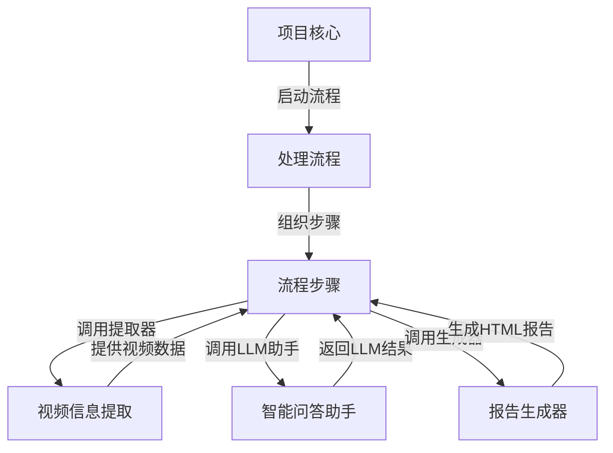

# Tutorial: Tutorial-Youtube-Made-Simple

这个项目是一个**智能小助手**，能帮你快速理解YouTube长视频。就像请了一个聪明朋友，你告诉他视频链接，他帮你“看”一遍，找出重要的地方，然后用*简单易懂*（像讲给5岁小孩听）的方式讲给你听，省去了自己看好几个小时的时间。

**Source Repository:** [https://github.com/The-Pocket/Tutorial-Youtube-Made-Simple](https://github.com/The-Pocket/Tutorial-Youtube-Made-Simple)

## Chapters

1. [项目核心
](01_项目核心_.md)
2. [处理流程
](02_处理流程_.md)
3. [流程步骤
](03_流程步骤_.md)
4. [视频信息提取
](04_视频信息提取_.md)
5. [智能问答助手
](05_智能问答助手_.md)
6. [报告生成器
](06_报告生成器_.md)

---

Generated by [AI Codebase Knowledge Builder](https://github.com/The-Pocket/Tutorial-Codebase-Knowledge)