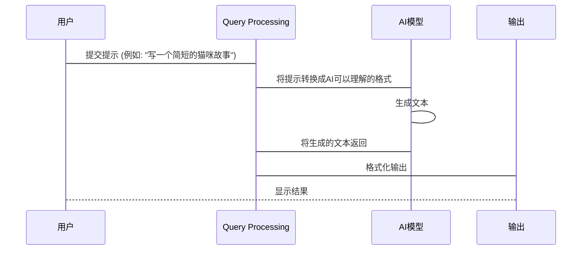

# Chapter 1: 提示工程 (Tíshì gōngchéng)

欢迎来到提示工程的世界！ 这就像学习一种新的语言，用来和人工智能（AI）交流。

你有没有遇到过这样的情况：你想让AI帮你做一件事情，但是它给出的答案并不是你想要的？ 这很可能就是因为你的“提示”（prompt）不够好。

想象一下，你想让AI帮你写一篇关于猫咪的文章。 如果你只是简单地说：“写一篇关于猫的文章”，AI可能会写出一篇非常笼统、枯燥的文章。 但是，如果你给它更具体的指示，比如：“写一篇有趣、充满活力的文章，描述暹罗猫的特点和生活习性，适合小学生阅读”，AI就能写出更符合你要求的文章。

**提示工程 (Tíshì gōngchéng)** 就是帮助你掌握这种“和AI说话”的艺术。 通过学习如何撰写有效的提示，你可以更好地控制AI的行为，让它为你所用。 在接下来的章节中，我们会一起学习各种提示技巧，让你成为一名提示大师！

## 什么是提示工程？

**提示工程** 就像是训练狗狗。 你需要给出清晰的指令（提示），才能让狗狗（AI）明白你想让它做什么。 好的提示能让AI给出更准确、更有用的回答。

具体来说，提示工程包括：

*   **理解AI的能力和限制：** 了解AI擅长做什么，不擅长做什么，可以帮助你更好地设计提示。
*   **设计有效的提示：** 学习如何使用清晰、简洁的语言来表达你的需求，并引导AI给出你想要的答案。
*   **迭代和优化提示：** 通过不断尝试和调整，找到最有效的提示方式。

## 提示工程的核心概念

让我们来看看提示工程的一些核心概念：

1.  **指令 (Instructions):** 这是你告诉AI要做什么的最直接的方式。 例如：“总结这篇文章的主要观点”。
2.  **上下文 (Context):** 提供背景信息，帮助AI更好地理解你的需求。 例如：“你是一名资深的大学教授，现在要给一年级学生讲解相对论，请用通俗易懂的语言讲解”。
3.  **输入数据 (Input Data):**  如果你想让AI处理特定的数据，你需要将数据作为输入提供给AI。 例如：将一篇新闻文章作为输入，让AI总结文章内容。
4.  **输出格式 (Output Format):** 明确指定你希望AI以什么样的格式输出结果。 例如：“以列表的形式输出”。

## 使用提示工程解决问题：生成食谱

现在，让我们用一个简单的例子来演示如何使用提示工程。 假设你想让AI帮你生成一个巧克力蛋糕的食谱。

一个**不好**的提示可能是：

```
写一个巧克力蛋糕的食谱。
```

这样的提示过于宽泛，AI可能会生成一个非常普通的食谱。

一个**更好**的提示可能是：

```
请写一个简单易学的巧克力蛋糕食谱，适合初学者，制作时间在1小时以内。食谱需要包含食材清单和详细的制作步骤。 输出格式为：
食材清单：
[食材1]: [用量]
[食材2]: [用量]
...

制作步骤：
1. [步骤1]
2. [步骤2]
...
```

这个提示更加具体，包含了以下信息：

*   **指令：** 写一个巧克力蛋糕食谱。
*   **上下文：** 适合初学者，制作时间在1小时以内。
*   **输出格式：** 食材清单和详细的制作步骤。

通过这个提示，AI更有可能生成一个符合你需求的食谱。

**示例输出：**

```
食材清单：
面粉: 200克
可可粉: 50克
白砂糖: 150克
鸡蛋: 2个
牛奶: 120毫升
黄油: 80克
泡打粉: 1茶匙
小苏打: 1/2茶匙

制作步骤：
1. 烤箱预热至180摄氏度。
2. 将面粉、可可粉、白砂糖、泡打粉和小苏打混合均匀。
3. 在另一个碗中，将鸡蛋、牛奶和融化的黄油混合均匀。
4. 将湿性材料倒入干性材料中，搅拌均匀。
5. 将面糊倒入蛋糕模具中。
6. 放入烤箱烤25-30分钟。
7. 取出蛋糕，冷却后即可食用。
```

## 提示工程的内部原理 (简化版)

让我们简单了解一下提示工程背后的工作原理。 我们可以用一个简化的序列图来描述：



1.  **用户 (用户):** 你，输入提示的人。
2.  **Query Processing (查询处理, QP):** 这是一个中间步骤，负责将你的提示转换成AI模型可以理解的格式。 例如，将自然语言转换为模型可以处理的数字表示。
3.  **AI模型 (AI Model):** 这是真正的“大脑”，负责根据提示生成文本。
4.  **输出 (Output):** AI模型生成的文本，经过格式化后呈现给你。

**代码层面 (简化示例, 仅供理解概念):**

虽然具体的实现会非常复杂，但我们可以用一个简化的Python代码片段来表示这个过程：

```python
def generate_response(prompt):
  """
  模拟AI模型生成响应
  """
  # 这是一个简化的模拟，实际的AI模型会使用更复杂的算法
  if "猫咪" in prompt:
    response = "猫咪是一种可爱的宠物，它们喜欢玩耍和睡觉。"
  else:
    response = "我是一个AI模型，我可以回答各种问题。"
  return response

def format_output(response):
  """
  格式化输出
  """
  return f"AI的回答：{response}"

prompt = "写一个简短的猫咪故事"
response = generate_response(prompt)
formatted_output = format_output(response)
print(formatted_output) # 输出：AI的回答：猫咪是一种可爱的宠物，它们喜欢玩耍和睡觉。
```

**代码解释：**

*   `generate_response(prompt)` 函数模拟了AI模型，根据提示生成响应。
*   `format_output(response)` 函数将AI模型的响应格式化，使其更易于阅读。

实际上，提示工程的实现远比这复杂，但这个简化的例子可以帮助你理解其基本原理。

## 重要提示：清晰是关键

请记住，提示工程的关键在于**清晰、简洁**。 你需要像教一个小朋友一样，告诉AI你想要什么，并提供足够的背景信息。 越清晰的提示，AI就越能给出你想要的答案。

在[Chapter 2: 提示模板 (Tíshì móbǎn)](02_提示模板__tíshì_móbǎn__.md) 中，我们将学习如何使用提示模板来更有效地进行提示工程。


---

Generated by [AI Codebase Knowledge Builder](https://github.com/The-Pocket/Tutorial-Codebase-Knowledge)