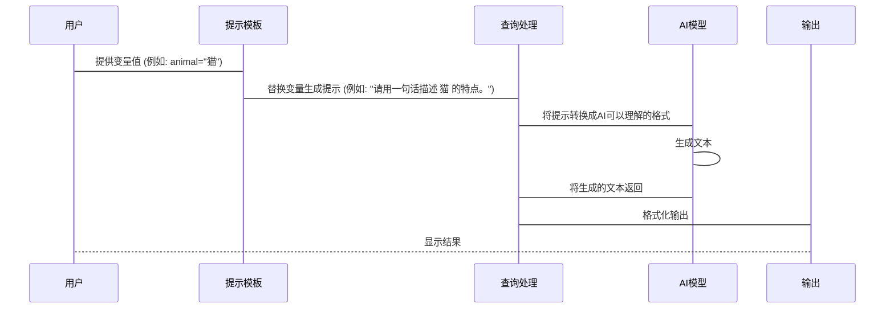

# Chapter 2: 提示模板 (Tíshì móbǎn)

在上一个章节 [提示工程 (Tíshì gōngchéng)](01_提示工程__tíshì_gōngchéng__.md) 中，我们学习了如何通过编写清晰的提示来与 AI 交流，让 AI 更好地理解我们的需求。 但是，如果我们经常需要向 AI 提问类似的问题，只是问题的内容稍有不同，每次都重新编写完整的提示就会很麻烦。 这就像每次写信都要从头开始写，而不是使用信件模板一样。

**提示模板 (Tíshì móbǎn)** 就是用来解决这个问题的！ 它可以帮助我们创建一个通用的提示结构，然后通过替换其中的变量，快速生成不同的提示，从而提高效率。

想象一下，你是一位老师，需要给学生出很多数学题。 题目类型都是一样的，只是数字不同。 如果没有提示模板，你可能需要为每一道题都写一遍完整的题目描述。 但是有了提示模板，你只需要创建一个通用的题目模板，然后替换其中的数字变量，就可以快速生成不同的题目了。

例如，你的数学题提示模板可能是：

"请计算： {num1} + {num2} = ?"

其中 `{num1}` 和 `{num2}` 就是变量。 每次出题时，你只需要替换这两个变量的值，就可以生成不同的题目了。 比如：

*   替换 `{num1}` 为 5，`{num2}` 为 3，生成提示： "请计算： 5 + 3 = ?"
*   替换 `{num1}` 为 10，`{num2}` 为 7，生成提示： "请计算： 10 + 7 = ?"

这样是不是方便多了？

## 提示模板的关键概念

让我们来看看提示模板的一些关键概念：

1.  **模板 (Template):** 这是一个包含变量的通用提示结构。 就像一个预先设计好的信件，只需要填空即可使用。

2.  **变量 (Variable):** 这是模板中可以被替换的部分，用特定的符号表示（例如：`{variable_name}`）。 变量就像信件中的“姓名”和“地址”，可以根据具体情况进行修改。

3.  **替换 (Substitution):** 将变量替换为实际值的过程。 这就像在信件模板中填入收信人的姓名和地址。

## 如何使用提示模板

现在，让我们通过一个简单的例子来演示如何使用提示模板。 假设我们想用 AI 生成一些关于动物的描述。 我们可以创建一个如下的提示模板：

"请用一句话描述 {animal} 的特点。"

其中 `{animal}` 是一个变量，代表动物的名称。

现在，我们可以使用这个模板来生成关于不同动物的描述：

*   将 `{animal}` 替换为 "猫"，生成提示： "请用一句话描述 猫 的特点。"
*   将 `{animal}` 替换为 "狗"，生成提示： "请用一句话描述 狗 的特点。"
*   将 `{animal}` 替换为 "大象"，生成提示： "请用一句话描述 大象 的特点。"

让我们来看一个更实际的例子。 在 `prompt_evaluations/05_prompt_foo_code_graded_animals/prompts.py` 文件中，我们定义了如下的简单提示模板：

```python
def simple_prompt(animal_statement):
    return f"""You will be provided a statement about an animal and your job is to determine how many legs that animal has.
    
    Here is the animal statement.
    <animal_statement>{animal_statement}</animal_statement>
    
    How many legs does the animal have? Please respond with a number"""
```

这个模板的目的是让 AI 根据动物的描述来判断该动物有多少条腿。 其中 `<animal_statement>{animal_statement}</animal_statement>` 就是一个变量，我们可以将不同的动物描述替换到这个变量中。

例如，我们可以将 `animal_statement` 替换为 "一只猫有四条腿"，生成如下的提示：

```
You will be provided a statement about an animal and your job is to determine how many legs that animal has.
    
Here is the animal statement.
<animal_statement>一只猫有四条腿</animal_statement>
    
How many legs does the animal have? Please respond with a number
```

AI 接收到这个提示后，应该会回答 "4"。

## 提示模板的内部原理

让我们简单了解一下提示模板的内部工作原理。 我们可以用一个简化的序列图来描述：



1.  **用户 (用户):** 你，提供变量值的人。
2.  **提示模板 (提示模板):** 负责接收变量值，并替换模板中的变量，生成完整的提示。
3.  **查询处理 (Query Processing, QP):** 这是一个中间步骤，负责将你的提示转换成AI模型可以理解的格式。
4.  **AI模型 (AI Model):** 这是真正的“大脑”，负责根据提示生成文本。
5.  **输出 (Output):** AI模型生成的文本，经过格式化后呈现给你。

**代码层面 (简化示例, 仅供理解概念):**

虽然具体的实现会非常复杂，但我们可以用一个简化的Python代码片段来表示这个过程：

```python
def create_prompt(template, variables):
  """
  根据模板和变量创建提示
  """
  prompt = template
  for key, value in variables.items():
    prompt = prompt.replace("{" + key + "}", value)
  return prompt

template = "请用一句话描述 {animal} 的特点。"
variables = {"animal": "猫"}
prompt = create_prompt(template, variables)
print(prompt) # 输出：请用一句话描述 猫 的特点。
```

**代码解释：**

*   `create_prompt(template, variables)` 函数接收一个模板和一个包含变量值的字典，然后将模板中的变量替换为实际值，生成完整的提示。

实际上，提示模板的实现远比这复杂，但这个简化的例子可以帮助你理解其基本原理。

再看一个例子，`prompt_evaluations/05_prompt_foo_code_graded_animals/prompts.py` 文件中的 `simple_prompt` 函数就是一个简单的提示模板的例子。 它接收一个 `animal_statement` 参数，然后将其嵌入到一个预定义的提示结构中，生成最终的提示。

```python
def simple_prompt(animal_statement):
    return f"""You will be provided a statement about an animal and your job is to determine how many legs that animal has.
    
    Here is the animal statement.
    <animal_statement>{animal_statement}</animal_statement>
    
    How many legs does the animal have? Please respond with a number"""
```

这个函数使用了 Python 的 f-string 来进行字符串格式化，可以将变量的值嵌入到字符串中。

## 总结

在本章中，我们学习了什么是提示模板，以及如何使用提示模板来更有效地进行提示工程。 提示模板可以帮助我们创建一个通用的提示结构，然后通过替换其中的变量，快速生成不同的提示，从而提高效率。 这就像使用一个通用的信件模板，只需要修改收信人姓名和地址即可。

在下一个章节 [工具使用 (Gōngjù shǐyòng)](03_工具使用__gōngjù_shǐyòng__.md) 中，我们将学习如何使用工具来帮助我们更好地进行提示工程。


---

Generated by [AI Codebase Knowledge Builder](https://github.com/The-Pocket/Tutorial-Codebase-Knowledge)