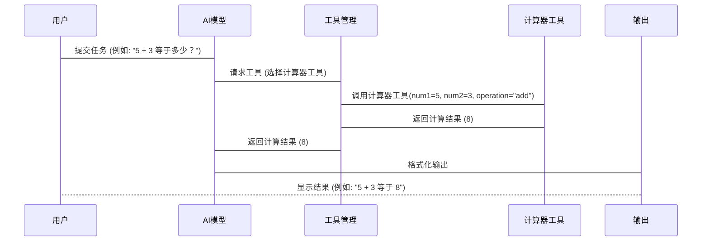

# Chapter 3: 工具使用 (Gōngjù shǐyòng)

在上一个章节 [提示模板 (Tíshì móbǎn)](02_提示模板__tíshì_móbǎn__.md) 中，我们学习了如何使用提示模板来更高效地生成提示。现在，让我们进入一个更强大的概念：**工具使用 (Gōngjù shǐyòng)**。

想象一下，你想让 AI 帮你预订一张机票。 如果没有工具使用，你只能用自然语言描述你的需求，比如：“我想预订一张明天从北京到上海的机票，最好是上午的航班。”  AI 可能会理解你的需求，但是它本身并不能直接预订机票。

**工具使用 (Gōngjù shǐyòng)** 就像给 AI 配备了各种“工具”，让它可以直接完成某些任务。  例如，我们可以给 AI 一个“机票预订工具”，让它可以连接到航空公司的 API，查询航班信息，并最终帮你预订机票。 这就像给木匠配备了锤子、锯子等工具，帮助他更高效地完成工作。 通过工具使用，AI不再只是一个信息提供者，而是一个可以执行特定任务的助手。

在本章节中，我们将学习如何使用工具，让 AI 拥有更强大的能力。

## 工具使用的关键概念

工具使用涉及以下几个关键概念：

1.  **工具 (Tool):** 工具是 AI 可以调用的函数或 API，用于执行特定任务。  例如，一个天气查询工具可以获取当前城市的天气信息；一个计算器工具可以进行数学计算。 工具就像 AI 的“外挂”，可以扩展 AI 的能力。

2.  **工具描述 (Tool Description):** 工具描述是对工具功能的描述，包括工具的名称、参数和功能介绍。  AI 通过工具描述来了解工具的作用以及如何使用它。  工具描述就像工具的使用说明书，告诉 AI 如何正确使用工具。

3.  **工具选择 (Tool Selection):** 当 AI 收到一个任务时，它需要根据任务的需求选择合适的工具。  例如，如果任务是“北京今天的天气怎么样？”，AI 应该选择天气查询工具。  工具选择就像是木匠根据需要选择不同的工具，锯木头用锯子，钉钉子用锤子。

4.  **工具调用 (Tool Invocation):**  选择好工具后，AI 需要使用正确的参数来调用工具。  例如，调用天气查询工具时，需要提供城市名称作为参数。  工具调用就像是木匠使用工具一样，需要掌握正确的使用方法。

5.  **结果处理 (Result Handling):**  工具执行完毕后，会返回一个结果。  AI 需要对结果进行处理，才能将其用于完成最终的任务。  例如，天气查询工具返回了北京今天的天气信息，AI 需要将信息提取出来，并用自然语言呈现给用户。

## 如何使用工具

让我们通过一个简单的例子来演示如何使用工具。 假设我们有一个计算器工具，可以进行加法运算。

```python
# 定义一个计算器工具
def calculator(num1, num2, operation):
  """
  一个简单的计算器工具，支持加法和减法。
  """
  if operation == "add":
    return num1 + num2
  elif operation == "subtract":
    return num1 - num2
  else:
    return "不支持该运算"

# 工具描述
tool_description = {
    "name": "calculator",
    "description": "一个可以进行加法和减法运算的计算器工具。",
    "parameters": {
        "num1": "第一个数字",
        "num2": "第二个数字",
        "operation": "运算类型，可以是 'add' 或 'subtract'"
    }
}

# 模拟 AI 的工具调用
def ai_call_tool(task):
    """
    模拟 AI 根据任务选择工具并调用它。
    """
    if "计算" in task:
        # 假设 AI 判断出需要使用计算器工具
        num1 = 5 # 假设 AI 从任务中提取出数字 5
        num2 = 3 # 假设 AI 从任务中提取出数字 3
        operation = "add" # 假设 AI 判断出需要进行加法运算
        result = calculator(num1, num2, operation)
        return result
    else:
        return "无法处理该任务"

# 任务
task = "请计算 5 + 3 等于多少？"

# AI 调用工具并得到结果
result = ai_call_tool(task)
print(f"计算结果：{result}") # 输出：计算结果：8
```

**代码解释：**

*   `calculator(num1, num2, operation)` 函数定义了一个简单的计算器工具，接收两个数字和一个运算类型作为参数，并返回计算结果。
*   `tool_description` 变量定义了工具的描述信息，包括工具的名称、描述和参数。
*   `ai_call_tool(task)` 函数模拟了 AI 的工具调用过程。 它首先判断任务是否需要使用计算器工具，然后从任务中提取参数，并调用计算器工具，最后返回计算结果。

在这个例子中，我们手动模拟了 AI 的工具选择和参数提取过程。 实际上，AI 需要使用更复杂的算法来完成这些任务。

## 工具使用的内部原理

让我们简单了解一下工具使用的内部工作原理。 我们可以用一个简化的序列图来描述：



1.  **用户 (用户):** 你，提交任务的人。
2.  **AI模型 (AI Model):** 负责接收任务、选择工具、调用工具和处理结果。
3.  **工具管理 (Tool Management):** 负责管理所有可用的工具，并根据 AI 的请求提供工具。
4.  **计算器工具 (Calculator Tool):** 一个具体的工具，负责执行特定的任务（例如，加法运算）。
5.  **输出 (Output):** AI模型生成的最终结果，呈现给用户。

**代码层面 (简化示例, 仅供理解概念):**

虽然具体的实现会非常复杂，但我们可以用一个简化的Python代码片段来表示这个过程：

```python
# 模拟工具管理
tools = {
    "calculator": calculator # calculator 函数 defined above
}

def ai_process_task(task):
    """
    模拟 AI 处理任务，选择工具并调用它。
    """
    if "计算" in task:
        tool_name = "calculator" # 假设 AI 判断出需要使用计算器工具
        tool = tools.get(tool_name)
        if tool:
            num1 = 5 # 假设 AI 从任务中提取出数字 5
            num2 = 3 # 假设 AI 从任务中提取出数字 3
            operation = "add" # 假设 AI 判断出需要进行加法运算
            result = tool(num1, num2, operation)
            return f"计算结果：{result}"
        else:
            return "找不到该工具"
    else:
        return "无法处理该任务"

task = "请计算 5 + 3 等于多少？"
result = ai_process_task(task)
print(result) # 输出：计算结果：8
```

**代码解释：**

*   `tools` 字典模拟了工具管理，存储了所有可用的工具。
*   `ai_process_task(task)` 函数模拟了 AI 的任务处理过程。 它首先判断任务是否需要使用工具，然后选择合适的工具，并调用该工具，最后返回结果。

## 一个更实际的例子: Anthropic's Tool Use Tutorial

如果你想更深入地了解工具使用，可以参考 Anthropic 提供的工具使用教程。 在教程中，你将学习如何创建和使用各种工具，以及如何将工具集成到 AI 流程中。

例如，在 `tool_use/README.md` 文件中，你可以找到关于工具使用的详细说明和示例代码。 这些例子将帮助你更好地理解工具使用的概念和实践。

注意，`tool_use/README.md` 文件本身**不是** Python 代码，而是一个 Markdown 文件，它指向一系列的 Jupyter Notebook 教程。 你需要打开相应的 Notebook 文件，才能看到实际的代码示例。

## 总结

在本章中，我们学习了什么是工具使用，以及如何使用工具来增强 AI 的能力。 工具使用就像给 AI 配备了各种“外挂”，让它可以完成更复杂的任务。 我们还了解了工具使用的关键概念，包括工具、工具描述、工具选择、工具调用和结果处理。

在接下来的章节 [模型评估 (Móxíng pínggū)](04_模型评估__móxíng_pínggū__.md) 中，我们将学习如何评估 AI 模型的性能，并优化模型的提示，使其能够更好地完成任务。


---

Generated by [AI Codebase Knowledge Builder](https://github.com/The-Pocket/Tutorial-Codebase-Knowledge)