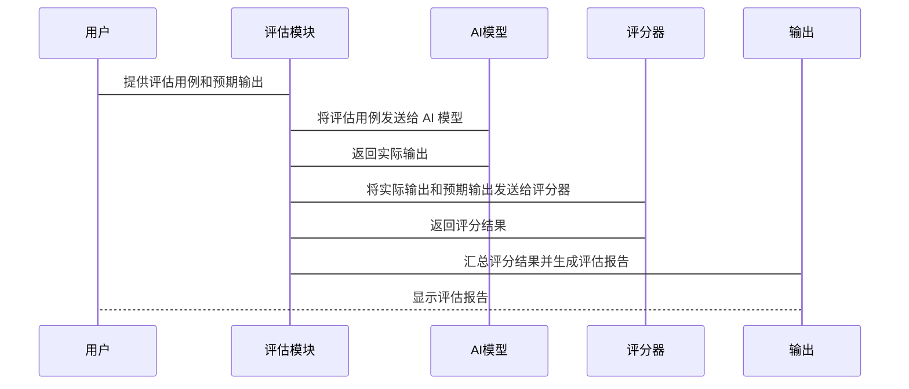

# Chapter 4: 模型评估 (Móxíng pínggū)

在上一章节 [工具使用 (Gōngjù shǐyòng)](03_工具使用__gōngjù_shǐyòng__.md) 中，我们学习了如何给 AI 配备各种工具，让它能完成更复杂的任务。 现在，让我们来学习如何评估 AI 模型的表现，也就是 **模型评估 (Móxíng pínggū)**。

模型评估就像给你的 AI 模型参加一场考试，看看它学得怎么样，答题能力如何。

想象一下，你训练了一个 AI 模型来识别猫和狗的图片。 你怎么知道这个模型是否真的准确呢？ 它是不是总是把猫识别成狗，或者把狗识别成猫呢？ 这时候就需要模型评估了。 你可以准备一些猫和狗的图片，让模型来识别，然后看看它识别的准确率有多高。 如果准确率很低，就说明模型还需要改进。

模型评估能帮助你了解 AI 模型的优点和缺点，从而改进你的提示词（prompt）或者模型本身，让它变得更聪明、更有用。 这就像给学生打分，帮助他们找到需要改进的地方。

## 模型评估的关键概念

让我们来看看模型评估的几个关键概念：

1.  **评估用例 (Evaluation Use Cases):** 这是你为 AI 模型设计的“考题”，用于测试模型在特定场景下的表现。 就像考试中的一道道题目。 评估用例可以是问题、指令、或者其他任何形式的输入。

2.  **预期输出 (Expected Output):** 这是你希望 AI 模型对评估用例给出的正确答案。 就像考试题目的标准答案。

3.  **实际输出 (Actual Output):** 这是 AI 模型对评估用例给出的实际答案。 就像学生考试时写的答案。

4.  **评分标准 (Scoring Criteria):** 这是你用来判断实际输出是否符合预期输出的标准。 就像考试的评分标准。 评分标准可以是简单的“正确/错误”，也可以是更复杂的评分规则。

5.  **评估指标 (Evaluation Metrics):** 这是你用来衡量模型整体表现的指标。 就像考试的平均分、及格率等。 常见的评估指标包括准确率、精确率、召回率等。

## 如何进行模型评估

现在，让我们通过一个简单的例子来演示如何进行模型评估。 假设我们有一个 AI 模型，可以根据商品描述生成商品标题。

我们的目标是评估这个模型生成标题的质量。

**步骤 1：设计评估用例**

我们可以准备一些商品描述作为评估用例。 例如：

*   商品描述 1: "一款轻便舒适的跑步鞋，适合日常跑步和训练。"
*   商品描述 2: "一款高品质的真皮钱包，手感柔软，设计简约。"
*   商品描述 3: "一款智能手表，可以监测心率、睡眠和运动数据。"

**步骤 2：定义预期输出**

对于每个商品描述，我们需要定义一个预期输出，也就是我们希望 AI 模型生成的理想标题。 例如：

*   商品描述 1 的预期输出: "轻便舒适跑步鞋"
*   商品描述 2 的预期输出: "高品质真皮钱包"
*   商品描述 3 的预期输出: "智能心率监测手表"

**步骤 3：生成实际输出**

让 AI 模型根据商品描述生成实际输出。 例如：

*   商品描述 1 的实际输出: "舒适跑步运动鞋"
*   商品描述 2 的实际输出: "真皮钱包"
*   商品描述 3 的实际输出: "智能运动手表"

**步骤 4：定义评分标准**

我们可以定义一个简单的评分标准：如果实际输出包含预期输出中的所有关键词，则认为答案正确，否则认为答案错误。

**步骤 5：计算评估指标**

根据评分标准，我们可以计算模型的准确率。 例如，如果模型对所有三个商品描述都给出了正确的答案，那么准确率就是 100%。

**代码示例 (简化版):**

```python
def evaluate_model(description, expected_title, actual_title):
  """
  评估模型生成的标题是否符合预期。
  """
  keywords = expected_title.split() # 分割预期输出为关键词列表
  for keyword in keywords:
    if keyword not in actual_title:
      return False # 实际输出缺少关键词，判定为错误
  return True # 实际输出包含所有关键词，判定为正确

# 评估用例
description1 = "一款轻便舒适的跑步鞋，适合日常跑步和训练。"
expected_title1 = "轻便舒适跑步鞋"
actual_title1 = "舒适跑步运动鞋"

description2 = "一款高品质的真皮钱包，手感柔软，设计简约。"
expected_title2 = "高品质真皮钱包"
actual_title2 = "真皮钱包"

# 进行评估
result1 = evaluate_model(description1, expected_title1, actual_title1)
result2 = evaluate_model(description2, expected_title2, actual_title2)

print(f"评估结果 1: {result1}") # 输出：评估结果 1: True
print(f"评估结果 2: {result2}") # 输出：评估结果 2: True
```

**代码解释：**

*   `evaluate_model(description, expected_title, actual_title)` 函数接收商品描述、预期标题和实际标题作为参数，并根据评分标准判断实际标题是否符合预期。
*   代码示例中，我们评估了两个商品描述，并输出了评估结果。

## 模型评估的内部原理

让我们简单了解一下模型评估的内部工作原理。 我们可以用一个简化的序列图来描述：



1.  **用户 (用户):** 你，提供评估用例和预期输出的人。
2.  **评估模块 (评估模块):** 负责协调整个评估过程，包括将评估用例发送给 AI 模型、接收实际输出、调用评分器和生成评估报告。
3.  **AI模型 (AI Model):** 接收评估用例，并生成实际输出。
4.  **评分器 (评分器):** 接收实际输出和预期输出，并根据评分标准给出评分结果。
5.  **输出 (Output):** 呈现评估报告，包含评估指标和详细的评估结果。

**代码层面 (简化示例, 仅供理解概念):**

虽然具体的实现会非常复杂，但我们可以用一个简化的Python代码片段来表示这个过程：

```python
def ai_model(description):
  """
  模拟 AI 模型，根据商品描述生成商品标题。
  """
  # 这是一个简化的模拟，实际的 AI 模型会使用更复杂的算法
  if "跑步鞋" in description:
    return "舒适跑步运动鞋"
  elif "钱包" in description:
    return "真皮钱包"
  else:
    return "未知商品"

def scorer(expected_title, actual_title):
  """
  模拟评分器，根据评分标准给出评分结果。
  """
  if expected_title in actual_title:
    return "正确"
  else:
    return "错误"

description = "一款轻便舒适的跑步鞋，适合日常跑步和训练。"
expected_title = "轻便舒适跑步鞋"
actual_title = ai_model(description)
score = scorer(expected_title, actual_title)

print(f"实际输出：{actual_title}") # 输出：实际输出：舒适跑步运动鞋
print(f"评分结果：{score}") # 输出：评分结果：正确
```

**代码解释：**

*   `ai_model(description)` 函数模拟了 AI 模型，根据商品描述生成商品标题。
*   `scorer(expected_title, actual_title)` 函数模拟了评分器，根据评分标准给出评分结果。

实际上，模型评估的实现远比这复杂，但这个简化的例子可以帮助你理解其基本原理。

## Promptfoo 和模型评估

在 `prompt_evaluations/README.md` 文件中，你会发现一个关于 Promptfoo 的提示评估综合课程。 Promptfoo 是一个强大的工具，可以帮助你更方便地进行模型评估。 它支持各种评估指标和评分标准，可以生成详细的评估报告，让你更好地了解 AI 模型的表现。

接下来的课程将带你了解如何使用 Promptfoo 进行有效的评估。

## 总结

在本章中，我们学习了什么是模型评估，以及如何进行模型评估。 模型评估就像给 AI 模型参加一场考试，帮助我们了解模型的优点和缺点，从而改进模型。 我们还学习了模型评估的关键概念，包括评估用例、预期输出、实际输出、评分标准和评估指标。

在接下来的章节 [Promptfoo配置 (Promptfoo pèizhì)](05_promptfoo配置__promptfoo_pèizhì__.md) 中，我们将学习如何使用 Promptfoo 来配置和运行模型评估。


---

Generated by [AI Codebase Knowledge Builder](https://github.com/The-Pocket/Tutorial-Codebase-Knowledge)