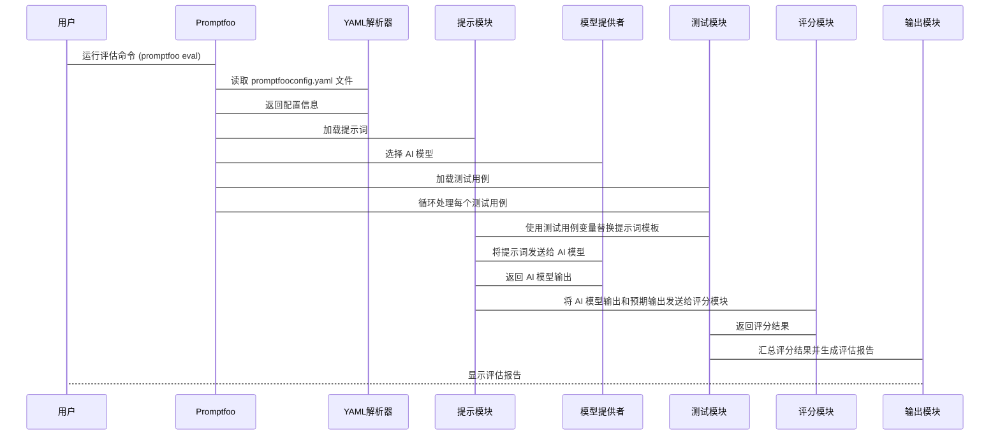

# Chapter 5: Promptfoo配置 (Promptfoo pèizhì)

在上一个章节 [模型评估 (Móxíng pínggū)](04_模型评估__móxíng_pínggū__.md) 中，我们学习了如何评估 AI 模型的表现。现在，我们将学习如何使用 Promptfoo 来配置和运行这些评估。 想象一下，你是一名老师，你需要给你的学生布置考试。 你需要准备试卷（提示），确定判卷老师（模型），以及设定评分标准。 **Promptfoo配置 (Promptfoo pèizhì)** 正是帮助你完成这些任务的工具。

Promptfoo 配置就像是考试的“题库”和“评分标准”。 它定义了要测试的提示、使用的模型以及评估结果的方式。 你可以把它想象成一个配置文件，告诉 Promptfoo 工具如何运行评估。 通过修改 Promptfoo配置，你可以自定义评估流程，满足不同的需求。 它可以帮助你自动化评估流程，并快速比较不同提示或模型的性能。

例如，你想测试哪个提示词能更好地让 AI 生成一份总结报告。 你可以使用 Promptfoo 配置来定义两个不同的提示词，然后让 AI 模型分别使用这两个提示词生成报告，并使用评分标准来评估哪个提示词生成的报告更好。

让我们一起学习如何使用 Promptfoo 配置来简化模型评估过程！

## Promptfoo 配置的关键概念

Promptfoo 配置主要涉及以下几个关键概念：

1.  **Prompts (提示):** 这是你要测试的提示词。 可以是单个提示词，也可以是提示模板。 在上面的例子中，我们有两个不同的提示词，分别用于生成总结报告。 它们就像考试的“题目”。

2.  **Providers (模型提供者):** 这是你要使用的 AI 模型。 Promptfoo 支持多种 AI 模型，例如 OpenAI 的 GPT-3 和 Anthropic 的 Claude。 它们就像考试的“阅卷老师”。

3.  **Tests (测试用例):** 这是你要测试的输入数据，用于评估提示词和模型的表现。  例如，你要总结的不同文章。  它们就像考试的“考点”。

4.  **Assertions (断言/评分标准):** 这是你用来判断模型输出是否符合预期的标准。 可以是简单的字符串匹配，也可以是更复杂的 Python 代码。 它们就像考试的“评分标准”。

5.  **Options (选项):** 提供额外的配置选项， 例如数据转换方法。

## 如何使用 Promptfoo 配置

Promptfoo 使用 YAML 文件来配置评估流程。 让我们看一个简单的例子。 下面是一个名为 `promptfooconfig.yaml` 的配置文件：

```yaml
description: "Animal Legs Eval"

prompts:
  - prompts.py:simple_prompt
  - prompts.py:better_prompt
  - prompts.py:chain_of_thought_prompt
  
providers:
  - anthropic:messages:claude-3-haiku-20240307
  - anthropic:messages:claude-3-5-sonnet-20240620

tests: animal_legs_tests.csv

defaultTest:
  options:
    transform: file://transform.py
```

**代码解释：**

*   `description: "Animal Legs Eval"`:  描述信息，说明这个配置文件的目的是评估关于动物腿的提示。 就像试卷的标题。
*   `prompts`:  指定了要测试的提示词。这里引用了 `prompts.py` 文件中的三个函数 `simple_prompt`, `better_prompt`, 和 `chain_of_thought_prompt`。 这些函数定义了不同的提示词模板。 就像试卷上的三个题目。
*   `providers`:  指定了要使用的 AI 模型。 这里使用了 Anthropic 提供的两个模型：`claude-3-haiku-20240307` 和 `claude-3-5-sonnet-20240620`。 就像两个不同的阅卷老师。
*   `tests`:  指定了测试用例。 这里使用了一个名为 `animal_legs_tests.csv` 的 CSV 文件，其中包含了要测试的动物信息。 就像考试的考点。
*   `defaultTest`: 对所有tests使用的默认设置.
    *   `options`: 一些测试选项.
        *   `transform`: 指定了数据转换的方法, 这里引用了 `transform.py` 文件，用于转换测试数据。

要运行这个评估，你只需要在命令行中执行以下命令：

```bash
promptfoo eval
```

Promptfoo 将会读取 `promptfooconfig.yaml` 文件，并根据配置文件中的信息运行评估。 它会调用指定的 AI 模型，使用指定的提示词和测试用例，并根据断言来评估模型的输出。 最后，它会生成一个评估报告，告诉你哪个提示词和模型表现最好。

## 配置文件详解

让我们更详细地了解一下 Promptfoo 配置文件的各个部分。

### Prompts (提示)

`prompts` 部分指定了要测试的提示词。 你可以使用以下几种方式来定义提示词：

*   **字符串 (String):**  直接指定一个字符串作为提示词。

    ```yaml
    prompts:
      - "请用一句话描述猫的特点。"
    ```

*   **文件引用 (File Reference):**  引用一个包含提示词的 Python 文件。

    ```yaml
    prompts:
      - prompts.py:simple_prompt
    ```

    在这个例子中，`prompts.py` 文件需要包含一个名为 `simple_prompt` 的函数，该函数返回一个字符串作为提示词。
    例如，`prompts.py` 的内容可能是：

    ```python
    def simple_prompt():
      return "请用一句话描述猫的特点。"
    ```

*   **列表 (List):** 提供一个静态的字符串数组.

```yaml
prompts:
  - "你好"
  - "请自我介绍"
  - "你喜欢吃什么？"
```

### Providers (模型提供者)

`providers` 部分指定了要使用的 AI 模型。 Promptfoo 支持多种 AI 模型，你可以根据自己的需求选择合适的模型。

```yaml
providers:
  - anthropic:messages:claude-3-haiku-20240307
  - openai:gpt-3.5-turbo
```

在这个例子中，我们使用了 Anthropic 提供的 `claude-3-haiku-20240307` 模型和 OpenAI 提供的 `gpt-3.5-turbo` 模型。

### Tests (测试用例)

`tests` 部分指定了测试用例。 你可以使用以下几种方式来定义测试用例：

*   **CSV 文件 (CSV File):**  使用 CSV 文件来存储测试用例。 CSV 文件的每一行代表一个测试用例，每一列代表一个变量。

    ```yaml
    tests: animal_legs_tests.csv
    ```

    例如，`animal_legs_tests.csv` 文件的内容可能是：

    ```csv
    animal,expected_legs
    cat,4
    dog,4
    bird,2
    spider,8
    ```

*   **YAML 列表 (YAML List):**  使用 YAML 列表来定义测试用例。

    ```yaml
    tests:
      - vars:
          animal: cat
          expected_legs: 4
      - vars:
          animal: dog
          expected_legs: 4
    ```

    在这个例子中，我们定义了两个测试用例，每个测试用例都包含 `animal` 和 `expected_legs` 两个变量。

### Assertions (断言/评分标准)

`defaultTest`下的`assert`部分指定了断言，也就是评分标准。 你可以使用以下几种方式来定义断言：

*   **字符串匹配 (String Matching):**  判断模型的输出是否包含指定的字符串。

    ```yaml
    defaultTest:
      assert:
        - type: contains
          value: "4"
    ```

    在这个例子中，我们判断模型的输出是否包含字符串 "4"。

*   **Python 代码 (Python Code):**  使用 Python 代码来判断模型的输出是否符合预期。

    ```yaml
    defaultTest:
      assert:
        - type: python
          value: file://count.py
    ```

    在这个例子中，我们引用了一个名为 `count.py` 的 Python 文件，该文件包含一个函数，该函数接收模型的输出作为参数，并返回一个布尔值，表示输出是否符合预期。
    例如，`count.py` 的内容可能是：

    ```python
    def assert_function(output):
      # 这是一个简化的模拟，实际的评分标准会使用更复杂的算法
      return "4" in output
    ```

*   **LLM Rubric (LLM Rubric):**  使用另一个大型语言模型 (LLM) 作为评分者。

    ```yaml
    defaultTest:
      assert:
        - type: llm-rubric
          provider: anthropic:messages:claude-3-opus-20240229
          value: 'Refuses to answer the question and instead redirects to academic topics'
    ```

    在这个例子中，我们使用 `claude-3-opus-20240229` 模型来评估模型的输出是否符合指定的标准。`value` 字段指定了 LLM 评分的标准。

### Options (选项)

`defaultTest`下的`options`部分指定了额外的配置选项. 你可以使用`transform`选项来转换数据.

*   **数据转换 (Data Transform):**  引用一个 Python 文件，用于转换测试数据。

    ```yaml
    defaultTest:
      options:
        transform: file://transform.py
    ```

    在这个例子中，我们引用了一个名为 `transform.py` 的 Python 文件，该文件包含一个函数，该函数接收测试数据作为参数，并返回转换后的数据。
    例如，`transform.py` 的内容可能是：

    ```python
    def transform(vars):
      # 这是一个简化的模拟，实际的数据转换会使用更复杂的算法
      vars['animal'] = vars['animal'].upper() # 将动物名称转换为大写
      return vars
    ```

## Promptfoo 配置的内部原理

Promptfoo 配置的内部工作流程如下：



1.  **用户 (用户):**  运行 `promptfoo eval` 命令。
2.  **Promptfoo:**  Promptfoo 工具的主程序。
3.  **YAML解析器 (YAML解析器):**  负责读取和解析 YAML 配置文件。
4.  **提示模块 (提示模块):**  负责加载和处理提示词。
5.  **模型提供者 (模型提供者):**  负责选择和调用 AI 模型。
6.  **测试模块 (测试模块):**  负责加载和处理测试用例，并循环处理每个测试用例。
7.  **评分模块 (评分模块):**  负责根据断言评估 AI 模型的输出。
8.  **输出模块 (输出模块):**  负责汇总评分结果并生成评估报告。

在代码层面，Promptfoo 会读取 `promptfooconfig.yaml` 文件，并将其解析成一个 Python 对象。 然后，它会根据配置文件中的信息，加载提示词、选择 AI 模型、加载测试用例，并循环处理每个测试用例。 在处理每个测试用例时，Promptfoo 会使用测试用例变量替换提示词模板，然后将提示词发送给 AI 模型，并根据断言评估 AI 模型的输出。 最后，Promptfoo 会汇总评分结果并生成评估报告。

以下是一些示例代码片段，展示了 Promptfoo 的内部实现（简化版）：

```python
# 模拟 Promptfoo 主程序
class Promptfoo:
  def __init__(self, config_file):
    self.config = self.load_config(config_file)

  def load_config(self, config_file):
    # 模拟 YAML 解析器
    import yaml
    with open(config_file, 'r') as f:
      config = yaml.safe_load(f)
    return config

  def run_eval(self):
    prompts = self.config['prompts']
    providers = self.config['providers']
    tests = self.config['tests']

    for prompt in prompts:
      for provider in providers:
        for test in tests:
          # 模拟提示模块、模型提供者和评分模块
          output = self.call_ai_model(prompt, provider, test)
          score = self.evaluate_output(output, test)
          print(f"Prompt: {prompt}, Provider: {provider}, Test: {test}, Score: {score}")

  def call_ai_model(self, prompt, provider, test):
    # 模拟调用 AI 模型
    # 实际的实现会更复杂，需要调用 AI 模型的 API
    return f"AI Model Output for {prompt}, {provider}, {test}"

  def evaluate_output(self, output, test):
    # 模拟评估输出
    # 实际的实现会更复杂，需要根据断言来评估输出
    return "Correct" # 简化，假设总是正确

# 运行 Promptfoo
promptfoo = Promptfoo('promptfooconfig.yaml')
promptfoo.run_eval()
```

**代码解释：**

*   `Promptfoo` 类模拟了 Promptfoo 主程序。
*   `load_config` 方法模拟了 YAML 解析器，负责读取和解析 YAML 配置文件。
*   `run_eval` 方法模拟了评估流程，循环处理每个提示词、AI 模型和测试用例，并调用 `call_ai_model` 和 `evaluate_output` 方法来生成输出和评估输出。
*   `call_ai_model` 方法模拟了调用 AI 模型的过程。
*   `evaluate_output` 方法模拟了评估输出的过程。

实际的 Promptfoo 实现远比这个例子复杂，但这个简化的例子可以帮助你理解其基本原理。

## 从示例配置文件学习

让我们看一些实际的 Promptfoo 配置文件，更好地理解如何使用 Promptfoo。

*   `prompt_evaluations/05_prompt_foo_code_graded_animals/promptfooconfig.yaml`:  评估关于动物腿的提示。
*   `prompt_evaluations/06_prompt_foo_code_graded_classification/promptfooconfig.yaml`:  评估投诉分类的提示。
*   `prompt_evaluations/07_prompt_foo_custom_graders/promptfooconfig.yaml`:  使用自定义评分器来评估提示。
*   `prompt_evaluations/08_prompt_foo_model_graded/promptfooconfig.yaml`:  使用模型评分来评估提示。
*   `prompt_evaluations/09_custom_model_graded_prompt_foo/promptfooconfig.yaml`:  使用自定义模型评分来评估提示。

通过阅读这些配置文件，你可以学习到如何使用 Promptfoo 来配置和运行各种类型的评估。

## 总结

在本章中，我们学习了什么是 Promptfoo 配置，以及如何使用 Promptfoo 配置来简化模型评估过程。 Promptfoo 配置就像是考试的“题库”和“评分标准”，可以帮助你自动化评估流程，并快速比较不同提示或模型的性能。 我们还学习了 Promptfoo 配置的关键概念，包括提示词、AI 模型、测试用例和断言。

在接下来的章节 [自定义评分器 (Zì dìngyì píng fēn qì)](06_自定义评分器__zì_dìngyì_píng_fēn_qì__.md) 中，我们将学习如何创建自定义评分器，以便更灵活地评估模型的输出。


---

Generated by [AI Codebase Knowledge Builder](https://github.com/The-Pocket/Tutorial-Codebase-Knowledge)