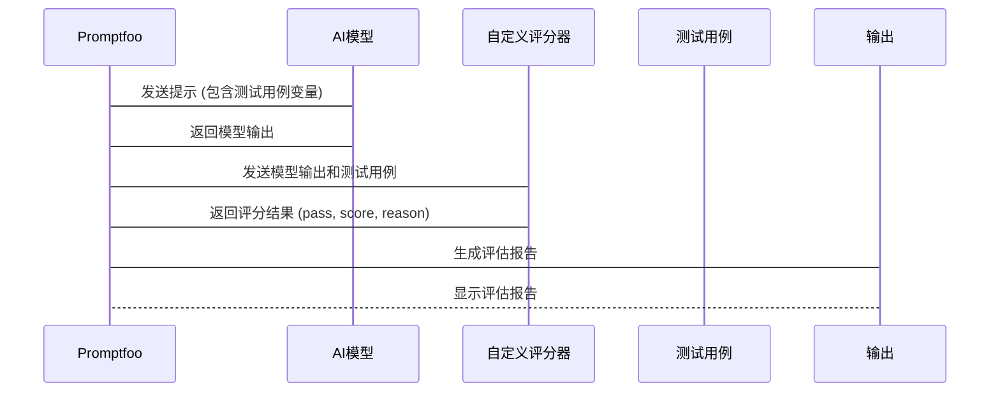

# Chapter 6: 自定义评分器 (Zì dìngyì píng fēn qì)

在上一章节 [Promptfoo配置 (Promptfoo pèizhì)](05_promptfoo配置__promptfoo_pèizhi__.md) 中，我们学习了如何使用 Promptfoo 配置文件来定义和运行模型评估。 但是，默认的评分标准可能无法满足所有的需求。想象一下，你是语文老师，你需要评估学生作文中特定词语的使用次数是否符合要求，比如“春天”这个词语必须出现3次。简单的字符串匹配可能无法胜任这项任务。 这时候，**自定义评分器 (Zì dìngyì píng fēn qì)** 就派上用场了!

自定义评分器就像是为AI考试设计的“个性化评分标准”。 默认的评分方式可能无法满足所有需求，因此你可以编写自己的代码来评估AI的回答。 比如，你可以编写代码来检查AI回答中是否包含特定的关键词， 或者计算AI回答的准确率。 它允许你编写灵活的 Python 代码来定义你的评估逻辑，从而满足更复杂的评估需求。

## 什么是自定义评分器？

可以将自定义评分器理解为专门为某个任务定制的“裁判”。默认的评分方式就像通用的裁判规则，适用于大部分情况，但对于一些特殊的场景，我们需要更专业的裁判。

自定义评分器是使用 Python 编写的函数，它接收 AI 模型的输出和一些上下文信息作为输入，然后根据你的自定义逻辑，返回一个评分结果。 这个评分结果可以包含以下信息：

*   **pass:** 一个布尔值，表示模型输出是否通过了评估。
*   **score:** 一个数值，表示模型输出的得分。
*   **reason:** 一个字符串，解释为什么模型输出通过或未通过评估。

## 如何使用自定义评分器？

让我们通过一个简单的例子来演示如何使用自定义评分器。 假设我们想评估 AI 模型生成的文章中，特定主题词出现的次数是否符合要求。

**步骤 1：编写自定义评分器**

我们可以编写一个 Python 函数来实现这个评分逻辑。 让我们参考一下 `prompt_evaluations/07_prompt_foo_custom_graders/count.py` 这个文件。

```python
import re

def get_assert(output, context):
    topic = context["vars"]["topic"]
    goal_count = int(context["vars"]["count"])
    pattern = fr'(^|\s)\b{re.escape(topic)}\b'

    actual_count = len(re.findall(pattern, output.lower()))

    pass_result = goal_count == actual_count

    result = {
        "pass": pass_result,
        "score": 1 if pass_result else 0,
        "reason": f"Expected {topic} to appear {goal_count} times. Actual: {actual_count}",
    }
    return result
```

**代码解释：**

*   `get_assert(output, context)` 函数是我们的自定义评分器。 它接收两个参数：
    *   `output`: AI 模型的输出。
    *   `context`: 一个包含上下文信息的字典，例如测试用例中定义的变量。
*   `topic = context["vars"]["topic"]` 从上下文中获取要检查的主题词。
*   `goal_count = int(context["vars"]["count"])` 从上下文中获取主题词应该出现的次数。
*   `pattern = fr'(^|\s)\b{re.escape(topic)}\b'` 创建一个正则表达式，用于匹配主题词。
*   `actual_count = len(re.findall(pattern, output.lower()))` 统计主题词在 AI 模型输出中实际出现的次数。
*   `pass_result = goal_count == actual_count` 判断主题词出现的次数是否符合要求。
*   `result = { ... }`  创建一个包含评分结果的字典。`pass` 字段指示测试是否通过，`score` 字段提供一个数值分数（1 或 0），`reason` 字段则解释了评分的原因。

**步骤 2：配置 Promptfoo**

现在，我们需要在 Promptfoo 配置文件中指定使用这个自定义评分器。 让我们参考 `prompt_evaluations/07_prompt_foo_custom_graders/promptfooconfig.yaml` 这个文件。

```yaml
description: Topic Count Eval

prompts:
  - "Write a short story about {topic}."

providers:
  - openai:gpt-3.5-turbo

tests: topic_count_tests.csv

defaultTest:
  assert:
    - type: python
      value: file://count.py
```

**代码解释：**

*   `assert`:  定义了评分标准。
*   `type: python`:  指定使用 Python 代码作为评分标准。
*   `value: file://count.py`:  指定自定义评分器的 Python 文件。

**步骤 3：准备测试用例**

我们需要准备一个 CSV 文件，其中包含要测试的主题词和期望出现的次数。 让我们参考 `prompt_evaluations/07_prompt_foo_custom_graders/topic_count_tests.csv` 这个文件。

```csv
topic,count
cat,3
dog,2
bird,4
```

**代码解释：**

*   `topic`: 要测试的主题词。
*   `count`:  主题词应该出现的次数。

**步骤 4：运行评估**

现在，我们可以使用以下命令运行评估：

```bash
promptfoo eval
```

Promptfoo 将会读取配置文件，调用 AI 模型生成文章，然后使用自定义评分器 `count.py` 来评估文章中主题词出现的次数是否符合要求，并生成评估报告。

## 自定义评分器的内部原理

让我们简单了解一下自定义评分器的内部工作原理。 我们可以用一个简化的序列图来描述：



1.  **Promptfoo:**  Promptfoo 工具的主程序。
2.  **AI模型 (AI Model):**  根据提示生成文本。
3.  **自定义评分器 (Zì dìngyì píng fēn qì):**  接收模型输出和测试用例，并根据自定义逻辑给出评分结果。
4.  **测试用例 (测试用例):**  包含测试数据和预期结果。
5.  **输出 (Output):**  呈现评估报告，包含评估指标和详细的评估结果。

**代码层面 (简化示例, 仅供理解概念):**

```python
def promptfoo_eval(prompt, ai_model, custom_grader, test_case):
  """
  模拟 Promptfoo 评估过程
  """
  model_output = ai_model(prompt.format(**test_case)) # 模拟 AI 模型生成输出
  grading_result = custom_grader(model_output, {"vars": test_case}) # 调用自定义评分器
  return grading_result

# 模拟 AI 模型 (简单示例)
def ai_model(prompt):
  return f"猫 猫 猫 在 {prompt} 中"

# 模拟自定义评分器 (来自 count.py, 简化)
def custom_grader(output, context):
  topic = context["vars"]["topic"]
  goal_count = int(context["vars"]["count"])
  actual_count = output.count(topic)
  pass_result = goal_count == actual_count
  return {"pass": pass_result, "score": 1 if pass_result else 0, "reason": "..."}

# 模拟测试用例
test_case = {"topic": "猫", "count": 3}
prompt = "写一篇关于 {topic} 的短文"

# 运行评估
result = promptfoo_eval(prompt, ai_model, custom_grader, test_case)
print(result) # 输出: {'pass': True, 'score': 1, 'reason': '...'}
```

**代码解释：**

*   `promptfoo_eval` 函数模拟了 Promptfoo 的评估过程。
*   `ai_model` 函数模拟了 AI 模型的输出。 实际上，这会调用一个远程的 API 端点。
*   `custom_grader` 函数模拟了自定义评分器。 实际上，Promptfoo 会执行 `count.py` 文件中的 `get_assert` 函数。
*   代码演示了如何使用这些模拟组件来评估一个简单的测试用例。

当然，实际的Promptfoo 代码会更复杂，它会处理配置文件，调用不同的模型，并以结构化的格式输出结果。

## 使用 LLM 作为评分器

除了编写 Python 代码，还可以使用另一个 LLM (Large Language Model) 作为评分器。 这对于评估模型的输出质量非常有用，例如判断生成文本的流畅度、相关性或准确性。

你可以参考 `prompt_evaluations/08_prompt_foo_model_graded/promptfooconfig.yaml` 和 `prompt_evaluations/09_custom_model_graded_prompt_foo/promptfooconfig.yaml` 文件，了解如何配置 Promptfoo 以使用 LLM 评分器。

`prompt_evaluations/09_custom_model_graded_prompt_foo/custom_llm_eval.py` 文件包含使用 Claude 模型进行评分的示例代码。

```python
import anthropic
import os
import json

def llm_eval(summary, article):
    # ... (使用 Claude 模型评估 summary) ...
    #  返回平均分数和模型的解释
    return avg_score, response.content[0].text

def get_assert(output: str, context, threshold=4.5):
    article = context['vars']['article']
    score, evaluation = llm_eval(output, article )
    return {
        "pass": score >= threshold,
        "score": score,
        "reason": evaluation
    }
```

这段代码使用 Anthropic 的 Claude 模型来评估文章摘要的质量，并返回一个包含 `pass`，`score` 和 `reason` 字段的结果字典。

## 总结

在本章中，我们学习了什么是自定义评分器，以及如何使用自定义评分器来更灵活地评估模型的输出。 自定义评分器允许你编写灵活的 Python 代码来定义你的评估逻辑，从而满足更复杂的评估需求。 我们还学习了如何使用另一个 LLM 作为评分器。

在接下来的章节 [数据转换 (Shùjù zhuǎnhuàn)](07_数据转换__shùjù_zhuǎnhuàn__.md) 中，我们将学习如何转换测试数据，以便更好地适应模型的输入要求。


---

Generated by [AI Codebase Knowledge Builder](https://github.com/The-Pocket/Tutorial-Codebase-Knowledge)