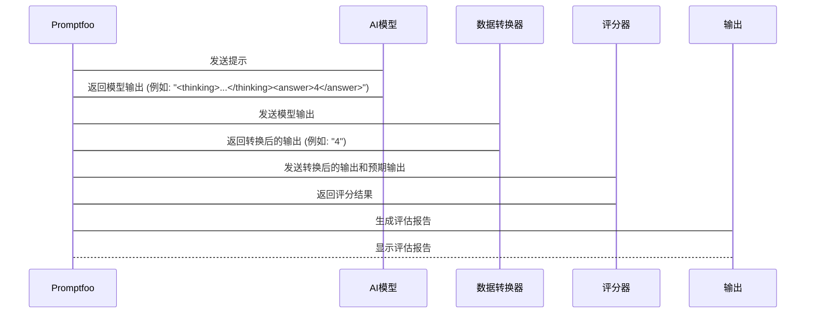

# Chapter 7: 数据转换 (Shùjù zhuǎnhuàn)

在上一章节 [自定义评分器 (Zì dìngyì píng fēn qì)](06_自定义评分器__zì_dìngyì_píng_fēn_qì__.md) 中，我们学习了如何创建自定义评分器来更灵活地评估模型的输出。 现在，让我们学习如何处理数据转换，也就是 **数据转换 (Shùjù zhuǎnhuàn)**。

想象一下，你是一位厨师，想要用烤箱烤一道美味的菜。 但是，食材的形状和大小可能不适合直接放入烤箱，你需要先对食材进行一些处理，比如切块、腌制等。 **数据转换 (Shùjù zhuǎnhuàn)** 就像是处理食材的过程，目的是将原始数据转换成 AI 模型更容易理解和处理的格式。

一个常见的例子是，AI模型希望你返回的都是数字，但是你的测试数据里有一些是文本，比如"猫"，"狗"，"鸟"。 为了能够让 AI 模型正常工作，你可能需要将这些文本转换成数字，比如"猫"对应1，"狗"对应2，"鸟"对应3。 这就是数据转换的意义。

## 什么是数据转换？

数据转换就像是调整AI回答的“格式”。 在评估AI的回答之前，你可能需要对AI的输出进行一些处理， 比如提取数字、删除空格等。 这就像是把原始数据清洗干净，才能更好地进行分析。

具体来说，数据转换包括以下几个步骤：

1.  **理解原始数据：** 了解原始数据的格式、类型和特点。 就像了解食材的种类、形状和大小。
2.  **确定目标格式：** 确定 AI 模型需要的数据格式。 就像确定烤箱能够容纳的食材形状和大小。
3.  **编写转换代码：** 编写代码将原始数据转换成目标格式。 就像切菜、腌制等处理食材的过程。

## 如何使用数据转换？

让我们通过一个简单的例子来演示如何使用数据转换。 假设我们有一个 AI 模型，可以根据动物描述来判断动物有多少条腿。 但是，我们的测试数据中，动物描述包含一些额外的文本，比如 `<thinking>这是一个思考过程</thinking>`。 我们可以使用数据转换来删除这些额外的文本，只保留动物腿的数量。

**步骤 1：编写数据转换代码**

我们可以编写一个 Python 函数来实现这个数据转换逻辑。 让我们参考一下 `prompt_evaluations/05_prompt_foo_code_graded_animals/transform.py` 这个文件。

```python
def get_transform(output, context):
    if "<thinking>" in output:
        try:
            return output.split("<answer>")[1].split("</answer>")[0].strip()
        except Exception as e:
            print(f"Error in get_transform: {e}")
            return output
    return output
```

**代码解释：**

*   `get_transform(output, context)` 函数是我们的数据转换函数。 它接收两个参数：
    *   `output`: AI 模型的输出。
    *   `context`: 一个包含上下文信息的字典。 （虽然在这个例子中没有用到，但为了通用性，还是保留了 context 参数）
*   `if "<thinking>" in output:` 判断输出是否包含 `<thinking>` 标签。
*   `return output.split("<answer>")[1].split("</answer>")[0].strip()` 使用字符串分割来提取 `<answer>` 标签中的内容，并删除首尾的空格。 这是一个错误处理：如果出现了异常，打印错误信息，并返回原始输出.
*   `return output` 如果输出不包含 `<thinking>` 标签，则直接返回原始输出。

**示例：**

如果 AI 模型的输出是 `<thinking>这是一个思考过程</thinking><answer>4</answer>`，那么经过数据转换后，输出将变成 `4`。

如果 AI 模型的输出是 `4`，那么经过数据转换后，输出仍然是 `4`。

**步骤 2：配置 Promptfoo**

现在，我们需要在 Promptfoo 配置文件中指定使用这个数据转换函数。 让我们参考 `prompt_evaluations/05_prompt_foo_code_graded_animals/promptfooconfig.yaml` 这个文件。

```yaml
description: "Animal Legs Eval"

prompts:
  - prompts.py:simple_prompt
  - prompts.py:better_prompt
  - prompts.py:chain_of_thought_prompt
  
providers:
  - anthropic:messages:claude-3-haiku-20240307
  - anthropic:messages:claude-3-5-sonnet-20240620

tests: animal_legs_tests.csv

defaultTest:
  options:
    transform: file://transform.py
```

**代码解释：**

*   `defaultTest`: 对所有tests使用的默认设置.
    *   `options`: 一些测试选项.
        *   `transform: file://transform.py`:  指定了数据转换的 Python 文件。

**步骤 3：运行评估**

现在，我们可以使用以下命令运行评估：

```bash
promptfoo eval
```

Promptfoo 将会读取配置文件，调用 AI 模型生成输出，然后使用数据转换函数 `transform.py` 来转换输出，最后根据评分标准评估转换后的输出，并生成评估报告。

## 数据转换的内部原理

让我们简单了解一下数据转换的内部工作原理。 我们可以用一个简化的序列图来描述：



1.  **Promptfoo:** Promptfoo 工具的主程序.
2.  **AI模型 (AI Model):** 根据提示生成文本.
3.  **数据转换器 (数据转换器):** 接收模型输出，并根据转换逻辑进行数据转换.
4.  **评分器 (评分器):** 接收转换后的输出和预期输出，并根据评分标准给出评分结果.
5.  **输出 (Output):** 呈现评估报告，包含评估指标和详细的评估结果.

**代码层面 (简化示例, 仅供理解概念):**

```python
def promptfoo_eval(prompt, ai_model, data_transformer, test_case):
  """
  模拟 Promptfoo 评估过程
  """
  model_output = ai_model(prompt.format(**test_case)) # 模拟 AI 模型生成输出
  transformed_output = data_transformer(model_output, {}) # 调用数据转换器
  return transformed_output

# 模拟 AI 模型 (简单示例)
def ai_model(prompt):
  return f"<thinking>思考一下...</thinking><answer>4</answer>"

# 模拟数据转换器 (来自 transform.py, 简化)
def data_transformer(output, context):
    if "<thinking>" in output:
        return output.split("<answer>")[1].split("</answer>")[0].strip()
    return output

# 模拟测试用例
test_case = {} # 示例中未使用测试用例变量
prompt = "动物有多少条腿？"

# 运行评估
transformed_output = promptfoo_eval(prompt, ai_model, data_transformer, test_case)
print(transformed_output) # 输出: 4
```

**代码解释：**

*   `promptfoo_eval` 函数模拟了 Promptfoo 的评估过程。
*   `ai_model` 函数模拟了 AI 模型的输出。
*   `data_transformer` 函数模拟了数据转换器。 实际上，Promptfoo 会执行 `transform.py` 文件中的 `get_transform` 函数。
*   代码演示了如何使用这些模拟组件来转换 AI 模型的输出。

## 数据转换的应用场景

数据转换在实际应用中非常常见。 以下是一些常见的数据转换场景：

*   **提取数字：** 从 AI 模型的输出中提取数字，例如从 "价格是 100 元" 中提取出 "100"。
*   **删除空格：** 删除 AI 模型输出中的多余空格，例如将 "  你好  " 转换成 "你好"。
*   **格式转换：** 将 AI 模型的输出转换成特定的格式，例如将 "true" 和 "false" 转换成布尔值 `True` 和 `False`。
*   **数据清洗：** 清洗 AI 模型输出中的无效字符或错误数据。

## 总结

在本章中，我们学习了什么是数据转换，以及如何使用数据转换来将原始数据转换成 AI 模型更容易理解和处理的格式。 数据转换就像是处理食材的过程，目的是让食材更适合烤箱。 我们还学习了如何编写数据转换代码，以及如何在 Promptfoo 配置文件中指定使用数据转换函数。

通过学习本章，你已经掌握了评估和优化 AI 模型输出的重要技能。 在接下来的学习中，你可以尝试使用数据转换来解决更复杂的评估问题，例如评估 AI 模型生成的文章质量，或者评估 AI 模型生成的代码是否正确。

因为课程到此结束，没有下一章节。 你现在已经掌握了提示工程、提示模板、工具使用、模型评估、Promptfoo配置和自定义评分器的相关知识， 可以利用这些知识来构建高效、可靠的 AI 应用。 祝你学习愉快!


---

Generated by [AI Codebase Knowledge Builder](https://github.com/The-Pocket/Tutorial-Codebase-Knowledge)