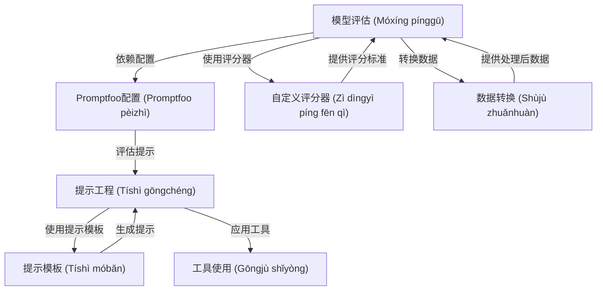

# Tutorial: courses

本项目`courses`旨在提供一系列关于 **Anthropic API** 和 **Claude 模型** 的*教育课程*。
它涵盖了从基础的 **API 使用** 和 **提示工程**，到高级的 **模型评估** 和 **工具使用** 等方面。
通过学习这些课程，用户可以更好地理解和应用 Claude 模型。

**Source Repository:** [https://github.com/anthropics/courses](https://github.com/anthropics/courses)

## Chapters

1. [提示工程 (Tíshì gōngchéng)
](01_提示工程__tíshì_gōngchéng__.md)
2. [提示模板 (Tíshì móbǎn)
](02_提示模板__tíshì_móbǎn__.md)
3. [工具使用 (Gōngjù shǐyòng)
](03_工具使用__gōngjù_shǐyòng__.md)
4. [模型评估 (Móxíng pínggū)
](04_模型评估__móxíng_pínggū__.md)
5. [Promptfoo配置 (Promptfoo pèizhì)
](05_promptfoo配置__promptfoo_pèizhì__.md)
6. [自定义评分器 (Zì dìngyì píng fēn qì)
](06_自定义评分器__zì_dìngyì_píng_fēn_qì__.md)
7. [数据转换 (Shùjù zhuǎnhuàn)
](07_数据转换__shùjù_zhuǎnhuàn__.md)

---

Generated by [AI Codebase Knowledge Builder](https://github.com/The-Pocket/Tutorial-Codebase-Knowledge)