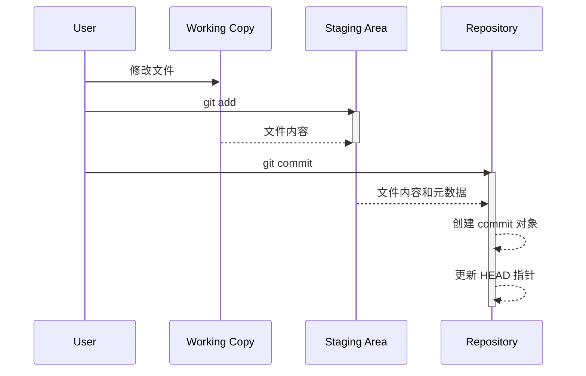

# Chapter 1: 版本控制 (Bǎnběn kòngzhì)

欢迎来到 DevOps 练习系列教程的第一章！ 在本章中，我们将一起探索一个非常重要的概念：版本控制 (Bǎnběn kòngzhì)。

版本控制就像一个时光机，让我们可以随时回到过去。 想象一下，你正在编写一个故事，突然你不小心删掉了一段非常精彩的文字。 如果没有版本控制，这段文字可能就永远消失了！ 但是，如果使用了版本控制，你可以轻松地回到之前的版本，找回这段文字。

版本控制对于多人协作开发项目尤为重要。 想象一下，你和你的朋友一起编写一个程序。 如果没有版本控制，你们可能会互相覆盖对方的代码，导致程序出现错误。 但是，如果使用了版本控制，你们就可以同时修改同一个程序，而不会互相干扰，并且可以轻松地合并你们的修改。

现在，让我们深入了解一下版本控制。

## 什么是版本控制？

版本控制 (Bǎnběn kòngzhì) 是一种记录项目文件更改的技术，以便你可以随时回溯到以前的版本。它就像一个备份系统，但比备份系统更强大，因为它不仅仅是简单地复制文件，而是记录了每一次更改的详细信息。

版本控制的一些关键概念包括：

*   **仓库 (Cāngkù, Repository)**：一个存储项目所有文件的历史记录的地方。 想象一下，这是一个包含你项目所有版本信息的保险箱。
*   **提交 (Tíjiāo, Commit)**：一次对项目文件的更改的保存记录。 想象一下，这是你为故事添加的一段新文字，你决定保存一下。
*   **分支 (Fēnzhī, Branch)**：一个独立的开发线，允许你进行实验性的更改，而不会影响主代码。 想象一下，你决定写一个故事的另一个结局，但你不想影响原来的结局。
*   **合并 (Héng, Merge)**：将一个分支的更改合并到另一个分支。 想象一下，你决定将你写的另一个结局合并到原来的故事中。

最流行的版本控制系统是 Git。 我们将在接下来的章节中使用 Git 来演示版本控制。

## 使用版本控制解决问题

让我们回到我们的故事编写的例子。 假设我们有一个名为 `story.txt` 的文件，内容如下：

```
Once upon a time, there was a brave knight.
```

现在，我们想添加一些新的内容：

```
Once upon a time, there was a brave knight.
He lived in a castle and protected the kingdom.
```

我们可以使用 Git 来跟踪这些更改。 首先，我们需要创建一个 Git 仓库：

```bash
git init
```

这个命令会在当前目录下创建一个名为 `.git` 的隐藏文件夹。 这个文件夹就是我们的 Git 仓库。

接下来，我们需要将 `story.txt` 文件添加到 Git 仓库：

```bash
git add story.txt
```

这个命令会将 `story.txt` 文件添加到暂存区 (staging area)。 暂存区是 Git 仓库中一个临时区域，用于存储我们想要提交的更改。

现在，我们可以提交我们的更改：

```bash
git commit -m "Add the knight's background story"
```

这个命令会将暂存区中的更改保存到 Git 仓库中。 `-m` 选项用于指定提交消息，提交消息应该描述这次提交的更改内容。

现在，如果我们想回到之前的版本，我们可以使用 `git log` 命令查看提交历史：

```bash
git log
```

这个命令会显示所有的提交记录，包括提交 ID、作者、提交时间和提交消息。 我们可以使用提交 ID 来回到之前的版本。

假设我们想回到添加背景故事之前的版本，我们可以使用 `git checkout` 命令：

```bash
git checkout <commit_id>
```

将 `<commit_id>` 替换为我们想要回到的版本的提交 ID。

现在，我们的 `story.txt` 文件会回到添加背景故事之前的状态。

```
Once upon a time, there was a brave knight.
```

我们可以使用 `git checkout main` 命令回到最新的版本（假设 `main` 是我们的主分支）。

```bash
git checkout main
```

## 版本控制的内部实现

当执行 `git commit` 命令时，Git 做了什么呢？

下面是一个简化的流程图：



1.  **用户 (User)** 修改工作目录 (Working Copy, WC) 中的文件。
2.  **用户 (User)** 使用 `git add` 命令将修改的文件添加到暂存区 (Staging Area, SA)。
3.  Git 将工作目录中的文件内容复制到暂存区。
4.  **用户 (User)** 使用 `git commit` 命令提交暂存区中的更改。
5.  Git 将暂存区中的文件内容和元数据（例如作者、提交时间、提交消息）复制到仓库 (Repository, Repo)。
6.  Git 在仓库中创建一个 commit 对象，commit 对象包含了文件内容、元数据以及指向父 commit 对象的指针。
7.  Git 更新 HEAD 指针，使其指向新的 commit 对象。 HEAD 指针指向当前分支的最新 commit 对象。

在 `.git` 目录下，你会发现一些重要的文件和文件夹：

*   `objects`：存储所有 commit 对象、tree 对象和 blob 对象。
*   `refs/heads`：存储所有本地分支的指针。
*   `HEAD`：指向当前分支的指针。
*   `index`：暂存区的文件。

## 总结

在本章中，我们学习了版本控制的基本概念，包括仓库、提交、分支和合并。 我们还学习了如何使用 Git 来跟踪文件的更改、回到之前的版本以及查看提交历史。

版本控制是 DevOps 中一个非常重要的工具。 它可以帮助我们更好地协作开发项目、管理代码更改以及快速恢复到之前的版本。 在 [持续集成/持续交付 (Chíxù jíchéng/chíxù jiāofù)
](02_持续集成_持续交付__chíxù_jíchéng_chíxù_jiāofù__.md)中，我们将学习如何使用版本控制来自动化构建、测试和部署软件。


---

Generated by [AI Codebase Knowledge Builder](https://github.com/The-Pocket/Tutorial-Codebase-Knowledge)