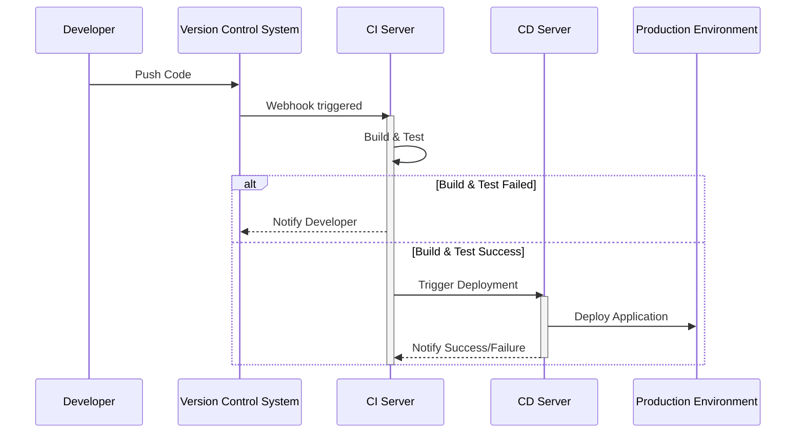

# Chapter 2: 持续集成/持续交付 (Chíxù jíchéng/chíxù jiāofù)

在[版本控制 (Bǎnběn kòngzhì)
](01_版本控制__bǎnběn_kòngzhì__.md)中，我们学习了如何使用 Git 来管理代码的更改。 现在，让我们更进一步，学习如何自动化构建、测试和部署软件。 这就是持续集成/持续交付 (CI/CD) 的用武之地。

想象一下你正在开发一个网站。 每次你修改代码后，都需要手动构建、测试和部署。 这很耗时，而且容易出错。 如果我们能自动化这个过程，岂不是更好？ 这就是 CI/CD 的目标。

持续集成/持续交付 (CI/CD) 就像一个装配线，代码更改通过一系列步骤，最终到达用户手中。 就像汽车工厂的装配线一样，每个步骤都经过精心设计，以确保高质量的产品。

## 什么是持续集成/持续交付？

持续集成 (CI) 是一种将代码更改频繁合并到共享存储库的实践。 这意味着开发者每天多次将他们的代码更改合并到主分支。 每次合并都会自动构建和测试代码，以确保没有引入错误。

持续交付 (CD) 是一种自动将软件更改发布到生产环境的实践。 这意味着每次代码更改通过所有测试后，都会自动部署到生产环境。

它们共同构成了一个流程，确保代码更改快速、频繁且可靠地发布。

用更简单的话来说：

*   **持续集成 (CI)**： 频繁地把你的代码合并到一起，并且每次都自动检查代码有没有问题。
*   **持续交付 (CD)**： 自动地把没有问题的代码发布到可以给用户使用的环境。

## 关键概念

为了更好地理解 CI/CD，让我们分解几个关键概念：

*   **源代码仓库 (Source Code Repository)**： 这是存储项目代码的地方，例如 Git 仓库。 我们在 [版本控制 (Bǎnběn kòngzhì)
](01_版本控制__bǎnběn_kòngzhì__.md) 中已经介绍过。
*   **构建 (Build)**： 将源代码编译成可执行程序的过程。 例如，将 Java 代码编译成 .jar 文件。
*   **测试 (Test)**： 运行自动化测试以确保代码按预期工作。 例如，运行单元测试和集成测试。
*   **部署 (Deploy)**： 将软件发布到生产环境的过程。 例如，将网站部署到服务器。
*   **流水线 (Pipeline)**： 自动化 CI/CD 流程的一系列步骤。 就像装配线上的各个工位。

## 使用 CI/CD 解决问题

让我们回到我们的网站开发例子。 假设我们有一个名为 `website` 的 Git 仓库。 每次我们提交代码更改到主分支，我们都想自动构建、测试和部署我们的网站。

我们可以使用 CI/CD 工具（例如 Jenkins、GitLab CI 或 GitHub Actions）来设置一个流水线。

这是一个使用 GitHub Actions 的简单流水线示例：

```yaml
name: CI/CD Pipeline # 流水线的名字

on: # 触发流水线的事件
  push:
    branches: [ main ] # 当代码推送到 main 分支时触发

jobs: # 定义流水线中的任务
  build: # 构建任务
    runs-on: ubuntu-latest # 在 Ubuntu 虚拟机上运行
    steps: # 任务中的步骤
      - uses: actions/checkout@v3 # 使用 checkout action 来检出代码
      - name: Build # 构建步骤的名字
        run: echo "Building the website..." # 运行构建命令
  test: # 测试任务
    runs-on: ubuntu-latest # 在 Ubuntu 虚拟机上运行
    needs: build # 依赖于构建任务完成
    steps: # 任务中的步骤
      - uses: actions/checkout@v3 # 使用 checkout action 来检出代码
      - name: Test # 测试步骤的名字
        run: echo "Running tests..." # 运行测试命令
  deploy: # 部署任务
    runs-on: ubuntu-latest # 在 Ubuntu 虚拟机上运行
    needs: test # 依赖于测试任务完成
    steps: # 任务中的步骤
      - uses: actions/checkout@v3 # 使用 checkout action 来检出代码
      - name: Deploy # 部署步骤的名字
        run: echo "Deploying the website..." # 运行部署命令
```

这个 YAML 文件定义了一个名为 "CI/CD Pipeline" 的流水线。 这个流水线由三个任务组成：`build`、`test` 和 `deploy`。

*   `build` 任务负责构建网站。 它会在 Ubuntu 虚拟机上运行 `echo "Building the website..."` 命令。 这只是一个示例命令。 实际上，你会运行构建你的网站所需的命令，例如 `npm install` 和 `npm build`。
*   `test` 任务负责运行测试。 它会在 Ubuntu 虚拟机上运行 `echo "Running tests..."` 命令。 同样，这只是一个示例命令。 实际上，你会运行你的测试套件，例如 `npm test`。
*   `deploy` 任务负责部署网站。 它会在 Ubuntu 虚拟机上运行 `echo "Deploying the website..."` 命令。 实际部署可能涉及将文件复制到服务器，或者更新云服务配置。

`needs` 关键字用于定义任务之间的依赖关系。 例如，`test` 任务依赖于 `build` 任务完成。 这意味着 `test` 任务只有在 `build` 任务成功完成后才会运行。

当我们将这个 YAML 文件提交到 `.github/workflows` 目录下时，GitHub Actions 会自动检测到它并运行流水线。

## CI/CD 的内部实现

让我们深入了解一下 CI/CD 工具内部发生了什么。

这是一个简化的流程图：



1.  **开发者 (DEV)** 将代码推送到版本控制系统 (Version Control System, VCS)，例如 Git 仓库。
2.  版本控制系统 (VCS) 通过 Webhook 触发持续集成服务器 (CI Server)。
3.  持续集成服务器 (CI) 构建和测试代码。
4.  如果构建和测试失败，持续集成服务器 (CI) 会通知开发者 (DEV)。
5.  如果构建和测试成功，持续集成服务器 (CI) 会触发持续交付服务器 (CD)。
6.  持续交付服务器 (CD) 将应用程序部署到生产环境 (Production Environment, PROD)。
7.  持续交付服务器 (CD) 通知持续集成服务器 (CI) 部署成功或失败。

不同的 CI/CD 工具可能会有不同的实现细节，但基本原理是相同的。 它们都旨在自动化构建、测试和部署软件的过程。

## 总结

在本章中，我们学习了持续集成/持续交付 (CI/CD) 的基本概念。 我们了解了如何使用 CI/CD 工具来自动化构建、测试和部署软件的过程。

CI/CD 是 DevOps 中一个非常重要的工具。 它可以帮助我们更快、更频繁地交付高质量的软件。 在[虚拟私有云 (Xūnǐ sīyǒu yún)
](03_虚拟私有云__xūnǐ_sīyǒu_yún__.md) 中，我们将学习如何使用云服务来托管我们的应用程序。


---

Generated by [AI Codebase Knowledge Builder](https://github.com/The-Pocket/Tutorial-Codebase-Knowledge)