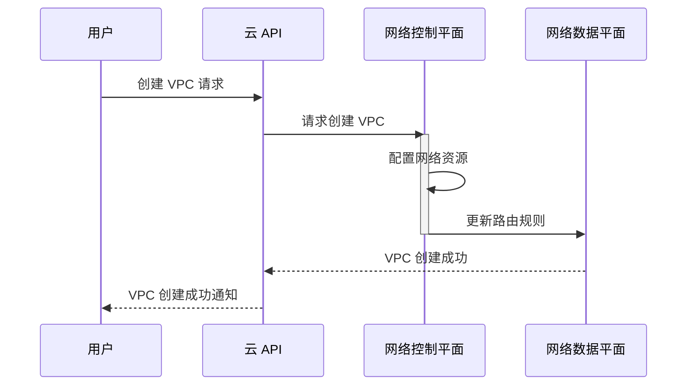

# Chapter 3: 虚拟私有云 (Xūnǐ sīyǒu yún)

在[持续集成/持续交付 (Chíxù jíchéng/chíxù jiāofù)
](02_持续集成_持续交付__chíxù_jíchéng_chíxù_jiāofù__.md)中，我们学习了如何自动化构建、测试和部署软件。 现在，让我们来探讨一下如何安全且隔离地运行这些软件。 这就是虚拟私有云 (VPC) 的作用所在！

想象一下，你正在开发一个在线商店。 你需要服务器来运行网站，数据库来存储商品信息，以及其他各种服务。 你可以将这些资源放在云提供商提供的共享环境中，但这样做可能会带来安全风险，并且难以管理。  使用虚拟私有云 (VPC)，你可以创建一个属于你自己的、完全隔离的云环境，就像你在云提供商的数据中心里拥有了一个私人的小天地！

## 什么是虚拟私有云 (VPC)？

虚拟私有云 (Xūnǐ sīyǒu yún, VPC) 就像你在云提供商的数据中心里拥有的一个隔离的网络。 您可以在此 VPC 中启动云资源，例如虚拟机和数据库，并将这些资源与公共互联网隔离开来。 这就像在共享办公空间中租用自己的私人办公室。 在你的私人办公室里，你可以自由地放置你的办公桌椅，安排你的工作空间，并且只有你和你允许的人才能进入。  VPC 让你能够在云上构建自己的安全且隔离的网络环境。

### 关键概念

为了更好地理解 VPC，让我们分解几个关键概念：

*   **子网 (Zǐwǎng, Subnet)**：子网是 VPC 的一部分，你可以将云资源放置在子网中。 想象一下，你的私人办公室里有几个房间，你可以将不同的设备放在不同的房间里。  例如，你可以将 Web 服务器放在一个子网中，将数据库服务器放在另一个子网中。
*   **路由表 (Lùyóu biǎo, Route Table)**：路由表定义了网络流量的路由规则。 想象一下，你的私人办公室里有一张地图，它指示流量如何到达不同的房间。 例如，你可以配置路由表，使得来自互联网的流量只能到达 Web 服务器所在的子网，而不能到达数据库服务器所在的子网。
*   **互联网网关 (Hùliánwǎng wǎngguān, Internet Gateway)**：互联网网关允许 VPC 中的资源与公共互联网通信。 想象一下，你的私人办公室里有一扇大门，允许你访问外部世界。  并非所有 VPC 都需要互联网网关，这取决于你是否需要你的资源能够访问互联网。
*   **安全组 (Ānquán zǔ, Security Group)**：安全组充当虚拟防火墙，控制进出 VPC 中资源的流量。想象一下，你的私人办公室门口的保安，他们负责检查进出的人员，只允许授权的人员进入。 我们将在[安全组 (Ānquán zǔ)
](07_安全组__ānquán_zǔ__.md)中更详细地讨论安全组。

### 使用 VPC 解决问题

让我们回到我们的在线商店例子。 我们可以使用 VPC 来创建一个安全且隔离的环境，用于运行我们的在线商店。

1.  **创建一个 VPC:** 首先，我们需要在云提供商那里创建一个 VPC。 这就像租用你的私人办公室。
2.  **创建子网:** 然后，我们需要在 VPC 中创建几个子网。  例如，我们可以创建一个公共子网用于 Web 服务器，以及一个私有子网用于数据库服务器。 这就像在你的私人办公室里创建不同的房间。
3.  **配置路由表:** 接下来，我们需要配置路由表，使得来自互联网的流量只能到达公共子网中的 Web 服务器。 这就像设置地图，确保顾客只能进入你的商店的展示区，而不能进入仓库。
4.  **配置安全组:**  最后，我们需要配置安全组，以控制进出 Web 服务器和数据库服务器的流量。  例如，我们可以允许来自互联网的流量到达 Web 服务器的 80 端口（HTTP）和 443 端口（HTTPS），并允许 Web 服务器访问数据库服务器的 3306 端口（MySQL）。 这就像雇佣保安来保护你的商店的安全。

以下是使用云提供商的命令行工具（例如 AWS CLI）创建 VPC 的一个简单示例：

```bash
# 创建一个 VPC
aws ec2 create-vpc --cidr-block 10.0.0.0/16 --output text --query Vpc.VpcId

# 输出：vpc-xxxxxxxxxxxxxxxxx
```

这个命令会创建一个 CIDR (Classless Inter-Domain Routing) block 为 `10.0.0.0/16` 的 VPC。 CIDR block 定义了 VPC 的 IP 地址范围。  `--output text --query Vpc.VpcId` 部分只是为了方便地提取新创建的 VPC 的 ID。

```bash
# 创建一个子网
aws ec2 create-subnet --vpc-id vpc-xxxxxxxxxxxxxxxxx --cidr-block 10.0.1.0/24 --availability-zone us-west-2a --output text --query Subnet.SubnetId

# 输出：subnet-xxxxxxxxxxxxxxxxx
```

这个命令会在 `vpc-xxxxxxxxxxxxxxxxx` VPC 中创建一个 CIDR block 为 `10.0.1.0/24` 的子网，并将其放置在 `us-west-2a` 可用区 (Availability Zone) 中。

**注意：** 上面的 `vpc-xxxxxxxxxxxxxxxxx` 和 `subnet-xxxxxxxxxxxxxxxxx` 是 VPC 和子网的实际 ID，在你的环境中会是不同的值。

这些只是基本的示例，实际的 VPC 配置可能更加复杂。 但希望这些示例能让你了解如何使用 VPC 来构建安全且隔离的云环境。

### VPC 的内部实现

让我们深入了解一下 VPC 内部是如何工作的。

当你在云提供商那里创建一个 VPC 时，实际上发生了什么呢？

这是一个简化的流程图：



1.  **用户 (User)** 通过云提供商的 API (API) 发送创建 VPC 的请求。
2.  **云 API (API)** 将请求转发给网络控制平面 (Network Control Plane, NC)。
3.  **网络控制平面 (NC)** 负责配置底层的网络资源，例如路由器、交换机和防火墙。
4.  **网络控制平面 (NC)**  更新网络数据平面 (Network Data Plane, ND) 中的路由规则。
5.  **网络数据平面 (ND)** 负责实际的数据包转发。
6.  最终返回成功消息。

虽然我们不能直接访问云提供商的网络控制平面和数据平面，但我们可以通过云 API 来管理 VPC 的配置。

例如，当创建一个子网时，云提供商会在底层配置网络设备，以确保该子网中的资源可以相互通信，并且可以根据路由规则与外部世界通信。

### 总结

在本章中，我们学习了虚拟私有云 (VPC) 的基本概念，包括子网、路由表、互联网网关和安全组。 我们了解了如何使用 VPC 来创建一个安全且隔离的云环境，用于运行我们的应用程序。

VPC 是 DevOps 中一个非常重要的工具。 它可以帮助我们更好地控制云环境的安全性和隔离性。 在[云基础设施即代码 (Yún jīchǔ shèshī jí dài mǎ)
](04_云基础设施即代码__yún_jīchǔ_shèshī_jí_dài_mǎ__.md)中，我们将学习如何使用代码来自动化 VPC 的创建和管理。


---

Generated by [AI Codebase Knowledge Builder](https://github.com/The-Pocket/Tutorial-Codebase-Knowledge)