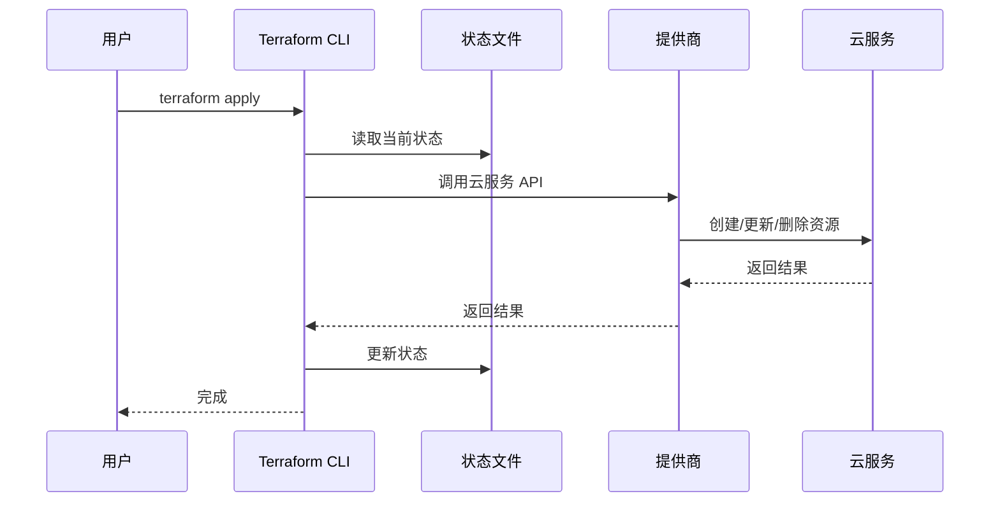

# Chapter 4: 云基础设施即代码 (Yún jīchǔ shèshī jí dài mǎ)

在 [虚拟私有云 (Xūnǐ sīyǒu yún)
](03_虚拟私有云__xūnǐ_sīyǒu_yún__.md) 中，我们学习了如何创建隔离的网络环境来运行我们的应用程序。但是，如果我们需要创建很多个 VPC，或者需要频繁地修改 VPC 的配置，手动操作就会变得非常繁琐和容易出错。有没有一种方法可以像编写代码一样来管理云基础设施呢？

这就是云基础设施即代码 (Yún jīchǔ shèshī jí dài mǎ, IaC) 要解决的问题！

想象一下，你要搭建一个网站，你需要配置服务器、数据库、网络等等。如果手动操作，每次搭建都需要重复相同的步骤，而且容易出错。但如果你使用基础设施即代码，你可以编写一个 "蓝图"，描述你想要的基础设施，然后让工具自动帮你创建和配置。 就像写程序一样，你可以版本控制你的蓝图，方便回溯和修改。

## 什么是云基础设施即代码 (Yún jīchǔ shèshī jí dài mǎ)？

基础设施即代码 (IaC) 是一种将基础设施管理视为软件开发的方法。 就像编写代码来创建应用程序一样，您可以使用 Terraform 等工具编写代码来定义和配置云资源，例如虚拟机、存储桶和网络。 这就像用蓝图来建造房子，确保每次建造都一致且可重复。 (Jīchǔ shèshī jí dài mǎ (IaC) shì yī zhǒng jiāng jīchǔ shèshī guǎnlǐ shìwéi ruǎnjiàn kāifā de fāngfǎ. Jiù xiàng biānxiě dài mǎ lái chuàngjiàn yìngyòng chéngxù yīyàng, nín kěyǐ shǐyòng Terraform děng gōngjù biānxiě dài mǎ lái dìngyì hé pèizhì yún zīyuán, lìrú xū擬jī, chǔcún tǒng hé wǎngluò. Zhè jiù xiàng yòng lántú lái jiànzào fángzi, quèbǎo měi cì jiànzào dōu yīzhì qiě kě chóngfù.)

### 关键概念

*   **代码 (Dài mǎ, Code)**： 使用 Terraform 等工具编写的配置文件，描述了您想要的基础设施。 就像建筑师的蓝图。
*   **资源 (Zīyuán, Resource)**： 云基础设施的构建块，例如虚拟机、存储桶、网络等等。 就像房子里的砖块、木材和管道。
*   **状态 (Zhuàngtài, State)**： Terraform 存储的关于当前基础设施的信息，用于跟踪资源的创建、修改和删除。 就像房子的施工记录。
*   **提供商 (Tígōng shāng, Provider)**： Terraform 的插件，用于与不同的云服务提供商（例如 AWS、Azure、GCP）进行交互。 就像不同的建筑公司，他们擅长建造不同类型的房子。

### 使用 IaC 解决问题

让我们回到我们搭建网站的例子。 使用 Terraform，我们可以编写代码来定义我们的 VPC、子网、安全组和虚拟机。

这是一个使用 Terraform 创建 AWS S3 存储桶的简单示例：

```terraform
resource "aws_s3_bucket" "example" {
  bucket = "my-unique-bucket-name" # 存储桶的名字，必须是唯一的
  acl    = "private" # 访问控制列表，设置为私有
  tags = {
    Name = "My S3 Bucket" # 标签，方便管理
  }
}
```

这段代码定义了一个名为 "example" 的 `aws_s3_bucket` 资源。它指定了存储桶的名字、访问控制列表和标签。

运行 `terraform apply` 命令后，Terraform 将会自动在 AWS 上创建这个 S3 存储桶。

要查看会发生什么，可以运行 `terraform plan` (运行 `terraform init` 之后)

```bash
terraform plan
```

输出结果会类似：

```
Terraform will perform the following actions:

  # aws_s3_bucket.example will be created
  + resource "aws_s3_bucket" "example" {
      + acl                          = "private"
      + arn                          = (known after apply)
      + bucket                       = "my-unique-bucket-name"
      + bucket_domain_name           = (known after apply)
      + bucket_regional_domain_name  = (known after apply)
      + hosted_zone_id               = (known after apply)
      + id                           = (known after apply)
      + region                       = (known after apply)
      + request_payer                = (known after apply)
      + tags                         = {
          + "Name" = "My S3 Bucket"
        }
      + versioning_id                = (known after apply)
      + website_domain               = (known after apply)
      + website_endpoint             = (known after apply)
    }

Plan: 1 to add, 0 to change, 0 to destroy.
```

上面的输出显示 Terraform 将会创建一个 `aws_s3_bucket.example` 资源。 `+` 符号表示资源将被添加。

### IaC 的内部实现

让我们深入了解一下 Terraform 内部是如何工作的。

当您运行 `terraform apply` 命令时，实际上发生了什么呢？

这是一个简化的流程图：



1.  **用户 (User)** 运行 `terraform apply` 命令。
2.  **Terraform CLI (CLI)** 读取当前状态文件 (State File)。
3.  **Terraform CLI (CLI)** 根据代码和当前状态，决定需要创建、更新或删除哪些资源。
4.  **Terraform CLI (CLI)** 调用相应提供商 (Provider) 的 API。
5.  **提供商 (Provider)** 与云服务 (Cloud Service) 进行交互，创建、更新或删除资源。
6.  **云服务 (Cloud Service)** 返回操作结果。
7.  **提供商 (Provider)** 将结果返回给 **Terraform CLI (CLI)**。
8.  **Terraform CLI (CLI)** 更新状态文件 (State File)。
9.  **Terraform CLI (CLI)** 返回完成信息给 **用户 (User)**。

例如，当 Terraform 需要创建一个 S3 存储桶时，它会调用 AWS 提供的 S3 API。 AWS 会创建存储桶，并将存储桶的信息返回给 Terraform。 Terraform 会将这些信息存储在状态文件中。

状态文件是 Terraform 中非常重要的一个概念。 它可以帮助 Terraform 跟踪基础设施的状态，并确保基础设施与代码保持同步。关于 `terraform.tfstate` 文件，请参考 [状态 (Zhuàngtài)
](04_云基础设施即代码__yún_jīchǔ_shèshī_jí_dài_mǎ__.md#状态__zhuàngtài__)章节。

### 总结

在本章中，我们学习了云基础设施即代码 (IaC) 的基本概念，包括代码、资源、状态和提供商。 我们了解了如何使用 Terraform 来创建和管理云基础设施。

IaC 是 DevOps 中一个非常重要的工具。 它可以帮助我们更好地管理云基础设施，并提高开发和运维效率。 在[容器 (Róngqì)
](05_容器__róngqì__.md) 中，我们将学习如何使用容器来打包和部署应用程序。


---

Generated by [AI Codebase Knowledge Builder](https://github.com/The-Pocket/Tutorial-Codebase-Knowledge)