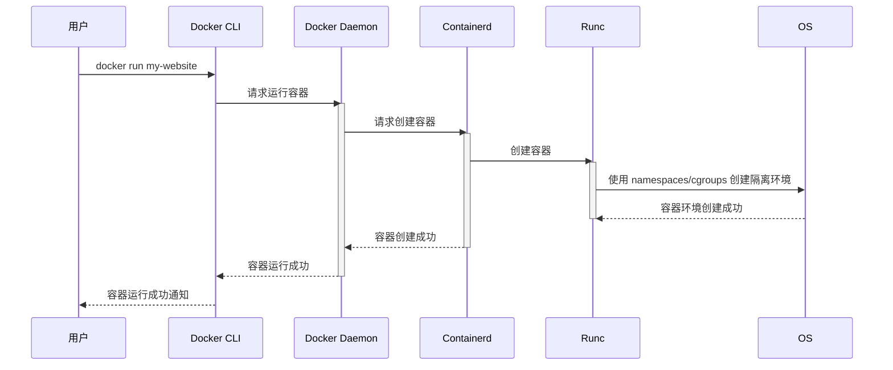

# Chapter 5: 容器 (Róngqì)

在[云基础设施即代码 (Yún jīchǔ shèshī jí dài mǎ)
](04_云基础设施即代码__yún_jīchǔ_shèshī_jí_dài_mǎ__.md)中，我们学习了如何使用代码来自动化创建和管理云基础设施。现在，让我们学习如何将应用程序及其依赖项打包成一个独立的单元，使其可以在任何地方以相同的方式运行。 这就是容器 (Róngqì) 的作用！

想象一下，你开发了一个网站。你的网站依赖于特定的操作系统版本、特定的库和特定的运行时环境。 如果你要将这个网站部署到不同的服务器上，你可能会遇到各种各样的问题，例如操作系统版本不兼容、缺少依赖项等等。 容器就像一个盒子，它可以将你的应用程序及其所有依赖项打包在一起。 这样，无论你将这个盒子运到哪里，你的应用程序都能正常工作。 这就像把你的应用程序打包成一个包裹，这样无论你把它运到哪里，它都能正常工作！

## 什么是容器 (Róngqì)?

容器 (Róngqì) 就像一个装载应用程序的盒子，包含应用程序及其运行所需的所有东西：代码、运行时、系统工具、库和设置。它将应用程序与底层基础设施隔离开来，确保应用程序在任何地方都以相同的方式运行。 (Róngqì jiù xiàng yīgè zhuāngzài yìngyòng chéngxù de hézi, bāohán yìngyòng chéngxù jí qí yùnxíng suǒ xū de suǒyǒu dōngxī: Dài mǎ, yùnxíng shí, xìtǒng gōngjù, kù hé shèzhì. Tā jiāng yìngyòng chéngxù yǔ dǐcéng jīchǔ shèshī gélí kāi lái, quèbǎo yìngyòng chéngxù zài rènhé dìfāng dōu yǐ xiāngtóng de fāngshì yùnxíng.)

简单来说，容器就是：

*   **代码 (Dài mǎ, Code):** 你的应用程序的代码。就像你的网站的HTML、CSS和JavaScript文件。
*   **运行时 (Yùnxíng shí, Runtime):** 你的应用程序运行所需要的环境。例如，如果你的应用程序是用Python编写的，那么你需要Python运行时。
*   **系统工具 (Xìtǒng gōngjù, System tools):** 你的应用程序可能需要的一些系统工具。例如，一些Linux命令。
*   **库 (Kù, Libraries):** 你的应用程序依赖的库。例如，一些Python库。
*   **设置 (Shèzhì, Settings):** 你的应用程序的配置文件。

## 关键概念

为了更好地理解容器，让我们分解几个关键概念：

*   **镜像 (Jìngxiàng, Image):** 镜像是容器的蓝图。它包含了运行容器所需的所有文件和配置。 就像一个菜谱，告诉你如何制作一道菜。 你可以基于同一个镜像创建多个容器。
*   **容器引擎 (Róngqì yǐnqíng, Container Engine):** 容器引擎是运行容器的软件。 例如，Docker 是一个流行的容器引擎。容器引擎就像一个烤箱，你可以用它来烤菜谱里的菜。
*   **容器仓库 (Róngqì cāngkù, Container Registry):** 容器仓库是存储容器镜像的地方。例如，Docker Hub 是一个公共的容器仓库。 容器仓库就像一个图书馆，你可以从中获取各种菜谱。
*   **Containerfile (容器文件):** 也被称为 Dockerfile， 是一个包含构建镜像指令的文本文件。 就像菜谱的文字描述。

## 使用容器解决问题

让我们回到我们的网站开发例子。 我们可以使用容器来解决部署问题。

1.  **创建 Containerfile:** 首先，我们需要创建一个 Containerfile，描述如何构建我们的网站容器镜像。 这就像编写菜谱，告诉别人如何制作你的菜。

    ```dockerfile
    # 使用一个基础镜像，例如一个包含 Node.js 的镜像
    FROM node:16

    # 设置工作目录
    WORKDIR /app

    # 复制 package.json 和 package-lock.json
    COPY package*.json ./

    # 安装依赖项
    RUN npm install

    # 复制所有的应用程序代码
    COPY . .

    # 暴露端口
    EXPOSE 3000

    # 运行应用程序
    CMD [ "npm", "start" ]
    ```

    这个 Containerfile 首先指定了一个基础镜像 `node:16`，它已经包含了 Node.js 运行时环境。 然后，它设置工作目录为 `/app`，复制 `package.json` 和 `package-lock.json` 文件，安装依赖项，复制所有的应用程序代码，暴露端口 3000，并运行应用程序。

2.  **构建镜像:** 接下来，我们可以使用 `docker build` 命令来构建镜像。 这就像按照菜谱制作菜。

    ```bash
    docker build -t my-website .
    ```

    这个命令会创建一个名为 `my-website` 的镜像。 `-t` 选项用于指定镜像的名称和标签。 `.` 表示 Containerfile 所在的目录。

3.  **运行容器:** 最后，我们可以使用 `docker run` 命令来运行容器。 这就像将菜端上餐桌，让大家品尝。

    ```bash
    docker run -p 8080:3000 my-website
    ```

    这个命令会创建一个基于 `my-website` 镜像的容器，并将容器的 3000 端口映射到主机的 8080 端口。 `-p` 选项用于指定端口映射。 现在，你可以在浏览器中访问 `http://localhost:8080` 来查看你的网站。

## 容器的内部实现

让我们深入了解一下容器内部是如何工作的。

当您运行 `docker run` 命令时，实际上发生了什么呢？

这是一个简化的流程图：



1.  **用户 (User)** 运行 `docker run` 命令。
2.  **Docker CLI (CLI)** 将请求发送给 **Docker Daemon (Daemon)**。
3.  **Docker Daemon (Daemon)** 将请求转发给 **Containerd**。
4.  **Containerd** 请求 **Runc** 创建容器。
5.  **Runc** 使用 Linux 内核的 namespaces 和 cgroups 功能来创建隔离的容器环境。
6.  最终返回成功消息。

简而言之，Docker 使用了 Linux 内核的一些特性来实现容器的隔离性。 Namespaces 用于隔离进程、网络、文件系统等等。 Cgroups 用于限制容器的资源使用，例如 CPU 和内存。

## 总结

在本章中，我们学习了容器的基本概念，包括镜像、容器引擎和容器仓库。 我们了解了如何使用容器来打包和部署应用程序，从而解决部署环境不一致的问题。

容器是 DevOps 中一个非常重要的工具。 它可以帮助我们更快、更可靠地交付软件。 在[服务 (Fúwù)
](06_服务__fúwù__.md) 中，我们将学习如何使用容器来构建微服务架构。


---

Generated by [AI Codebase Knowledge Builder](https://github.com/The-Pocket/Tutorial-Codebase-Knowledge)