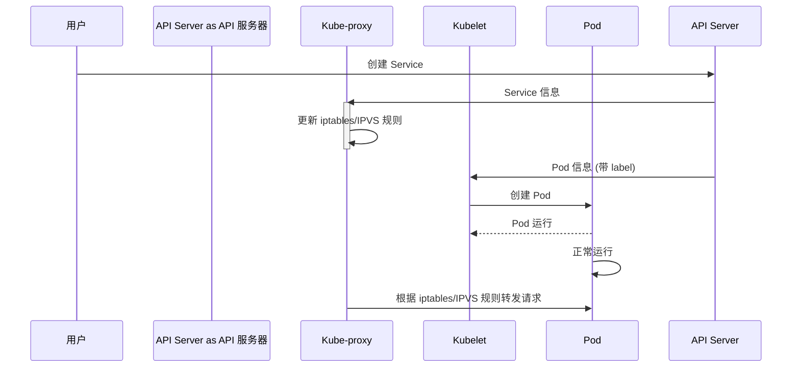

# Chapter 6: 服务 (Fúwù)

在[容器 (Róngqì)
](05_容器__róngqì__.md) 中，我们学习了如何将应用程序及其依赖项打包成一个独立的单元。 但是，如果我们有很多容器，而且这些容器可能会失败并被替换，我们如何才能确保我们的应用程序始终可用呢？ 这就是 Kubernetes 服务 (Fúwù) 的作用！

想象一下，你运营着一个在线商店，并且你使用了多个容器来运行你的网站。 如果其中一个容器失败了，你的客户可能就无法访问你的网站了。 此外，如果你的网站需要处理大量的流量，你可能需要运行多个容器来分担负载。 Kubernetes 服务就像一个智能路由器，它可以将流量转发到健康的容器，并自动处理容器的故障和扩展。 这就像一个可靠的交通指挥员，确保你的客户总能找到你的商店！

## 什么是服务 (Fúwù)?

在 Kubernetes 中，服务就像一个智能交通调度员，它为一组 Pod 提供一个稳定的 IP 地址和 DNS 名称。当请求到达服务时，它会将请求转发到其中一个正常的 Pod。这意味着即使 Pod 失败并被替换，应用程序仍然可以通过相同的服务地址访问。(Zài Kubernetes zhōng, fúwù jiù xiàng yīgè zhìnéng jiāotōng diàodùyuán, tā wèi yī zǔ Pod tígōng yīgè wěndìng de IP dìzhǐ hé DNS míngchēng. Dāng qǐngqiú dàodá fúwù shí, tā huì jiāng qǐngqiú zhuǎnfā dào qízhōng yīgè zhèngcháng de Pod. Zhè yìwèizhe jíshǐ Pod shībài bìng bèi tìhuàn, yìngyòng chéngxù réngrán kěyǐ tōngguò xiāngtóng de fúwù dìzhǐ fǎngwèn.)

简单来说，服务做了以下几件事：

*   **稳定的 IP 地址 (Wěndìng de IP dìzhǐ, Stable IP Address):** 为一组 Pod 提供一个固定的 IP 地址，即使 Pod 被替换，IP 地址也不会改变。 就像你的商店的地址，即使你装修了商店，地址也不会改变。
*   **DNS 名称 (DNS míngchēng, DNS Name):** 为一组 Pod 提供一个易于记忆的 DNS 名称。 就像你的商店的名字，客户可以通过名字找到你的商店，而不需要记住复杂的 IP 地址。
*   **负载均衡 (Fùzài jūnhéng, Load Balancing):** 将请求转发到健康的 Pod，并自动处理 Pod 的故障和扩展。 就像一个交通指挥员，确保所有的车辆都能顺利到达目的地。

## 关键概念

为了更好地理解服务，让我们分解几个关键概念：

*   **Pod 选择器 (Pod xuǎnzé qì, Pod Selector):** 服务使用 Pod 选择器来选择一组 Pod。 Pod 选择器就像一个标签，只有带有特定标签的 Pod 才能被服务选择。 就像一个 VIP 会员卡，只有拥有这张卡的客户才能享受特殊服务。
*   **Service 类型 (Service lèixíng, Service Type):** Service 类型定义了如何暴露服务。 Kubernetes 支持多种 Service 类型，例如 ClusterIP、NodePort 和 LoadBalancer。 就像不同的交通方式，你可以选择不同的方式来到达目的地。
    *   **ClusterIP:** 在集群内部暴露服务。 只能在集群内部访问。
    *   **NodePort:** 在每个节点上暴露服务。 可以通过节点的 IP 地址和端口访问。
    *   **LoadBalancer:** 使用云提供商的负载均衡器暴露服务。 可以通过负载均衡器的 IP 地址访问。

## 使用服务解决问题

让我们回到我们的在线商店例子。 我们可以使用 Kubernetes 服务来解决以下问题：

*   **容器故障:** 如果一个容器失败了，服务会自动将流量转发到其他健康的容器，确保你的网站始终可用。
*   **负载均衡:** 如果你的网站需要处理大量的流量，服务可以将流量分发到多个容器，从而提高性能和可伸缩性。
*   **服务发现:** 服务提供了一个稳定的 IP 地址和 DNS 名称，使得其他应用程序可以轻松地发现和访问你的网站。

这是一个使用 Kubernetes 创建一个 Service 的简单示例：

首先，创建一个运行 Nginx 的 Pod (创建一个名为 `nginx-pod.yaml` 的文件):

```yaml
apiVersion: v1
kind: Pod
metadata:
  name: nginx-pod
  labels:
    app: nginx
spec:
  containers:
  - name: nginx
    image: nginx:latest
    ports:
    - containerPort: 80
```

这个 YAML 文件定义了一个名为 `nginx-pod` 的 Pod。 它运行一个 Nginx 容器，并将容器的 80 端口暴露出来。 `labels` 字段定义了 Pod 的标签。

接下来, 运行 `kubectl apply -f nginx-pod.yaml` 创建 pod。

然后，创建一个 Service (创建一个名为 `nginx-service.yaml` 的文件):

```yaml
apiVersion: v1
kind: Service
metadata:
  name: nginx-service
spec:
  selector:
    app: nginx # 选择带有 app=nginx 标签的 Pod
  ports:
  - protocol: TCP
    port: 80 # Service 的端口
    targetPort: 80 # Pod 的端口
  type: ClusterIP # Service 的类型
```

这个 YAML 文件定义了一个名为 `nginx-service` 的 Service。 `selector` 字段指定了 Pod 选择器，它选择带有 `app=nginx` 标签的 Pod。 `ports` 字段定义了 Service 的端口映射。 `type` 字段指定了 Service 的类型为 `ClusterIP`。

接下来, 运行 `kubectl apply -f nginx-service.yaml` 创建 service。

创建完成后，你可以使用以下命令来查看 Service 的信息：

```bash
kubectl get service nginx-service
```

输出结果应该类似：

```
NAME            TYPE        CLUSTER-IP      EXTERNAL-IP   PORT(S)   AGE
nginx-service   ClusterIP   10.100.10.100   <none>        80/TCP    10s
```

`CLUSTER-IP` 字段显示了 Service 的 IP 地址。 你可以使用这个 IP 地址在集群内部访问 Nginx 服务。

尝试访问服务：

```bash
kubectl run --rm -it busybox --image=busybox --restart=Never -- sh -c "wget -q -O- http://nginx-service"
```

这条命令会创建一个临时的 `busybox` Pod，并且使用 `wget` 命令访问 `nginx-service`。 如果一切正常，你会看到 Nginx 的默认页面。

如果上述命令成功，那么就证明服务已经正常工作。

## 服务的内部实现

让我们深入了解一下 Kubernetes 服务内部是如何工作的。

当您创建一个 Kubernetes 服务时，实际上发生了什么呢？

这是一个简化的流程图：



1.  **用户 (User)** 创建一个 Kubernetes Service，并将其提交给 **API 服务器 (API Server)**。
2.  **API 服务器 (API Server)** 将 Service 的信息通知给每个节点上的 **Kube-proxy** 组件。
3.  **Kube-proxy** 组件根据 Service 的信息，更新节点的 `iptables` 或者 `IPVS` 规则。
4.  **API 服务器 (API Server)** 将 Pod 的信息（包括 labels）通知给每个节点上的 **Kubelet** 组件。
5.  **Kubelet** 组件根据 Pod 的定义创建 Pod。
6.  当有请求到达 Service 的 IP 地址和端口时，节点的 `iptables` 或者 `IPVS` 规则会将请求转发到后端的 Pod。

**Kube-proxy** 组件是 Kubernetes 服务实现的关键。 它负责监听 API 服务器的 Service 和 Endpoint 的变化，并根据这些变化更新节点的 `iptables` 或者 `IPVS` 规则。

你可以在节点上使用 `iptables -L -t nat` 命令来查看 `iptables` 规则。 或者 `ipvsadm -Ln` 命令查看 `IPVS` 规则。

有关 Service 的更详细实现，可以参考 Kubernetes 的源码。

```go
// 代码示例 (简化)
// service.go
func (proxier *Proxier) syncService(service *api.Service) {
  // 根据 Service 的类型创建不同的代理策略
  switch service.Spec.Type {
  case api.ServiceTypeClusterIP:
    proxier.syncClusterIPService(service)
  case api.ServiceTypeNodePort:
    proxier.syncNodePortService(service)
  case api.ServiceTypeLoadBalancer:
    proxier.syncLoadBalancerService(service)
  }
}
```

上面的代码片段展示了 `Kube-proxy` 如何根据 Service 的类型来创建不同的代理策略。 例如，`syncClusterIPService` 函数负责创建 ClusterIP 类型的 Service 的代理规则。

## 使用已提供的练习

现在，让我们用提供的练习 `topics/kubernetes/services_01.md` 来实践一下创建 Service 的过程。 按照练习中的指示，你可以学习如何创建一个 Pod，然后为这个 Pod 创建一个 Service，并验证应用程序是否可以访问。

```text
## Services 01

#### Objective

Learn how to create services

#### Instructions

1. Create a pod running ngnix
2. Create a service for the pod you've just created
3. Verify the app is reachable
```

这段练习的目标是学习如何创建 Kubernetes 服务。你需要首先创建一个运行 Nginx 的 Pod，然后为这个 Pod 创建一个 Service，并验证你的应用可以通过 Service 访问。 这样可以帮助你理解 Service 的作用和使用方法。

## 总结

在本章中，我们学习了 Kubernetes 服务 (Fúwù) 的基本概念，包括 Pod 选择器和 Service 类型。 我们了解了如何使用服务来解决容器故障、负载均衡和服务发现等问题。

服务是 DevOps 中一个非常重要的工具。 它可以帮助我们构建高可用、可扩展的应用程序。 在[安全组 (Ānquán zǔ)
](07_安全组__ānquán_zǔ__.md) 中，我们将学习如何使用安全组来保护我们的应用程序的安全。


---

Generated by [AI Codebase Knowledge Builder](https://github.com/The-Pocket/Tutorial-Codebase-Knowledge)