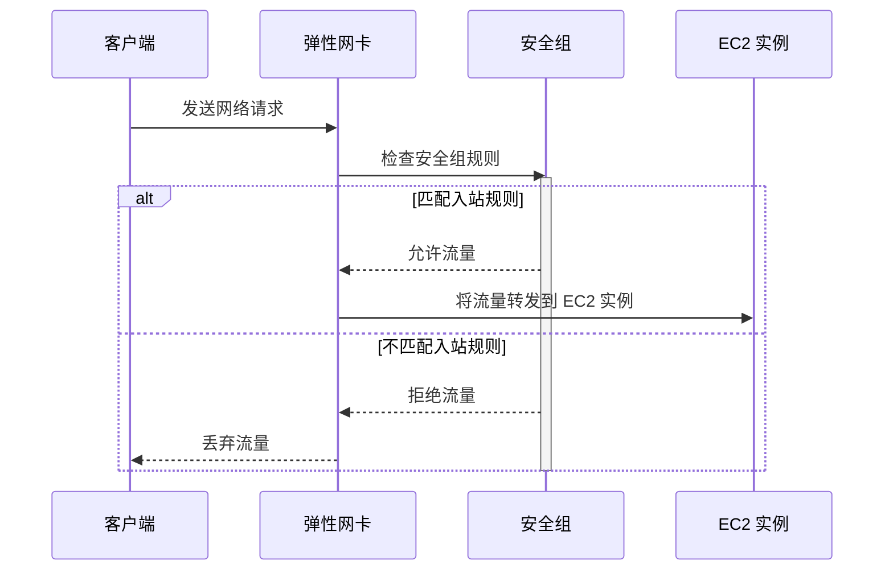

# Chapter 7: 安全组 (Ānquán zǔ)

在[服务 (Fúwù)
](06_服务__fúwù__.md)中，我们学习了如何使用服务来管理和暴露我们的应用程序。但是，仅仅让应用跑起来是不够的，我们还需要保护它们免受未经授权的访问。这就是安全组 (Ānquán zǔ) 发挥作用的地方。

想象一下你搭建了一个网站，但是任何人都可以随意访问你的服务器，那你的网站可能会受到攻击。安全组就像一个虚拟防火墙，可以控制哪些流量可以进入你的服务器，哪些流量应该被阻止。  这就像你家的门卫，决定谁可以进入你的家，保护你的财产安全！

## 什么是安全组 (Ānquán zǔ)?

安全组 (Ānquán zǔ) 就像云服务器的虚拟防火墙，控制着进出实例的网络流量。你可以像设置家用路由器的防火墙一样，定义规则来允许或拒绝特定端口和协议的流量。这就像一个俱乐部的守门人，只允许符合规则的人进入。(Ānquán zǔ jiù xiàng yún fúwùqì de xūnǐ fánghuǒqiáng, kòngzhìzhe jìn chū shílì de wǎngluò liúliàng. Nǐ kěyǐ xiàng shèzhì jiāyòng lùyóuqì de fánghuǒqiáng yīyàng, dìngyì guīzé lái yǔnxǔ huò jùjué tèdìng duānkǒu hé xiéyì de liúliàng. Zhè jiù xiàng yīgè jùlèbù de shǒumén rén, zhǐ yǔnxǔ fúhé guīzé de rén jìnrù.)

简单来说，安全组就是：

*   **控制流量 (Kòngzhì liúliàng, Control Traffic):**  决定哪些流量可以进入你的云服务器，哪些流量应该被阻止。 就像俱乐部的守门人。
*   **规则 (Guīzé, Rules):**  定义允许或拒绝流量的条件。 例如，只允许来自特定 IP 地址的流量访问特定端口。  就像俱乐部的着装要求或者会员制度。

## 关键概念

为了更好地理解安全组，让我们分解几个关键概念：

*   **入站规则 (Rùzhàn guīzé, Inbound Rules):**  控制允许进入云服务器的流量。 就像控制谁可以进入你的家。
*   **出站规则 (Chūzhàn guīzé, Outbound Rules):**  控制允许从云服务器出去的流量。 就像控制谁可以从你的家出去。
*   **端口 (Duānkǒu, Port):**  用于区分不同应用程序或服务的数字。  例如，HTTP 使用 80 端口，HTTPS 使用 443 端口。 就像你家的不同房间，每个房间都有不同的用途。
*   **协议 (Xiéyì, Protocol):**  用于数据传输的规则集。 例如，TCP 和 UDP 是常见的协议。 就像你家使用的语言，不同的语言用于和不同的人交流。
*   **源 IP 地址 (Yuán IP dìzhǐ, Source IP Address):**  发起连接的计算机的 IP 地址。  就像来访者的地址。
*   **目标 IP 地址 (Mùbiāo IP dìzhǐ, Destination IP Address):**  目标服务器的 IP 地址。 就像你的家的地址。

## 使用安全组解决问题

让我们回到我们的网站搭建的例子。假设我们的网站运行在 AWS 的 EC2 实例上。 我们希望只有来自特定 IP 地址的流量可以访问我们的网站，并且只允许通过 HTTP 和 HTTPS 协议访问。

1.  **创建安全组:** 首先，我们需要在云提供商那里创建一个安全组。 这就像雇佣你的门卫。
2.  **配置入站规则:** 然后，我们需要配置入站规则，以允许来自特定 IP 地址的流量访问 EC2 实例的 80 端口（HTTP）和 443 端口（HTTPS）。 这就像告诉门卫，只允许特定地址的人进入。
3.  **配置出站规则:**  接下来，我们需要配置出站规则，以允许 EC2 实例访问互联网。  这就像允许你的家人可以自由地外出。

以下是使用 AWS CLI 创建安全组并配置规则的简单示例：

```bash
# 创建一个安全组
aws ec2 create-security-group --group-name my-web-sg --description "安全组，用于允许 Web 流量" --vpc-id vpc-xxxxxxxxxxxxxxxxx --output text --query GroupId

# 输出：sg-xxxxxxxxxxxxxxxxx
```

这个命令会创建一个名为 `my-web-sg` 的安全组，并将其与 `vpc-xxxxxxxxxxxxxxxxx` VPC 关联。 `--output text --query GroupId` 部分只是为了方便地提取新创建的安全组的 ID。

**注意：**  请将 `vpc-xxxxxxxxxxxxxxxxx` 替换为你的 VPC ID。

```bash
# 添加一条入站规则，允许来自特定 IP 地址的 HTTP 流量
aws ec2 authorize-security-group-ingress --group-id sg-xxxxxxxxxxxxxxxxx --protocol tcp --port 80 --cidr 203.0.113.0/24
```

这个命令会添加一条入站规则，允许来自 `203.0.113.0/24` CIDR block 的 HTTP 流量访问 `sg-xxxxxxxxxxxxxxxxx` 安全组。

**注意：** 请将 `sg-xxxxxxxxxxxxxxxxx` 替换为你的安全组 ID，并将 `203.0.113.0/24` 替换为你想要允许的 IP 地址范围。

```bash
# 添加一条入站规则，允许来自特定 IP 地址的 HTTPS 流量
aws ec2 authorize-security-group-ingress --group-id sg-xxxxxxxxxxxxxxxxx --protocol tcp --port 443 --cidr 203.0.113.0/24
```

这个命令会添加一条入站规则，允许来自 `203.0.113.0/24` CIDR block 的 HTTPS 流量访问 `sg-xxxxxxxxxxxxxxxxx` 安全组。

这些只是基本的示例，实际的安全组配置可能更加复杂。但希望这些示例能让你了解如何使用安全组来保护你的应用程序的安全。

## 安全组的内部实现

让我们深入了解一下安全组内部是如何工作的。

当有流量到达你的 EC2 实例时，安全组是如何决定是否允许该流量通过的呢？

这是一个简化的流程图：



1.  **客户端 (Client)** 发送网络请求到 EC2 实例的弹性网卡 (Elastic Network Interface, ENI)。
2.  **弹性网卡 (ENI)**  将请求转发给与该网卡关联的安全组 (Security Group, SG)。
3.  **安全组 (SG)** 检查请求是否匹配任何入站规则。
4.  如果请求匹配任何入站规则，安全组允许流量通过，弹性网卡将流量转发到 **EC2 实例 (EC2)**。
5.  如果请求不匹配任何入站规则，安全组拒绝流量通过，弹性网卡丢弃流量。

安全组实际上是基于 Linux 内核的 `iptables` 或 `nftables` 实现的。  当你配置安全组规则时，云提供商会在底层配置 `iptables` 或 `nftables` 规则，以实现流量过滤。

虽然我们不能直接访问底层的 `iptables` 或 `nftables` 规则，但我们可以通过云 API 来管理安全组的配置。

例如，当你添加一条入站规则时，云提供商会在底层添加一条 `iptables` 或 `nftables` 规则，以允许匹配该规则的流量通过。

## 总结

在本章中，我们学习了安全组 (Ānquán zǔ) 的基本概念，包括入站规则、出站规则、端口和协议。 我们了解了如何使用安全组来保护我们的应用程序的安全，并防止未经授权的访问。

安全组是 DevOps 中一个非常重要的工具。 它可以帮助我们更好地保护云环境的安全。 在[持续监控 (Chíxù jiānkòng)
](08_持续监控__chíxù_jiānkòng__.md) 中，我们将学习如何使用持续监控来检测和响应安全事件。

---

Generated by [AI Codebase Knowledge Builder](https://github.com/The-Pocket/Tutorial-Codebase-Knowledge)