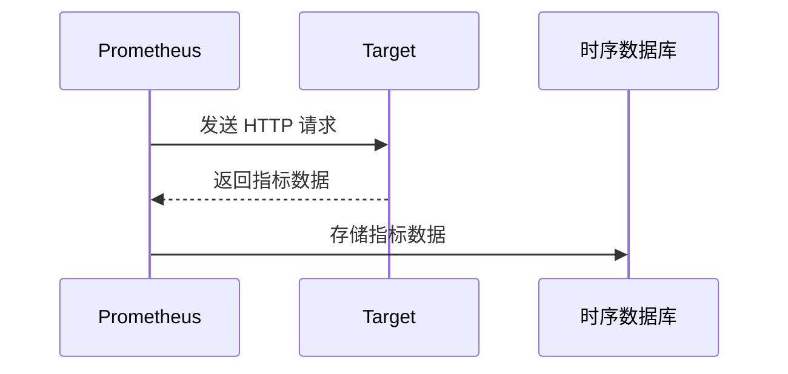

# Chapter 8: 持续监控 (Chíxù jiānkòng)

在[安全组 (Ānquán zǔ)
](07_安全组__ānquán_zǔ__.md)中，我们学习了如何使用安全组来保护我们的应用程序。 但安全不仅仅是设置防火墙。 我们还需要时刻关注应用程序的健康状况，以便及时发现问题并采取行动。 这就是持续监控 (Chíxù jiānkòng) 的意义所在！

想象一下你经营一家商店。 你不仅需要在晚上锁好门（安全组），还需要在白天观察是否有顾客在商店里遇到问题，例如结账队伍太长，或者商品摆放不整齐。 通过持续的观察，你可以及时调整，提高顾客的购物体验。 持续监控就像给你的应用程序安装了一个摄像头，可以随时观察它的运行状况。

持续监控 (Chíxù jiānkòng) 就是要对应用程序、服务器和其他基础设施组件进行系统性和持续性的观测。这就像一个警卫，时刻观察着一切，以便尽早发现任何问题并采取措施。通过持续的监控，团队可以快速检测到异常行为、性能瓶颈和其他问题，从而防止它们影响用户体验。

## 什么是持续监控？

持续监控 (Chíxù jiānkòng) 就像医生的体检。医生通过血压、心跳等指标来评估你的身体健康状况。 持续监控则是通过各种指标，比如 CPU 使用率、内存占用、请求响应时间、错误率等，来评估应用程序的健康状况。

持续监控的核心目标是：

*   **尽早发现问题 (Jìnzǎo fāxiàn wèntí):**  在问题影响用户之前发现它们。
*   **快速定位问题 (Kuàisù dìngwèi wèntí):**  快速找到问题的根源。
*   **持续改进 (Chíxù gǎijìn):**  通过监控数据来优化应用程序的性能和稳定性。

## 关键概念

为了更好地理解持续监控，让我们分解几个关键概念：

*   **指标 (Zhǐbiāo, Metrics):** 指标是用于衡量应用程序或基础设施性能的数值。 比如 CPU 使用率、内存占用、请求响应时间等。 就像体检中的血压、心跳等指标。
*   **日志 (Rìzhì, Logs):**  日志是应用程序运行过程中产生的事件记录。 通过分析日志，我们可以了解应用程序的运行状态，例如错误信息、警告信息等。 就像病历，记录了你生病的过程和医生的诊断。
*   **警报 (Jǐngbào, Alerts):**  警报是在指标超出预设阈值或发生异常事件时触发的通知。 就像闹钟，提醒我们该起床了。
*   **仪表盘 (Yíbiǎo pán, Dashboards):** 仪表盘是将监控数据可视化展示的界面。 就像汽车的仪表盘，可以让我们随时了解汽车的运行状态。

## 使用持续监控解决问题

让我们回到我们的在线商店的例子。 我们希望监控以下指标：

*   **请求响应时间 (Qǐngqiú xiǎngyìng shíjiān):** 用户访问网站的速度。
*   **错误率 (Cuòwù lǜ):**  网站出错的概率。
*   **CPU 使用率 (CPU shǐyòng lǜ):**  服务器的 CPU 使用情况。

我们可以使用 Prometheus 和 Grafana 来实现持续监控。

1.  **Prometheus 收集指标 (Prometheus shōují zhǐbiāo):**  Prometheus 是一个开源的监控系统，可以从各种来源收集指标数据。 我们可以配置 Prometheus 来收集我们在线商店的各项指标。

2.  **Grafana 可视化数据 (Grafana kěshìhuà shùjù):** Grafana 是一个开源的数据可视化工具，可以将 Prometheus 收集的指标数据可视化展示在仪表盘上。

这是一个 Prometheus 配置文件的简单示例 (`prometheus.yml`):

```yaml
global:
  scrape_interval:     15s # 每 15 秒抓取一次数据

scrape_configs:
  - job_name: 'my-website' # 监控任务的名字
    static_configs:
      - targets: ['localhost:8080'] # 要监控的目标地址
```

这个配置文件告诉 Prometheus 每 15 秒抓取一次 `localhost:8080` 的指标数据。

这个配置文件只是一个例子。我们需要配置 Prometheus 收集更有用的指标数据。 例如，我们可以使用 Prometheus 的 Node Exporter 来收集服务器的 CPU 使用率、内存占用等指标。

安装好 Prometheus 和 Node Exporter 后， 启动 Node Exporter 后，我们就可以修改 `prometheus.yml` 文件，添加 Node Exporter 作为监控目标：

```yaml
global:
  scrape_interval:     15s # 每 15 秒抓取一次数据

scrape_configs:
  - job_name: 'my-website' # 监控任务的名字
    static_configs:
      - targets: ['localhost:8080'] # 要监控的目标地址
  - job_name: 'node_exporter' # 监控任务的名字
    static_configs:
      - targets: ['localhost:9100'] # Node Exporter 暴露的端口
```

接下来，重启 Prometheus。

然后，我们可以使用 Grafana 创建一个仪表盘，展示服务器的 CPU 使用率。

在 Grafana 中，我们可以创建一个新的仪表盘，并添加一个图表面板。 在图表面板中，我们可以选择 Prometheus 作为数据源，并使用 PromQL 查询语言来查询 CPU 使用率指标。

一个简单的 PromQL 查询语句如下：

```promql
rate(process_cpu_seconds_total{job="node_exporter"}[5m])
```

这条语句会计算 `node_exporter` 任务的 CPU 使用率，并展示过去 5 分钟的平均值。

通过这些仪表盘，我们可以实时了解我们在线商店的运行状况，并在出现问题时及时采取行动。

## 持续监控的内部实现

让我们深入了解一下持续监控的内部是如何工作的。

当 Prometheus 抓取指标数据时，实际上发生了什么呢？

这是一个简化的流程图：



1.  **Prometheus** 根据配置文件中的 `scrape_configs`，定期向目标 (Target) 发送 HTTP 请求。
2.  **目标 (Target)** 返回指标数据，例如 CPU 使用率、内存占用等。
3.  **Prometheus** 将指标数据存储到时序数据库 (Time Series Database, TSDB) 中。 时序数据库是一种专门用于存储时间序列数据的数据库，例如 Prometheus 使用的 TSDB。

Prometheus 存储指标数据的格式如下：

```
<metric_name>{<label_name>=<label_value>, ...} <metric_value> <timestamp>
```

例如：

```
process_cpu_seconds_total{job="node_exporter",instance="localhost:9100"} 0.123 1678886400
```

这个数据表示 `node_exporter` 任务的 `process_cpu_seconds_total` 指标在时间戳 `1678886400` 的值为 `0.123`。

我们可以通过 Prometheus 的 API 来查询这些指标数据。 例如，我们可以使用以下 API 来查询 `node_exporter` 任务的 CPU 使用率：

```
/api/v1/query?query=rate(process_cpu_seconds_total{job="node_exporter"}[5m])
```

## 总结

在本章中，我们学习了持续监控 (Chíxù jiānkòng) 的基本概念，包括指标、日志、警报和仪表盘。 我们了解了如何使用 Prometheus 和 Grafana 来实现持续监控，并解决在线商店的运行状况问题。

持续监控是 DevOps 中一个非常重要的工具。 它可以帮助我们更快、更可靠地交付软件。 在[责任共担模型 (Zérèn gòngdān móxíng)
](09_责任共担模型__zérèn_gòngdān_móxíng__.md) 中，我们将学习云服务提供商和用户之间如何分担安全责任。


---

Generated by [AI Codebase Knowledge Builder](https://github.com/The-Pocket/Tutorial-Codebase-Knowledge)