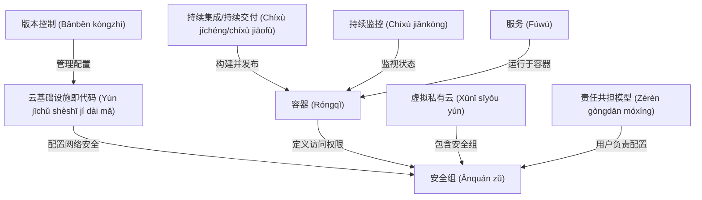

# Tutorial: devops-exercises

这个项目旨在帮助大家理解 DevOps 的各个方面。它通过提供关于**云基础设施即代码**、*容器*、**持续集成/持续交付**等概念的练习和问题，来指导学习者掌握云原生技术和自动化运维的实践。希望你通过本项目的学习，更好地理解和应用 DevOps 的核心理念和工具。

**Source Repository:** [https://github.com/bregman-arie/devops-exercises](https://github.com/bregman-arie/devops-exercises)

## Chapters

1. [版本控制 (Bǎnběn kòngzhì)
](01_版本控制__bǎnběn_kòngzhì__.md)
2. [持续集成/持续交付 (Chíxù jíchéng/chíxù jiāofù)
](02_持续集成_持续交付__chíxù_jíchéng_chíxù_jiāofù__.md)
3. [虚拟私有云 (Xūnǐ sīyǒu yún)
](03_虚拟私有云__xūnǐ_sīyǒu_yún__.md)
4. [云基础设施即代码 (Yún jīchǔ shèshī jí dài mǎ)
](04_云基础设施即代码__yún_jīchǔ_shèshī_jí_dài_mǎ__.md)
5. [容器 (Róngqì)
](05_容器__róngqì__.md)
6. [服务 (Fúwù)
](06_服务__fúwù__.md)
7. [安全组 (Ānquán zǔ)
](07_安全组__ānquán_zǔ__.md)
8. [持续监控 (Chíxù jiānkòng)
](08_持续监控__chíxù_jiānkòng__.md)
9. [责任共担模型 (Zérèn gòngdān móxíng)
](09_责任共担模型__zérèn_gòngdān_móxíng__.md)

---

Generated by [AI Codebase Knowledge Builder](https://github.com/The-Pocket/Tutorial-Codebase-Knowledge)